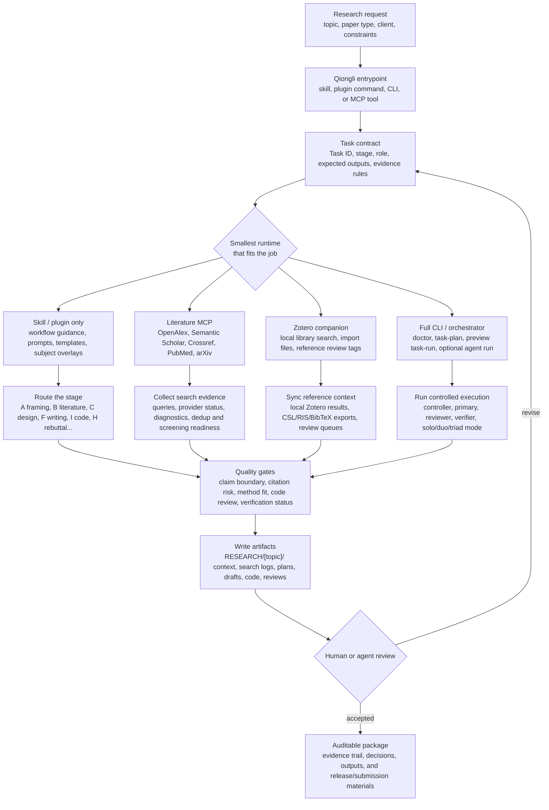

<div align="center">
  <h1>Qiongli (穷理)</h1>
  <p><strong>Reviewable academic workflows for Codex, Claude Code, Claude Desktop, Antigravity, and Hermes.</strong></p>
  <p>Plan the work, search the literature, draft and review manuscripts, run research code, and keep the evidence trail in one place.</p>
  <p>
    <a href="https://www.npmjs.com/package/qiongli"></a>
    <a href="https://www.npmjs.com/package/qiongli?activeTab=versions"></a>
    <a href="https://pypi.org/project/qiongli/"></a>
    <a href="https://pypi.org/project/qiongli/1.5.0b8/"></a>
  </p>
  <p>
    <a href="packages/qiongli-literature-mcpb/README.md"></a>
    <a href="packages/qiongli-zotero-companion/README.md"></a>
  </p>
  <p>
    <a href="README_CN.md">中文 README</a> ·
    <a href="docs/index.md">VitePress Docs</a> ·
    <a href="docs/zh/index.md">中文文档</a> ·
    <a href="docs/quickstart.md">Quick Start</a> ·
    <a href="docs/guide/install.md">Install</a> ·
    <a href="docs/reference/cli.md">CLI</a>
  </p>
</div>

## At A Glance

Qiongli is for research work that needs a paper trail. It turns a broad academic request into a task flow with Task IDs, quality gates, role handoffs, and standard outputs under `RESEARCH/[topic]/`. Instead of asking an agent to improvise a whole paper in one pass, you get smaller steps that are easier to inspect, revise, and trust.

Use it when you need to:

- **Choose a paper route:** empirical, qualitative, systematic review, RCT/preregistration, theory, or code-first methods.
- **Make literature work auditable:** plan searches, record diagnostics, materialize search bundles, deduplicate results, and prepare screening or snowballing.
- **Keep writing tied to evidence:** map claims to sources, check citation risk, plan figures and tables, review limitations, proofread, and prepare rebuttals.
- **Treat research code as research evidence:** move through Stage-I `I5 -> I6 -> I7 -> I8` for specification, planning, execution, and review.
- **Coordinate more than one agent:** use solo, duo, or triad modes with explicit handoffs, disagreement records, and verification status.

The public name is **Qiongli**, from the Chinese `穷理`: to keep asking what principle, evidence, and limit sit underneath a question. The full methodology name is **Qiongli Zhengche** (`穷理证澈`): make evidence chains, citation risk, assumptions, and claim boundaries clear enough to audit.

## Start Here

| Need | Best entry |
|---|---|
| You want the full docs experience | Open the [VitePress docs](docs/index.md), or run `npm run docs:dev` locally |
| You prefer Chinese docs | Start with [中文 README](README_CN.md) or [中文文档](docs/zh/index.md) |
| You want Qiongli in one client | Use the [Install Guide](docs/guide/install.md) |
| You need full local Qiongli in client-native form | Use `qiongli install --target all`; this defaults to the full local plugin surface |
| You are choosing a paper workflow | Use [Task Recipes](docs/guide/task-recipes.md) |
| You need scriptable installs or upgrades | Use the [CLI Reference](docs/reference/cli.md) |
| You want to understand the architecture | Read [Architecture](docs/architecture.md) |

From v1.9.0 onward, `qiongli install` and `qiongli upgrade` default to `--profile full --surface plugin`. Codex, Claude Code, and Antigravity receive CLI-managed local plugins backed by the full Python MCP server. Antigravity bundles that MCP server in the plugin root `mcp_config.json`; Hermes receives a managed MCP client config. Use `--surface skills --profile partial` only when you deliberately want the legacy skills-only surface.

## Latest Stable Downloads

Current stable release: [v1.9.2](https://github.com/jxpeng98/qiongli/releases/tag/v1.9.2). These direct links cover the common install paths; use the download guide for subject-specific Desktop ZIPs and maintainer artifacts.

| Need | Link or command |
|---|---|
| npm CLI | [`qiongli@1.9.2`](https://www.npmjs.com/package/qiongli/v/1.9.2): `npm install -g qiongli@latest` |
| PyPI CLI | [`qiongli 1.9.2`](https://pypi.org/project/qiongli/1.9.2/): `pipx install qiongli` |
| Claude Desktop/Web core skill | [`qiongli-claude-desktop-skill-core-v1.9.2.zip`](https://github.com/jxpeng98/qiongli/releases/download/v1.9.2/qiongli-claude-desktop-skill-core-v1.9.2.zip) |
| Claude Desktop literature MCPB | [`qiongli-literature-provider-0.1.5.mcpb`](https://github.com/jxpeng98/qiongli/releases/download/v1.9.2/qiongli-literature-provider-0.1.5.mcpb) |
| Zotero Desktop companion | [`qiongli-zotero-companion-0.2.2.xpi`](https://github.com/jxpeng98/qiongli/releases/download/v1.9.2/qiongli-zotero-companion-0.2.2.xpi) |
| All release assets | [Download guide](https://github.com/jxpeng98/qiongli/releases/download/v1.9.2/qiongli-downloads-v1.9.2.md) and [GitHub Release](https://github.com/jxpeng98/qiongli/releases/tag/v1.9.2) |

## How It Works



## Current Structure

Qiongli is split into four surfaces so you can install only what the task actually needs:

| Surface | What it provides | Does it launch local agents? |
|---|---|---|
| Skill / plugin package | Agent instructions, workflow commands, templates, standards, subject overlays, and effective skill markdown | No |
| Literature MCP runtime | Bundled Node fallback for local literature/provider tools such as `qiongli_literature_search`, `qiongli_config_status`, `qiongli_configure_provider`, and `qiongli_save_provider_config` | No |
| Full CLI MCP runtime | Python-backed MCP tools including literature search, provider config, `qiongli_orchestrator_route`, `qiongli_orchestrator_doctor`, `qiongli_task_plan`, and `qiongli_task_run` | Only when explicitly enabled |
| Shell / Python orchestrator | `doctor`, validators, `task-plan`, `task-run`, `team-run`, and code-build routes | Yes, when runtime auth is configured |

This separation matters most on Desktop. A manual Skill ZIP gives Claude Desktop/Web the Qiongli skill and subject overlays. A `.mcpb` install adds local literature-provider tools. The full local agent runtime stays in the CLI/MCP surface, where it can be configured and audited separately.

For Codex marketplace plugins, the bundled literature MCP is launched from the plugin bundle. Configure provider keys through `qiongli_config_status` and the local `qiongli_configure_provider`, not by putting secrets into `.mcp.json` or plugin manifests. The same setup tool is exposed by the Claude Desktop MCPB, Claude Code plugin runtime, and full CLI MCP server for other local MCP clients.

## Installation Decision Guide

Start with the smallest surface that matches the job. In Qiongli, "full workflow" means the complete methodology, workflows, templates, quality gates, skill registry, and subject overlays. It does not automatically mean local provider calls or local agent execution.

| Install path | Use it when | Advantages | Trade-offs |
|---|---|---|---|
| **Codex marketplace plugin**: `codex plugin marketplace add jxpeng98/skillsplace --ref main` | You use Codex and want Qiongli as a native skill/plugin without local CLI setup. | Installs the Qiongli skill, subject packages such as `qiongli-economics`, and the bundled zero-dependency literature MCP registration/runtime as a lite/no-CLI fallback. | Marketplace stays lite/no-Python. Full local Qiongli is the CLI-generated local plugin: `qiongli install --profile full --target codex --surface plugin`. |
| **Claude Code marketplace plugin**: `claude plugin marketplace add jxpeng98/skillsplace@main` | You use Claude Code and want the Qiongli workflow from the marketplace. | Installs the full `subject/complete` workflow package for `qiongli` and subject entries such as `qiongli-economics@skillsplace`; includes slash workflow commands like `/paper`, `/lit-review`, and `/code-build`, plus the same zero-dependency Node literature MCP runtime as Codex for provider, search, and status tools. | Marketplace stays lite/no-Python. Full Python-backed tools use the CLI-generated local plugin: `qiongli install --profile full --target claude --surface plugin`. |
| **Claude Desktop/Web Skill ZIP** | You want Qiongli in Claude Desktop or Claude.ai without a code environment. | No terminal required. Good for skill-guided paper planning, writing, review, and focused subject packages. | Focused package kept under Desktop upload limits; skill-only, no secrets, no provider calls, no local agent execution. |
| **Claude Desktop Literature MCPB**: `qiongli-literature-provider.mcpb` | Desktop needs local OpenAlex/Semantic Scholar search and provider key configuration. | No Python or npm install; pairs cleanly with the Desktop Skill ZIP. | Literature/provider tools only. It does not install Qiongli skills and does not launch orchestrator agents. |
| **Full local plugin**: `qiongli install --target all` | You want one full local Qiongli surface across Codex, Claude Code, Antigravity, and Hermes. | Generates client-native local plugin bundles for Codex/Claude Code/Antigravity that launch `qiongli mcp serve --transport stdio`; Antigravity bundles root `mcp_config.json`, and Hermes receives managed full MCP client config. | Requires Python 3.12+. Marketplace plugin installs remain separate. |
| **npm / npx**: `npm install -g qiongli` or `npx qiongli@latest ...` | You want scriptable installs, upgrades, and prebuilt complete/focused subject payloads through Node. | Good default for cross-client asset installation; no PyPI dependency for skill payloads. | Advanced bridge commands such as `setup`, `doctor`, `task-run`, and `mcp` need Python 3.12+ with `PyYAML`. |
| **Bootstrap `partial`** | You want portable workflow assets and command discovery across clients without Python. | Simple shell/PowerShell path for skills and workflow discovery links. | No runtime validation, no Python bridge, no local orchestrator execution. |
| **Bootstrap `full` / pipx / pip Python CLI** | You need the CLI runtime directly: `doctor`, validators, local `task-plan`, `task-run`, `team-run`, or `qiongli mcp serve`. | Most complete runtime surface; enables local checks, provider config, literature search, and Python-backed orchestration. | Requires Python 3.12+, model CLIs in `PATH`, and runtime auth for actual agent execution. For Codex/Claude Code, prefer `--surface plugin` when you want the client to own a plugin container. |

Claude Code marketplace status: yes, Claude Code can install the Qiongli methodology through Skillsplace for core and subject `complete` packages. Codex and Claude Code marketplace plugins install the skill/command package plus the bundled zero-dependency Node literature MCP runtime for provider, search, and status tools. The full local product path is the CLI full profile; for Codex and Claude Code, the preferred shape is a CLI-generated local plugin whose `.mcp.json` launches `qiongli mcp serve --transport stdio`.

Prerelease testing uses the separate `qiongli-next` marketplace entry. It installs only the core Qiongli workflow for Codex and Claude Code, keeps the bundled literature MCP runtime, and pairs with `qiongli-next-claude-desktop-skill-core-<tag>.zip` plus `qiongli-literature-provider-<version>.mcpb` for Claude Desktop. CLI prerelease testing uses `npx qiongli@next ...`.

Detailed install instructions live in [docs/guide/install.md](docs/guide/install.md). The quickest route from nothing installed is [docs/quickstart.md](docs/quickstart.md).

## Install Snippets

Native plugin installs:

```bash
# Codex
codex plugin marketplace add jxpeng98/skillsplace --ref main
codex plugin marketplace list

# Claude Code
claude plugin marketplace add jxpeng98/skillsplace@main
claude plugin install qiongli@skillsplace
claude plugin install qiongli-economics@skillsplace

# Prerelease channel
claude plugin install qiongli-next@skillsplace
```

npm / npx installs:

```bash
npm install -g qiongli
qiongli install --target all --project-dir "$PWD"
qiongli install --subject economics --target all --project-dir "$PWD"
qiongli install --subject accounting --target all --project-dir "$PWD"
qiongli install --subject economics-accounting --target all --project-dir "$PWD"
qiongli install --subject economics --coverage focused --target all --project-dir "$PWD"

# Explicit legacy skills-only surface
qiongli install --surface skills --profile partial --target all --project-dir "$PWD"

# Update the CLI package and refresh the full local plugin/MCP surface
qiongli self-update --dry-run
qiongli self-update --yes

# Prerelease testing
npx qiongli@next install --target all --project-dir "$PWD"
npx qiongli@next check --json

# Remove CLI-installed global assets before switching install channels
qiongli remove --target all --dry-run
qiongli remove --target all
```

Bootstrap installs:

```bash
# Linux / macOS
curl -fsSL https://raw.githubusercontent.com/jxpeng98/qiongli/main/scripts/bootstrap_qiongli.sh | bash -s -- --profile partial --project-dir "$PWD" --target all
curl -fsSL https://raw.githubusercontent.com/jxpeng98/qiongli/main/scripts/bootstrap_qiongli.sh | bash -s -- --profile full --project-dir "$PWD" --target all
```

```powershell
# Windows PowerShell 7+
pwsh -ExecutionPolicy Bypass -File .\bootstrap_qiongli.ps1 -Profile partial -ProjectDir "$PWD" -Target all
pwsh -ExecutionPolicy Bypass -File .\bootstrap_qiongli.ps1 -Profile full -ProjectDir "$PWD" -Target all
```

Use `partial` for skills and workflow discovery. Use `full` when you also need the shell CLI, `doctor`, validators, or local orchestrator execution.

## Check And Doctor

Use `qiongli check` to inspect package/version state and client installation surfaces. In plugin-first installs it reports `surface=plugin` for Codex/Claude Code/Antigravity local plugins, `surface=mcp` for Hermes or MCP-only managed configs, and `surface=legacy_skill` for old global skill installs. The JSON payload keeps the backward-compatible `installed`, `version`, `subject`, `coverage`, and `path` fields and also includes nested `plugin`, `skill`, and `mcp` details. Plugin diagnostics include `active`, `enabled`, `plugin_id`, and `activation_detail` where the client CLI can be queried, so file installation can be distinguished from an enabled client plugin. Use `qiongli check --offline --json` in local release or CI gates that must avoid PyPI/GitHub calls.

Use `qiongli doctor --cwd .` for runtime/orchestrator health. It runs the orchestrator doctor and then prints a non-fatal `Client Integration` summary from the same install-surface discovery logic.

If Codex shows `qiongli` in Personal plugins but opens with `Plugin detail unavailable`, the marketplace entry was discovered but the local plugin payload could not be read. The common causes are an invalid `.codex-plugin/plugin.json`, an invalid `skills/qiongli-workflow/SKILL.md` YAML frontmatter block, or a missing local plugin path. Regenerate the CLI-managed local plugin with `qiongli install --target codex --surface plugin --overwrite`, then restart Codex.

## Recommended CLI Setup Wizard

After npm, pipx, pip, or bootstrap installs, use the setup wizard when you want help choosing an install or upgrade path:

```bash
qiongli setup
qiongli setup --dry-run
qiongli setup --project-dir "$PWD" --no-doctor
qiongli setup --provider-mode prompt --no-browser
qiongli install --target all --project-dir "$PWD"
```

The wizard covers `install` and `upgrade`, runtime surface (`cli`, `codex`, `claude-code`, `antigravity`, or `multi-platform`), subject, coverage, `--mode copy|link`, install scope, CLI directory / shell CLI location, `--overwrite` / `--no-overwrite`, optional provider config, and doctor verification unless `--no-doctor` is used. Provider setup defaults to one local browser page for OpenAlex, Semantic Scholar, Crossref, PubMed, and arXiv guidance; use `--no-browser` to print the URL only, `--provider-mode prompt` for terminal-only entry, or `--provider-mode skip` to bypass provider setup.

On npm installs, `qiongli setup` delegates to the bundled Python bridge and therefore requires Python 3.12+ plus `PyYAML`. If you only need Node-based asset installation, use explicit `qiongli install ...` commands.

Provider keys saved through `qiongli setup` use the same provider config as `qiongli provider setup` and `qiongli provider doctor`. The local page includes links and short steps for getting each provider credential; arXiv is marked as available without an API key. Secrets are stored in provider configuration outside generated research artifacts. Setup configures credentials and runs doctor/capability checks; it does not by itself guarantee external search results.

Use `qiongli self-update --dry-run` to preview the detected package-manager update command. `qiongli self-update --yes` updates npm/pipx/pip first, then runs `qiongli install --target all --surface plugin --profile full --overwrite` and `qiongli check --offline` from the refreshed package. Source checkouts should use `git pull` plus an explicit `qiongli install --overwrite`.

## Remove CLI-installed Assets

Use `qiongli remove` (aliases: `qiongli uninstall`, `qiongli delete`) to remove CLI-installed global workflow assets, discovery links, or CLI-managed local full plugins. Default `qiongli upgrade` already migrates old skills/MCP surfaces to the plugin-first layout after the new install succeeds, so manual removal is mainly for channel switches or cleanup. It does not uninstall marketplace plugins such as `qiongli` or `qiongli-next`; remove those through the Codex, Claude Code, or Claude Desktop plugin manager that installed them.

```bash
qiongli remove --target all --dry-run
qiongli remove --parts plugin --target codex
qiongli remove --surface plugin --target claude
```

Plugin removal only deletes CLI-managed local full plugin roots marked with `.qiongli-managed.json`, and Codex marketplace entries marked with `metadata.managedBy = "qiongli-cli"`. Unmanaged roots and marketplace lite plugins are preserved.

## Manual Desktop And MCP Boundaries

Claude Desktop / Claude.ai can use Qiongli without a terminal:

1. Download a release Skill ZIP such as `qiongli-claude-desktop-skill-core-<tag>.zip` or `qiongli-claude-desktop-skill-economics-<tag>.zip`.
2. Upload it through the Desktop/Web Skills flow.
3. Enable the uploaded `qiongli` skill.

The Desktop/Web ZIP uses `coverage=focused` to stay under the current 180-file upload budget. It is subject-specialized, not lower quality. It preserves workflows, prompts, templates, standards, selected profiles, `skills-summary.md`, `skills-core.md`, and selected effective skill markdown generated with layered overlays.

This Desktop skill ZIP is **skill-only**: it stores no secrets and does not execute provider calls. To add local Desktop literature tools, install the separate Qiongli Literature Provider `.mcpb`:

```text
qiongli-literature-provider.mcpb
```

The MCPB runs a zero-dependency Node stdio server for OpenAlex, Semantic Scholar, Crossref, PubMed, and arXiv search, provider status, and provider key saving. arXiv is enabled without credentials. It supports provider setup through the local wizard, query variants, finance/economics deep-search routing, pagination, retry diagnostics, and limited citation/reference metadata expansion. Desktop users need `qiongli-literature-provider` MCPB or platform-native search before claiming `provider_connected`; otherwise record the run as `strategy_only` and treat platform search or a user-supplied corpus as the evidence source. Finance/economics data APIs such as FRED and SEC EDGAR belong in a separate data MCP surface; see [Finance/Economics Data MCP Boundary](docs/advanced/finance-econ-data-mcp.md).

The MCPB does not launch orchestrator agents. To expose the full Python-backed local product through MCP, install the npm, pipx/pip, or bootstrap `full` CLI runtime. For Codex and Claude Code, prefer the CLI-generated local plugin surface:

```bash
qiongli install --profile full --target codex --surface plugin
qiongli install --profile full --target claude --surface plugin
qiongli install --profile full --target all --surface plugin
```

In that mode the local plugin owns the MCP launch for Codex, Claude Code, and Antigravity. Antigravity follows the official plugin layout by placing the server definition in the plugin root `mcp_config.json`; `--parts mcp --target antigravity` remains available for the older client-level config path at `~/.gemini/config/mcp_config.json`. Hermes receives managed client-level MCP config. The direct MCP command remains the same:

```bash
qiongli mcp serve --transport stdio
qiongli mcp doctor --json
qiongli mcp config example --target codex --json
qiongli mcp config example --target claude-code --json
qiongli mcp config example --target antigravity --json
qiongli mcp config example --target hermes --json
```

The full CLI MCP server exposes:

- `qiongli_config_status`, `qiongli_save_provider_config`, and `qiongli_collect_evidence`
- `qiongli_literature_status`
- `qiongli_literature_search`
- `qiongli_literature_export_evidence`
- `qiongli_orchestrator_route`
- `qiongli_orchestrator_doctor`
- `qiongli_task_plan`
- `qiongli_task_run`

Use `qiongli_orchestrator_route` from Codex, Claude Code, Antigravity, or another local MCP client when a natural academic request might need multi-agent coordination, independent review, handoff, strict gates, or auditable task-run artifacts. It returns a preview-first `doctor -> task_plan -> task_run` sequence. `qiongli_task_run` defaults to preview mode. It launches local runtime agents only when the MCP caller explicitly sends JSON boolean `run_agents: true` and the local runtime passes `doctor`. Project-local guidance uses `.qiongli/local_guidance.md` and `.qiongli/trace/`, which the first non-`off` task run initializes if missing; formal task outputs still belong under `RESEARCH/[topic]/...`.

See [Cross-Platform MCP Server](docs/advanced/cross-platform-mcp.md) and [MCP Providers Setup](docs/advanced/mcp-providers-setup.md).

## Subject Packages And Overlays

The user-visible skill name is `qiongli`. The installed directory remains `qiongli-workflow` for compatibility with existing clients and release artifacts.

Current official subjects:

- `core`
- `economics`
- `accounting`
- `business`
- `finance`
- `political-economy`
- `geoeconomics`
- `economics-accounting`

Default install means `core/complete`. CLI/npm specialized installs default to `coverage=complete`, so `--subject economics` means the full framework plus economics specialization, not a reduced package. Use `--coverage focused` only for deliberate slim packages and Desktop/Web ZIP-equivalent packages.

Subject specialization is layered:

- `core` owns shared workflow contracts, generic skills, templates, standards, and quality gates.
- Subject packages add discipline depth through selected profiles, append overlays, declared section replacements, and subject-specific skills.
- Effective packages are generated from `skill_refs`, subject overlays, layered section overrides, and optional local custom overlays.
- Generic skill source files are not duplicated.

Public Desktop ZIP subjects in this phase are `core`, `economics`, `business`, `finance`, `political-economy`, `geoeconomics`, and `economics-accounting`; there is no standalone accounting Desktop ZIP yet.

Local customization is available for source/Python workflows:

```bash
qiongli customize --subject economics --name my-econ-lab --out ./qiongli-custom/econ-lab
python3 scripts/materialize_subject_package.py --subject economics --custom-dir ./qiongli-custom/econ-lab --source . --out /tmp/qiongli-workflow
```

npm runtime installs use pre-generated payloads and do not accept runtime `--custom-dir` in this phase.

See [Subject Packaging Model](docs/advanced/subject-packaging-model.md).

## Workflow Runtime

Qiongli writes durable research artifacts under `RESEARCH/[topic]/`. The most common runtime checks are:

```bash
python3 -m bridges.orchestrator doctor --cwd .
python3 -m bridges.orchestrator task-plan --task-id F3 --paper-type empirical --topic ai-in-education --cwd .
python3 -m bridges.orchestrator task-run --task-id F3 --paper-type empirical --topic ai-in-education --cwd .
```

Useful controls:

- `--execution-mode solo|duo|triad`
- `--controller codex|claude|antigravity`
- `--primary`, `--reviewer`, and `--verifier`
- `--solo-role-gates strict|standard|off`
- `--mcp-strict` and `--skills-strict`
- `--research-depth deep`
- `--only-target <id>`

Full functionality requires a real Python runtime plus model CLIs in `PATH`: `python3`, `codex`, `claude`, and `antigravity`. You also need runtime authentication. `codex` can run with `OPENAI_API_KEY` or an existing ChatGPT/Codex login, `claude` uses `ANTHROPIC_API_KEY` or an existing Claude Code login, and `antigravity` uses the local Antigravity CLI login/configuration.

Without these runtime pieces, you can still install assets and use shell `qiongli check|upgrade|align`, but `doctor`, validators, tests, and full orchestrator execution will be partial or unavailable.

## Academic Idea Boundary

Qiongli includes an Academic Idea Funnel and Academic Grill Loop before early-stage paper outputs. This is an academic adaptation of Matt Pocock's `grill-me` interaction pattern, not a generic grill-me clone. The adaptation turns one-question-at-a-time clarification into academic idea-discovery: claim strength, evidence threshold, rival explanations, feasibility, venue/reviewer risk, and the handoff into `context/boundary_review.md`.

The funnel artifact is:

```text
RESEARCH/[topic]/context/idea_funnel.md
```

The boundary artifact is:

```text
RESEARCH/[topic]/context/boundary_review.md
```

Source credit: [Matt Pocock's skills repository](https://github.com/mattpocock/skills).

## Repository Map

| Path | Role |
|---|---|
| `content/workflow/` | Portable skill package source: `SKILL.md`, workflows, references, agents, standards |
| `content/distribution/` | Canonical plugin metadata for generated Codex/Claude Code payloads |
| `content/skills/` | Canonical academic capability cards and registry |
| `content/subjects/` | Subject catalog, overlays, subject-specific skills, and materialization rules |
| `content/templates/` | Research artifact templates |
| `content/standards/` | Canonical contracts including `standards/research-workflow-contract.yaml`, `standards/mcp-agent-capability-map.yaml`, schemas, and quality gates |
| `packages/python-qiongli/` | Python CLI/runtime package and bridge modules |
| `packages/npm-qiongli/` | npm installer, bundled payload, and Python bridge entry |
| `packages/qiongli-literature-mcpb/` | Claude Desktop literature-provider MCPB package source |
| `docs/` | User, advanced, reference, architecture, and maintainer documentation |
| `tests/` | Contract, materialization, MCP, runtime, package, and orchestration tests |

Generated outputs are intentionally not normal feature-review targets. Normal feature PRs should update canonical source, tests, and documentation only. Release automation performs staged materialization into temporary roots, including `plugins/qiongli/`, `plugins/qiongli-next/`, `packages/qiongli-plugin/`, and `packages/qiongli-next-plugin/`.

When adding or deepening a subject, update `content/subjects/catalog.yaml`, subject overlays, subject-specific registry/markdown, selected profiles, eval fixtures, specialization audit expected terms, materializer tests, npm package contract tests against staged materialization, and release validation if the subject has a Desktop/Web artifact.

For agent and skill collaboration details, see [Agent-Skill Collaboration](docs/advanced/agent-skill-collaboration.md). The legacy shell installer source remains available at `scripts/install_qiongli.sh`; most users should prefer the install paths in [docs/guide/install.md](docs/guide/install.md).

## Verification

Common local checks:

```bash
uv run python -m unittest tests.test_mcp_cli tests.test_mcp_tool_handlers tests.test_mcp_stdio_server -v
uv run python -m unittest tests.test_orchestrator_workflows tests.test_controller_agnostic_orchestration -v
uv run python scripts/validate_research_standard.py --strict
npm test --prefix packages/npm-qiongli
git diff --check
```

For runtime readiness:

```bash
uv run python -m bridges.orchestrator doctor --cwd .
```

## More Documentation

- [Quick Start](docs/quickstart.md)
- [Install Guide](docs/guide/install.md)
- [Using Agent Skills](docs/guide/using-agent-skills.md)
- [Task Recipes](docs/guide/task-recipes.md)
- [Multi-Agent Runtime Guide](docs/guide/multi-agent.md)
- [CLI Reference](docs/reference/cli.md)
- [Architecture](docs/architecture.md)
- [Cross-Platform MCP Server](docs/advanced/cross-platform-mcp.md)
- [Plugin-First Architecture](docs/advanced/plugin-first-architecture.md)
- [Controller Modes](docs/advanced/controller-modes.md)
- [Subject Packaging Model](docs/advanced/subject-packaging-model.md)

## Design Lineage

Qiongli borrows useful ideas from existing agent-workflow projects while adapting them to academic research:

- [fengshao1227/ccg-workflow](https://github.com/fengshao1227/ccg-workflow): strict phase separation, spec -> plan -> execute -> review, and constrained execution.
- [GuDaStudio/skills](https://github.com/GuDaStudio/skills): reusable Claude-oriented collaboration skill packaging.
- [Matt Pocock's `grill-me` skill](https://github.com/mattpocock/skills/blob/main/skills/productivity/grill-me/SKILL.md): one-question-at-a-time clarification, adapted here into the Academic Idea Funnel and Academic Grill Loop for defensible scholarly idea formation.

## Community Credit

Thanks to the [linux.do](https://linux.do/) community for being an open Chinese-language space for practical AI tooling, developer workflow, and local-first productivity discussions. Qiongli will be shared there as the workflow matures, both to reach more users and to collect direct feedback.
