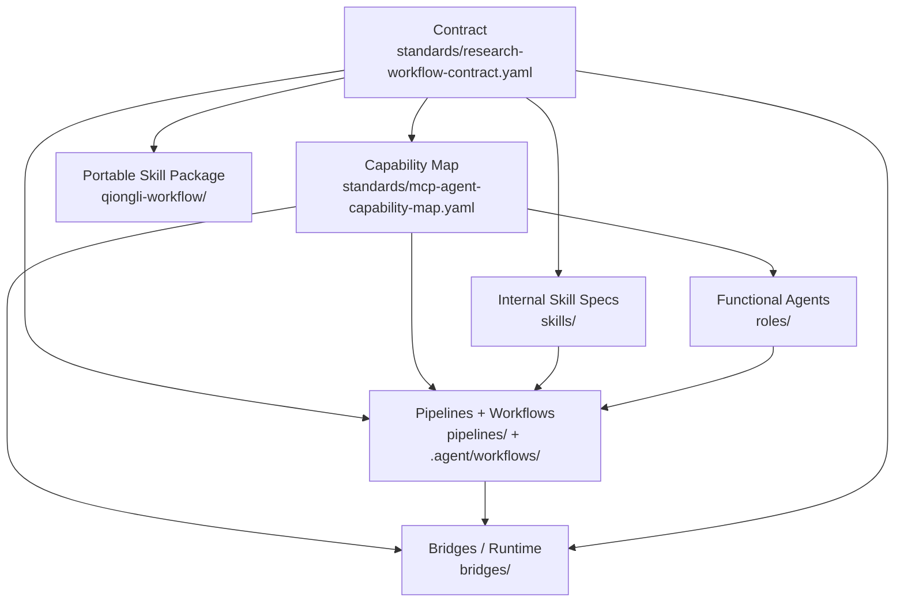

<div align="center">
  
  <h1>Qiongli (穷理)</h1>
  <p><strong>Contract-driven academic workflows for Codex, Claude Code, and Gemini.</strong></p>
  <p>Plan papers, run literature work, draft manuscripts, execute research code, and audit evidence through one canonical task contract.</p>
  <p>
    <a href="docs/quickstart.md">Quick Start</a> ·
    <a href="docs/guide/install.md">Install</a> ·
    <a href="docs/guide/using-agent-skills.md">Use Skills</a> ·
    <a href="docs/guide/task-recipes.md">Research Recipes</a> ·
    <a href="docs/reference/cli.md">CLI</a> ·
    <a href="docs/architecture.md">Architecture</a>
  </p>
</div>

## What Qiongli Does

Qiongli turns academic work into explicit, reviewable task flows. Instead of asking an agent to improvise a paper end to end, each run is tied to Task IDs, quality gates, role handoffs, and output paths under `RESEARCH/[topic]/`.

Use it when you need:

- **Research workflows:** systematic review, empirical study, qualitative study, RCT preregistration, theory paper, and code-first methods paper routes.
- **Literature rigor:** provider-aware search planning, search diagnostics, materialized search bundles, dedup logs, screening readiness, and snowball readiness.
- **Writing integrity:** claim-evidence mapping, citation risk checks, figures/tables planning, limitations review, proofreading, and rebuttal preparation.
- **Research code discipline:** strict Stage-I `I5 -> I6 -> I7 -> I8` specification, planning, execution, and review artifacts.
- **Multi-agent review:** Codex / Claude / Gemini orchestration with solo, duo, and triad modes, explicit handoffs, disagreement records, and verification status.

## Start Here

Choose the smallest entrypoint that matches the job:

| Need | Recommended path | Details |
|---|---|---|
| Use Qiongli in one AI client | Native plugin / extension | [Install guide](docs/guide/install.md) |
| Know what to type after install | Client-specific skill entrypoints | [Using agent skills](docs/guide/using-agent-skills.md) |
| Install workflow assets across clients | Bootstrap `partial` profile | [Quick start](docs/quickstart.md) |
| Use `qiongli doctor`, validators, or orchestrator | Bootstrap `full` profile with Python 3.12+ | [Multi-agent guide](docs/guide/multi-agent.md) |
| Script installs through npm | `npm install -g qiongli` or `npx qiongli@latest` | [CLI reference](docs/reference/cli.md) |
| Update the Python CLI distribution | `pipx install qiongli` or `pipx upgrade qiongli` | [Upgrade guide](docs/guide/upgrade.md) |
| Pick a paper route | Start from task recipes | [Task recipes](docs/guide/task-recipes.md) |

## Current Capability Map

| Area | What is covered |
|---|---|
| Framing | question refinement, contribution crafting, hypotheses, theory maps, gap analysis, venue fit |
| Literature | academic search, concept expansion, screening, extraction, citation snowballing, full-text retrieval, reference management |
| Design | study design, variables, robustness, datasets, preregistration, data management |
| Ethics and compliance | IRB support, deidentification, ethics statements, PRISMA and reporting checks |
| Writing and synthesis | evidence synthesis, manuscript architecture, analysis interpretation, tables, figures, discussion, limitations |
| Submission and rebuttal | peer-review simulation, fatal-flaw detection, cover materials, reviewer response |
| Code and reproducibility | data cleaning, merging, statistics, code build/review, release packaging, reproducibility audits |
| Presentation | talk planning, slide architecture, Slidev, Beamer, and PPTX-oriented outputs |

## Runtime Boundary

> [!WARNING]
> Full functionality requires a real Python runtime plus all three model CLIs in `PATH`:
> `python3`, `codex`, `claude`, and `gemini`.
> You also need the matching runtime authentication. `codex` can run with `OPENAI_API_KEY` or an existing ChatGPT/Codex login, `claude` uses `ANTHROPIC_API_KEY`, and Gemini `direct` mode requires non-interactive auth such as `GEMINI_API_KEY` or Vertex env auth. Google-login-only Gemini automation should use the resident broker path described in [docs/guide/multi-agent.md](docs/guide/multi-agent.md).
> Without them, you can still install assets and use shell `qiongli check|upgrade|align`, but `doctor`, validators, tests, and the full orchestrator flow will be partial or unavailable.

## Why The Name

**Qiongli** is the public name of the project, from the Chinese `穷理`: to pursue the underlying principle of a question until its logic, evidence, and limits are clear. For an academic workflow system, the name points to the work this repository is meant to support: not just producing text, but tracing a research claim back through literature, method, code, critique, and reproducible artifacts.

The full system name is **Qiongli Zhengche** (`穷理证澈`). **Zhengche** (`证澈`) names the core methodology: make evidence chains, citation risk, assumptions, and claim boundaries transparent enough to audit. In practice, that means every workflow is tied to Task IDs, quality gates, and output paths under `RESEARCH/[topic]/`, rather than relying on ad hoc prompts.

Technical identifiers follow the public name: the plugin is `qiongli`, the portable skill package is `qiongli-workflow`, and the updater distribution is `qiongli`. Legacy aliases such as `research-skills`, `rsk`, and `rsw` remain available only for compatibility.

## Design Lineage And Related Projects

This repository is not built in isolation. Two external projects are especially relevant to its design direction:

- [fengshao1227/ccg-workflow](https://github.com/fengshao1227/ccg-workflow)
  - We borrow the workflow idea of strict phase separation: spec -> plan -> execute -> review.
  - We also borrow the habit of constraining execution instead of letting a single prompt improvise end to end.
  - The difference is scope: CCG is primarily a software-engineering collaboration system, while this repository localizes those ideas into an academic workflow and turns them into canonical Stage-I tasks `I5 -> I6 -> I7 -> I8` plus contract-bound outputs under `RESEARCH/[topic]/`.
- [GuDaStudio/skills](https://github.com/GuDaStudio/skills)
  - This project is a useful reference for packaging Claude-oriented collaboration skills and for making Codex / Gemini cooperation installable as reusable skill assets.
  - The difference is packaging model and target domain: `GuDaStudio/skills` is a general collaboration skill collection, while `qiongli` uses one research contract, one artifact tree, and one task catalog for academic work.
- [Matt Pocock's `grill-me` skill](https://github.com/mattpocock/skills/blob/main/skills/productivity/grill-me/SKILL.md)
  - We credit the one-question-at-a-time interaction pattern and the habit of giving a recommended answer while clarifying an idea.
  - Qiongli adapts it into an academic idea-discovery loop: instead of grilling software plans, it tests whether a topic can become a defensible paper idea with clear claim strength, evidence threshold, rival explanations, feasibility, and reviewer risk.
  - The Academic Idea Funnel is this academic adaptation as a reusable artifact: `RESEARCH/[topic]/context/idea_funnel.md` records candidate idea triage, the recommended idea, weakest assumption, evidence plan, reviewer risk, and the handoff into `context/boundary_review.md`.

---

## Quick Start (0 → 1 Navigation)

This is the shortest stable path from “nothing installed” to “running a canonical task.”

Start with the consolidated docs when you need detail:

- [Quick Start](docs/quickstart.md)
- [Multi-Agent Runtime Guide](docs/guide/multi-agent.md)
- [Install Guide](docs/guide/install.md)
- [Using Agent Skills](docs/guide/using-agent-skills.md)
- [CLI Reference](docs/reference/cli.md)
- [Architecture](docs/architecture.md)
- [Plugin-First Architecture](docs/advanced/plugin-first-architecture.md)
- [Controller Modes](guides/advanced/controller-modes.md)

### 0. Choose An Install Path

For native client distribution, install **Qiongli** through the client-specific extension surface:

- **Codex:** add the shared [Skillsplace](https://github.com/jxpeng98/skillsplace) marketplace, then install or enable `qiongli` for the default core package or a subject entry such as `qiongli-economics`.
- **Claude Code:** add the shared [Skillsplace](https://github.com/jxpeng98/skillsplace) marketplace, then install `qiongli@skillsplace` for core or a subject entry such as `qiongli-economics@skillsplace`.
- **Claude Desktop / Claude.ai:** if you do not want to use a code/CLI environment, download a focused subject ZIP from the GitHub Release assets, then drag it into Claude Desktop's Skills upload/install flow or upload it from `Customize > Skills > + > Create skill > Upload a skill`. Use `qiongli-claude-desktop-skill-core-<tag>.zip` for the default general workflow, `qiongli-claude-desktop-skill-economics-<tag>.zip` for economics, `qiongli-claude-desktop-skill-political-economy-<tag>.zip` for political economy, `qiongli-claude-desktop-skill-geoeconomics-<tag>.zip` for geoeconomics, `qiongli-claude-desktop-skill-business-<tag>.zip` for business, `qiongli-claude-desktop-skill-finance-<tag>.zip` for finance, or `qiongli-claude-desktop-skill-economics-accounting-<tag>.zip` for the official economics/accounting composite. The legacy `qiongli-claude-desktop-skill-<tag>.zip` remains a core alias for one release cycle.
- **Gemini CLI:** install the Gemini extension from `plugins/qiongli` locally, or from a standalone extension repository/gallery entry once published.

Public Codex and Claude marketplace catalog metadata now lives in `jxpeng98/skillsplace`. Release builds now attach separate Codex and Claude Code plugin artifacts for `core`, `economics`, `accounting`, `business`, `finance`, `political-economy`, `geoeconomics`, and `economics-accounting` so the shared marketplace can list subject-specific install choices. This repository keeps the source plugin payload and platform manifests that those generated artifacts derive from:

- `plugins/qiongli/.codex-plugin/plugin.json`
- `plugins/qiongli/.claude-plugin/plugin.json`
- `plugins/qiongli/gemini-extension.json`
- `plugins/qiongli/commands/*.md`
- `plugins/qiongli/skills/qiongli-workflow`

The plugin is the install/discovery container; `qiongli-workflow` is the portable skill package inside it. The user-visible skill name is `qiongli`; the install directory stays `qiongli-workflow` for compatibility. The 71 academic skill specs under `skills/` are source-of-truth capability cards and are synchronized into the portable/plugin package before release.

Claude Desktop does not use the Claude Code third-party plugin marketplace path. For Desktop, use the release ZIP above; the ZIP contains a top-level `qiongli/` skill folder so the folder name matches `SKILL.md`.

### Subject Packages

Subject packaging has two audiences: users choose an install shape, while developers decide where specialization belongs. The full model is documented in [Subject Packaging Model](docs/advanced/subject-packaging-model.md).

For users:

| Need | Install shape | Command |
|---|---|---|
| Unsure what to choose | `core / complete` | `qiongli install --target all` |
| Full framework plus economics expertise | `economics / complete` | `qiongli install --subject economics --target all` |
| Full framework plus accounting expertise | `accounting / complete` | `qiongli install --subject accounting --target all` |
| Full framework plus business expertise | `business / complete` | `qiongli install --subject business --target all` |
| Full framework plus finance expertise | `finance / complete` | `qiongli install --subject finance --target all` |
| Full framework plus political economy expertise | `political-economy / complete` | `qiongli install --subject political-economy --target all` |
| Full framework plus geoeconomics expertise | `geoeconomics / complete` | `qiongli install --subject geoeconomics --target all` |
| Slim economics package | `economics / focused` | `qiongli install --subject economics --coverage focused --target all` |
| Official economics/accounting cross-discipline package | `economics-accounting / complete` | `qiongli install --subject economics-accounting --target all` |
| Refresh accounting after updating the CLI | `accounting / complete` | `qiongli upgrade --subject accounting --target all` |

For developers, `core` owns shared workflow contracts, generic skills, templates, standards, and quality gates. Specialized subjects add discipline depth through selected profiles, append overlays, declared section replacements, and a small number of subject-specific skills. Generic skill source files are not duplicated. Effective packages are generated from `skill_refs`, subject overlays, layered section overrides, and optional local custom overlays.

Current official subjects are `core`, `economics`, `accounting`, `business`, `finance`, `political-economy`, `geoeconomics`, and the official composite `economics-accounting`. Default install means `core/complete`. `--subject economics`, `--subject business`, `--subject finance`, `--subject political-economy`, and `--subject geoeconomics` mean complete specialized installs, not reduced packages. `--subject accounting` means `accounting/complete`, full framework plus accounting specialization. `--coverage focused` is the deliberate slim path and the Desktop/Web ZIP path. Public Desktop ZIP subjects in this phase are `core`, `economics`, `business`, `finance`, `political-economy`, `geoeconomics`, and `economics-accounting`; there is no standalone accounting Desktop ZIP yet. `political-economy` and `geoeconomics` are independent subjects, not a composite pair. Official composite subjects are named subjects, not arbitrary comma-separated stacking. To switch subjects or coverage, rerun install or upgrade. Each client still has one active `qiongli-workflow` package at a time.

When adding or deepening a subject, update these together: `subjects/catalog.yaml`, subject overlays, subject-specific registry and markdown, selected domain and venue profiles, subject eval fixtures, specialization audit expected terms, materializer tests, npm package contract tests against staged materialization when the subject is installable through npm, and release validation if the subject has a Desktop/Web artifact.

### Local Customization

Use a local custom subject layer when a user, lab, or project needs overlays, profiles, or custom skills without changing canonical Qiongli source. This scaffold and materialization path is for the Python/source checkout workflow. Custom overlays affect generated output only and do not rewrite canonical source files.

```bash
qiongli customize --subject economics --name my-econ-lab --out ./qiongli-custom/econ-lab
python3 scripts/materialize_subject_package.py --subject economics --custom-dir ./qiongli-custom/econ-lab --source . --out /tmp/qiongli-workflow
```

npm runtime installs use pre-generated payloads only and do not accept a runtime `--custom-dir` in this phase.

Invocation depends on the client surface:

- **Codex:** discover with `/skills`, then invoke the installed skill as `$qiongli`. Codex does not expose a custom `/qiongli` slash command.
- **Claude Code / Gemini CLI:** use workflow commands such as `/paper`, `/lit-review`, `/paper-write`, and `/code-build` when command/workflow discovery is installed.
- **Shell CLI / orchestrator:** use `qiongli`, `ql`, or `python3 -m bridges.orchestrator ...` when you need checks, upgrades, task plans, or multi-agent execution.

Use the bootstrap/CLI path below when you need cross-client global installs, slash-command symlinks, `qiongli upgrade`, `doctor`, or multi-model orchestration.

Compatibility note: the native plugin does not touch separate global CLI installs by itself. If you still need CLI / orchestrator capabilities, keep the `full` runtime and run `qiongli upgrade --target all --doctor`; current qiongli installers remove confirmed legacy `research-paper-workflow` global skill directories while installing `qiongli-workflow`. If you move fully to the plugin, preview global cleanup with `qiongli clean --globals --dry-run`.

### 1. Choose `partial` Or `full`

The bootstrap installer has two profiles. Use `partial` when you only want the cross-client skill package and slash-command discovery. Use `full` when you also want the local shell CLI and Python-backed orchestrator checks.

| Profile | What you get | Python needed before install | Result after install |
|---|---|---|---|
| `partial` | global `qiongli-workflow` skill assets for Codex / Claude Code / Gemini, plus workflow discovery links where the client supports them | No | Codex can use `$qiongli`; Claude/Gemini slash workflows such as `/paper` and `/lit-review` are ready |
| `full` | everything in `partial`, shell CLI commands `qiongli` / `ql` plus legacy aliases, and optional `doctor` validation | Yes, Python 3.12+ | Full orchestrator runtime is ready |

Use `partial` if:

- you only need native client skills and slash workflows
- you do not have Python installed yet
- you want the lowest-friction install on Windows or a locked-down machine

Use `full` if:

- you want `qiongli upgrade`, `qiongli init`, `qiongli doctor`, or the short legacy aliases `rsk` / `rsw`
- you want to run `python3 -m bridges.orchestrator task-plan|task-run|doctor`
- you want local validators, unit tests, or multi-model orchestration

Behavior in `full` mode:

- If `python3 >= 3.12` already exists, bootstrap reuses it.
- If Python is missing or too old, bootstrap fails fast and prints installation options. It does not install Python or `mise`.
- On Windows, bootstrap runs directly in PowerShell and installs Git for Windows via `winget` only when shell CLI wrappers need Bash.

If you omit `--profile`, the bootstrap script explains both choices and prompts you to choose.

### Python prerequisite for `full`

`full` mode requires Python 3.12+ to already be available on PATH. The installer does not install Python or `mise` for you. Install Python using any method you prefer:

- macOS: python.org installer, `brew install python`, `pyenv`, or `mise`
- Windows: python.org installer, `winget install -e --id Python.Python.3.12 --source winget`, Microsoft Store, or pyenv-win
- Linux: distro package manager, `pyenv`, or `mise`

Verify before running `full`:

```bash
python3 --version
```

### 2. Run The One-Click Bootstrap

Linux / macOS:

```bash
curl -fsSL https://raw.githubusercontent.com/jxpeng98/qiongli/main/scripts/bootstrap_qiongli.sh | bash -s -- --project-dir "$PWD" --target all
```

Windows PowerShell 7+:

```powershell
winget install --id Microsoft.PowerShell --source winget
Invoke-WebRequest https://raw.githubusercontent.com/jxpeng98/qiongli/main/scripts/bootstrap_qiongli.ps1 -OutFile .\bootstrap_qiongli.ps1
pwsh -ExecutionPolicy Bypass -File .\bootstrap_qiongli.ps1 -ProjectDir "$PWD" -Target all
```

If you want to skip the prompt and force a profile:

```bash
# Linux / macOS
curl -fsSL https://raw.githubusercontent.com/jxpeng98/qiongli/main/scripts/bootstrap_qiongli.sh | bash -s -- --profile partial --project-dir "$PWD" --target all
curl -fsSL https://raw.githubusercontent.com/jxpeng98/qiongli/main/scripts/bootstrap_qiongli.sh | bash -s -- --profile full --project-dir "$PWD" --target all
```

```powershell
# Windows PowerShell 7+
# Partial profile
pwsh -ExecutionPolicy Bypass -File .\bootstrap_qiongli.ps1 -Profile partial -ProjectDir "$PWD" -Target all
# Full profile
pwsh -ExecutionPolicy Bypass -File .\bootstrap_qiongli.ps1 -Profile full -ProjectDir "$PWD" -Target all
# Beta profile (latest prerelease tag)
pwsh -ExecutionPolicy Bypass -File .\bootstrap_qiongli.ps1 -Beta -Profile full -ProjectDir "$PWD" -Target all
```

This installs:

- workflow assets for Codex / Claude Code / Gemini
- project integration files such as `.agent/workflows/`, `CLAUDE.md`, `.gemini/` when you run `qiongli init` or `--parts project`
- shell CLI commands `qiongli`, `ql`, plus legacy aliases `research-skills`, `rsk`, `rsw` in `full` mode

### npm / npx Alternative

If you prefer a Node-based installer, the npm package is a real standalone entrypoint and does not depend on PyPI:

```bash
npm install -g qiongli
qiongli install --target all --project-dir "$PWD"
qiongli install --subject economics --target all --project-dir "$PWD"
qiongli install --subject accounting --target all --project-dir "$PWD"
qiongli install --subject political-economy --target all --project-dir "$PWD"
qiongli install --subject geoeconomics --target all --project-dir "$PWD"
qiongli install --subject economics-accounting --target all --project-dir "$PWD"
```

For prerelease testing without a global install:

```bash
npx qiongli@next install --subject economics --target all --project-dir "$PWD"
npx qiongli@next check --json
```

The npm package bundles pre-materialized `core`, `economics`, `accounting`, `business`, `finance`, `political-economy`, `geoeconomics`, and `economics-accounting` payloads in both `complete` and `focused` coverage. `--subject` defaults to `core`, and `--coverage` defaults to `complete`; use `--coverage focused` only when you want the slim subject package. `qiongli check --json` reports the bundled subject/coverage payload and installed target subjects. Advanced commands such as `qiongli doctor`, `qiongli task-run`, and `qiongli team-run` delegate to the bundled Python bridge and require Python 3.12+ plus `PyYAML`.

Recommended first command after npm, pipx, pip, or bootstrap install:

```bash
qiongli setup
qiongli setup --dry-run
qiongli setup --project-dir "$PWD" --no-doctor
```

The setup wizard is for CLI, Codex, and Claude Code users who want help choosing install or upgrade, runtime surface (`cli`, `codex`, `claude-code`, or `multi-platform`), subject, coverage (`complete` or `focused`), `--mode copy|link`, install scope (`all`, `globals`, `project`, or `cli`), CLI directory, `--overwrite` / `--no-overwrite`, upgrade source (`--repo`, `--ref`, `--ref-type`, or beta), optional literature provider keys, and doctor verification unless you pass `--no-doctor`. Every prompt includes a short `Tip:` comment explaining what the choice changes.

On npm installs, `qiongli setup` delegates to the bundled Python bridge and therefore requires Python 3.12+ plus `PyYAML`. If you only need Node-based asset installation, use explicit `qiongli install ...` commands.

Provider keys entered through `qiongli setup` use the same provider config as `qiongli provider setup` and `qiongli provider doctor`. Secrets are stored in the provider configuration outside generated research artifacts. Setup configures credentials and runs doctor/capability checks; it does not by itself guarantee external search results.

### 3. Use The Installed Skills

After `partial` or `full`, the normal user workflow is global-first:

1. Create or open a research workspace: `mkdir my-paper && cd my-paper`.
2. Start a supported client.
3. Use the entrypoint that client supports:
   - Codex: run `/skills` to confirm `qiongli`, then invoke `$qiongli` with your task, for example `$qiongli plan an empirical paper on ai-in-education`.
   - Claude Code / Gemini CLI: run a workflow command such as `/paper`, `/lit-review`, `/paper-write`, or `/code-build`.
   - Shell: run `qiongli doctor`, `qiongli upgrade`, or `python3 -m bridges.orchestrator task-plan|task-run` when you installed the full runtime.

Project-local files are not written by default. Run this only when you explicitly want project integration files such as `.env` or local workflow assets:

```bash
qiongli init --project-dir .
```

### 4. Pick An Entry Mode

Use one of these stable entrypoints:

- Codex skill invocation: `/skills` for discovery, `$qiongli` for execution
- Workflow commands in `.agent/workflows/*.md` such as `/paper`, `/lit-review`, `/paper-write`, `/code-build` where slash-command discovery is available
- Installer / updater CLI: `qiongli`, `ql`, plus legacy aliases `research-skills`, `rsk`, `rsw`
- Orchestrator CLI: `python3 -m bridges.orchestrator ...`

### 5. Optional Local Installers And Refresh Paths

If Python is already available, you can also use the local cross-platform installer:

```bash
python3 scripts/bootstrap_qiongli.py --profile partial --project-dir .
python3 scripts/bootstrap_qiongli.py --profile full --project-dir .
```

If Python is already available and you specifically want the Python-distributed updater CLI, that path still exists:

```bash
pipx install qiongli
```

That `pip` / `pipx` path is now optional compatibility distribution for the updater CLI. It is not the recommended first-install path.

To refresh an existing install from inside a project:

```bash
qiongli upgrade --target all --project-dir . --doctor
```

If you used `partial` and later install Python 3.12+, rerun bootstrap with `--profile full` or run `qiongli upgrade --target all --doctor` after the shell CLI is available.

If you already used the shell bootstrap above, re-run it or `qiongli upgrade` with `--overwrite` whenever you want to refresh installed assets.

*Python boundary: shell `qiongli check|upgrade|align` do not require Python; `--doctor`, `python3 -m bridges.orchestrator ...`, validators, and tests still require `python3`.*

### 6. Validate Local Readiness

If Python is available, run the stable preflight checks before a larger workflow:

```bash
python3 -m bridges.orchestrator doctor --cwd .
python3 scripts/validate_research_standard.py --strict
```

Use `doctor` for runtime CLIs, API keys, and MCP wiring.
Use the validator for repo-level contract and schema consistency.

### 6. Plan Before You Run

Inspect prerequisites, output paths, and routing before execution:

```bash
python3 -m bridges.orchestrator task-plan \
  --task-id F3 \
  --paper-type empirical \
  --topic ai-in-education \
  --cwd .
```

`task-plan` shows:

- contract outputs
- prerequisite tasks
- functional owner and handoff trace
- runtime plan (`draft` / `review` / `fallback`)

### 7. Run a Canonical Research Task

```bash
python3 -m bridges.orchestrator task-run \
  --task-id F3 \
  --paper-type empirical \
  --topic ai-in-education \
  --cwd . \
  --triad
```

For a repeatable Codex-first local smoke test with optional Gemini broker coverage:

```bash
python3 scripts/smoke_multi_agent.py --cwd . --transport broker --start-broker
```

Common controls:

- `--focus-output` and `--output-budget`: reduce auxiliary artifact spread by shrinking the active output set
- `--research-depth deep` plus `--max-rounds`: enforce a narrower, more adversarial evidence-expansion and revision loop
- `--only-target <id>`: for structured Stage-I tasks `I4`-`I8`, reload the existing artifact and rerun only the selected actionable target
- Controller-aware flags: `--execution-mode solo|duo|triad`, `--controller`, `--primary`, `--reviewer`, `--verifier`, and `--solo-role-gates strict|standard|off`
- Strict controller-mode validation: invalid controller flag values are rejected; pair controller-aware runs with `--mcp-strict` and `--skills-strict` when missing providers or skill specs must block execution

Example: rerun one planning step only

```bash
python3 -m bridges.orchestrator task-run \
  --task-id I6 \
  --paper-type methods \
  --topic llm-bias \
  --cwd . \
  --only-target S1
```

Example: Claude-primary duo writing run with Codex review

```bash
python3 -m bridges.orchestrator task-run \
  --task-id F3 \
  --paper-type empirical \
  --topic ai-in-education \
  --cwd . \
  --execution-mode duo \
  --controller claude \
  --primary claude \
  --reviewer codex \
  --mcp-strict \
  --skills-strict
```

See [Controller Modes](guides/advanced/controller-modes.md), [Solo Mode](guides/advanced/solo-mode.md), and [Codex-Claude Duo](guides/advanced/codex-claude-duo.md) for controller-aware task-run conventions, solo gates, and disagreement handling.

### 8. Run the Strict Academic Code Flow

Use `code-build` when code is a first-class research artifact rather than a generic engineering task:

```bash
python3 -m bridges.orchestrator code-build \
  --method "Staggered DID" \
  --topic policy-effects \
  --domain econ \
  --focus full \
  --cwd .
```

With `--topic`, `code-build` enters the strict Stage-I path:

- `I5` code specification
- `I6` zero-decision planning
- `I7` execution + performance packaging
- `I8` review

It also supports targeted follow-up:

```bash
python3 -m bridges.orchestrator code-build \
  --method "Transformer Fine-Tuning" \
  --topic llm-bias \
  --domain cs \
  --focus full \
  --only-target I5:decision-1 \
  --only-target I8:P1-01 \
  --cwd .
```

### 9. Use Workflow Commands When Your Client Supports Slash-Command UX

If your client is using the installed workflow entry markdowns, try these commands. Codex users should use `/skills` and `$qiongli` instead; Codex does not register these as custom slash commands.

| Command | Purpose | Example |
|---------|---------|---------|
| `/paper` | Choose-your-path paper workflow | `/paper ai-in-education CHI` |
| `/lit-review` | Systematic literature review | `/lit-review transformer architecture 2020-2024` |
| `/paper-read` | Deep paper analysis | `/paper-read https://arxiv.org/abs/2303.08774` |
| `/find-gap` | Identify research gaps | `/find-gap LLM in education` |
| `/build-framework` | Build theoretical framework | `/build-framework technology acceptance` |
| `/academic-write` | Academic writing assistance | `/academic-write introduction AI ethics` |
| `/paper-write` | Full paper drafting | `/paper-write ai-in-education empirical CHI` |
| `/synthesize` | Evidence synthesis / meta-analysis | `/synthesize ai-in-education` |
| `/study-design` | Empirical study design | `/study-design ai-in-education` |
| `/ethics-check` | Ethics / IRB pack | `/ethics-check ai-in-education` |
| `/submission-prep` | Submission package | `/submission-prep ai-in-education CHI` |
| `/rebuttal` | Rebuttal / revision response | `/rebuttal ai-in-education` |
| `/code-build` | Strict Stage-I academic code flow | `/code-build "Staggered DID" --topic policy-effects --domain econ --focus full` |
| `/proofread` | AI de-fingerprinting & final proofread | `/proofread ai-in-education` |
| `/academic-present` | Academic presentation prep | `/academic-present ai-in-education --format slidev` |

---

## CLI Install And Args

This section covers the installer/updater CLI only. It does not document the research execution args of `bridges.orchestrator`.

### 1. Ways to install the CLI

#### Option A: Native plugin / extension install

Use this when:
- you want the easiest install path inside one client
- you only need the `qiongli-workflow` skill surfaced in Codex, Claude Code, or Gemini CLI
- you do not need `qiongli`, `doctor`, or cross-client global installation

Install commands:

Codex:

```bash
codex plugin marketplace add jxpeng98/skillsplace --ref main
codex plugin marketplace list
```

Then install or enable `qiongli` from the Codex plugin UI.
Subject entries such as `qiongli-economics`, `qiongli-accounting`, `qiongli-business`, `qiongli-finance`, `qiongli-political-economy`, `qiongli-geoeconomics`, and `qiongli-economics-accounting` install the corresponding `subject/complete` package instead of the default core package.

Claude Code:

```bash
claude plugin marketplace add jxpeng98/skillsplace@main
claude plugin install qiongli@skillsplace
# Or install a subject-specialized package:
claude plugin install qiongli-economics@skillsplace
```

In an interactive Claude Code session:

```text
/plugin marketplace add jxpeng98/skillsplace@main
/plugin install qiongli@skillsplace
/plugin install qiongli-economics@skillsplace
```

Claude Desktop / Claude.ai:

1. Download `qiongli-claude-desktop-skill-core-<tag>.zip`, `qiongli-claude-desktop-skill-economics-<tag>.zip`, `qiongli-claude-desktop-skill-business-<tag>.zip`, `qiongli-claude-desktop-skill-finance-<tag>.zip`, `qiongli-claude-desktop-skill-political-economy-<tag>.zip`, `qiongli-claude-desktop-skill-geoeconomics-<tag>.zip`, or `qiongli-claude-desktop-skill-economics-accounting-<tag>.zip` from the GitHub Release assets.
2. Drag the ZIP into Claude Desktop's Skills upload/install flow, or open `Customize > Skills`.
3. Click `+`, choose `Create skill`, then `Upload a skill`.
4. In Claude.ai, use the same `Customize > Skills` upload flow and select the same ZIP.
5. Enable the uploaded `qiongli` skill.

The Desktop/Web ZIP uses `coverage=focused` to stay under the current 180-file upload budget. It is subject-specialized, not lower quality: it preserves executable workflows, prompts, templates, standards, selected profiles, `skills-summary.md`, and `skills-core.md`; specialized ZIPs also include selected effective skill markdown with layered overlays. This Desktop skill ZIP is skill-only: it contains workflows/prompts/templates, stores no secrets, and does not execute provider calls. Use CLI/npm with the default `coverage=complete`, the plugin packages, or the source repository when you need the full canonical source tree.

The separate Qiongli Literature Provider `.mcpb` (`qiongli-literature-provider.mcpb`) is the Claude Desktop local provider asset. It runs local Desktop literature search through OpenAlex and Semantic Scholar, exposes a Desktop configuration UI for OpenAlex email and Semantic Scholar API key values, and relies on Claude Desktop sensitive-field handling instead of putting keys in the skill ZIP. CLI, Codex, and Claude Code users can run `qiongli provider setup`, then verify `provider_connected` or `strategy_only` with `qiongli provider doctor`. Desktop users need the `qiongli-literature-provider` MCPB or platform-native search before claiming `provider_connected`; if no MCPB or platform-native search is available, record the run as `strategy_only` and treat platform search or user-supplied corpus as the evidence source.

Gemini CLI:

```bash
gemini extensions install ./path/to/qiongli/plugins/qiongli
```

Codex and Claude Code install from the shared Skillsplace marketplace catalog. Claude Desktop uses the GitHub Release ZIP upload path. Gemini CLI uses the official extension system (`gemini-extension.json`) rather than a marketplace JSON.

#### Option B: Shell bootstrap CLI install

Use this when:
- you want the shell CLI without installing the PyPI package
- you want `qiongli` / `ql` quickly, while keeping `rsk` / `rsw` compatibility
- you also want workflow assets installed at the same time

Command:

```bash
cd /path/to/your/project
curl -fsSL https://raw.githubusercontent.com/jxpeng98/qiongli/main/scripts/bootstrap_qiongli.sh | bash -s -- \
  --project-dir "$PWD" \
  --target all
```

What it installs:
- shell CLI: `qiongli`, `ql`, plus legacy aliases `research-skills`, `rsk`, `rsw`
- `qiongli-workflow` skill into client skill directories
- project integration files such as `.agent/workflows/`, `CLAUDE.md`, `.gemini/` when you run `qiongli init` or `--parts project`

Default CLI directory:
- `${QIONGLI_BIN_DIR:-${RESEARCH_SKILLS_BIN_DIR:-~/.local/bin}}`

If the command is not found after install, add this directory to `PATH`:

```bash
export PATH="$HOME/.local/bin:$PATH"
```

#### Option C: npm CLI via `npm` / `npx`

Use this when:
- Node.js is already available
- you want an npm-native installer that bundles the skills payload
- you still want optional bridge commands without installing the PyPI package

Command:

```bash
npm install -g qiongli
qiongli install --target all --project-dir "$PWD"
qiongli install --subject economics --target all --project-dir "$PWD"
qiongli install --subject accounting --target all --project-dir "$PWD"
qiongli install --subject economics --coverage focused --target all --project-dir "$PWD"
```

Prerelease without global install:

```bash
npx qiongli@next install --subject economics --target all --project-dir "$PWD"
```

What it installs:
- npm CLI: `qiongli`
- `qiongli-workflow` skill into client skill directories
- optional Python bridge runtime source inside the npm package for `doctor`, `task-run`, and `team-run`

The npm package does not run a `postinstall` hook. Installing the package itself does not modify user skill directories; `qiongli install` or `qiongli upgrade` performs the asset installation.

#### Recommended CLI Setup Wizard

After installing the shell CLI through bootstrap, npm, pipx, or pip, run the setup wizard first:

```bash
qiongli setup
qiongli setup --dry-run
qiongli setup --project-dir "$PWD" --no-doctor
```

The wizard guides CLI, Codex, and Claude Code installs through install or upgrade selection, runtime surface (`cli`, `codex`, `claude-code`, or `multi-platform`), subject choice, coverage choice (`complete` or `focused`), `--mode copy|link`, install scope (`all`, `globals`, `project`, or `cli`), CLI directory, `--overwrite` / `--no-overwrite`, optional upgrade source, literature provider key setup, and doctor verification. Every prompt includes a short `Tip:` comment explaining what the choice changes.

On npm installs, `qiongli setup` delegates to the bundled Python bridge and therefore requires Python 3.12+ plus `PyYAML`. Use explicit `qiongli install ...` commands when you want the Node-only installer path.

Provider keys entered through setup use the same provider config as `qiongli provider setup` and `qiongli provider doctor`. Secrets stay outside generated research artifacts. The provider step configures credentials and checks capabilities; it should not be described as a promise that an external literature search will run.

#### Option D: Python CLI via `pipx`

Use this when:
- Python is already available
- you want to keep using the PyPI-distributed CLI

Command:

```bash
pipx install qiongli
qiongli setup
```

`qiongli setup` guides the same choices interactively. For scriptable installs, keep using `qiongli upgrade` or explicit `qiongli install ...` commands as documented above.

What it installs:
- Python CLI: `qiongli`, `ql`, plus legacy aliases `research-skills`, `rsk`, `rsw`
- It does not automatically write workflow assets into your project; you still run `qiongli upgrade`

#### Option E: Install shell CLI from a local clone

Use this when:
- you already cloned this repository
- you want to control install location or use `link` mode

Command:

```bash
./scripts/install_qiongli.sh \
  --target all \
  --project-dir /path/to/project \
  --install-cli \
  --overwrite
```

### 2. Shell bootstrap args

Entry script:
- `scripts/bootstrap_qiongli.sh`

Common args:

| Arg | Purpose | Default / Notes |
|-----|---------|-----------------|
| `--repo <owner/repo|git-url>` | Choose the upstream GitHub repo | Defaults to `QIONGLI_REPO`, then legacy `RESEARCH_SKILLS_REPO`, else `jxpeng98/qiongli` |
| `--ref <tag-or-branch>` | Install a specific release tag or branch | Defaults to latest release |
| `--ref-type <tag|branch>` | Tell the installer how to interpret `--ref` | Default `tag` |
| `--beta` | Install the latest beta / prerelease tag when `--ref` is omitted | Off by default; stable latest release remains the default |
| `--target <codex|claude|gemini|antigravity|all>` | Choose which client targets to write | Default `all` |
| `--project-dir <path>` | Choose where project integration files are written when project parts are enabled | Default current directory |
| `--install-cli` | Install shell CLI commands | Enabled by default |
| `--no-cli` | Skip shell CLI installation and install workflow assets only | Opposite of `--install-cli` |
| `--cli-dir <path>` | Choose where the shell CLI is installed | Default `${QIONGLI_BIN_DIR:-${RESEARCH_SKILLS_BIN_DIR:-~/.local/bin}}` |
| `--overwrite` | Replace existing skill / CLI / project files | Off by default |
| `--doctor` | Run environment preflight after install | Only runs when `python3` exists |
| `--dry-run` | Preview the actions only | Does not download or write files |

Examples:

```bash
# Install a specific tag
curl -fsSL https://raw.githubusercontent.com/jxpeng98/qiongli/main/scripts/bootstrap_qiongli.sh | bash -s -- \
  --repo jxpeng98/qiongli \
  --ref v0.1.0 \
  --ref-type tag \
  --project-dir "$PWD" \
  --target all \
  --overwrite

# Install the latest beta / prerelease
curl -fsSL https://raw.githubusercontent.com/jxpeng98/qiongli/main/scripts/bootstrap_qiongli.sh | bash -s -- \
  --profile full \
  --beta \
  --project-dir "$PWD" \
  --target all

# Install workflows only, skip CLI
curl -fsSL https://raw.githubusercontent.com/jxpeng98/qiongli/main/scripts/bootstrap_qiongli.sh | bash -s -- \
  --project-dir "$PWD" \
  --target claude \
  --no-cli

# Preview without writing files
curl -fsSL https://raw.githubusercontent.com/jxpeng98/qiongli/main/scripts/bootstrap_qiongli.sh | bash -s -- \
  --project-dir "$PWD" \
  --target codex \
  --dry-run
```

### 3. Local installer args

Entry script:
- `scripts/install_qiongli.sh`

Common args:

| Arg | Purpose | Default / Notes |
|-----|---------|-----------------|
| `--target <codex|claude|gemini|antigravity|all>` | Choose which client targets to write | Default `all` |
| `--mode <copy|link>` | Copy files or create symlinks | Default `copy` |
| `--project-dir <path>` | Choose where project integration files are written when project parts are enabled | Default current directory |
| `--install-cli` | Install shell CLI | Off by default |
| `--no-cli` | Skip shell CLI installation | This is the default behavior |
| `--cli-dir <path>` | Choose where the shell CLI is installed | Default `${QIONGLI_BIN_DIR:-${RESEARCH_SKILLS_BIN_DIR:-~/.local/bin}}` |
| `--overwrite` | Replace existing targets | Off by default |
| `--doctor` | Run `python3 -m bridges.orchestrator doctor` after install | Only runs when `python3` exists |
| `--dry-run` | Preview the actions only | Does not write files |

Notes:
- Use `--mode link` when maintaining a local clone long-term
- Use `--mode copy` for one-off installs
- `--mode link` is for local-repo installs, not remote bootstrap installs

### 4. `qiongli` subcommands and aliases

Both shell CLI and Python CLI expose:
- `qiongli`
- `ql`
- `research-skills` (legacy)
- `rsk`
- `rsw`

Shared commands:
- `check`
- `upgrade`
- `align`

Python CLI only:
- `doctor`
- `init`

#### `qiongli check`

Purpose:
- inspect installed local skill versions
- inspect latest upstream release
- decide whether an upgrade is available

Args:

| Arg | Purpose |
|-----|---------|
| `--repo <owner/repo|url>` | Override the upstream repo |
| `--json` | Emit JSON for scripts or CI |
| `--strict-network` | Fail if upstream lookup fails |

Examples:

```bash
qiongli check
qiongli check --repo jxpeng98/qiongli
qiongli check --json
```

#### `qiongli upgrade`

Purpose:
- download an upstream release/branch archive
- refresh globally installed skills by default, with optional shell CLI refresh
- project integration files stay explicit via `qiongli init` or `--parts project`

Common args:

| Arg | Purpose |
|-----|---------|
| `--repo <owner/repo|url>` | Override the upstream repo |
| `--ref <tag-or-branch>` | Choose a release tag or branch |
| `--ref-type <tag|branch>` | Tell the installer how to interpret `--ref` |
| `--target <codex|claude|gemini|antigravity|all>` | Choose install target |
| `--project-dir <path>` | Choose project path |
| `--install-cli` | Install or refresh shell CLI wrappers |
| `--no-cli` | Skip shell CLI refresh |
| `--cli-dir <path>` | Choose shell CLI directory |
| `--parts <globals,project,cli,doctor>` | Only apply selected install surfaces |
| `--overwrite` | Replace existing targets |
| `--doctor` | Run doctor after upgrade |
| `--dry-run` | Preview upgrade actions |

Examples:

```bash
qiongli upgrade --target all --overwrite
qiongli upgrade --project-dir . --parts project,doctor
qiongli upgrade --repo jxpeng98/qiongli --ref main --ref-type branch --project-dir . --target claude
qiongli upgrade --project-dir . --target codex --dry-run
```

#### `qiongli doctor`  (Python CLI)

Purpose:
- run `bridges.orchestrator doctor` against a project path without remembering the module invocation

Examples:

```bash
qiongli doctor --cwd .
```

#### `qiongli init`  (Python CLI)

Purpose:
- initialize project-facing workflow assets from the installed package without downloading a fresh archive
- this is the default way to wire a project after a global install/upgrade

Common args:

| Arg | Purpose |
|-----|---------|
| `--project-dir <path>` | Choose project path |
| `--target <codex|claude|gemini|antigravity|all>` | Choose client/project surface |
| `--parts <globals,project,cli,doctor>` | Select install surfaces (default: `project`) |
| `--overwrite` | Replace existing project assets |
| `--doctor` | Run doctor after init |
| `--dry-run` | Preview init actions |

Examples:

```bash
qiongli init --project-dir .
qiongli init --project-dir . --target claude --overwrite
```

#### `qiongli align`

Purpose:
- print a short explanation of what the CLI installed and which paths `upgrade` modifies

Args:

| Arg | Purpose |
|-----|---------|
| `--repo <owner/repo|url>` | Only changes the example repo shown in output |

Examples:

```bash
qiongli align
qiongli align --repo jxpeng98/qiongli
```

### 5. Useful environment variables

| Env Var | Purpose |
|---------|---------|
| `QIONGLI_REPO` | Default upstream repo, so you can omit `--repo` |
| `QIONGLI_BIN_DIR` | Default install directory for the shell CLI |
| `RESEARCH_SKILLS_REPO` | Legacy fallback for `QIONGLI_REPO` |
| `RESEARCH_SKILLS_BIN_DIR` | Legacy fallback for `QIONGLI_BIN_DIR` |
| `CODEX_HOME` | Root directory for Codex skill installation |
| `CLAUDE_CODE_HOME` | Root directory for Claude Code skill installation |
| `GEMINI_HOME` | Root directory for Gemini skill installation |
| `ANTIGRAVITY_HOME` | Root directory for Antigravity global skill installation |
| `GITHUB_TOKEN` / `GH_TOKEN` | Auth token for private repos or GitHub API limits |

### 6. What still needs Python

Does not need Python:
- shell bootstrap install
- shell CLI `check` / `upgrade` / `align`
- local installer `copy/link` asset install

Still needs Python:
- `--doctor`
- `python3 -m bridges.orchestrator ...`
- validators, orchestrator, and test commands in this repo

---

## Subject Packages And Runtime Domains

**How do subject packages relate to runtime domains?**

Qiongli now supports subject-specialized installs. `core` is the default general package; `economics`, `accounting`, `business`, `finance`, `political-economy`, `geoeconomics`, and the named composite `economics-accounting` install the same canonical workflow with subject overlays and subject-specific skills. CLI/npm installs default to `coverage=complete`, so a specialized install keeps the full framework and adds the requested specialization. `coverage=focused` is for deliberate slim packages and Desktop/Web ZIPs.

Runtime flags such as `--domain econ` still matter for a single task packet, but they no longer replace subject packaging. Use `qiongli install --subject economics --target all` when the client should operate as an economics-specialized Qiongli install by default. Use runtime domains for temporary task-level emphasis inside the active subject.

---

## 🏗 Architecture & Standardization Layer

The system operates on a single canonical workflow contract ensuring that Codex, Claude, and Gemini produce outputs in identical formats and paths.

- **The Contract**: `standards/research-workflow-contract.yaml` (Task IDs, required outputs, quality gates)
- **The Routing**: `standards/mcp-agent-capability-map.yaml` (MCP tool mapping & primary/fallback agents)
- **Output Standard**: All generated content saves strictly to `RESEARCH/[topic]/`

### Layer Model

The core execution stack is organized into six layers:

| Layer | Current Location | Responsibility |
|---|---|---|
| **Contract** | `standards/research-workflow-contract.yaml` | Defines canonical Task IDs, artifact paths, and quality gates |
| **Functional Agents** | `roles/` + `pipelines/` | Research responsibility layer (literature, methods, writing, compliance, etc.) |
| **Runtime Agents** | `standards/mcp-agent-capability-map.yaml` + `bridges/` | Chooses which model runtime executes a step (`codex`, `claude`, `gemini`) |
| **Internal Skill Specs** | `skills/` | Reusable execution specs referenced by the capability map and pipelines |
| **Pipelines / Workflows** | `pipelines/` + `.agent/workflows/` | DAGs and user entrypoints that sequence skills for a paper type or command |
| **Bridges** | `bridges/` | Runtime adapters, orchestration, and MCP integration |

One additional distribution surface sits beside the execution stack:

- **Portable Skill Package**: `qiongli-workflow/` is the installable cross-client entry skill for Codex/Claude/Gemini.
- **Important**: `qiongli-workflow/` is not the authoritative source for every internal capability spec; `skills/` and `standards/` remain the internal source-of-truth layers.

### Terminology

- **Portable skill** means an end-user installable skill package such as `qiongli-workflow/`.
- **Internal skill spec** means a repo-internal markdown spec under `skills/` used by the capability map, pipelines, and validators.
- **Functional agent** means the research responsibility layer (today represented primarily by `roles/` and pipeline ownership patterns).
- **Runtime agent** means the actual model executor (`codex`, `claude`, `gemini`).

### Dependency Direction

Maintain these dependencies in one direction only:



Operational rules:

- `Contract` defines canonical outputs and quality gates. Downstream layers may reference them but should not silently redefine them.
- `Capability Map` defines routing and required capabilities. Downstream layers may compose that routing but should not invent a second routing truth.
- `Functional Agents` define responsibility and ownership. They do not replace runtime selection.
- `Internal Skill Specs` define reusable execution behavior. They do not replace the contract or the capability map.
- `Pipelines / Workflows` sequence existing pieces. They should not become a second source of artifact or ownership truth.
- `Bridges` execute the plan. They should not encode contract logic that diverges from `standards/`.

### Maintainer Mapping

Use this table as a fast "where does this task live?" reference. Skills listed are representative, not exhaustive.

| Task ID | Functional owner | Representative skill specs | Runtime plan | Contract artifacts |
|---|---|---|---|---|
| `A1` | `research-orchestrator` | `question-refiner`, `metadata-enricher` | draft `claude` / review `gemini` / fallback `codex` | `framing/research_question.md` |
| `B1` | `literature-agent` | `academic-searcher`, `paper-screener`, `fulltext-fetcher`, `paper-extractor` | draft `claude` / review `codex` / fallback `gemini` | `protocol.md`, `search_strategy.md`, `search_log.md`, `search_results.csv`, `screening/` |
| `C4` | `data-agent` | `dataset-finder` | draft `claude` / review `gemini` / fallback `codex` | `data_management_plan.md`, `design/dataset_plan.md` |
| `F3` | `writing-agent` | `manuscript-architect`, `analysis-interpreter`, `effect-size-interpreter` | draft `claude` / review `codex` / fallback `gemini` | `manuscript/manuscript.md`, `manuscript/results_interpretation.md`, `manuscript/effect_interpretation.md` |
| `H1` | `publication-agent` | `submission-packager`, `reporting-checker`, `citation-formatter` | draft `claude` / review `gemini` / fallback `codex` | `submission/cover_letter.md`, `submission/submission_checklist.md`, `submission/title_page.md`, `submission/highlights.md`, `submission/*` |
| `I3` | `data-agent` | `data-cleaning-planner`, `data-merge-planner`, `code-builder` | draft `codex` / review `gemini` / fallback `claude` | `analysis/`, `data/cleaning_plan.md`, `data/merge_plan.md` |

### Skills + Agents Flow (ASCII)

```text
User Goal / Prompt
        |
        v
Task / Workflow Router (Task ID + paper_type)
        |
        v
Canonical Contract Load
        |
        v
Capability Map Load
        |
        +-------------------------------+
        |                               |
        v                               v
Functional Routing                 Runtime Routing
(role / responsibility)           (codex / claude / gemini)
        |                               |
        +---------------+---------------+
                        v
                MCP Evidence Collection
                        |
                        v
                 Draft Generation
                        |
                        v
                 Review / Critique
                        |
            +-----------+-----------+
            |                       |
            v                       v
      Triad Audit (optional)   Dual/Single Fallback
                        \       /
                         v     v
               Synthesis (summarizer)
                        |
                        v
        Quality Gates + Artifact Output Write
            -> RESEARCH/[topic]/...
```

See [docs/advanced/agent-skill-collaboration.md](docs/advanced/agent-skill-collaboration.md) for the current guide. The legacy mirror remains at [guides/advanced/agent-skill-collaboration.md](guides/advanced/agent-skill-collaboration.md).

---

## Multi-Model Collaboration (`orchestrator`)

You can coordinate Codex, Claude, and Gemini concurrently for cross-stage research tasks.
*(Requires runtime auth for each agent. Gemini may run through `direct`, `broker`, or `auto`; see [docs/guide/multi-agent.md](docs/guide/multi-agent.md).)*

```bash
# Inspect task prerequisites and routing before execution
python3 -m bridges.orchestrator task-plan --task-id F3 --paper-type empirical --topic my-topic --cwd .

# Parallel analysis - triad concurrent analysis + synthesis
python3 -m bridges.orchestrator parallel --prompt "Analyze code safety" --cwd . --summarizer claude

# Task-run - execute canonical Task ID with capability-map agent routing
python3 -m bridges.orchestrator task-run --task-id F3 --paper-type empirical --topic my-topic --cwd .

# Team-run - research fanout/fanin parallel execution (MVP: B1, H3)
python3 -m bridges.orchestrator team-run --task-id B1 --paper-type systematic-review --topic my-topic --cwd .
python3 -m bridges.orchestrator team-run --task-id H3 --paper-type empirical --topic my-topic --cwd .

# Strict Stage-I academic code flow
python3 -m bridges.orchestrator code-build --method "Staggered DID" --topic my-topic --domain econ --focus full --cwd .

# Interactive Step-by-Step Mode (pauses for Y/n confirmation before agent execution)
python3 -m bridges.orchestrator task-run --task-id F3 --paper-type empirical --topic my-topic --cwd . -i

# Enforce strict capabilities
python3 -m bridges.orchestrator task-run --task-id B1 --paper-type systematic-review --topic my-topic --cwd . --mcp-strict

# Reduce artifact sprawl and push for deeper evidence/review
python3 -m bridges.orchestrator task-run --task-id F3 --paper-type empirical --topic my-topic --cwd . \
  --focus-output manuscript/manuscript.md \
  --research-depth deep \
  --draft-profile deep-research \
  --review-profile strict-review \
  --triad-profile deep-research \
  --triad \
  --max-rounds 4

# Reopen only selected Stage-I targets
python3 -m bridges.orchestrator code-build --method "Transformer Fine-Tuning" --topic llm-bias --domain cs --focus full \
  --only-target I5:decision-1 \
  --only-target I8:P1-01 \
  --cwd .
```

Useful knobs for `task-run`:

- `--focus-output <path>`: repeatable; restrict this run to specific contract output paths.
- `--output-budget <n>`: cap how many contract outputs are active in this run.
- `--research-depth deep`: adds explicit evidence-expansion, contradiction-check, and narrow-claim pressure.
- `--max-rounds <n>`: increases revision depth after review blocks.
- `--only-target <id>`: for Stage-I structured artifacts, reload the existing artifact and rerun only the selected actionable target(s).
- `--execution-mode`, `--controller`, `--primary`, `--reviewer`, `--verifier`, `--solo-role-gates`: record strict controller-mode metadata for solo, duo, or triad task ownership.
- Built-in profiles: `focused-delivery`, `deep-research`, `strict-review`, `rapid-draft`, `default`.

**Execution Modes**

| Mode | Purpose | Unit of work |
|------|---------|--------------|
| `parallel` | Same prompt → multiple agents analyze → synthesis | Open-ended prompt |
| `task-run` | Single Task ID → serial draft → review → triad | One research task |
| `team-run` | Single Task ID → fanout workers → merge → review | Multiple work units (MVP: `B1`, `H3`) |
*(See [docs/reference/cli.md](docs/reference/cli.md) for the full command reference.)*

---

## Evidence Quality Rating (A-E)

| Grade | Evidence Type |
|-------|--------------|
| **A** | Systematic reviews, Meta-analyses, Large RCTs |
| **B** | Cohort studies, High-IF journal papers |
| **C** | Case studies, Expert opinion, Conference papers |
| **D** | Preprints, Working papers |
| **E** | Anecdotal, Theoretical speculation |

---

## Supported APIs & Databases

| Source | Purpose | Coverage |
|--------|---------|----------|
| Semantic Scholar | Primary search | 200M+ papers |
| arXiv | CS/AI/Physics preprints | Full coverage |
| OpenAlex | Bibliometrics | 250M+ works |
| Crossref | Metadata verification | 140M+ DOIs |

---

## Development & Contributing

### CI Pipeline & Local Consistency
All changes to contracts or skills must pass strict CI format validation.

```bash
# Validate core YAML schemas and contract mappings locally
python3 scripts/validate_research_standard.py --strict
python3 -m unittest tests.test_orchestrator_workflows -v

# Validate user-generated research artifacts inside a project
python3 scripts/validate_project_artifacts.py --cwd ./project  --topic <topic> --task-id H1 --strict
```

If you wish to test the legacy installation method, the script is located at: `scripts/install_qiongli.sh`


### Release Automation
Use `scripts/release_automation.sh publish` as the release entrypoint. Do not create release tags or trigger publish workflows manually during routine releases; `publish` owns the release-prep commit, tag push, CI/publish wait, GitHub Release, plugin artifacts, and acceptance receipt.

```bash
# Full end-to-end stable publish from main/master
./scripts/release_automation.sh publish --tag v0.1.0 --from-tag v0.1.0-beta.6

# Full end-to-end beta publish from dev
git switch dev
./scripts/release_automation.sh publish --tag v0.8.0-beta.1 --skip-bump --from-tag v0.7.0-beta.2

# Diagnostic / recovery split phases when needed
./scripts/release_automation.sh pre --tag v0.1.0 --from-tag v0.1.0-beta.6
./scripts/release_automation.sh post --tag v0.1.0 --create-release
```

---

## Project Structure

```
qiongli/
├── standards/                # Canonical workflow contract + capability map
├── qiongli-workflow/  # Portable cross-client skill package (distribution surface)
├── .agent/workflows/         # Installed workflow entry markdowns / slash-command surface
├── pipelines/                # Abstract DAGs for paper-type workflows and handoffs
├── roles/                    # Functional-agent role configs (research responsibility layer)
├── bridges/                  # Runtime orchestration and model adapters
├── skills/                   # Internal skill specs referenced by the capability map
│   ├── [...]                 # Stages A through K
│   └── domain-profiles/      # Domain-specific configs (economics, cs-ai, etc.)
├── schemas/                  # JSON schemas + artifact type vocab
├── eval/                     # Golden test cases
├── guides/                   # Basic and Advanced tutorials
├── scripts/                  # CI, installers, validators
└── tests/                    # Unit tests
```

License: MIT
