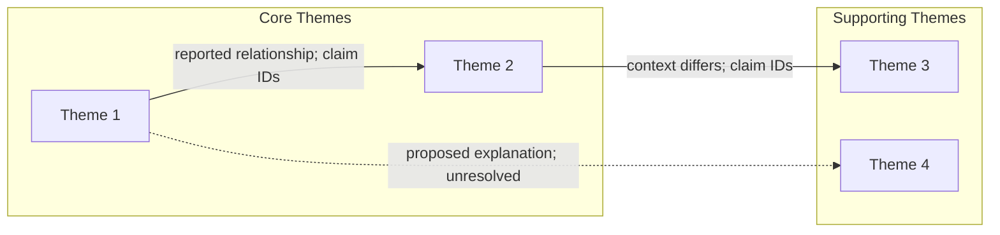

# Synthesis Matrix Template

<!--
Usage: Use this matrix to synthesize findings across multiple papers.
Maps themes/concepts (rows) against papers (columns) to identify patterns.
Save to: RESEARCH/[topic]/synthesis_matrix.md
-->

# Synthesis Matrix

## Review: [Your Review Title]

## Date: [Date]

---

## Theme × Paper Matrix

Use only the sections needed for the requested synthesis. Define each row's
specific claim/outcome, relevant population and time point before comparing
papers. Replace Paper labels with citekeys; retain study/report/cohort identity
and overlap in Pattern Notes. Different versions are not independent studies.
Keep existing project claim IDs in row labels and exact source/version/locator
bindings in cells or their linked evidence rows. A cross-source inference gets
its own claim ID with contributing claims/anchors.

Optional marks summarize an inspected comparison, not a support verdict:
- **✓** = Evidence supports the specified claim within recorded limits
- **✗** = Comparable evidence conflicts with that claim; explain how
- **○** = Mentioned but not substantiated in the inspected material
- **—** = Not addressed within the stated inspected scope

Write unknown/partial access explicitly. A blank cell or abstract omission cannot
establish absence, and an inconclusive estimate is not automatically contradiction.
Keep different outcomes or incomparable designs separate. No mark replaces the
passage, uncertainty and appraisal needed to judge support.

| Theme / Concept | Paper 1 | Paper 2 | Paper 3 | Paper 4 | Paper 5 | Pattern Notes |
|-----------------|---------|---------|---------|---------|---------|---------------|
| Theme 1: [Name] | | | | | | |
| Theme 2: [Name] | | | | | | |
| Theme 3: [Name] | | | | | | |
| Theme 4: [Name] | | | | | | |
| Theme 5: [Name] | | | | | | |

---

## Detailed Theme Analysis

### Theme 1: [Theme Name]

**Definition and project question:** [Claim/outcome and why it matters here]

| Paper | Key Evidence | Quote/Page | Support Level |
|-------|--------------|------------|---------------|
| Citekey; study/report | Finding, design/context, magnitude/uncertainty where available | Version; exact inspected locator; access limit | Claim supported within stated limits / unresolved; reason |
| Citekey; study/report | | | |

**Synthesis:** [Own claim ID; contributing claims/anchors; explain comparable
findings, relevant differences and what the current paper can infer]

**Limits and contrary evidence:** [Appraisal, dependence, unavailable material and
unresolved alternatives; a count of papers or notes does not establish certainty]

---

### Theme 2: [Theme Name]

**Definition and project question:** [Claim/outcome and why it matters here]

| Paper | Key Evidence | Quote/Page | Support Level |
|-------|--------------|------------|---------------|
| Citekey; study/report | Finding and comparison limits | Version; exact inspected locator; access limit | Support judgment and reason |
| Citekey; study/report | | | |

**Synthesis:** [Own claim ID; premises and their locators; project implication]

**Limits and contrary evidence:** [What remains conditional and why]

---

## Relationship Matrix

Map relationships between key constructs across studies. Distinguish measured
association, tested mechanism and proposed explanation. Leave a mechanism
unknown when it was not examined; do not infer it from a shared topic.

### Construct Relationship: [Construct A] → [Construct B]

| Paper | Direction | Strength | Mechanism | Conditions |
|-------|-----------|----------|-----------|------------|
| Citekey; claim ID; locator | Reported direction | Estimate/uncertainty or qualitative basis | Reported / inferred / unknown | Design, outcome, time, scope |
| Citekey; claim ID; locator | | | | |

**Overall Pattern:** [Describe the overall relationship pattern]

---

## Contradiction Analysis

Document conflicting findings and potential explanations. Compare like outcomes
before calling them contradictory; label untested explanations as hypotheses.
Use source-bound claim IDs in both evidence columns, including version/locator.

| Contradiction | Papers in Support | Papers Against | Possible Explanation |
|---------------|-------------------|----------------|---------------------|
| [Finding 1] | Author (Year) | Author (Year) | |
| [Finding 2] | Author (Year) | Author (Year) | |

---

## Gap Identification from Synthesis

Identify gaps within the inspected corpus and access scope. A missing matrix
entry or failed retrieval does not prove that no research exists. Counts below
describe coverage, not effect strength, certainty or novelty.

### Under-researched Themes
| Theme | # Papers | Gap Type |
|-------|----------|----------|
| | /N | Theoretical / Empirical / Methodological |

### Unexplored Relationships
| Relationship | Explored By | Not Explored |
|--------------|-------------|--------------|
| A → B | n = | Potential gap |

### Conflicting Areas Needing Resolution
| Topic | Nature of Conflict | Suggested Resolution |
|-------|-------------------|---------------------|
| | | |

---

## Visual Synthesis

Optional illustrations must use observed, source-bound data. The examples below
are placeholders, not evidence. Distinguish unknown cells from inspected absence;
retain independent-study versus report counts and access scope in any legend.

### Theme Frequency Heatmap (Conceptual)

```
Papers →     P1  P2  P3  P4  P5  P6  P7  P8
Theme 1      ██  ██  ░░  ██  ░░  ██  ██  ░░  (5/8)
Theme 2      ██  ░░  ██  ██  ██  ░░  ██  ██  (6/8)
Theme 3      ░░  ██  ██  ░░  ██  ██  ░░  ██  (5/8)
Theme 4      ██  ██  ██  ██  ░░  ░░  ░░  ░░  (4/8)

██ = Addressed in inspected scope    ░░ = Not addressed in inspected scope
Use ? for unknown/unread material; this illustration supplies no actual counts.
```

### Thematic Network (Mermaid)



---

## Summary Statistics

| Metric | Value |
|--------|-------|
| Total Papers in Matrix | |
| Independent Studies / Overlapping Reports / Unresolved Identity | |
| Total Themes Identified | |
| Themes with Source-bound Comparisons | |
| Comparable Findings in Conflict | |
| Key Gaps Identified | |

## Changed Sources and Writing Uses

Use **Re-review after a source change** in `references/evidence-verification.md`.
In the existing evidence rows and decision log/handoff, retain old/new source
bindings, affected synthesis and manuscript claim IDs, actual revised prose,
unchanged conclusions with reasons, and uninspected dependencies. Check indirect
inferences and unmapped uses, including background and notes. Keep old reviews
and failures; a matrix refresh alone does not re-verify a manuscript or authorize
a project write. Saved stage summaries retain separate revisions.

---

*Matrix created: [Date]*
*Last updated: [Date]*
