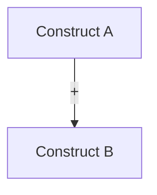

# Stage A — Framing & Positioning (A1–A5)

This stage turns a topic into a *defensible* research plan: what you will claim, why it matters, and what evidence would count.

## Inputs (minimum)

- `topic` (1 sentence)
- `paper_type` (`empirical` / `qualitative` / `systematic-review` / `methods` / `theory`)
- Constraints: time, data access, population/context, methods you can actually run
- Optional: target `venue` (or 2–3 candidate venues)

## Canonical outputs (contract paths)

- `A1` → `framing/research_question.md`
- `A1_5` → `framing/hypothesis.md`
- `A2` → `framing/contribution_statement.md`
- `A3` → `theoretical_framework.md`
- `A4` → `gap_analysis.md`
- `A5` → `framing/venue_analysis.md`

## Quality gate focus

- `Q1` (question-to-method alignment) applies to all A-tasks.
- `Q2` (claim-evidence traceability) starts in `A2` (contribution) and is enforced later in `F4/G3`.

## Choose the contribution and evidence boundary

Use `references/discipline-guidance.md` when the field changes the question or
evidence. State whether the intended contribution is descriptive, causal,
predictive, interpretive, theoretical, methodological, a replication or a resource.
Define the population/corpus, unit, period and evidence that could support or
challenge it. Keep demonstrated findings separate from a proposal's intended work.

A literature gap is bounded by the sources actually searched/read; an unfamiliar
topic is not proof of novelty. Compare the closest relevant work and explain the
unresolved question. If access, sample or time makes the original claim infeasible,
offer a narrower supported question without silently replacing the user's aim.
Carry that boundary and the next evidence need into Stage B/C.

## Academic Idea Funnel / Academic Grill Loop For Idea-Discovery

Before drafting `A1`, `A2`, `A4`, or `A5` from a vague topic, use `boundary-interviewer` to run the Academic Idea Funnel. This is an academic idea-discovery pass, not a generic brainstorming questionnaire.

The loop must:

- inspect existing project artifacts before asking;
- ask one scholarly question at a time;
- include a recommended answer with academic rationale, evidence threshold, claim-strength implication, and reviewer or venue consequence;
- convert broad interest into a defensible research idea that can fit one paper;
- record candidate idea triage, the recommended idea, weakest assumption, and next task in `context/idea_funnel.md`;
- hand off locked decisions, rival risks, and revisit trigger into `context/boundary_review.md`.

Use Stage A grill questions such as:

1. From this vague topic, which defensible research idea could become one paper rather than a field overview?
2. What evidence would make the candidate idea answerable in one paper?
3. Which population, context, time period, corpus, or construct definition is explicitly out of scope?
4. What contribution type is primary, and which adjacent contribution is not being claimed?
5. Who would cite this work if it succeeds, and why would they care?

`context/idea_funnel.md` is the preflight artifact for choosing the idea. `context/boundary_review.md` is the follow-on artifact for locking claim strength, evidence threshold, scope limits, and reviewer-facing risks.

---

## A1 — Research Question (RQ) Specification

**Definition of done**

- A clear **main RQ**, with non-overlapping sub-RQs only when needed
- Clear **unit of analysis** (individual/team/org/document/system)
- Defined **constructs** (what you mean by each key term) and plausible **operationalizations**
- Scope boundaries (what is *out of scope*, and why)
- For `systematic-review`: inclusion/exclusion criteria + keyword seed set
- For `qualitative`: expected evidence form (interviews / cases / fieldnotes / documents / observations) + setting boundary
- A short feasibility note (FINER-style) with the biggest risks

**Recommended structure: `framing/research_question.md`**

```markdown
# Research Question (RQ)

## Topic
[1–2 sentences]

## Main RQ
[One sentence]

## Sub-RQs
1. ...
2. ...

## Framing (choose one)
- PICO (intervention/exposure effect) OR PEO (non-intervention)
- If methods/theory paper: state the target capability or construct network
- If qualitative paper: state the focal process, practice, experience, or meaning to be understood

## Core constructs & definitions
| Construct | Working definition | Observable proxy (candidate) |
|---|---|---|

## Scope boundaries
- Included:
- Excluded:

## Evidence that would answer the RQ
- Primary outcomes / observations:
- Minimum viable dataset / corpus:

## Risks & feasibility (FINER short form)
- Feasible:
- Novel:
- Ethical:
- Relevant:

## Keywords (seed list)
- concept1: ...
- concept2: ...
```

---

## A1_5 — Hypothesis / Proposition Generation

Use when the paper needs *testable* or *arguable* statements (empirical / qualitative / theory / methods).

**Definition of done**

- Map each relevant RQ to hypotheses, propositions, or sensitizing concepts as the design requires
- Each item has **mechanism intuition** and **boundary conditions**
- If confirmatory, specify the predicted relation and whether the test is directional, with a rationale
- If qualitative and exploratory, articulate the focal process, meaning, or contrast to investigate
- Include consequential alternatives where supported:
  - measurement/construct alternative (operationalization could flip result)
  - theory-based rival explanation or rival interpretation (addressed in `C1_5`)

**Recommended structure: `framing/hypothesis.md`**

```markdown
# Hypotheses / Propositions / Sensitizing Concepts

## Mapping to RQs
| RQ | Hypothesis/Proposition/Concept IDs |
|---|---|

## Hypotheses (empirical / methods validation)
### H1 (directional)
- Statement:
- Mechanism:
- Boundary conditions:
- Operationalization candidates (IV/DV):

## Propositions (theory paper)
### P1
- Statement:
- Intuition:
- Scope conditions:

## Sensitizing concepts / working propositions (qualitative)
### QP1
- Focal process / meaning:
- Why it may matter:
- Boundary conditions / contrast cases:
- Evidence form (cases / interviews / observations / documents):

## Rival explanations (seed list)
1. ...
2. ...
```

---

## A2 — Contribution & Novelty Statement

Write *what changes in the literature* if your paper is accepted.

**Definition of done**

- A supported primary contribution and any distinct secondary contributions, each with:
  - **Prior state** (what was known/assumed)
  - **Your delta** (what changes)
  - **Evidence plan** (what will support it)
- Identify the main contribution type (one primary, others secondary):
  - theoretical / empirical / methodological / dataset / systems artifact / synthesis

**Recommended structure: `framing/contribution_statement.md`**

```markdown
# Contribution Statement

## One-sentence thesis
[What the paper shows/builds]

## Primary contribution
- Type:
- Claim:
- Who cares / why now:
- Evidence required:

## Secondary contributions (if supported)
1. ...

## Non-goals (to prevent scope creep)
- ...
```

---

## A3 — Theoretical Framework

Choose, justify, and operationalize the theory lens; do not just list citations.

**Definition of done**

- Relevant anchor theories/frameworks with:
  - core constructs + relationships
  - mechanism narrative (why the relation holds)
  - boundary conditions
- A conceptual model diagram when it clarifies the argument (Mermaid acceptable)
- A mapping from constructs → measures (if empirical) or → propositions (if theory)

**Recommended structure: `theoretical_framework.md`**

```markdown
# Theoretical Framework

## Anchor theory(ies)
| Theory | Core idea | Key constructs | Why it fits this RQ |
|---|---|---|---|

## Construct definitions
| Construct | Definition | Notes / contested definitions |
|---|---|---|

## Proposed relationships
| Link | Direction | Mechanism | Boundary conditions |
|---|---|---|---|

## Conceptual model


## Operationalization bridge (if empirical)
| Construct | Candidate measure | Data source |
|---|---|---|
```

---

## A4 — Gap Analysis

Gap ≠ “no one has studied this exact combination”. Gap must be *meaningful* and *supported* by the literature.

**Definition of done**

- Supported candidate gaps, each with:
  - category (theoretical / empirical / methodological / population / data)
  - supporting source locations and coverage limits
  - why existing work cannot answer your RQ
  - how your approach closes it
- Prioritize gaps by feasibility + impact (short rubric)

**Recommended structure: `gap_analysis.md`**

```markdown
# Gap Analysis

## Landscape summary
- ...

## Candidate gaps
| Gap ID | Type | Description | Evidence (citations) | Why it matters | How we address |
|---|---|---|---|---|---|

## Prioritization
| Gap ID | Feasible | Impact | Novelty | Risk | Priority |
|---|---:|---:|---:|---:|---|
```

---

## A5 — Venue Analysis

For early venue exploration or adaptation to a chosen journal/conference, use
`skills/A_framing/venue-analyzer.md`. Follow `references/stage-H-submission.md`
for shared evidence, fit and modification boundaries. For recommendations driven
by an existing draft without a chosen target, use H5 instead.

**Definition of done**

- The target or candidate set reflects the research question and author constraints.
- Decision-relevant requirements have sources, checked dates and applicable
  article type/stage; local profiles and inferred practices are labeled as such.
- Fit and conflicts are explained using the actual contribution and evidence.
- Proposed adaptations connect requirements to manuscript locations and distinguish
  presentation/reporting changes from new research or author decisions.
- Missing evidence limits conclusions; no arbitrary candidate quota or promised outcome.

Formal output: `framing/venue_analysis.md`. Include the requirement and adaptation
tables from the shared Stage H reference, chosen direction and unresolved checks.
