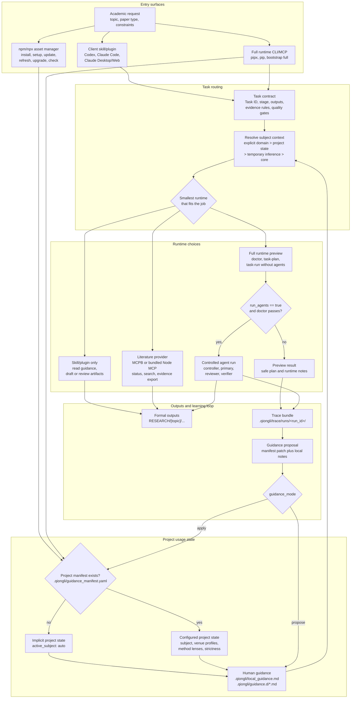

# Using Agent Skills

Qiongli installs one agent-facing skill system, but each client exposes it differently. Use this page after installation when you need to know what to type inside Codex, Claude Code, Antigravity, Hermes, or the shell.

## Naming Model

| Name | Meaning | Where it appears |
|---|---|---|
| `qiongli` | Public plugin, CLI, and user-visible skill name | Skillsplace, npm, PyPI, Codex `/skills`, shell commands |
| `qiongli-workflow` | Portable skill package directory | `~/.codex/skills/`, `~/.claude/skills/`, `~/.gemini/antigravity/skills/`, `~/.hermes/skills/`, plugin payloads |
| `skills/*/*.md` | Internal academic capability cards | Repository source and orchestrator injection |

Most users should look for `qiongli`, not `research-paper-workflow`. The directory name `qiongli-workflow` remains for compatibility with existing installers and release artifacts.

## Client Entry Points

| Client | Discover | Invoke | Notes |
|---|---|---|---|
| Codex | `/skills` | `$qiongli`, `$qiongli-lit-review`, `$qiongli-academic-write`, or another generated Qiongli workflow wrapper | Codex does not expose Qiongli workflows as custom slash commands. Plugin installs generate thin wrapper skills that route to the same canonical workflows as Claude slash commands. Restart Codex after installing or upgrading. |
| Claude Code | Plugin UI or `/plugin` commands | `/paper`, `/lit-review`, `/paper-write`, `/code-build`, or natural language asking for Qiongli | Plugin installs command wrappers plus the portable skill package. |
| Shell | `qiongli check` | npm: `qiongli install`, `qiongli update`, `qiongli project ...`; full runtime: `qiongli doctor`, `qiongli task-run`, `python3 -m bridges.orchestrator ...` | npm/npx is Python-free asset management. Full runtime commands require `pipx install qiongli` and Python 3.12+. |

## Runtime Architecture Flow

This is the end-to-end path from a user request to runtime choice, preview, execution, and durable outputs.



The important boundary is that installation does not imply execution. npm/npx installs and refreshes client assets, while the full runtime has to be installed and called explicitly before `doctor`, MCP orchestration, provider setup, or agent execution can run.

## Codex Usage

After installing from Skillsplace, npm, PyPI, or `qiongli upgrade --target codex`, restart Codex and check:

```text
/skills
```

You should see `qiongli`. Plugin-first installs also generate thin workflow wrapper skills such as `qiongli-lit-review`, `qiongli-academic-write`, `qiongli-paper-read`, and `qiongli-proofread`. Invoke the main skill or a wrapper with a concrete research task:

```text
$qiongli plan a systematic review on retrieval augmented generation in education
$qiongli-lit-review retrieval augmented generation in education
$qiongli-academic-write related work for my CHI paper
$qiongli design an empirical study about ai writing support in universities
$qiongli prepare a submission checklist for my CHI paper
```

Do not expect `/qiongli` or `/lit-review` to work in Codex. Slash commands are reserved for Codex built-ins and installed slash surfaces that Codex itself exposes. Qiongli's Codex-facing entries are skill invocation forms. The generated wrappers are intentionally thin: `$qiongli-lit-review` routes to the same `workflows/lit-review.md` source used by Claude Code `/lit-review`.

If `/skills` only shows `research-paper-workflow`, you are seeing an older global install. Run the current installer or upgrade path, restart Codex, and check again:

```bash
qiongli upgrade --target codex --overwrite
```

Current qiongli installers remove confirmed legacy `research-paper-workflow` global skill directories during upgrade. Use `qiongli clean --globals --dry-run` first if you want to preview global cleanup separately.

## Claude Code Usage

Claude Code can expose Qiongli through workflow entry markdowns. The common user-facing commands are:

| Command | Use when |
|---|---|
| `/paper` | You want the guided paper workflow and paper-type routing. |
| `/lit-review` | You need literature search, screening, extraction, or synthesis. |
| `/paper-read` | You want deep analysis of one paper. |
| `/find-gap` | You need to identify and rank research gaps. |
| `/study-design` | You need empirical, qualitative, or mixed-method study design. |
| `/paper-write` | You want manuscript drafting from an existing research workspace. |
| `/code-build` | You need strict academic code specification, planning, execution, review, and reproducibility checks. |
| `/submission-prep` | You need journal or conference submission packaging. |

These slash workflows are convenience entrypoints. They all route into the same Qiongli task contract and skill package.

## Shell And Orchestrator Usage

Use the shell CLI when you need to inspect, upgrade, validate, or run explicit task IDs:

```bash
qiongli check
qiongli upgrade --target all
qiongli doctor --project-dir .
```

Use the orchestrator when you want explicit task planning or multi-agent execution:

```bash
python3 -m bridges.orchestrator task-plan \
  --task-id F3 \
  --paper-type empirical \
  --topic ai-in-education \
  --cwd .

python3 -m bridges.orchestrator task-run \
  --task-id F3 \
  --paper-type empirical \
  --topic ai-in-education \
  --cwd . \
  --triad
```

## Recommended Flow

1. Install through Skillsplace for one-client usage, or use `qiongli upgrade --target all` for global multi-client usage.
2. Restart the target client so its skill registry and workflow discovery refresh.
3. In Codex, confirm `/skills` shows `qiongli` and invoke `$qiongli`.
4. In Claude Code, use `/paper`, `/lit-review`, `/paper-write`, or `/code-build`.
5. For repeatable task execution, use `qiongli doctor` and `python3 -m bridges.orchestrator task-plan|task-run`.

Qiongli writes research artifacts under `RESEARCH/[topic]/` when a workflow or orchestrator task produces durable outputs. Project-local integration files are only written when you explicitly run `qiongli init` or choose project install parts.
