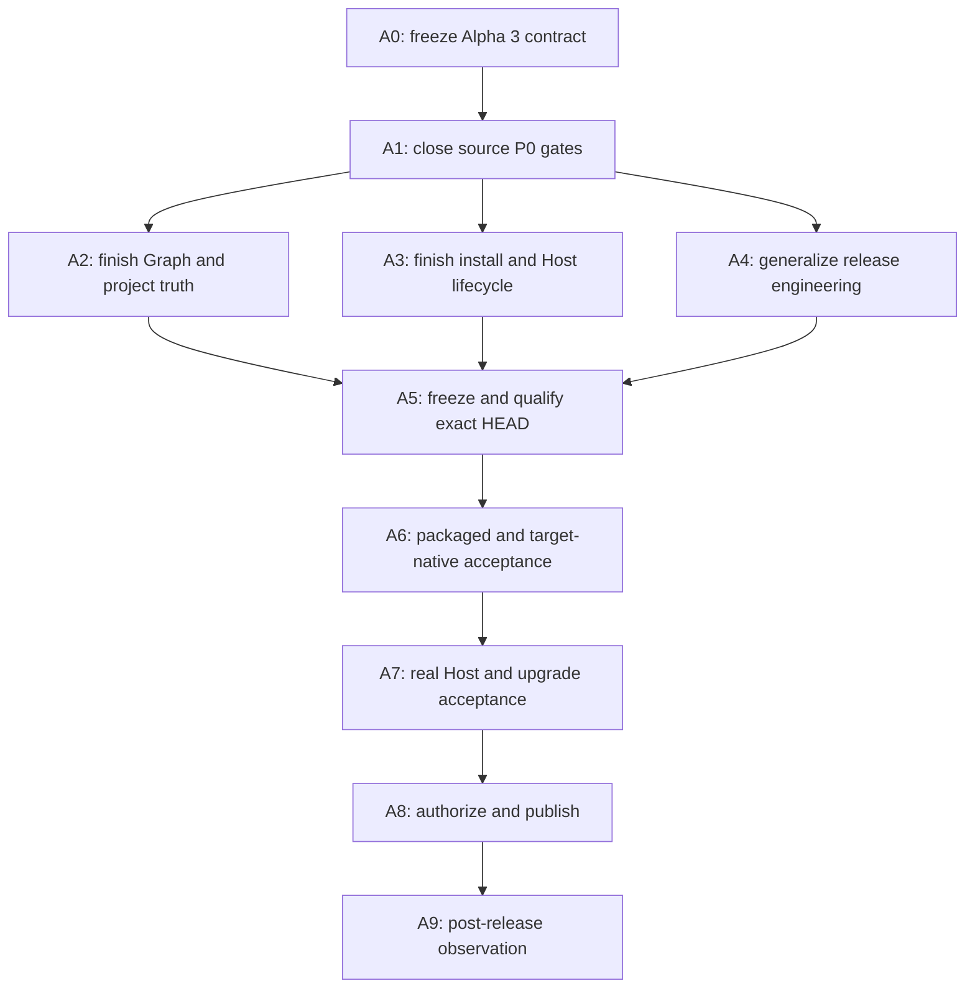

# Qiongli 2.0.0-alpha.3 Completion and Release Plan

Status: in progress — A0 through A4 complete; publication remains forbidden

Date: August 1, 2026

Target branch: `2.x`

Target release: `v2.0.0-alpha.3`

## Outcome

Close the remaining Academic Graph, project continuity, Skills, Plugin, native
CLI, Host activation, packaged acceptance, and Community Alpha release gaps,
then publish one exact-source `v2.0.0-alpha.3` prerelease with truthful target
claims and a complete rollback path.

This plan treats the already exercised `2.0.0-alpha.2` packages as internal,
non-publishing engineering evidence. Reusing that version for a new tester-visible
build would make package and receipt identities ambiguous, so the next candidate
is `2.0.0-alpha.3`.

Publication remains forbidden until Batch A8 completes. A source test, local App,
isolated Host, raw CI artifact, ad-hoc package, or registration document is never
equivalent to a public release receipt.

## Alpha 3 product claim

The release may claim:

> Deterministic Academic Graph v1 over supported canonical research artifacts,
> with bounded project continuity, captures, artifact inspection, App/CLI/MCP
> parity, and managed Codex and Claude Code integrations.

The release must not claim:

- automatic interpretation of every file in an arbitrary research directory;
- heuristic promotion of prose or BibTeX into graph facts;
- a dedicated dataset entity before a future graph schema revision;
- Full MCP mutation or Timeline tools that are outside its public contract;
- production operating-system publisher trust; or
- support for a target or architecture without a target-native receipt.

## Current baseline

The planning baseline is clean local commit
`b19661841eee9b8186f3288be3017d7f7704686a`.

Completed source evidence:

- 167 `qiongli-project` tests pass;
- 57 focused Desktop Academic Graph tests pass;
- 32 App API and 240 Desktop tests pass;
- Svelte diagnostics and the production bundle contract pass;
- 164 `qiongli` library and 31 native CLI tests pass;
- product-control, Skills convergence, CLI installation, and isolated real-client
  compatibility tests pass for current Codex and Claude Code clients.

Open release blockers:

1. `HostProbeState::NotObservable` is rendered as `StatusCode::Ready` for Host
   activation and MCP attachment.
2. Rust Clippy fails on `filter_map_bool_then`.
3. the release workflow, signing examples, update journey, artifact names, and
   policy tests still contain Alpha 1 contracts;
4. the local branch is 146 commits ahead of `origin/2.x`, so current HEAD has no
   remote CI result;
5. R5E and R5G exact-package acceptance remain open;
6. current system Codex and Claude Code profiles do not have `qiongli-next`
   installed and activated;
7. the shell-visible `qiongli` is still the retired 1.x shell CLI; and
8. the two C5 system-host handoff receipts do not exist.

## Milestones

| Batch | Deliverable | Release state after completion |
|---|---|---|
| A0 | frozen version, scope, target claims, and update contract | No-Go |
| A1 | source P0 and Rust quality gates green | No-Go |
| A2 | Graph and project data contract complete | No-Go |
| A3 | CLI, Plugin, Skills, and Host lifecycle complete | No-Go |
| A4 | version-generic release chain and notes complete | No-Go |
| A5 | clean exact commit with successful required CI | RC candidate |
| A6 | exact packages and target-native receipts accepted | Conditional Go |
| A7 | native CLI, live Hosts, handoffs, and upgrade accepted | Release candidate |
| A8 | trust bundle independently verified and published | Public Alpha |
| A9 | public-download smoke and observation complete | Alpha accepted |

## Release dependency graph



No later batch may substitute evidence for an earlier batch.

## Hard release gates

The release is `No-Go` if any of these conditions is true:

- the final worktree is dirty or a receipt does not bind the final commit;
- format, Clippy, tests, frontend checks, or release-policy tests are red;
- a Host state that was not observed can be displayed as ready;
- the version differs across Cargo, Cargo.lock, Plugin manifests, artifact names,
  update metadata, release notes, candidate receipts, or tag;
- the promotion candidate is not built from current `origin/2.x` HEAD;
- promotion authorization can run without a successful Native CI result for the
  same commit;
- the packaged App cannot install and verify the native CLI in a fresh login
  shell;
- either real Codex or Claude Code handoff receipt is missing;
- a receipt contains a path, credential, prompt, response, conversation, or tool
  body; or
- checksums, SBOM, provenance, detached signature, update metadata, or rollback
  evidence is incomplete for a claimed target; or
- the production client, native executable, or packaged application exceeds the
  frozen Alpha 3 size budget without a reviewed replacement budget and measured
  capability benefit.

## Batch A0 — Freeze the Alpha 3 contract

### Tasks

1. Adopt `2.0.0-alpha.3` as the next tester-visible version.
2. Freeze the product claim and explicit non-goals above.
3. Freeze the Community Alpha target matrix:
   - macOS arm64: ad-hoc Community Alpha DMG and update ZIP;
   - Windows x86_64: complete unsigned portable directory;
   - Linux x86_64: AppImage plus portable CLI archive.
4. Freeze a target claim matrix rather than borrowing macOS evidence:
   - macOS arm64 may claim the complete App, native CLI, Codex, Claude Code,
     Skills, Full MCP, and live-handoff journey after A7;
   - Windows and Linux may claim only capabilities accepted on native test
     systems; package startup does not imply native Host integration acceptance;
   - a cross-platform integration claim requires native install, PATH, repair,
     remove, restart, and client receipts on every claimed target.
5. Keep unsupported architectures absent from release claims.
6. Implement the preferred signed Alpha 1 to Alpha 3 update with atomic
   rollback. If its A7 receipt cannot be accepted, remove the automatic update
   claim and ship an explicit manual-replacement contract instead.
7. Create one Alpha 3 acceptance ledger mapping every claim to its test,
   package receipt, target receipt, or live-host receipt owner.
8. Enforce the Alpha 3 bundle and package size budgets recorded in that ledger.
   Any increase requires a measured delta and must replace an existing budget;
   dependency additions do not receive implicit headroom.

### Exit gate

- version, claims, targets, update policy, evidence owners, and publication
  authority are unambiguous;
- no task below depends on an unspecified release behavior.

### Commit checkpoint

`docs(release): freeze alpha 3 acceptance contract`

## Batch A1 — Close source-level P0 gates

### A1.1 Host readiness must fail closed

1. Change `NotObservable` activation and MCP attachment states from `Ready` to a
   non-ready status such as `Attention` or `Unavailable`.
2. Remove the second false-ready path where an initial MCP file or registration
   is present but no Host process has positively observed the attachment.
3. Keep the separate observation reason so the UI can distinguish:
   - Host action required;
   - probe unavailable;
   - probe failed or timed out; and
   - positively observed.
4. Preserve version mismatch as `VersionMismatch`; never collapse it into
   `NotObservable` or a generic command failure.
5. Add a real bounded Claude Code MCP observation instead of returning
   `NotObservable` unconditionally.
6. Ensure overall readiness cannot become ready unless Source, Skills,
   Registration, Activation, and MCP attachment meet the declared policy.
7. Add Rust and Desktop tests for command failure, timeout, malformed output,
   unsupported version, stale registration, observed activation, and observed
   MCP attachment.
8. Verify that all green states originate from positive evidence.

### A1.2 Restore clean Rust quality gates

1. Replace the `filter_map` plus `bool::then` expression with an equivalent
   Clippy-clean filter and map implementation.
2. Run format, check, Clippy, and the full locked workspace test set.
3. Treat new Rust 1.97 warnings as errors in local and CI gates.

### Required commands

```bash
cargo fmt --manifest-path packages/qiongli-native/Cargo.toml --all -- --check
cargo check --manifest-path packages/qiongli-native/Cargo.toml \
  --workspace --all-targets --all-features --locked
cargo clippy --manifest-path packages/qiongli-native/Cargo.toml \
  --workspace --all-targets --all-features --locked -- -D warnings
cargo test --manifest-path packages/qiongli-native/Cargo.toml \
  --workspace --all-targets --all-features --locked
```

### Exit gate

- no false-ready path exists;
- all Rust quality gates pass from a clean worktree;
- tests prove both positive and negative Host observation transitions.

### Commit checkpoints

1. `fix(integrations): fail closed on unobserved host state`
2. `fix(config): restore rust clippy release gate`

## Batch A2 — Finish Academic Graph and project data truth

### A2.1 Close canonical artifact coverage

1. Create a versioned coverage matrix for the manifest, all eight canonical
   artifacts, and `graph/semantic_links.jsonl`. Record portable authority,
   graph contribution, stable identity, source anchor, diagnostic reason, and
   App/CLI/Full MCP visibility for each source.
2. Keep `stage_handoff.md` structural-only for Alpha 3: it remains an inspectable
   and tracked Artifact but must not manufacture Claim, Decision, or relation
   records from free text. Mark this explicitly in the registry so the accepted
   registry and extractor expectations agree.
3. Add contract tests that enumerate every canonical graph-bearing artifact and
   reject a registered artifact without an extractor.
4. Preserve the rule that arbitrary prose and BibTeX do not become graph facts
   without a reviewed canonical link.

### A2.2 Add authoritative stale-source state

1. Define stale state in the native graph projection instead of inferring it in
   Svelte.
2. Bind stale state to the project revision, source digest, and last successful
   graph build.
3. Carry the state through App API, CLI query output, Full MCP read contracts,
   and the visual graph language.
4. Test fresh, stale, missing, migrated, and rebuilt sources across restart.

### A2.3 Reconfirm continuity and bounded behavior

1. Re-run deterministic rebuild, incremental/full byte parity, portable
   round-trip, restart, archive/restore, and stale-revision rejection tests.
2. Re-run small, medium, and large graph fixtures with node/edge/query limits.
3. Include native 2.x, migrated 1.x, bounded-large, and error/recovery fixtures.
   The last fixture covers missing, invalid, zero-edge, unsupported, stale,
   symlinked, oversized, invalid UTF-8, archived, and wrong-project inputs.
4. Confirm Capture consolidation changes only reviewed semantic artifacts and
   never silently rewrites unsupported maps.
5. Confirm App, copied CLI, and public Full MCP project/portfolio reads agree.
6. Run one realistic project smoke without committing its body, identifier, or
   path; retain only fixture class, bounded counts, verdicts, and digests.

### Deferred by contract

- a first-class dataset node remains a future schema revision;
- heuristic extraction from arbitrary text remains out of scope;
- Full MCP continuity mutations remain outside the public Alpha 3 contract.

Those items are not release blockers only if the release notes state the same
boundary.

### Exit gate

- every registered graph-bearing artifact has one deterministic extractor;
- stale state is native and testable;
- restart and portable operations preserve graph identity;
- large graph operations remain deterministic and bounded;
- the Alpha 3 claim matches the implemented contract exactly.

### Commit checkpoints

1. `feat(graph): close canonical artifact coverage`
2. `feat(graph): expose authoritative stale source state`
3. `test(graph): qualify deterministic project continuity`

## Batch A3 — Finish Skills, Plugin, CLI, and Host lifecycle

### A3.1 Complete native CLI lifecycle

1. Keep App installation preview, approval digest, atomic replacement, receipt,
   byte verification, version verification, and failure restoration.
2. Add an explicit previewed remove or restore operation for a successfully
   installed native CLI. It must restore a preserved unmanaged predecessor only
   when the receipt and bytes still match.
3. Refuse removal of drifted, unowned, symlinked, or shadowed targets.
4. Add an explicit previewed `cli-path-configure` operation. It may write only a
   receipt-bound marker block after showing the target profile and approval
   digest, and must reject symlinks, oversized or non-UTF-8 profiles, and
   content changed after preview.
5. Verify fresh login shells for supported zsh and bash profiles without relying
   on the GUI process `PATH`.
6. Report Active, Missing, Not configured, Shadowed, Drifted, Version mismatch,
   and Not observable independently.
7. Expose removal through the bounded App command family, for example
   `qiongli app plan cli-remove` followed by an approved apply operation.
8. When removal follows a managed 1.x replacement, restore the retained original
   only if its receipt and digest still match; otherwise fail closed.

### A3.2 Close Plugin and Skills reconciliation

1. Keep source builds read-only and grant install authority only to the verified
   packaged product.
2. Verify install, restart discovery, repair, remove, and legacy 1.x migration
   for both Codex and Claude Code.
3. Remove only receipt-owned state and preserve unrelated marketplace, Plugin,
   Skill, MCP, and user configuration.
4. Verify the current Plugin, bundled Skills, Lite MCP, Full MCP registration,
   activation, and attachment as separate observations.
5. Ensure post-install refresh uses a fresh Host probe and cannot reuse a cached
   ready state.
6. Move activation instructions out of frontend constants. The native snapshot
   must provide the exact structured Host action, including Claude Code scope,
   so tests, installer behavior, and the UI cannot drift independently.

### A3.3 Keep current client compatibility explicit

1. Re-run isolated real-client install tests against the supported Codex and
   Claude Code versions.
2. Record supported minimum and tested versions in release notes.
3. Fail closed on unsupported versions and label unknown future versions
   separately from known incompatibility.
4. Keep human-readable Host output parsers bounded; prefer a stable JSON output
   when the upstream client exposes one.

### A3.4 Correct installation documentation

1. Add one 2.x Alpha installation page covering App, native CLI, Codex,
   Claude Code, Skills, MCP attachment, repair, removal, and migration.
2. Label the existing npm, Python, and shell CLI documentation as the 1.x line.
3. Explain that the native CLI comes from the packaged App and does not require
   Rust, Python, Node.js, npm, pip, or Cargo at runtime.
4. Add bounded troubleshooting for PATH shadowing and stale 1.x installations.

### Exit gate

- isolated Codex and Claude Code install/repair/remove/restart tests pass;
- the native CLI can install, verify, remove or restore, and survive restart;
- fresh login shells resolve the exact packaged CLI bytes and version;
- no 1.x source can satisfy 2.x readiness;
- documentation sends Alpha users to only one authoritative 2.x path.

### Commit checkpoints

1. `feat(cli): complete managed install and restore lifecycle`
2. `fix(integrations): verify activation after host restart`
3. `docs(alpha): separate native 2.x installation from legacy cli`

## Batch A4 — Generalize and repair release engineering

### A4.1 Replace Alpha 1 coupling with exact version binding

1. Do not replace Alpha 1 constants with Alpha 3 constants.
2. Make release tools accept or derive one exact version from the workspace and
   requested tag, then fail if they differ.
3. Generate macOS, Windows, and Linux artifact names from that exact version.
4. Bind version into candidate, target, integrity, update, and publication
   receipts.
5. Rename Alpha 1-only scripts and examples when their contract becomes generic;
   retain Alpha 1 fixtures only for historical verification.
6. Update the C5 fixture and live-host runbook to use the accepted package
   version instead of a stale literal.
7. Make the native `release_ready` path synchronize or verify every active
   version owner rather than assuming Cargo is the only native version source.
8. Maintain an allowlist for immutable historical Alpha 1 evidence; active
   workflows, examples, scripts, and artifact templates must contain no fixed
   Alpha 1 release assumption.

### A4.2 Restore release and policy tests

1. Update the five stale Python release/branch-policy tests to assert current
   behavior rather than old workflow names or brittle text counts.
2. Convert the Alpha 1 Rust evidence test into a version-parameterized release
   evidence test while preserving historical Alpha 1 verification.
3. Add one end-to-end contract test proving that Cargo version, Plugin versions,
   artifact names, candidate set, update metadata, release notes, and tag agree.
4. Add a negative test that changes one version field and proves fail-closed
   behavior.

### A4.3 Bind promotion to successful CI

1. Require a successful Native CI run for the exact source commit before the
   publication environment can be entered.
2. Implement this either through a successful `workflow_run` trigger or an
   explicit commit-bound check in manual promotion; a concurrent push workflow
   is insufficient.
3. Protect `2.x` with required Native CI checks and retain the protected
   `community-alpha-publication` environment.
4. Keep raw candidate artifacts short-lived and non-publishing.

### A4.4 Prepare version and release content

1. Bump Cargo workspace, Cargo.lock, Codex and Claude Plugin manifests, embedded
   content, fixtures, and product metadata to `2.0.0-alpha.3` in one commit.
2. Add bilingual Alpha 3 release notes and update `CHANGELOG.md`.
3. State target trust limits, supported versions, manual or automatic update
   behavior, data integration boundaries, known issues, and rollback steps.
4. Verify that `v2.0.0-alpha.3` does not exist before candidate preparation.

### Required checks

```bash
python3 scripts/sync_versions.py 2.0.0-alpha.3

python3 -m unittest \
  tests.test_release_version_contract \
  tests.test_release_note_versions \
  tests.test_release_automation \
  tests.test_release_upload_assets \
  tests.test_release_local_install_check \
  tests.test_branch_policy

bash scripts/verify_release_tag_version.sh \
  --root . --tag v2.0.0-alpha.3

rg -n '2\.0\.0-alpha\.1|alpha1|Alpha\.1' \
  .github/workflows \
  packages/qiongli-native/apps/qiongli/examples \
  tooling/scripts
```

### Exit gate

- no current release path contains an active Alpha 1 artifact assumption;
- all release and policy tests pass;
- the exact commit cannot enter authorization without matching successful CI;
- all version-bearing files agree on Alpha 3;
- release notes are truthful and complete.

### Commit checkpoints

1. `refactor(release): bind native artifacts to exact version`
2. `test(release): repair native alpha policy contracts`
3. `ci(release): require exact-head native qualification`
4. `build(release): prepare 2.0.0-alpha.3`

## Batch A5 — Freeze and qualify the exact release commit

### Tasks

1. Merge A1 through A4 into `2.x` and require a clean worktree.
2. Run all local source, frontend, integration, release, and diff gates.
3. Run native release preparation against the exact Alpha 3 version.
4. Commit any intended acceptance documentation before freezing the candidate.
5. Push `2.x` and record the final source commit.
6. Wait for Native CI and every required check on that exact commit.
7. Reject a candidate if a later commit becomes `2.x` HEAD.

### Required commands

```bash
pnpm --dir packages/qiongli-app-api check
pnpm --dir packages/qiongli-app-api test
pnpm --dir packages/qiongli-desktop check
pnpm --dir packages/qiongli-desktop test
pnpm --dir packages/qiongli-desktop build

./scripts/release_ready.sh \
  --version 2.0.0-alpha.3 \
  --skip-bump \
  --skip-note-gen

git diff --check
git status --short
```

### Exit gate

- all local gates pass;
- `origin/2.x`, the candidate source, Native CI, and release ledger identify the
  same commit;
- the worktree is clean;
- no later source change is allowed without restarting A5.

## Batch A6 — Exact-package and target-native acceptance

### A6.1 Product-controlled macOS package

1. Run `pnpm desktop:macos:acceptance` from the frozen commit.
2. Verify schema, exact source, package digest, product authority, embedded
   content, Skills, CLI, integrations, migration, restart, Keychain, project
   continuity, Graph, and path-redaction checks.
3. Run the R5D Zotero automated and required manual gates.
4. Retain only path-redacted receipts or bounded receipt digests.

### A6.2 Close R5E visual acceptance

Inspect the exact packaged App at `375`, `768`, `1024`, and `1440` content
widths with:

- no horizontal page overflow;
- complete keyboard focus order and focus restoration;
- light and dark contrast;
- reduced-motion behavior;
- deterministic restart state;
- migrated, medium, and large graph fixtures;
- fresh and authoritative stale-source visuals; and
- no clipped, incorrectly wrapped, or false-ready status control.

### A6.3 Close R5G project-centered acceptance

Verify project restoration, deep links, internal artifact preview, graph query,
Capture continuity, Timeline, integrations, route-local query cleanup, restart,
stale-revision rejection, and App/CLI/Full MCP read parity.

### A6.4 Build target-native Community Alpha candidates

1. Rebuild macOS arm64, Windows x86_64, and Linux x86_64 from the exact commit.
2. Run each target's startup, package-shape, CLI, receipt, and tamper tests.
3. Run native PATH, install, verify, repair, remove, restart, and client
   integration checks for every target receiving those claims.
4. Aggregate only candidates from the same workflow and source commit.
5. Because A0 freezes a three-target Alpha 3 set, one failed target blocks that
   release set. Narrowing the target set requires restarting A0, rewriting the
   claim matrix and notes, and generating a new candidate and authorization.
6. A target never borrows package, startup, PATH, or Host evidence from another
   operating system.

### Exit gate

- R5D, R5E, R5G, package, and target-native ledgers are complete;
- all receipts bind the exact commit and package digests;
- manual observations are distinct from automated claims;
- publication remains false.

### Commit checkpoint

`test(acceptance): qualify alpha 3 exact packages`

## Batch A7 — Real CLI, Host, handoff, and upgrade acceptance

### A7.1 Native CLI on the real system profile

1. Use only the accepted packaged App to preview and install the native CLI.
2. Start a fresh login shell and verify:
   - `command -v qiongli` resolves the managed target;
   - bytes match the accepted packaged CLI;
   - `qiongli --version` reports `2.0.0-alpha.3`;
   - no earlier 1.x shim shadows the target.
3. Exercise verify, repair, explicit remove or restore, reinstall, and restart.

### A7.2 Codex live Host receipt

1. Migrate or install `qiongli-next` into the authenticated system Codex
   profile through the accepted App.
2. Start a fresh Codex process and positively observe Plugin, Skills,
   Registration, Activation, and Full MCP attachment.
3. Execute the four fail-closed rejection probes and the revision-bound triad
   handoff in the C5 runbook.
4. Compose and validate one path-redacted exact-package receipt.

### A7.3 Claude Code live Host receipt

Repeat A7.2 in an independent authenticated Claude Code profile. Do not reuse a
conversation, candidate, evidence reference, checkpoint, or receipt.

### A7.4 Update and rollback journey

If automatic update is claimed:

1. install public Alpha 1 in an isolated or clean system profile;
2. consume signed Alpha 3 update metadata;
3. stage, verify, activate, restart, and preserve user project state;
4. inject a failed health check and prove atomic rollback;
5. retry successfully and verify App, CLI, Plugin, and project parity.
6. Separately exercise the internal Alpha 2 to Alpha 3 fixture so the immediately
   preceding package and receipt schemas remain compatible.
7. Reject wrong target, replay, downgrade, expired grant, wrong generation,
   invalid digest, invalid signature, interrupted download, and cancellation
   without changing the active installation or project revision.

If manual update was selected in A0, verify replacement installation and state
preservation from both public Alpha 1 and internal Alpha 2, and keep automatic
update unavailable and unclaimed.

### Required acceptance commands

```bash
pnpm desktop:macos:acceptance -- --diagnostics
pnpm acceptance:r5f:manual-test
pnpm acceptance:r5f:manual-record -- --list-gates
pnpm acceptance:host:c5:preflight
```

### Exit gate

- the system shell sees the exact native CLI;
- current Codex and Claude Code integrations are positively observed after a
  fresh process;
- two independently valid handoff receipts exist;
- negative probes do not advance state;
- upgrade and rollback behavior matches the release claim;
- no private Host material enters a receipt or commit.

### Commit checkpoints

1. `test(acceptance): close alpha 3 live host continuity`
2. `test(update): qualify alpha 3 upgrade rollback`

## Batch A8 — Authorize and publish the Community Alpha

### Candidate finalization

1. Download only exact-run target candidates.
2. Verify source commit, version, package digests, target receipts, and package
   inventory offline.
3. Generate and verify:
   - SHA-256 checksums;
   - per-target CycloneDX SBOMs covering Rust dependencies, frontend dependencies
     actually present in the Desktop bundle, and the Qiongli application; any
     intentionally excluded dependency surface must be declared;
   - provenance naming every public asset as a subject and binding the exact
     source, Native CI run, Promotion run, target-native build, and the fact that
     raw CI artifacts were not reused;
   - detached Ed25519 release signatures;
   - update metadata when claimed; and
   - the bounded publication authorization receipt.
4. Confirm every claimed target has a complete acceptance row.
5. Confirm the Alpha 3 tag still does not exist.
6. Complete final signing, verification, and publication within the existing
   86,400-second authorization window; an expired authorization requires a new
   review and cannot be refreshed implicitly.

### Publication

1. Approve the exact candidate in the protected publication environment.
2. Create a draft GitHub prerelease targeting the accepted commit, with the
   immutable `v2.0.0-alpha.3` version identity and reviewed bilingual notes.
3. Upload only the signed, receipt-bound release set to the draft.
4. Have an independent verifier compare draft asset names, sizes, digests,
   inventory, notes, target receipts, and source identity against the signed
   release set.
5. Publish the draft as a prerelease only after that comparison passes.
6. Verify public asset names, sizes, checksums, signatures, and notes after
   publication by downloading them again.
7. Set `publication_allowed: true` only in the final authorization receipt.

### Exit gate

- the tag, release, source commit, candidate set, release notes, signatures,
  SBOMs, provenance, and update metadata identify one version and source;
- no assembled-unpublished CI artifact is presented as a release asset;
- every download is independently verifiable;
- rollback instructions are published beside installation instructions.

## Batch A9 — Post-release observation and rollback trigger

1. Download every release asset from its public URL and repeat checksum and
   signature verification.
2. Run one clean or isolated first-install/startup smoke per claimed target.
3. Re-run one macOS App, native CLI, Codex, and Claude Code readiness check.
4. Monitor only bounded crash, install, update, and integration reports; do not
   collect research content or Host conversations.
5. Trigger rollback or asset withdrawal if any of these occur:
   - signature, checksum, provenance, or source mismatch;
   - data loss or state corruption;
   - false-ready Host or integration status;
   - install/remove escaping receipt-owned state;
   - update activation without working rollback; or
   - a target package cannot start on its claimed architecture.

Rollback must preserve the tag and audit trail. Withdraw affected assets or
mark the prerelease unavailable; do not silently replace immutable files.

Before publication, a failed candidate, expired authorization, changed source,
or invalid draft discards the entire release set and returns to A5 with a new
commit and new evidence. Do not reuse its authorization.

After publication, or whenever publication state is uncertain, keep the tag and
audit evidence immutable, withdraw the affected channel or assets, publish
signed revocation or replacement metadata where applicable, repair `2.x` with a
normal commit, and use `v2.0.0-alpha.4` for the corrected release. Never
force-push, reuse Alpha 3, or automatically return native 2.x users to 1.x.

## Definition of done

`v2.0.0-alpha.3` is complete only when all rows are accepted:

| Area | Required final evidence |
|---|---|
| Source quality | format, check, Clippy, full tests, frontend checks, release tests |
| Academic Graph | canonical coverage, native stale state, deterministic and bounded fixtures |
| Project continuity | App/CLI/MCP read parity, portable/restart/archive/capture receipts |
| Native CLI | install, fresh-shell discovery, verify, repair, remove/restore, restart |
| Codex | current Plugin/Skills/Full MCP plus one live revision-bound receipt |
| Claude Code | independent current Plugin/Skills/Full MCP and live receipt |
| Packaged App | exact-head product-controlled receipt plus R5D/R5E/R5G ledgers |
| Targets | one native package and startup receipt per claimed target |
| Supply chain | checksums, SBOM, provenance, signatures, inventory, authorization |
| Size | automated client budgets plus exact-head CLI and packaged-App measurements |
| Update | accepted signed upgrade/rollback journey or an explicit manual-only contract |
| Publication | immutable tag and GitHub prerelease bound to the accepted commit |

## Execution rules

- Work may proceed in parallel inside A2, A3, and A4 only after A1 is green.
- Every source change after A5 invalidates A5 through A8 evidence.
- Generated Apps, private homes, credentials, conversations, logs, prompts,
  responses, system registrations, and raw Host observations remain uncommitted.
- Commit only source, tests, schemas, plans, release notes, and path-redacted
  receipts or bounded receipt digests.
- A missing observation stays missing; it is never inferred from registration,
  package presence, or MCP health.
- Do not publish, tag, push release assets, or authorize a candidate from an
  implementation batch.
