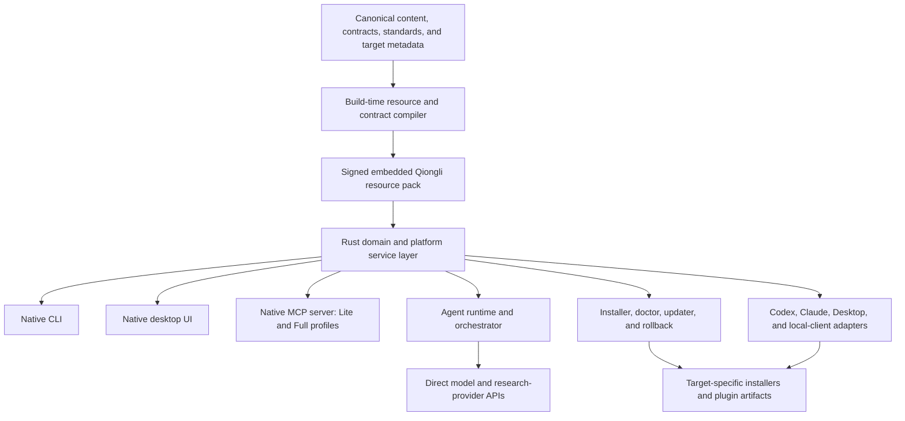

# Qiongli 2 Rust-Native Platform Migration Roadmap

Status: approved direction, implementation not started
Decision date: July 10, 2026
Target branch after the 1.x freeze: `2.x`
Immediate execution plan:
`docs/superpowers/plans/2026-07-10-qiongli-1x-closeout-and-2x-native-bootstrap.md`

## Executive Decision

Qiongli will close the Python-led release line with one final planned 1.x
prerelease, `v1.19.0-beta.1`, then move active product development to a
Rust-native 2.x line.

The first native release will be `v2.0.0-alpha.1`, not a beta. A full runtime
rewrite changes configuration ownership, project-state writes, installer
transactions, agent backends, desktop integration, native packaging, and
rollback behavior. Calling the first vertical slice a beta would claim a level
of compatibility and operational stability that has not yet been demonstrated.

The target product is one Qiongli Native Platform with multiple execution
profiles, not separate Python Full, Rust Lite, Node MCPB, and desktop products.
The installed product must provide:

- a native desktop application for managing skills, MCP servers, providers,
  integrations, agents, orchestration, updates, diagnostics, and recovery;
- a full native CLI using the same service layer as the desktop application;
- a native MCP server with Lite and Full exposure profiles;
- embedded and materializable skills, agents, workflows, roles, schemas,
  templates, standards, and platform metadata;
- local integration adapters for supported Codex and Claude surfaces;
- a provider-independent agent and orchestrator runtime;
- signed, target-specific installers and plugin artifacts that require no
  user-installed Rust, Python, Node.js, npm, uv, pip, or Cargo.

## Release-Line Decision

### Final 1.x release

The final planned 1.x beta is `v1.19.0-beta.1`:

- Python package version: `1.19.0b1`;
- workflow, npm, plugin, and release tag version: `1.19.0-beta.1`;
- Rust Lite and MCPB component target: `0.2.0-beta.3`, because both components
  changed after their `0.2.0-beta.2` release;
- baseline tag: `v1.18.0-beta.3`;
- release source: `dev`, following the current prerelease branch policy.

`v1.18.0-beta.4` is rejected because the current work adds public Contract v2
configuration and literature-planning behavior. It is a feature-bearing minor
line, not a patch-only correction to beta.3.

After post-release acceptance, create `release/1.x-python` at the accepted tag.
That branch is a compatibility oracle and critical-fix line. Normal feature
development stops there. Critical security or release-breakage corrections may
override the "final planned beta" rule, but require an explicit exception and a
matching Rust fix. Support ends 90 days after Qiongli 2 stable unless a later
support decision replaces this policy.

After the acceptance receipt and normalized migration baseline are committed
and pushed, create `2.x` from that post-release baseline commit. All native
implementation then targets `2.x`; do not create it early from the dirty or
unaccepted 1.x tree. `dev` remains the recorded 1.x integration endpoint unless
the maintainer branch policy is explicitly revised later.

### 2.x prerelease choice

| Option | Compatibility signal | Operational risk | Decision |
|---|---|---|---|
| Start at `v2.0.0-beta.1` | Implies feature completeness and migration readiness | Too strong before parity, native matrix, and rollback evidence | Rejected |
| Start at `v2.0.0-alpha.1` | Clearly communicates incomplete and changing contracts | Requires release tooling to learn alpha tags | Recommended |
| Publish a separate 0.x native product | Isolates technical risk | Splits the product, marketplace identity, and support story | Rejected |

The decision is based on five criteria: public-contract stability, behavioral
parity, data-migration safety, native artifact truth, and recoverability. It can
change directly to beta only if the Rust implementation already satisfies all
beta-entry gates in this roadmap before the first public 2.x artifact. The
current repository does not satisfy those gates.

## Product Promise And Boundaries

### Zero language-runtime dependency

For an end user, the production promise is:

- no Rust toolchain or Cargo;
- no Python, pip, uv, or virtual environment;
- no Node.js, npm, npx, or package lifecycle installation;
- no language-runtime bootstrap during first launch;
- no production command that shells out to `python3`, `node`, `npx`, `uv`, or
  `cargo run`;
- GUI, CLI, MCP, local installation, skills, and orchestration start on a clean
  supported machine after installing the signed Qiongli artifact.

Build and maintainer environments may use Rust, Python, and Node.js until their
tooling is migrated. That does not weaken the end-user runtime promise, but no
maintainer-only dependency may leak into a production payload or launch path.

Academic workflows may optionally use domain software such as R, Python,
LaTeX, Pandoc, Zotero, or statistical packages. Those are capability-specific
optional integrations. Their absence must be diagnosed clearly and must not
prevent the core platform from starting.

### Model execution is still required

Zero language-runtime dependency does not mean zero model dependency. Agent and
orchestrator execution requires at least one usable model backend:

- host-native execution when a client exposes a supported host capability;
- direct OpenAI API execution;
- direct Anthropic API execution;
- a future compatible provider implementation; or
- an optional external Codex, Claude, or other CLI adapter.

The native installer must not present an optional external CLI as a required
runtime. Qiongli must implement an `AgentBackend` boundary and direct HTTP/API
paths so the core orchestrator remains usable without those CLIs. Subscription
or desktop-app authentication must not be assumed to be reusable by Qiongli
unless the host documents and exposes that capability.

`AgentBackend` is model transport, not a complete local agent. Direct APIs also
require a native `ToolHost` governed by an `AgentExecutionPolicy`: tool-call
loop, project-root and symlink sandbox, read/write allowlists, shell disabled by
default or explicitly approved, MCP/service tool routing, call/time/output
limits, cancellation, result truncation, redaction, and an audit trail. The
orchestrator may not treat unrestricted host filesystem or command execution as
an implicit consequence of using a direct model API.

### Local and cloud boundaries

The native installer can manage files and registrations on the user's machine.
It cannot inject a local executable into a hosted cloud worker that does not
mount the user's filesystem.

- Codex CLI and a documented Codex surface in the ChatGPT desktop app can
  consume locally registered skills, plugin metadata, and native MCP commands.
- ChatGPT desktop behavior outside a validated Codex/plugin surface remains
  host-supported or remote-only; Qiongli does not infer local activation from
  the Codex filesystem path.
- Claude Code local sessions can consume local skills-directory or marketplace
  plugins and bundled native MCP commands.
- Claude Desktop local support must use a validated direct-plugin/MCPB or other
  documented local integration path.
- ChatGPT web, Codex cloud, and Claude cloud sessions require a separately
  deployed remote MCP/service or a host-supported skill upload. Remote MCP is a
  separate post-local milestone, not a hidden function of the desktop binary.

## Canonical Source And Repository Boundaries

The Rust migration changes implementations, not sources of academic truth.

| Boundary | Canonical source | 2.x rule |
|---|---|---|
| Academic workflows and skills | `content/workflow/`, `content/skills/`, `content/templates/`, `content/roles/` | Embed or materialize; do not translate into Rust source |
| Academic and data standards | `content/standards/`, `content/schemas/` | Load as versioned contracts; retain AC1 academic-code governance |
| MCP capability contracts | `content/mcp-contracts/` | Complete Contract v2 before Full cutover |
| Product and target model | `content/distribution/` | Compile target-aware install and release plans |
| Python 1.x behavior | `packages/python-qiongli/` plus frozen fixtures | Compatibility oracle only after the final 1.x beta |
| Rust Lite behavior | `packages/qiongli-lite-mcp/` | Extract into shared crates while retaining a compatibility binary |
| Legacy Node behavior | `packages/qiongli-literature-mcpb/`, `packages/npm-qiongli/` | Frozen oracle until parity or explicit retirement decision |
| Native implementation | `packages/qiongli-native/` | New Rust workspace and product runtime |
| Repository code policy | future `tooling/quality/` | Retain RC1; do not move it into academic content |
| Marketplace catalogs | external marketplace repository | Do not copy external catalog state into this repository |

Generated plugins, desktop bundles, installers, caches, and release archives
remain generated outputs. The native runtime may embed a compiled resource
pack, but that pack must be reproducible from canonical `content/` sources.

### 1.x and 2.x state coexistence policy

Alpha uses copy-on-migrate, never an in-place global-state rewrite:

- `QIONGLI_CONFIG_HOME` remains the compatibility root;
- legacy 1.x global files remain at their existing paths and are read-only to
  the 2.x importer;
- 2.x global config, state, migration receipts, and managed markers live under
  `QIONGLI_CONFIG_HOME/v2/` unless a platform ADR chooses an equivalent
  version-scoped native location;
- legacy project state under `<project>/.qiongli/` is read-only during preview;
  migrated 2.x state is first written under `<project>/.qiongli/v2/`;
- before acceptance, 2.x may dual-read legacy state as a fallback but writes
  only to the v2 namespace; after acceptance it reads v2 first and exposes
  legacy data only through an explicit compatibility/import view;
- secret values are copied to the OS keychain only with user approval. The
  legacy credential source is not deleted automatically; optional cleanup is a
  separate previewable action after the keychain reference is verified;
- 1.x never reads or writes the v2 namespace. Downgrade restores host
  registrations to 1.x and uses the untouched legacy state or a verified
  pre-migration backup.

The state ADR may replace the literal directory names only if it preserves the
same isolation, copy-on-migrate, secret-retention, and downgrade properties.

## Target Architecture



CLI and GUI are thin frontends over the same Rust services. MCP tools call the
same services. The full installer is one signed product bundle and may expose a
`qiongli` CLI plus a platform-native desktop launcher; whether those are one
multi-mode executable or two thin executables is an ADR, not a user-runtime
difference. Platform plugin artifacts may carry a headless executable or a
profile-constrained companion built from the same workspace.

## Proposed Rust Workspace

```text
packages/qiongli-native/
  Cargo.toml
  crates/
    qiongli-contracts/
    qiongli-content/
    qiongli-config/
    qiongli-provider-kernel/
    qiongli-mcp/
    qiongli-domain-runtime/
    qiongli-agent-runtime/
    qiongli-tool-host/
    qiongli-orchestrator/
    qiongli-platform/
    qiongli-installer/
    qiongli-updater/
    qiongli-ui/
    qiongli-testkit/
  apps/
    qiongli-cli/
    qiongli-desktop/
```

| Crate | Responsibility | Primary migration inputs |
|---|---|---|
| `qiongli-contracts` | Typed loaders, schemas, semantic errors, side-effect classes, compatibility aliases | `content/mcp-contracts/`, `content/standards/` |
| `qiongli-content` | Embedded resource pack, selection, materialization, version and integrity checks | workflow, skills, roles, templates, subjects, venue profiles |
| `qiongli-config` | Global config, project state, migrations, keychain facade, redaction, atomic writes | provider config, project manifest, guidance and experience state |
| `qiongli-provider-kernel` | Literature providers, query normalization, search, evidence export, Zotero bridge | current Rust Lite and Python/Node oracle behavior |
| `qiongli-mcp` | JSON-RPC framing, stdio/HTTP transport, profile exposure, dispatch | Rust Lite server and Python Full MCP |
| `qiongli-domain-runtime` | Subjects, guidance, lifecycle, experience, journal fit, project inference | Python Full domain modules |
| `qiongli-agent-runtime` | `AgentBackend`, auth, streaming, cancellation, retry, direct APIs, optional CLI adapters | Python bridge classes |
| `qiongli-tool-host` | Native tool loop, workspace sandbox, approvals, MCP/service tools, limits, redaction and audit | current host/CLI execution semantics and security policy |
| `qiongli-orchestrator` | Task DAG, solo/duo/triad, workers, synthesis, review, artifact and quality gates | Python orchestrator and workflow contracts |
| `qiongli-platform` | Host discovery and integration adapters | current installer and client-config logic |
| `qiongli-installer` | Declarative `InstallPlan`, transactions, managed markers, repair and removal | three current installer implementations |
| `qiongli-updater` | Channels, signatures, checksums, atomic self-update and rollback | current self-update and release metadata |
| `qiongli-ui` | Native desktop components and view models only | shared services; no duplicated business logic |
| `qiongli-testkit` | Golden corpus, oracle adapters, clean-machine and target-install fixtures | Python, Node, Rust, release receipts |

`packages/qiongli-lite-mcp/` remains as a compatibility package during alpha.
It should progressively depend on shared native crates rather than retain a
forked provider and MCP implementation. Removal or final aliasing happens only
after two consecutive parity-qualified 2.x prereleases.

## Runtime Profiles

| Profile | Included runtime | Allowed behavior | Distribution |
|---|---|---|---|
| `skill-only` | Embedded/materialized content only | Host-routed workflows; no local process required | ZIP or host-supported skills package |
| `lite` | Native MCP plus bounded providers | Read/configure/search/export/preview; no arbitrary shell or agent launch | Marketplace/direct plugin or MCPB |
| `full` | Entire native service layer | Project writes, domain runtime, agents, orchestration, validation, installers | Signed desktop/CLI installer and local plugin |
| `remote` | Future deployed service | Hosted MCP for web/cloud surfaces | Separate service and security program |

Lite and Full are capability policies over the same contracts and shared
crates. They must not become independent language implementations again.

## Integration Strategy

| Surface | 2.x local strategy | Required user action | Boundary |
|---|---|---|---|
| Codex CLI | Register a target-aware personal or repo plugin and MCP entry from one `InstallPlan` | Refresh or start a new task when required | Never write Codex plugin cache directly |
| Codex in ChatGPT desktop local | Materialize the correct native plugin and register it through the documented Codex personal/repo marketplace source | The host may still require install/enable and restart | No undocumented cache mutation or UI automation |
| ChatGPT desktop outside Codex | Host-supported skills/plugin flow or future remote MCP only until local activation is documented and validated | Host/workspace policy applies | Do not reuse Codex paths as an inferred ChatGPT install API |
| Claude Code CLI | Prefer personal skills-directory plugin for direct local discovery; support marketplace form too | Reload plugins or start a new session | Preserve trust and MCP approval semantics |
| Claude Code desktop local | Use the same local plugin/skills path for local sessions | Select local environment and reload as required | Do not claim local plugins reach cloud sessions |
| Claude Desktop | Build and validate a direct-plugin/MCPB adapter and lifecycle | Import/enable may remain host-controlled | Gate on real client activation evidence |
| Antigravity/Hermes | Preserve only after adapter contract and real acceptance | Host-specific | Tier 2 unless explicitly promoted |
| ChatGPT web/Codex cloud | Skills-only upload or future production remote MCP | Workspace/admin policy applies | Local binary cannot install into hosted workers |
| Claude cloud sessions | Future remote service or host-supported content path | Workspace/admin policy applies | Local filesystem integrations do not transfer |

Current host documentation supports Codex personal/repo marketplaces and says
the host installs marketplace plugins into its own cache. Therefore the
Qiongli installer registers supported Codex source metadata and manages its own
payload, but never treats the host cache as an installation API and never
generalizes that path to every ChatGPT desktop mode. Claude Code documents
skills-directory plugins that load without a marketplace install, and
marketplace plugins that are copied to a host cache; Qiongli follows those
public boundaries.

Public marketplace delivery of a local native MCP remains target-sensitive.
Until a host exposes an operating-system/architecture selector, a generic
marketplace entry must not pretend that one native artifact supports every
machine. Use target-specific artifacts, the local integration manager,
skills-only delivery, or a future remote MCP.

## Migration Workstreams

### W0 — 1.x closeout and immutable baseline

- resolve all release-blocking P0/P1/P2 findings in the current Stage 1 work;
- commit the current capability-contract, configuration, and literature batches
  without mixing generated release outputs into source commits;
- publish `v1.19.0-beta.1` with honest pilot coverage and target identity;
- freeze Python, Node, Rust Lite, CLI, install, state, and orchestration behavior
  into normalized fixtures;
- create `release/1.x-python` only after postflight acceptance.

Exit gate: the final release is reproducible, its tree is clean, and its exact
tag, component versions, artifacts, checksums, target triples, and known
limitations are recorded.

### W1 — Contract and parity foundation

- expand Capability Contract v2 from the current pilot to every canonical Full
  MCP tool and public alias;
- freeze CLI help, arguments, JSON output, exit codes, dry-run behavior, and
  error classes;
- inventory all skills, tasks, roles, workflows, subjects, templates, standards,
  and generated package combinations at the final 1.x tag;
- normalize local absolute paths and nondeterministic timestamps in oracle data;
- add a differential harness that can run Python/Node oracles in CI but stores
  runtime-independent golden results for Rust tests.

Exit gate: `23/23` canonical tools and `24/24` public names are contract-backed,
or the generated freeze manifest records an updated exact count with an
approved compatibility explanation.

### W2 — Native core, config, and data migration

- create the Rust workspace and common error/result model;
- compile canonical content into a signed, versioned resource pack;
- define a stable config-home contract and OS keychain abstraction;
- add `schema_version` to all Qiongli-owned mutable state;
- implement the version-scoped copy-on-migrate and dual-read rules defined
  above for global config, project state, keychain references, and markers;
- implement backup, atomic replacement, idempotent forward migration, failure
  rollback, owner-only permissions, and secret redaction;
- import 1.x provider config, project manifest, guidance, experience, and
  install markers without modifying the source until the user accepts a plan.

Exit gate: migration fixtures pass on all Tier 1 systems, failed migrations
restore byte-equivalent source state, and 1.x never reads partially migrated
2.x data as if it were valid.

### W3 — Provider kernel and MCP parity

- extract current Rust Lite search, providers, configuration, Zotero, and MCP
  framing into shared crates;
- preserve Lite safety policy while enabling Full project-write handlers;
- migrate read-only tools before project-writing and execution tools;
- implement stdio first; add local HTTP only where a supported client needs it;
- test schema, success payload, semantic error, redaction, side effect, timeout,
  cancellation, pagination, rate-limit, and no-provider behavior.

Exit gate: Rust passes every Contract v2 golden call and real bounded smoke
without Python or Node in the production process tree.

### W4 — Domain runtime and academic workflow parity

- migrate project inference and manifest handling;
- migrate subject routing, refinement, lifecycle, guidance, and resource
  materialization;
- migrate experience records, journal fit, literature artifacts, screening,
  full-text, and citation graph behavior;
- preserve academic analysis-code governance AC1, Stage I tasks, Q1/Q2/Q4
  quality gates, exceptions, provenance, and reproduction artifacts;
- keep canonical academic policy in `content/`, not hard-coded in Rust.

Exit gate: the same project fixtures produce semantically equivalent managed
files, proposed actions, warnings, and quality decisions.

### W5 — Agent runtime and orchestrator

- define `AgentBackend` before porting orchestration logic;
- implement direct OpenAI and Anthropic adapters, plus an optional external CLI
  compatibility adapter;
- implement `ToolHost` and `AgentExecutionPolicy` before allowing direct API
  backends to read, write, call tools, or execute approved local actions;
- maintain a backend capability matrix and make an explicit retain, optional,
  or remove decision for host-native, Codex/Claude CLI, Antigravity, and future
  adapters; only verified rows may be advertised;
- define task/run state, cancellation, retry, streaming, budget, model metadata,
  and credential boundaries;
- decompose the Python orchestrator into task graph, routing, worker execution,
  synthesis, review, artifact, and quality services;
- preserve solo, duo, triad, primary/reviewer/verifier, worker fan-out and
  barriers, merge/review, resumability, profiles, artifacts, and Stage I gates;
- expose orchestration through CLI, GUI, and Full MCP without three separate
  implementations.

Exit gate: all frozen orchestrator scenarios pass, unavailable backends fail
with a structured diagnosis, and at least one direct API backend completes the
full workflow through the policy-enforced native ToolHost on a machine with no
external agent CLI.

### W6 — Installer, integration manager, doctor, and updater

- replace three installer inference paths with one declarative `InstallPlan`;
- make plan preview, conflict detection, apply, verify, repair, remove, upgrade,
  and rollback use the same target and managed-file model;
- preserve unmanaged user configuration and require approval before replacing
  conflicting entries;
- implement Codex and Claude local adapters within documented source and trust
  boundaries;
- display which surfaces are installed, registered, enabled, active, unsupported,
  or remote-only;
- verify signatures and checksums before atomic self-update.

Exit gate: every supported local client passes fresh install, upgrade from 1.x,
repair, uninstall, and rollback acceptance with no orphaned managed entries.

### W7 — Native desktop application

- select and record a pure-Rust desktop toolkit before implementation;
- implement onboarding, install profile, provider and secret configuration,
  skills manager, MCP manager, integration status, agent backend manager,
  orchestrator runs, diagnostics, update, and rollback views;
- use service-layer commands and typed events; do not move business logic into
  UI callbacks;
- meet keyboard navigation, readable scaling, error recovery, localization, and
  screen-reader expectations defined for the chosen toolkit;
- make every mutating action previewable and auditable.

Exit gate: a clean-machine user can install, configure a backend, register one
supported desktop/CLI host, run a diagnostic and a bounded agent workflow, then
remove or roll back Qiongli without opening a shell.

### W8 — Native release matrix and supply chain

Tier 1 targets:

- macOS arm64;
- Windows x86_64;
- Linux x86_64.

Tier 2 candidates are macOS x86_64, Windows arm64, and Linux arm64. Promotion
requires measured demand and native-runner capacity.

Work includes target-native builds, macOS signing/notarization, Windows
Authenticode signing, Linux packages, checksums, signatures, SBOM, provenance,
installer launch tests, update rollback tests, and clean-VM dependency audits.
Cross-compilation alone is not release evidence.

Exit gate: every advertised target has a target-native startup receipt and no
generic artifact contains an undisclosed current-host binary.

### W9 — Security, data, and repository governance

- retain fail-closed config parsing, atomic writes, redaction, loopback-only
  local setup, bounded requests, and explicit network-provider consent;
- store secrets in the OS keychain where available, with a documented secure
  fallback and no secret values in status, logs, crash reports, or fixtures;
- define telemetry as opt-in and non-blocking; alpha ships with no remote
  telemetry by default;
- enforce Rust formatting, clippy, tests, dependency policy, unsafe-code policy,
  secret scans, path safety, and repository RC1 changed-file gates;
- preserve academic data identity, provenance, deidentification, and AC1 code
  standards as separate domain governance.

Exit gate: no high-severity security, private-data, unsafe-path, or supply-chain
finding remains open at beta promotion.

### W10 — Legacy retirement

- retire Node production paths only after their behavior is migrated or
  explicitly removed by contract;
- inventory each Node-only behavior, including advanced search controls and
  Zotero search/upsert, and give it a `migrated`, `contractually removed`, or
  `retained compatibility` disposition with evidence;
- stop publishing the Python product runtime only after 2.x beta migration and
  rollback gates pass;
- retain frozen oracle fixtures and maintenance branch history;
- decide separately whether maintainer-only Python/Node release tooling migrates
  before 2.0 stable; it may not ship in production artifacts regardless;
- remove compatibility aliases only through declared deprecation windows.

Exit gate: production packages contain no Python/Node runtime path, release docs
identify the final 1.x support policy, and deletion does not remove the parity
evidence needed to audit the migration.

For Node retirement, a "green prerelease" means the disposition manifest is
complete, every migrated item passes Rust oracle/contract tests, every removed
item has an approved compatibility note, production payload/process scans show
no Node invocation, rollback evidence passes, and no open P0/P1 regression is
attributable to the retirement.

## Release Train And Milestone Gates

| Milestone | Public version | Required outcome |
|---|---|---|
| M0 — 1.x closeout | `v1.19.0-beta.1` | Clean, accepted Python baseline; Contract v2 pilot described honestly; current-host native limits retained |
| M1 — Native vertical slice | `v2.0.0-alpha.1` | Rust workspace, embedded content, versioned config import, CLI/GUI shells, Lite MCP, doctor, current-host local install, clean-machine proof |
| M2 — MCP and data parity | `v2.0.0-alpha.2` | Full Contract v2 coverage, provider/MCP parity, project-state migrations and rollback |
| M3 — Local integration manager | `v2.0.0-alpha.3` | Codex and Claude local adapters, skills/MCP management, transactional install/update/remove |
| M4 — Agents and orchestration | `v2.0.0-alpha.4` | Direct API backend, policy-enforced ToolHost, task graph, multi-agent modes, artifact and quality gates |
| M5 — Full workflow parity | `v2.0.0-alpha.5` | Domain runtime, all Full capabilities, AC1/RC1 enforcement, no Node production fallback |
| M6 — Native matrix | `v2.0.0-alpha.6` | Signed Tier 1 artifacts, target-native receipts, updater and clean-VM matrix |
| M7 — Migration qualification | `v2.0.0-beta.1` | All beta-entry gates below; Python product runtime no longer required |
| M8 — Hardening | `v2.0.0-beta.N` | Real-user migration fixes, performance, accessibility, recovery, no P0/P1 defects |
| M9 — Stable | `v2.0.0` | Stable gates, support docs, rollback and supply-chain evidence complete |

Alpha numbers are planning labels, not permission to publish incomplete or
unsafe artifacts. Milestones may combine or split, but their exit gates remain.

### Planning horizon

The following ranges are capacity estimates, not release commitments. They
assume two full-time Rust/product engineers plus part-time release/QA support,
with contract, runtime, UI/integration, and release lanes overlapping after the
1.x freeze. A solo implementation should expect a materially longer schedule.

| Outcome | Incremental effort | Expected cumulative window after the accepted 1.x tag |
|---|---:|---:|
| M0 final 1.x closeout | 1-2 weeks before the native clock starts | week 0 |
| M1 alpha.1 vertical slice | 4-6 weeks | weeks 4-6 |
| M2 MCP/data parity | 5-8 weeks | weeks 10-14 |
| M3 local integration manager | 4-6 weeks, partly parallel with M2 | weeks 14-20 |
| M4 agents/orchestrator | 8-12 weeks | weeks 22-32 |
| M5 full workflow parity | 6-10 weeks, partly parallel with M4 | weeks 28-38 |
| M6 signed Tier 1 matrix | 4-8 weeks, continuous release work starts earlier | weeks 34-44 |
| M7 beta qualification | 4-8 weeks of migration and clean-machine closure | weeks 40-52 |

If staffing, signing credentials, native runners, direct provider API test
accounts, or real desktop-client acceptance are unavailable, milestone gates
move; their claims must not be weakened to preserve the estimated dates.

## Program Task Catalog

| ID | Task | Depends on | Completion evidence |
|---|---|---|---|
| `RLS-101` | Close current Stage 1 security and compatibility findings | none | targeted regressions and zero release-blocking findings |
| `RLS-102` | Commit, version, validate, publish, and accept final 1.x beta | RLS-101 | accepted `v1.19.0-beta.1` receipt |
| `RLS-103` | Create Python maintenance baseline and support policy | RLS-102 | `release/1.x-python` and frozen manifest |
| `ARC-201` | Record native architecture, UI, backend, state, and installer ADRs | RLS-102 | reviewed ADR set |
| `REL-201` | Add alpha version/tag/channel support to release tooling | RLS-102 | alpha dry-run and parser tests |
| `CTR-201` | Generate complete MCP/CLI/content/orchestrator baseline inventory | RLS-102 | normalized freeze manifest |
| `CTR-202` | Complete Capability Contract v2 | CTR-201 | full validator and golden corpus |
| `LEG-201` | Inventory and disposition every Python/Node/Rust Lite legacy behavior | CTR-201 | capability disposition manifest and normalized oracles |
| `FND-201` | Scaffold `packages/qiongli-native/` workspace | ARC-201 | fmt/clippy/test on Tier 1 CI |
| `FND-202` | Build deterministic embedded resource pack | FND-201, CTR-201 | reproducible hash and drift test |
| `CFG-201` | Define versioned global config and secret-store facade | ARC-201, FND-201 | cross-platform config tests |
| `CFG-202` | Version and migrate project/guidance/experience state | CFG-201, CTR-201 | import, idempotency and rollback fixtures |
| `PRV-201` | Extract Rust provider kernel from the frozen Lite surface | FND-201, CTR-201 | Lite compatibility suite |
| `MCP-201` | Extract Lite transport, protocol, dispatch, and profile policy | FND-201, CTR-201 | stdio and frozen-Lite contract suite |
| `MCP-202` | Migrate all Full read/config tools | MCP-201, CFG-201, CTR-202 | Full golden calls |
| `MCP-203` | Migrate Full project-write tools | MCP-202, CFG-202, DOM-201 | side-effect and rollback tests |
| `MCP-204` | Expose agent/orchestrator execution tools through Full MCP | MCP-203, DOM-202, AGT-203, ORC-203 | execution-policy and end-to-end tests |
| `DOM-201` | Migrate project and subject runtime | CFG-202, FND-202 | fixture parity |
| `DOM-202` | Migrate guidance, experience, literature artifacts, and journal fit | DOM-201 | fixture parity and AC1 gates |
| `AGT-201` | Define and implement `AgentBackend` protocol | ARC-201, CFG-201 | fake backend and direct API tests |
| `AGT-202` | Add direct OpenAI and Anthropic backends | AGT-201 | redacted live opt-in smoke |
| `AGT-203` | Implement `ToolHost` and `AgentExecutionPolicy` | AGT-201, CFG-201 | sandbox, approval, tool-loop, limit, redaction and audit tests |
| `AGT-204` | Add optional external CLI compatibility adapters | AGT-201 | unavailable/timeout/cancel tests |
| `AGT-205` | Decide and test the advertised backend matrix, including host-native and Antigravity disposition | AGT-202, AGT-203, AGT-204, INT-204 | per-backend capability and acceptance matrix |
| `ORC-201` | Port task graph, state, resume, and profiles | CTR-201, CFG-202, AGT-201 | frozen scenario parity |
| `ORC-202` | Port solo/duo/triad workers and synthesis | ORC-201, AGT-202, AGT-203 | deterministic sandboxed fake-backend suite |
| `ORC-203` | Port artifacts, review, quality, Stage I, AC1 and Q gates | ORC-202, DOM-202, AGT-203 | end-to-end academic workflow suite |
| `PLT-201` | Define one target-aware `InstallPlan` | ARC-201, CTR-201 | schema and preview fixtures |
| `PLT-202` | Implement transactional installer and managed markers | PLT-201, CFG-201 | install/remove/rollback tests |
| `INT-201` | Implement Codex local source registration | PLT-202 | CLI and desktop activation receipt |
| `INT-202` | Implement Claude Code skills-directory and marketplace adapters | PLT-202 | CLI and desktop local receipt |
| `INT-203` | Implement and validate Claude Desktop direct adapter | PLT-202 | real client activation receipt |
| `INT-204` | Classify Antigravity, Hermes, and future adapters | PLT-201 | tier decision and contract |
| `UI-201` | Implement native shell, onboarding, navigation, and accessibility base | ARC-201, FND-201 | desktop UI tests |
| `UI-202` | Implement skills, MCP, provider, and integration management | UI-201, CFG-201, PLT-202 | clean-machine user journey |
| `UI-203` | Implement agents, orchestration, diagnostics, update, and rollback views | UI-202, ORC-203, UPD-201 | end-to-end user journey |
| `UPD-201` | Implement signed channel metadata and atomic updater | PLT-202, REL-201 | update and rollback matrix |
| `PKG-201` | Build Tier 1 native artifact matrix | FND-201 | target-native startup receipts |
| `PKG-202` | Add signing, notarization, SBOM, provenance, and checksums | PKG-201 | verified release evidence |
| `QAT-201` | Add clean-machine zero-runtime acceptance | FND-202, CFG-201, MCP-201, PLT-202, UI-202, INT-201, INT-202, UPD-201 | full alpha-slice no-language-runtime process audit |
| `GOV-201` | Enforce Rust repository RC1 gates | FND-201 | changed-file and release policy checks |
| `GOV-202` | Preserve academic AC1/data governance in native runtime | DOM-202, ORC-203 | I4-I8 and Q1/Q2/Q4 evidence |
| `RET-201` | Remove Node production fallback | LEG-201, PRV-201, DOM-202, MCP-204, two qualified green prereleases | disposition, payload and process audit |
| `RET-202` | Stop Python product runtime publication | beta-entry gates | registry/channel transition receipt |
| `REM-201` | Design remote MCP for cloud/web surfaces | local beta evidence | separate threat model and service decision |

`REM-201` is intentionally outside the local alpha critical path.

## Beta Entry Gates

`v2.0.0-beta.1` is allowed only when all are true:

- every supported public MCP name is contract-backed and Rust-conformant;
- Full CLI commands preserve documented arguments, output, exit, dry-run, and
  error semantics or carry an approved migration note;
- canonical skills, tasks, roles, workflows, templates, subjects, and package
  combinations materialize without drift;
- 1.x global and project state imports are idempotent, backed up, and reversible;
- solo, duo, triad, primary/reviewer/verifier, worker, synthesis, artifact, and
  quality-gate scenarios pass;
- at least one direct model API backend completes an end-to-end workflow without
  an external CLI;
- the native `ToolHost` enforces project-root/symlink boundaries, read/write
  policy, shell approval, MCP/service tool policy, limits, cancellation,
  redaction, and audit for that direct-backend workflow;
- every backend advertised in beta has a capability declaration and matching
  acceptance evidence; host-native, external CLI, Antigravity, and other
  adapters are either verified or explicitly not advertised;
- GUI, CLI, MCP, installer, updater, skills, and orchestrator pass on clean Tier
  1 machines without Rust, Python, or Node.js;
- production payloads contain no forbidden language-runtime invocation;
- Codex and Claude local adapters have real install, activation, upgrade,
  uninstall, and rollback receipts for each advertised surface;
- all advertised native artifacts are target-identified, signed where required,
  and started on the target operating system;
- no open P0/P1 security, data-loss, migration, installation, or release defect;
- the Node disposition manifest is complete, Node production fallback is
  removed after two qualified green prereleases, and Python is no longer
  required by the product path being promoted.

## Stable Entry Gates

`v2.0.0` additionally requires:

- at least two consecutive green beta releases with no rollback of a public
  contract or state schema;
- migration and rollback documentation tested by someone other than the
  implementer;
- no unresolved P0/P1 defect and an explicitly accepted P2 list;
- signed and reproducible Tier 1 release artifacts with SBOM and provenance;
- accessibility, localization, performance, startup, update, crash recovery,
  and uninstall acceptance;
- final 1.x support and end-of-life communication;
- repository RC1 and academic AC1 release gates both passing in their distinct
  scopes.

## Quality And Acceptance Matrix

| Layer | Required evidence |
|---|---|
| Contract | schema validation, aliases, errors, side effects, redaction, golden calls |
| Unit | Rust unit/property tests for pure services and parser boundaries |
| Differential | Rust output against normalized Python/Node/Rust Lite oracles |
| State | import, backup, repeated migration, corruption, permission and rollback tests |
| Installer | preview, conflict, managed/unmanaged, apply, repair, update, remove, rollback |
| Integration | real local client discovery, activation, tool listing and safe call |
| Orchestrator | fake deterministic backends plus opt-in real direct API smoke |
| Desktop | keyboard, scaling, failure recovery and complete user journeys |
| Native | target-native startup, signing verification and clean-machine dependency audit |
| Supply chain | locked dependencies, license policy, SBOM, provenance, checksum, signature |

## Metrics

Track these values per prerelease:

- capability contract coverage;
- CLI command and option parity;
- normalized content/materialization parity;
- state migration fixture coverage and rollback success;
- orchestrator scenario parity;
- supported local integration acceptance coverage;
- target-native artifact startup coverage;
- clean-machine zero-runtime success rate;
- production process-tree forbidden-runtime count;
- open P0/P1/P2 migration defects;
- binary, installer, embedded-resource, and update sizes;
- cold GUI, CLI, and MCP startup time;
- managed-file rollback and uninstall residue rate.

## Risk Register

| Risk | Impact | Mitigation |
|---|---|---|
| Translating Python file by file | Hidden behaviors and state semantics disappear | Contract and oracle freeze before porting |
| Orchestrator remains coupled to external CLIs | Zero-dependency promise is false | `AgentBackend` first; direct API implementation before beta |
| Direct API agents receive unrestricted local tools | Data loss, secret exposure, or arbitrary execution | Native `ToolHost`, project sandbox, allowlists, approvals, limits and audit |
| Partial Contract v2 is treated as complete | Full tools drift or vanish | Generated full inventory and blocking coverage gate |
| Project files are rewritten without schema migration | Irrecoverable user data loss | backup, forward-only versioning, atomic writes and rollback |
| GUI duplicates CLI logic | Long-term behavioral drift | one service layer and typed frontend commands |
| Marketplace payload claims unsupported platforms | Installed MCP cannot start | target identity, local variant selection, honest marketplace scope |
| Host cache is treated as a public API | Client updates break installs | write only documented source/config locations |
| Cloud support is inferred from local support | Users expect unavailable hosted execution | explicit remote profile and separate service milestone |
| Node is deleted by language rather than behavior | Zotero/search behavior regresses | frozen Node oracle and explicit retirement decisions |
| Python line keeps receiving features | Migration baseline never stabilizes | `release/1.x-python` critical-fix-only policy |
| Pure Rust UI blocks accessibility or packaging | Desktop quality slips | toolkit ADR and prototype gate before UI expansion |
| Secrets enter config, logs, or fixtures | Credential exposure | keychain facade, allowlist status, redaction and secret scans |

## Rollback Strategy

- Never mutate a 1.x state file before a backup and validated migration plan
  exist.
- Keep 1.x global/project state and 2.x `v2/` namespaces separate during alpha;
  import is copy-on-migrate and legacy files remain untouched by default.
- Copy approved credentials into the keychain, verify the new reference, and
  retain the legacy source until a separate cleanup plan is accepted.
- Use versioned managed markers so uninstall removes only Qiongli-owned files.
- An alpha install can switch host registrations back to the accepted 1.x
  binary and content without downgrading already migrated project state.
- If project state cannot be safely downgraded, restore the pre-migration backup
  and preserve the 2.x copy for diagnosis.
- Native self-update must use an A/B or equivalent staged replacement with a
  last-known-good executable and verified metadata.

## Explicit Non-Goals For The First Alpha

- a hosted multi-tenant control plane;
- silently bypassing client marketplace, trust, approval, or admin policy;
- reusing undocumented desktop application credentials;
- arbitrary shell execution in the Lite profile;
- removing every maintainer Python or Node script before the product runtime is
  complete;
- promising every operating system or architecture before target-native
  evidence exists;
- changing canonical academic policies merely to simplify Rust implementation.

## External Platform Constraints

The integration design must be revalidated at each alpha because host behavior
can change. Current primary references:

- OpenAI, [Build plugins](https://developers.openai.com/codex/plugins/build)
  for personal/repo marketplace registration and host-managed plugin cache;
- OpenAI, [Submit plugins](https://learn.chatgpt.com/docs/submit-plugins) for
  public MCP submission and production-server requirements;
- Anthropic, [Plugins reference](https://code.claude.com/docs/en/plugins-reference)
  for skills-directory plugins, `${CLAUDE_PLUGIN_ROOT}`, and marketplace cache
  behavior;
- Anthropic, [Desktop application](https://code.claude.com/docs/en/desktop) for
  local versus cloud session boundaries.

## Definition Of Program Done

The migration is complete when a user can install a signed Qiongli 2 artifact
on every supported Tier 1 platform and, without installing a language runtime:

1. launch the native UI or CLI;
2. inspect and configure skills, MCPs, providers, model backends, integrations,
   agents, and updates;
3. register Qiongli with a supported local Codex or Claude surface through a
   documented host boundary;
4. run Lite MCP tools and a Full project workflow;
5. run the orchestrator with agents through a supported backend and the native,
   policy-enforced tool host;
6. preserve academic code, data, provenance, artifact, and quality standards;
7. upgrade, repair, uninstall, or roll back without losing unmanaged files or
   pre-migration state;
8. verify the installed binary, target identity, version, checksums, and release
   evidence;
9. operate with no production dependency on Rust, Python, Node.js, npm, uv,
   pip, or Cargo.
