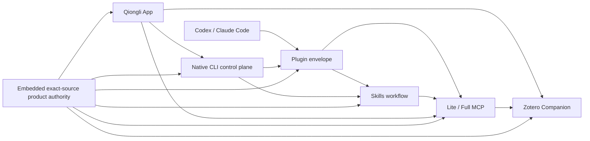
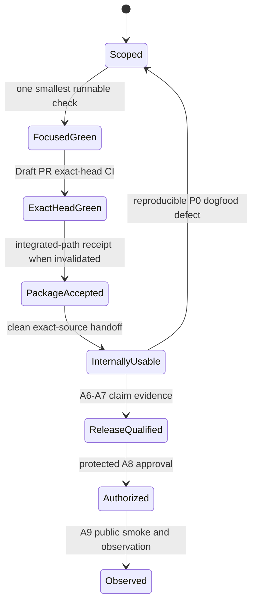

# Qiongli 2 Accelerated Rust Migration Roadmap

Status: active first-usable stabilization. The integrated `2.x` head is
`ba33301412de1c6919bf35d69a1312825f6c069d`. Exact-head Native CI run
`31283065849` passed all ten jobs; Community Alpha promotion run `31284047249`
rebuilt and aggregated macOS arm64, Windows x86_64, and Linux x86_64 and
remains non-publishing at its protected authorization gate. The same source
passed product-controlled macOS and automated R5D Zotero acceptance with
Plugin, Skills, CLI, Lite/Full MCP, and Companion checks green. Development now
optimizes for the first internally usable product; manual observation and
public-release qualification remain separate work.

Decision date: July 13, 2026

Target branch: `2.x`

Active rolling branch: `fix/alpha3-first-usable-integration` from `2.x`; Draft
PR #115

Design authority:
`docs/superpowers/specs/2026-07-13-qiongli-2-native-acceleration-design.md`

Community Alpha distribution authority:
`docs/superpowers/specs/2026-07-17-qiongli-community-alpha-distribution-note.md`

Community Alpha architecture authority:
`docs/architecture/decisions/0208-community-alpha-distribution-boundary.md`

R3Q execution authority:
`docs/superpowers/plans/2026-07-17-qiongli-r3q-native-product-control-plane.md`

R4 Research Workspace and Academic Graph authority:
`docs/superpowers/specs/2026-07-18-qiongli-r4-research-workspace-and-academic-graph-design.md`

Detailed architecture and program catalog:
`docs/superpowers/roadmaps/2026-07-10-qiongli-2-rust-native-platform-roadmap.md`

## First-Usable Development Strategy — August 9, 2026

The immediate product is one internally usable macOS build whose Plugin,
Skills, Zotero Companion, native CLI, and Lite/Full MCP work together. New
features, visual polish, package-manager delivery, public signing, automatic
update, and broader target claims do not block this track.

This section is the canonical development-chain authority. The Alpha 3
completion plan maps its later states to A5-A9, and the acceptance ledger holds
the resulting evidence. Do not create a second workflow, status document, or
receipt family for the first-usable track.

### Product spine and shared ownership

The first usable version is one vertical product spine, not five independently
shippable features:



| Surface | Required first-usable outcome | Shared owner to fix first |
|---|---|---|
| Plugin | exact bundle installs, verifies, restarts, repairs, and removes in Codex and Claude Code | embedded content and platform reconciliation |
| Skills | bundled and standalone Skills materialize, verify, refresh, and remain version-bound | canonical content registry and materializer |
| CLI | preview/apply/verify/repair/remove, fresh-shell discovery, restart, and 1.x migration work from the packaged authority | native App and platform control plane |
| MCP | Plugin-declared and standalone Lite/Full servers start with empty `PATH`; App/CLI/MCP reads agree | shared runtime contracts and packaged launch authority |
| Zotero | the bound Companion installs, starts, searches, performs approval-bound writes, replays safely, and removes cleanly | Companion artifact binding and shared Zotero service |

A defect observed in one surface is fixed at the shared owner when sibling
surfaces route through it. Surface-specific guards are allowed only when the
contract is genuinely surface-specific.

### Canonical delivery state machine



| State | Entry evidence | What it proves | What it does not prove |
|---|---|---|---|
| Scoped | one reproduced essential-path defect or named release claim | the work needs to exist and has one shared owner | implementation correctness |
| Focused green | one smallest check fails before and passes after the change | the changed behavior is fixed locally | workspace or target compatibility |
| Exact-head green | required Native CI succeeds for the PR head SHA | source and three-platform required checks agree on the exact commit | a user-installable product or publication |
| Package accepted | existing packaged-product and Zotero receipts bind the exact clean commit with `publication_allowed=false` | Plugin, Skills, CLI, MCP, and Zotero compose in the non-publishing App | real user-profile Hosts or public target claims |
| Internally usable | accepted package is available for bounded dogfooding and no automated essential-path P0 is known | the first usable product loop is open | manual acceptance or Community Alpha authorization |
| Release-qualified | A6-A7 receipts bind the exact candidate, target, client, update, and rollback claims | the candidate may be considered for publication | permission to publish |
| Authorized | protected A8 exact-set authorization | a maintainer approved that immutable candidate | successful public download |
| Observed | A9 download, startup, checksum, update, and rollback observations | the public Alpha is accepted or rollback is triggered | Stable readiness |

Each state consumes the evidence below it; no state substitutes for the next
one. In particular, `Package accepted` deliberately remains non-publishing.

### Shortest working flow

1. Record the user-visible failure, exact source, affected spine surface, and
   smallest reproduction in the rolling PR or issue; do not create a separate
   planning artifact.
2. Trace all callers to the shared owner and fix only the reproduced P0 or the
   named release claim.
3. Leave one focused check that would fail without the change. Keep focused
   negative checks for trust, credentials, destructive mutation, path
   ownership, receipt integrity, and data-loss boundaries.
4. Commit the root-cause fix and its check as one cohesive checkpoint, push the
   rolling Draft PR, and let Native CI own the complete source matrix.
5. If CI fails, reproduce only the failing job or changed boundary; do not
   rerun unrelated local suites.
6. Run `pnpm desktop:macos:acceptance -- --diagnostics` only when the integrated
   product receipt is invalidated, then hand that exact accepted build to
   bounded internal dogfooding.
7. Feed only reproducible essential-path P0 failures back to step 1. When none
   remain, continue with A6-A9 without changing the internal product claim.

The existing packaged-product acceptance is the only local cross-component
gate. Do not add another first-usable runner, receipt format, fixture family, or
test framework while it covers the required product path.

### Evidence invalidation rules

Run a gate only when its evidence has been invalidated:

| Evidence | Invalidated by | Reuse rule |
|---|---|---|
| Focused check | behavior or boundary changes again | rerun only the closest affected check |
| Exact-head CI | any new commit on the PR | only the current head SHA counts |
| Packaged-product receipt | a new commit changes App composition, embedded resources, Plugin, Skills, CLI, MCP, Zotero, packaging, or their shared contracts | source-only documentation and unrelated CI edits reuse the last product baseline |
| Internal dogfood build | its package receipt is invalidated, install grant expires, or a P0 fix lands | rebuild from a clean exact commit |
| A6-A7 release receipt | candidate source, version, target, client version, artifact digest, update metadata, or claimed journey changes | repeat only the affected target or journey unless exact-set identity changes |
| A8 authorization | any authorized artifact or exact-set identity changes | authorization never transfers to a replacement candidate |
| A9 observation | the public asset or update channel changes | observe the changed public path again |

Documentation-only changes do not force a product rebuild. A code change that
does not touch the integrated spine still needs exact-head CI, but it does not
automatically invalidate packaged acceptance. When uncertain, follow the
receipt inputs rather than rerunning everything.

### Minimum validation matrix

| Change | Developer runs | Authoritative broader gate |
|---|---|---|
| Documentation or static metadata | `git diff --check` | PR review |
| One Rust behavior | affected package/test filter | Native CI |
| One Svelte/App API behavior | affected test file; type check only for a contract change | Native CI |
| Plugin, Skills, CLI, MCP, or Zotero integration | closest focused check while editing | packaged-product acceptance at the cohesive checkpoint |
| Packaging or embedded-resource identity | packaged-product acceptance | exact-head Native CI and promotion |
| Public release claim | none during implementation | A6-A9 release qualification only |

Do not rerun a complete local workspace suite after an unchanged exact head has
already passed Native CI. Reproduce only a failing CI job or a changed boundary.
Security, destructive mutation, credentials, path ownership, receipt integrity,
and data-loss boundaries keep their focused negative check and are never
simplified away.

### Work and release structure

- `2.x` remains the integrated base;
- one rolling first-usable branch carries only blocker fixes;
- one cohesive commit may include the root-cause fix and its single focused
  regression check;
- generated Apps, test homes, receipts, and credentials remain uncommitted;
- internal usability requires automated acceptance, not public authorization;
- public distribution still requires the independent A6-A9 gates in the Alpha
  3 completion plan.

The rolling PR body carries only four live fields: current exact-head
capabilities, the latest cohesive checkpoint, the next dependency-contiguous
slice, and explicit nonclaims. GitHub CI is the source of source-gate truth;
the acceptance ledger is the source of artifact and release-gate truth.

### First-usable exit

The internal build is usable when the packaged receipt binds one clean commit,
reports every Plugin/Skills/CLI/MCP/Zotero check as true, launches with an empty
`PATH`, and leaves `publication_allowed` false. This gate is currently met for
`ba33301412de1c6919bf35d69a1312825f6c069d`; the next phase is blocker-only
dogfooding, not more pre-emptive feature or test work.

## Executive Decision

Qiongli 1.x is frozen at the accepted `v1.19.0-beta.1` baseline. Normal Python
and Node product development is closed. Active development targets one
Rust-native Qiongli 2 product.

The migration uses exactly one active rolling Draft PR at a time. The first
rolling line completed the path from the post-PR-#62 `2.x` base through the
published `v2.0.0-alpha.1`. R3Q uses one successor rolling branch and Draft PR;
R4 does not start until R3Q is accepted and merged. Task, workstream, and crate
IDs remain tracking labels rather than branch or PR gates.

Legacy Python and Node full suites are diagnostic-only. Required 2.x checks are
native Rust checks and proportionate boundary tests. Broader packaging,
integration, signing, and clean-machine checks run when the corresponding
artifact or public claim exists.

The first public distribution may use the explicitly labelled, zero-cost
`community-alpha` class on macOS arm64, Windows x86_64, and Linux x86_64.
Platform-paid trust is not an Alpha.1 gate: macOS uses an ad-hoc signature,
Windows uses an unsigned portable ZIP, and Linux uses an AppImage. Qiongli's
detached Ed25519 release/update trust, exact target identity, checksums, SBOM,
provenance, target-native startup evidence, truthful warnings, and explicit
publication authorization remain mandatory. Production Developer ID,
notarization, and Windows Authenticode stay on the later hardening path.

Package-manager distribution is a Beta hardening workstream, not a
retroactive Community Alpha claim. R5 adds an official Homebrew tap for native
macOS Apple Silicon and Intel delivery, an official Scoop bucket, and a WinGet
Community Repository package for Windows x86_64. Each manager must consume the
same immutable, checksummed release assets as the direct-download channel and
must pass native install, upgrade, repair or reinstall, and uninstall receipts
before Qiongli advertises it as supported.

## Current Native Baseline

Integrated on `2.x`:

- accepted ADR 0201-0208 architecture set;
- non-publishing native alpha release identity and dry-run;
- native workspace and one multi-mode application scaffold;
- accepted 1.x MCP, CLI, content, and orchestrator source inventory;
- Contract v2 closure for 23 canonical tools and 24 public names;
- FND-202A resource-pack manifest and profile contract;
- FND-202B bounded canonical source collector;
- FND-202C deterministic pack writer and digests;
- FND-202D bounded verifier/loader through PR #62, merge commit
  `ebd2d7bef651fcbd22a7310aa50f9945604fa9eb`.

The current physical native workspace contains `apps/qiongli`,
`qiongli-content`, `qiongli-config`, `qiongli-runtime`, `qiongli-platform`,
`qiongli-ui`, and the isolated `qiongli-windows-security` FFI boundary.
FND-202E is complete through portability head `870d85b8`, FND-202F is complete
at `76ee339f`, CFG-201A ends at `588e564d`, and CFG-201B ends at implementation
checkpoint `90190612` on
the same rolling branch. R1 native command composition ends at implementation
checkpoint `f2a6fbe6`. The first shared Lite runtime extraction is complete at
`d7f2d64f`. R3Q consumes the already accepted 1.x inventory as an outcome-level
product parity ledger; it does not reopen Python development, require the
legacy suites, or start another source-inventory phase.

R3A reaches its implementation checkpoint at `60c2ddc5`. It defines the
signed Lite launch-grant and declarative install-plan trust boundary and adds
truthful read-only `qiongli install status`; it does not yet install, mutate,
discover, register, activate, package, or release anything.

R3B reaches its accepted implementation checkpoint at `b3a6ea6b`. It adds the
first verified-plan and exact-approval-gated managed resource transaction
lifecycle, canonical receipts/state, a root-scoped recovery journal, and safe
apply/verify/repair/remove/rollback behavior. Exact implementation-and-local-
receipt head `6fdbcde5` passed Native CI and Cloudflare; the source binary still
exposes no executable install command.

## Operating Rules

### Branch and PR

- keep `2.x` as the integrated native base;
- keep one rolling branch for the current dependency-contiguous objective;
- keep one Draft PR from that branch into `2.x`;
- do not create FND, CFG, MCP, UI, installer, or packaging child PRs;
- use cohesive Conventional Commits as review and rollback checkpoints;
- push after the one focused check for a cohesive batch passes;
- turn the PR Ready when required exact-head CI passes;
- create the next rolling branch only after the current one merges.

### Development validation

During implementation, run one focused check for the changed behavior. Keep a
focused negative check when the change touches trust, destructive mutation,
credentials, path ownership, receipt integrity, or data-loss prevention.

Native CI owns workspace format, check, Clippy, full Rust tests, frontend
contracts, and the cross-platform matrix. Do not duplicate that complete matrix
locally before or after a green exact-head run.

Run the existing product-controlled macOS acceptance once per cohesive
cross-component or packaging checkpoint. It already covers Plugin, Skills,
CLI, Lite MCP, Full MCP, Zotero, restart, migration, and receipt boundaries.

Run target artifacts, signing, checksums, SBOM, provenance, real system-profile
activation, accessibility observation, upgrade, repair, remove, and rollback
matrices only for a named public-release claim. Legacy Python and Node suites
remain diagnostic-only unless the change directly touches their compatibility
surface.

### Long-flow sessions

A development session continues across multiple task IDs and commits while the
next work is dependency-contiguous and safely verifiable. Completing one small
task is not a reason to stop. A session pauses only for new authority, a real
architecture choice, a concrete security/data-loss blocker, or an external
platform limitation.

## Rust Workspace Framework

The alpha implementation uses these physical boundaries:

```text
packages/qiongli-native/
  apps/qiongli/
  crates/qiongli-content/
  crates/qiongli-config/
  crates/qiongli-runtime/
  crates/qiongli-execution/
  crates/qiongli-platform/
  crates/qiongli-ui/
  crates/qiongli-testkit/
```

| Boundary | Owns | Must not own |
|---|---|---|
| Content | Embedded resources, profiles, integrity, approved materialization | UI, host registration, model calls |
| Config | Versioned state, migration, atomic writes, secret references | UI callbacks, provider transport |
| Runtime | Contracts, providers, domain services, MCP | Client-specific installation |
| Execution | Agents, ToolHost, policy, orchestrator | UI or host cache mutation |
| Platform | Install plans, integrations, doctor, updater, rollback | Duplicate domain/provider logic |
| UI | Views, view models, typed intents, accessibility | Direct filesystem, process, network, or secret access |
| Testkit | Native fixtures, fakes, target harnesses | Production behavior |
| App | Mode parsing and dependency composition | Duplicated service implementation |

The old fourteen-crate diagram remains a possible later decomposition, not an
alpha scaffolding requirement. A module splits into another crate only when an
independent security, reuse, compilation, or packaging boundary is demonstrated.

## Critical Path

```text
R0 native control plane
  -> R1 content/config foundation
  -> R2 shared Lite runtime
  -> R3 installable CLI/UI alpha.1
  -> R3P three-platform Community Alpha distribution
  -> R3Q native product control plane and 1.x install parity
  -> R4 Full runtime alpha.2
  -> R5 native cutover beta.1
  -> stable hardening
```

R0-R3P completed the first public Alpha line. R3Q, R4, and R5 use successor
rolling PRs, but only one may be active at a time.

R4 keeps one rolling line but has an explicit internal dependency order:

```text
R4-0 Svelte desktop and Plugin-first client-integration rebaseline
  -> R4A Research Library and native project state
  -> R4B Research Capture and conflict-aware consolidation
  -> R4C Academic Graph projection and native visualization
  -> R4D Full MCP, host handoff, and ToolHost policy
  -> R4E host-driven orchestration and recovery
  -> R4M 1.x replacement migration and Alpha.2 acceptance
```

The immediate implementation slice after R3Q is `R4-0`. It replaces the
prototype presentation layer with one Tauri 2, Svelte 5, TypeScript, and
SvelteKit static-SPA shell before feature breadth grows, while preserving the
existing Rust application-service and packaged-product authority boundaries.
The same slice freezes one client-integration snapshot and vocabulary, adds
failing fixtures for detected hosts with missing Qiongli 2 plugins, legacy
`qiongli` coexistence, and a non-private legacy Claude marketplace root, then
isolates Qiongli 2 private state, repairs read-only discovery, and restructures
the Workflow Content and Client Integrations views. R4A does not begin until
the packaged Svelte App and CLI report the same causal states for those
fixtures and the egui comparison surface is no longer needed for recovery.

Decision update on July 24, 2026: ADR 0212 supersedes R3Q/R4-0's indefinite
`qiongli` plus `qiongli-next` coexistence as a product outcome. Existing
read-only legacy discovery becomes input to one bounded replacement migration.
Qiongli 2 converts supported user data and settings, regenerates plugins,
Skills, and MCP content from the verified 2.x App, verifies host activation,
then removes only proven 1.x surfaces. Temporary overlap is a migration state,
not a successful ownership state. R4M is now a blocking stabilization batch
before Alpha.2 release qualification; its execution authority is
`docs/superpowers/plans/2026-07-24-qiongli-1x-to-2x-replacement-migration.md`.

## R0 — Native Control Plane

Purpose: remove process overhead before adding more product surface.

Implementation status on July 13, 2026:

- complete at checkpoint `4d81a933` after actionlint, 18 focused policy tests,
  and the local native format/check/Clippy/workspace-test gate passed;
- GitHub Actions run `29286377360` passed the change boundary and Linux, macOS,
  and Windows Rust jobs on that checkpoint;
- live ruleset `18800504` requires exactly those four contexts while retaining
  pull-request, deletion, non-fast-forward, review-thread, and no-bypass rules;
- Draft PR #63 remains the only active 2.x migration PR, and R1 continues in
  that same branch.

Deliverables:

- approved acceleration design and this authoritative roadmap;
- one rolling branch and Draft PR;
- native-only required 2.x CI;
- legacy compatibility workflow moved out of branch protection;
- Draft PR capability/commit/next-batch/nonclaim ledger.

Exit gate:

- all required checks operate without the full Python or Node suites;
- exact-head native Linux, macOS, and Windows jobs pass;
- no second active 2.x migration PR exists.

## R1 — Content And Config Foundation

Purpose: make the native binary self-contained and safe to configure.

Implementation status on July 14, 2026:

- FND-202E is complete through implementation checkpoint `bd11896e` and
  portability follow-ups `e3c3f93e` and `870d85b8`;
- the service accepts only an already verified in-memory pack plus a target
  capability created by the private temporary factory or an explicitly named
  trusted CLI/UI/installer approval boundary;
- temporary targets live in atomically created private containers, while
  explicit Unix targets reject group- or world-writable ancestor chains;
- managed receipts, bounded canonical-source/profile validation, private
  staging, logical modes, link/reparse rejection, lock identity, managed-tree
  drift checks, sibling promotion, rollback, and distinct post-commit cleanup
  errors are covered by focused tests;
- the final local gate passed format, workspace check, Clippy with warnings
  denied, and 48 Rust tests;
- GitHub Actions run `29291560721` passed the native boundary plus Linux,
  macOS, and Windows Rust jobs at exact code head
  `870d85b8f0ac5f57311292d06b7278441eb9d3f7`;
- two review passes closed the shared-temp, staging-permission, lock-identity,
  and post-commit ambiguity findings, with no remaining Critical or Important
  blocker inside the declared FND-202E threat model;
- public CLI/UI/MCP wiring, Windows ACL and hard-link hardening, and adversarial
  same-user handle-relative filesystem operations remain explicit successor
  work rather than FND-202E claims;
- FND-202F now builds the canonical 418-entry content tree during the Rust
  application build, verifies it against committed content-root and whole-pack
  SHA-256 identities, and embeds only the verified bytes and expected digest;
- the lock binds academic content version `v1.19.0-beta.1` and the complete
  Contract v2 source tree at canonical content commit
  `ff2c4f35cd1ee5df78a04ff90a0325273917eed8`, content root
  `7a56401cb8208ab53483631e72cbcdc5b37c20a32e46eebfc9e8e2b219352f69`,
  and pack digest
  `38b9b1342a6a699b64d416a14ae25736750c166c2f502e6402c0c4418a6dc00d`;
- `EmbeddedContent` supplies profile list/read/materialize services, while the
  application validates the pack at startup; a copied-binary test runs outside
  the checkout with an empty `PATH`;
- the FND-202F local gate passed format, workspace check, Clippy with warnings
  denied, and 52 Rust tests. Review caught and closed an initial source-commit
  provenance mismatch, then reported no remaining Critical or Important
  blocker;
- GitHub Actions run `29292694823` passed the native boundary plus Linux,
  macOS, and Windows Rust jobs at exact implementation head
  `76ee339f2c21ac1139ff422392778f3fb0857598` in 7s, 29s, 33s, and 1m3s.
- CFG-201A spans implementation commits `60886b33`, `ed3e3384`, `ebf36bd4`,
  and `bb3537e4`, plus portability fixes `31beab11` and `588e564d`: it adds a
  versioned global root, exact typed settings, opaque secret references,
  strict bounded JSON, redacted status, revision conflicts, and
  recovery-aware persistence;
- the local CFG-201A gate passed the native change boundary, format, locked
  workspace check, Clippy with warnings denied, and 84 Rust tests using the
  required native-only commands; no Python or Node suite was run or required;
- the Unix adapter implements owner-only directories/files, a bounded lock,
  synchronized staging and recovery files, atomic activation, rollback, and
  explicit post-commit cleanup state. The local macOS execution covered the
  permission, conflict, concurrency, lock-timeout, and fault-injection matrix;
- CFG-201B design commit `974e539b`, isolated adapter commit `1c3df663`, and
  shared-transaction implementation commit `90190612` add supported Windows
  persistence without weakening `qiongli-config`'s unsafe-code prohibition;
- the isolated adapter creates and verifies protected current-user-only DACLs,
  rejects reparse points and hard-linked managed files, exposes handle identity,
  and performs write-through same-volume replacement;
- Windows now runs the same bounded lock, optimistic revision, synchronized
  staging/recovery, activation, verification, cleanup, and rollback state
  machine as Unix. Windows uses `MoveFileExW` write-through semantics instead
  of claiming an undocumented directory-fsync guarantee;
- GitHub Actions run `29318765759` passed the native boundary plus Linux,
  macOS, and Windows Rust jobs at exact implementation head
  `588e564d73b1afa367c7d7ee4d539c55f893e368` in 7s, 32s, 46s, and 57s;
- the CFG-201B local gate passed the native boundary, format, locked workspace
  check, Clippy with warnings denied, and all 84 Rust tests. A local
  `x86_64-pc-windows-msvc` workspace check and Clippy pass also type-checked
  every Windows-only production and test target before push;
- GitHub Actions run `29321393463` passed the native boundary plus Linux,
  macOS, and real Windows Rust jobs at exact implementation head
  `90190612d2ba66b93ae98c536d688ba86ab78b34` in 6s, 31s, 49s, and 1m29s;
- the Windows runner executed first/replacement writes, DACL checks, reparse
  and hard-link rejection, stale/concurrent writers, lock timeout, redaction,
  pre/post-activation failure injection, cleanup, and rollback-failure tests;
- credentials remain opaque `SecretRef` values. `UnavailableSecretStore` is
  the only secret-store implementation, so this checkpoint does not claim a
  keychain, credential vault, or plaintext fallback;
- R1 command design commit `45a1cc87` and implementation checkpoint
  `f2a6fbe6` compose the accepted content and config services without adding a
  second service implementation;
- the canonical binary now exposes exact help/version, content list and
  explicitly approved materialization, redacted config show and revision-safe
  default-profile set, combined status, and foundation doctor commands;
- every successful data command emits schema-version-1 JSON. Usage failures
  return 2, operation failures return 1, and doctor returns 1 only for a
  blocking config state;
- public errors use static or allowlisted reason codes. CLI tests prove that
  materialization/config paths, environment values, provider email, malformed
  document bytes, and private arguments do not enter stdout or stderr;
- config set preserves every provider field and delegates optimistic writes to
  the accepted cross-platform store. It accepts no secret or provider value;
- the copied binary lists and materializes the embedded pack from outside the
  checkout with an empty `PATH`, while failed target and stale config writes
  preserve prior bytes;
- the local R1 gate passed the native boundary, format, locked workspace check,
  Clippy with warnings denied, and all 92 Rust tests. The Windows MSVC
  cross-target workspace check and Clippy also passed;
- GitHub Actions run `29323018180` passed the boundary, Linux, macOS, and real
  Windows jobs on exact implementation head
  `f2a6fbe608c234219526c8947f0cb50470ac1482` in 4s, 37s, 40s, and 1m19s;
- no Python or Node suite was run or required. R1 does not implement provider
  configuration, credentials, MCP, project state, 1.x migration, agents,
  orchestration, desktop UI, host installation, or release packaging.

Deliverables:

1. FND-202E atomic materializer — complete through `870d85b8`:
   - temporary or explicitly approved output root;
   - managed receipt;
   - traversal and symlink rejection;
   - atomic commit and rollback;
   - no arbitrary output path from untrusted MCP input.
2. FND-202F embedding and drift closure — complete at `76ee339f`:
   - reproducible build-time pack;
   - embedded expected digest;
   - profile list/read/materialize API;
   - source-drift guard owned by native tooling.
3. `qiongli-config` cross-platform vertical slice — complete at `90190612`:
   - `QIONGLI_CONFIG_HOME/v2/` resolution;
   - typed public settings and profile selection;
   - provider settings and secret references;
   - atomic owner-only Unix and Windows writes and redacted diagnostics;
   - an isolated safe Win32 security boundary with protected DACL, identity,
     reparse, hard-link, and write-through replacement checks.
4. Native commands — complete at `f2a6fbe6`:
   - version/help;
   - content list/materialize;
   - config show/set;
   - status/doctor foundation.

Exit gate result: passed on implementation head `f2a6fbe6` in Native CI run
`29323018180`.

- the application starts with an empty `PATH`;
- embedded content is usable without a source checkout;
- failed materialization or config writes leave prior state intact;
- the current native workspace passes the Tier 1 build/test matrix.

## R2 — Shared Lite Runtime

Purpose: move the already working Rust Lite value into the canonical native
workspace instead of reimplementing it.

Implementation status: in progress. R2A, R2B, R2C, and R2D are complete. R2A
closed on July 14, 2026:

- design checkpoint `1e732155` freezes the first extraction boundary and
  explicit nonclaims;
- implementation checkpoint `d7f2d64f` adds `qiongli-runtime` with typed,
  path/input-free errors and an optional verified-embedded-content adapter;
- the strict parser accepts at most 1 MiB and requires the exact Contract v2
  Lite schema version, 12 public definitions in frozen order, and 11 canonical
  typed identities. `qiongli_open_config_wizard` resolves to the canonical
  configure-provider identity;
- newline and Content-Length stdio framing now have one shared implementation
  with 8 MiB message and 64 KiB header bounds plus typed UTF-8, incomplete,
  input, output, and serialization failures;
- the canonical app proves that the registry loads from the already verified
  `marketplace-lite` embedded profile without a loose-file fallback;
- the old Rust Lite package now uses thin definitions/protocol adapters and the
  shared typed handler resolver. Its duplicate name table and local
  framing/contract parsers were removed;
- unknown Lite JSON-RPC method and tool names now return static errors without
  echoing attacker-controlled names;
- the local gate passed the native boundary, format, locked workspace check,
  strict Clippy, all 104 native Rust tests, Windows MSVC cross-target check and
  strict Clippy, plus 15 focused old Lite protocol/server tests;
- Native CI run `29324291281` passed the exact implementation head
  `d7f2d64f5028bc909f4055834e8644077501752e`: boundary in 7s, focused Lite
  compatibility in 33s, Linux in 36s, macOS in 41s, and real Windows in 1m17s;
- no Python or Node suite ran or became required. R2A does not expose an MCP
  command in the canonical executable and does not migrate provider, evidence,
  Zotero, route-preview, or task-plan behavior.

R2A deliberately left provider behavior in the compatibility package. R2B
below closes that next dependency-contiguous boundary without opening native
MCP availability.

R2B is complete on July 14, 2026:

- design checkpoint `a7a505eb` freezes the native-config authority, redacted
  access/status model, request and HTTP bounds, cooperative cancellation,
  compatibility extraction, and explicit nonclaims;
- implementation checkpoint `2eaadfb1` adds canonical identities and aliases
  for OpenAlex, Semantic Scholar, Crossref, PubMed, and arXiv plus
  non-serializable zeroizing access and redacted readiness;
- native global settings adapt through the injected `SecretStore` only. Missing
  secrets and unavailable secure storage remain distinct, and no plaintext or
  process-environment fallback was added to the native path;
- canonical search requests cap UTF-8 query bytes at 4,096, per-provider
  results at 200, and total results at 1,000 before runtime construction;
- the shared client keeps fixed production endpoints, disables redirects and
  implicit proxy discovery, uses 3-second connect and 15-second request
  timeouts, and reads at most 4 MiB. Non-Windows uses bundled Rustls roots and
  Windows uses operating-system SChannel without a user-installed runtime;
- the five provider clients, response normalization, concurrent fan-out,
  canonical output order, partial-failure diagnostics, DOI/title-year
  deduplication, final limiting, and deterministic search planning now have one
  Rust owner in `qiongli-runtime`;
- cancellation is typed and checked before/after request boundaries and
  between PubMed's calls. Blocking HTTP already in flight is not claimed to be
  immediately interruptible and remains bounded by the request timeout;
- the old Lite provider/search/search-plan modules are re-exports or thin
  constructors. Legacy file/environment config resolves only at that
  compatibility edge before conversion to shared access;
- the local gate passed format, boundary, locked native check, strict native
  and Lite Clippy, all 116 native tests, 57 focused Lite compatibility tests,
  and Windows MSVC cross-target check/Clippy;
- Native CI run `29326303112` passed exact implementation head
  `2eaadfb137bb26a71ab578f0c2bcdf6dc140a869`: boundary in 5s, focused Lite in
  35s, Linux in 1m02s, macOS in 1m28s, and real Windows in 1m53s; and
- no live provider, Python, or Node suite ran. R2B does not expose provider or
  MCP commands in the canonical executable and does not implement production
  secure storage, evidence, Zotero, orchestration, UI, installation, or
  packaging.

R2C is complete on July 14, 2026:

- design checkpoint `68558ed0` freezes the side-effect-free evidence snapshot,
  read-only loopback probe, in-memory import-file export, resource bounds,
  compatibility edge, and explicit nonclaims;
- implementation checkpoint `2513c52f` adds typed evidence input with
  canonical/alias ambiguity rejection, 4,096-byte queries, 1,000 results,
  2 MiB serialized input, 32 container levels, and 100,000 JSON values;
- evidence snapshots remove credential-bearing keys recursively, retain benign
  evidence fields such as `token_budget` and `public_key`, omit compatibility
  paths and wall-clock time, and expose only static validation errors;
- the shared Zotero exporter validates at most 1,000 normalized records,
  unique exact format selection, 2 MiB input, bounded fields and provider
  metadata, and a 2 MiB combined output before returning deterministic
  CSL-JSON, RIS, BibTeX, and import-report contents in memory;
- RIS folds control and Unicode line-separator characters, while BibTeX escapes
  syntax-bearing input so record text cannot inject fields or entries;
- the shared Zotero probe accepts only bounded HTTP(S) loopback roots, strips
  path/query/fragment input, calls fixed connector/companion paths, disables
  redirects and implicit proxy discovery, bounds production requests to five
  seconds and companion bodies to 32 KiB, and never returns URL/body/library
  content;
- the old Lite evidence handler now delegates to the shared snapshot builder;
  its Zotero exporter is a re-export, and its companion module retains only
  the historical environment-to-client adapter beside shared re-exports;
- the local gate passed boundary, native and Lite format, locked native check,
  strict native and Lite Clippy, all 131 native tests, all 67 focused Lite
  compatibility tests, and Windows MSVC cross-target check/Clippy;
- Native CI run `29327768079` passed exact implementation head
  `2513c52f9a39cb97a6d41f282dcbdff920eac979`: boundary in 4s, focused Lite in
  32s, Linux in 1m08s, macOS in 1m39s, and real Windows in 1m53s; and
- no live Zotero/provider, Python, or Node suite ran. R2C does not write files,
  mutate/search a Zotero library, install the companion, expose a native Zotero
  settings surface, or add MCP mode to the canonical executable.

R2D is complete on July 14, 2026:

- design checkpoint `bb6d2b08` freezes the bounded pure-preview contract,
  typed dispatch projection, compatibility command meaning, privacy boundary,
  verification, and explicit nonclaims;
- implementation checkpoint `5509d2c1` gives all 11 canonical Lite identities
  one exhaustive config, literature, Zotero, or orchestration handler target;
- the configure-provider compatibility alias still resolves before dispatch,
  and handler selection performs no string matching after typed resolution;
- shared route input accepts a required nonblank request of at most 4,096
  bytes plus the exact optional Contract v2 platform enum; shared task input
  accepts required task ID and paper type values of at most 256 bytes plus a
  topic of at most 4,096 bytes, preserving current task-field trimming;
- route/task outputs deterministically retain the accepted Marketplace Lite
  preview flags, keep agent/shell/project-write permissions false, and retain
  the 1.x Full-runtime command only as compatibility guidance rather than
  native 2.x capability discovery;
- runtime validation rejects non-object, unknown, missing, mistyped, blank,
  unsupported-platform, and oversized input with static canary-free errors;
- the old Lite preview module is a shared-runtime re-export and its server now
  dispatches every tool through the shared typed domain projection before
  wrapping results in JSON-RPC;
- the local gate passed boundary, native and Lite format, locked native check,
  strict native and Lite Clippy, all 138 native tests, all 69 focused Lite
  compatibility tests, and Windows MSVC cross-target check/Clippy;
- Native CI run `29328767532` passed exact implementation head
  `5509d2c146e65265e1f47cc9b4badb3f258325c9`: boundary in 4s, focused Lite in
  33s, Linux in 52s, macOS in 1m22s, and real Windows in 1m59s; and
- no Python/Node suite, live provider/Zotero service, filesystem write,
  process, shell, environment lookup, or agent backend was added or required.
  The canonical executable still exposes no MCP mode.

R2E and the R2 native Lite vertical are complete on July 14, 2026:

- design checkpoint `51887f4c` freezes the closed Lite/stdio command, shared
  protocol and handler ownership, unavailable-safe credential boundary,
  copied-binary gate, release nonclaims, and R3 handoff;
- implementation checkpoint `fce20f46` exposes
  `qiongli mcp serve --profile lite --transport stdio` from the canonical
  executable, with `marketplace-lite` as the only profile alias and no Full or
  alternate transport escalation;
- one shared runtime server owns bounded line and `Content-Length` framing,
  JSON-RPC/MCP lifecycle methods and notifications, the embedded 12-name Lite
  registry, typed domain dispatch, and bounded output/error redaction;
- native config and literature status use the shared provider-access model and
  the opaque `<managed-native-config>` identifier; secret references resolve
  only through `SecretStore`, with no environment or 1.x plaintext fallback;
- valid save-provider and wizard calls are validated and return fixed
  unavailable tool errors without writing config, starting a listener,
  launching a browser, or echoing the supplied value;
- shared search-plan and literature-search parsers now serve both Rust
  entrypoints; the old Lite server removed 408 lines and added 20, a 388-line
  net reduction in duplicate compatibility-server code;
- the copied canonical binary passed initialize, exact 12-name tools/list,
  bounded line-framed domain calls, notification suppression, secret/path
  redaction, and EOF with an empty `PATH`; direct shared-server tests passed
  `Content-Length` framing;
- the local gate passed boundary, native and Lite format, locked native check,
  strict native and Lite Clippy, all 148 native tests, all 69 focused Lite
  compatibility tests, and Windows MSVC cross-target check/Clippy;
- Native CI run `29330582098` passed exact implementation head
  `fce20f469d6cc691dcd9ea74d822a8dcf75bdb38`: boundary in 5s, focused Lite in
  38s, Linux in 1m08s, macOS in 1m08s, and real Windows in 2m00s; and
- no Python/Node suite, live provider/Zotero service, config mutation,
  loopback listener, process, browser, UI, installer, packaging, launch grant,
  Marketplace activation, Full MCP, or agent backend was added or required.

R2 is therefore complete for the development vertical. This does not make the
binary an installable alpha or a release plugin. Production secure-store
mutation, signed artifact-bound launch grants, target packaging, host
installation/repair, and clean-machine installed-product proof remain R3.

Deliverables:

- `qiongli-runtime` contract and error foundation;
- provider config/status and bounded search;
- evidence export and supported Zotero operations;
- stdio JSON-RPC/MCP framing;
- Contract v2 Lite profile dispatch;
- native MCP mode in the canonical `qiongli` executable;
- old `qiongli-lite-mcp` reduced toward a thin compatibility wrapper.

Exit gate:

- advertised Lite tools answer initialize, tools/list, and bounded safe calls;
- no Python or Node process appears in the production process tree;
- provider unavailability, timeout, cancellation, and credentials remain typed
  and redacted;
- old and new Rust entrypoints do not contain divergent provider logic.

## R3 — Installable Native Alpha.1

Purpose: turn the native services into a usable local product.

R3A is complete on July 14, 2026:

- design checkpoint `60c50526` freezes exact Lite artifact identity, injected
  Ed25519 trust, deterministic typed plans, bounded parsing, and nonclaims;
- implementation checkpoint `60c2ddc5` adds `qiongli-platform`, strict signed
  grant verification, private verified tokens, target-matched invertible plan
  contracts, semantic digests, and closed reason-coded failures;
- the canonical source binary exposes read-only `qiongli install status` and
  truthfully reports launch grant, preview, and apply as unavailable;
- local gates passed the native boundary, format, locked check, strict Clippy,
  all 161 native Rust tests, and Windows MSVC cross-target check/Clippy;
- Native CI run `29332864357` passed exact implementation-and-local-receipt
  head `a971ae1e`: boundary in 8s, Lite compatibility in 37s, Linux in 1m08s,
  macOS in 1m05s, and real Windows in 2m19s; Cloudflare Pages also passed; and
- no production signing key, signed release artifact, filesystem executor,
  receipt, adapter, real client activation, Marketplace/Desktop install,
  package, or release exists yet.

R3B is complete at design checkpoint `714315cd` and implementation checkpoint
`b3a6ea6b`:

- one exact Marketplace Lite resource plan can materialize below an explicitly
  approved owner-only `QiongliManagedData` root only after exact grant, plan,
  payload, root, and approval validation;
- canonical active and lifecycle receipts support fresh apply, exact replay,
  read-only verify, absent-target repair, remove, and rollback;
- a root-scoped journal serializes distinct install IDs, and UID/DACL, root and
  target identity, no-replace rename, quarantine, and post-rename ambiguity
  handling fail closed without deleting uncertain data;
- local gates passed the native boundary, format, locked workspace check,
  strict Clippy, all 177 native Rust tests, and Windows MSVC cross-target
  workspace check/strict Clippy;
- Native CI run `29335762713` passed exact implementation-and-local-receipt
  head `6fdbcde5`: boundary in 4s, focused Lite in 37s, Linux in 1m15s, macOS
  in 1m24s, and real Windows in 2m22s; Cloudflare Pages also passed; and
- multi-operation plans, managed replacement/upgrade, plugin/MCP registration,
  host actions, nested destinations, client paths, production grants, packages,
  and release claims remain rejected or unavailable.

R3C is complete at design checkpoint `8c76f5f2` and implementation checkpoint
`f0455ad8`. It implements the first `INT-201` Codex local adapter vertical with
documented current-user discovery, read-only preview, exact client-config
approval, and receipt-backed registration/removal. It must not write Codex
plugin caches or claim
Desktop/Marketplace activation; real client activation evidence remains a
separate exit gate. Claude Code and Claude Desktop remain `INT-202`/`INT-203`
successor work.

The R3C boundary is frozen in
`docs/superpowers/specs/2026-07-14-qiongli-r3c-codex-local-adapter-design.md`.
It uses the documented personal marketplace at
`~/.agents/plugins/marketplace.json`, a receipt-verified fixed source below
`~/.qiongli/plugins/codex`, and an exact approval-gated merge transaction.
Codex-owned cache and enablement state remain out of scope; registration means
only that the desktop client can discover the local source for a later user
install.

R3C acceptance evidence:

- the canonical embedded pack contains a receipt-covered skills-only Codex
  manifest and has 419 entries;
- `qiongli-platform` implements redacted discovery, deterministic preview,
  exact approval, canonical registration/lifecycle receipts, root-scoped
  journaling, and apply/verify/repair/remove/rollback;
- marketplace merges preserve unrelated fields and entries and reject
  unreceipted conflicts, drift, links, unsafe permissions, oversized input,
  partial approval, and ambiguous recovery;
- `qiongli install codex status` is read-only and the source build continues to
  report production grant, preview, and apply as unavailable; and
- the native boundary, strict Clippy, all 185 native Rust tests, all 69 focused
  Lite compatibility tests, and the Windows MSVC all-target workspace check
  pass locally; and
- exact-head Native CI run `29338915660` passed `f0455ad8`: boundary in 5s,
  focused Lite in 41s, Linux in 1m15s, macOS in 2m13s, and real Windows in
  2m19s. Cloudflare Pages also passed.

R3D is complete at design checkpoint `e2e5c814`, implementation checkpoint
`468f458e`, and accepted portability head `103fe11d`. It composes the target
native binary and native Lite MCP declaration into a complete Codex plugin
layout, binds package identity to the signed artifact and embedded content
receipts, and proves a real clean-client install/enable/runtime path. Client
cache and enablement writes remain client-owned; public Marketplace and cloud
availability are not claimed.

The R3D boundary is frozen in
`docs/superpowers/specs/2026-07-14-qiongli-r3d-codex-native-plugin-design.md`.
The generated target-specific package uses one native Qiongli executable for
CLI and Lite MCP, a canonical `skills/qiongli-workflow` projection, a strict
bundle receipt, and client-owned activation. Real Codex evidence must use an
isolated home and must not modify the developer's normal cache or enablement
state.

R3D is complete. The platform now
builds and verifies a target-specific, receipt-covered package containing the
canonical skill projection, one native Qiongli executable, and a root MCP
declaration. R3C discovery accepts only that complete package and binds its
registration state to the package receipt and content root.

Local R3D acceptance proves:

- deterministic composition, private staging, locking, no-replace promotion,
  complete-tree verification, and rejection of target, lock, binary, mode,
  hard-link, receipt, extra-file, and content drift;
- the packaged binary serves all 12 Lite MCP tools with an empty `PATH`;
- Plugin Creator validates the generated package; and
- Codex CLI `0.144.1` installs, lists, enables, caches, and launches the package
  in an isolated client home without modifying normal Codex state.

The local gate passes strict host and Windows MSVC Clippy, all 187 normal native
Rust tests, and all 69 focused Lite compatibility tests. The external Codex
test passes explicitly and remains ignored in the default workspace gate.
Production grants, public Marketplace publication, cloud/web execution,
package upgrade/rollback, release artifacts, and Claude/UI/Full-runtime work
remain unavailable.

Remote R3D acceptance passed at
`103fe11dc5ada2f4e34a6c79a367f9e27a82ad5e`: Native CI run `29342795330`
passed the boundary in 6s, focused Lite in 36s, Linux in 1m33s, macOS in
2m17s, and Windows in 2m44s; Cloudflare Pages also passed. The Windows gate
includes the complete bundle and secure owner-only operations beyond the
legacy 260-character path limit.

R3E / `INT-202A` is complete at design checkpoint `461c4839` and accepted
implementation head `337cce74`. It adds a target-native, receipt-covered Claude
Code plugin package, exact direct skills-directory discovery and removal, and a
Qiongli-owned local marketplace lifecycle over the existing signed artifact,
embedded content, install-plan, approval, and transaction boundaries.

Local R3E acceptance proves:

- the verified embedded pack contains 420 entries including the canonical
  Claude manifest, while Codex and Claude composers each exclude the other
  host's manifest from the generated skill payload;
- direct discovery accepts only an exact verified package and direct removal
  preserves unmanaged or drifted paths;
- the local marketplace adapter supports preview, apply, verify, absent-entry
  repair, remove, and rollback without writing Claude-owned settings, registry,
  cache, or enablement state;
- all 199 normal native Rust tests, all 69 focused Lite compatibility tests,
  strict host Clippy, and Windows MSVC workspace check/Clippy pass; and
- Claude Code `2.1.206` strictly validates and discovers `qiongli@skills-dir`,
  adds and installs the isolated local marketplace package, verifies the copied
  cache, serves all 12 Lite MCP tools with an empty `PATH`, and removes the
  isolated plugin and marketplace.

Remote R3E acceptance passed at
`337cce741ee2837165331a9a3cd5a53d2e7bf245`: Native CI run `29345585219`
passed the boundary in 5s, focused Lite in 38s, Linux in 2m14s, Windows in
2m30s, and macOS in 2m42s; Cloudflare Pages also passed.

R3E does not add production grants or mutating install commands and does not
claim Claude Desktop, cloud/web, public marketplace, managed upgrade, release,
UI, Full MCP, agent, or orchestrator completion. `INT-203` and remote service
support remain separate gates.

R3F / `UI-201` plus the read-only portion of `UI-202` is complete at design
checkpoint `59f968c6`, implementation checkpoint `66398b2c`, and accepted
implementation-and-CI head `4d706033`. The canonical executable now exposes
`qiongli ui` with Overview, Skills, MCP, Providers, Integrations, and
Diagnostics views over a bounded redacted snapshot.

Local R3F acceptance proves:

- `qiongli-ui` depends only on eframe, egui, and zeroize and has no concrete
  config, content, platform, runtime, filesystem, process, or network service;
- all eight headless AccessKit tests pass across six views, keyboard
  activation, labelled transient input, preview confirm/cancel, recovery,
  680/1080 widths, and 100/150/200 percent scale;
- the real adapter reads verified embedded content, redacted provider/config
  state, the 12-tool Lite contract, and Codex/Claude Code discovery without
  creating host or Qiongli state;
- invalid initial snapshots are quarantined without rendering their dynamic
  text, while production apply and install confirmation remain unavailable;
- all 210 normal native Rust tests pass with two external-client tests ignored,
  and strict host and Windows MSVC Clippy pass; and
- the test profile strips debug information so the unified GUI/CLI/MCP test
  binary stays inside the unchanged 128 MiB plugin-composer input bound.

The initial implementation-head Native CI run `29349701112` found the Linux
debug test binary above that bound. The build-only fix at `4d706033` retained
the production limit. Exact-head Native CI run `29351331008` then passed the
boundary in 6s, focused Lite in 39s, macOS in 4m45s, Linux in 4m51s, and
Windows in 6m16s; Cloudflare Pages also passed.

R3F does not claim packaged-window startup, manual target screen-reader
acceptance, config or secret writes, UI-launched MCP, plugin mutation, signing,
updater, clean-machine release, Claude Desktop, cloud/web, Full MCP, agents, or
orchestrator completion.

R3G / `PKG-201A` is complete at design checkpoint `0b895a88`, implementation
checkpoint `df493e13`, and accepted implementation-and-CI head `7fddca15`. The
platform now assembles one current-target `lite` plus `portable-archive`
staging tree around the canonical binary and binds its complete target,
version, channel, profile, package, binary, and verified resource-pack identity
in canonical metadata with explicit `assembled-unpublished` status.

Local R3G acceptance proves deterministic composition, private no-replace
staging, bounded source validation, complete-tree and external resource-pack
verification, fixed path-redacted failures, and tamper/conflict rejection. The
committed artifact-local binary runs `--version`, verified content listing,
MCP initialization, the exact 12-tool Lite surface, and one bounded read-only
tool call from outside the checkout with an empty runtime `PATH`. All 215
normal native tests pass, two external-client tests remain explicitly ignored,
all 69 focused Lite compatibility tests pass, and strict host and Windows MSVC
checks and Clippy pass.

Initial Native CI run `29353736596` passed every job except the new Windows
R3G tests, whose fixture used a default-DACL parent. `7fddca15` switched that
test fixture to the existing owner-only Windows helper without weakening the
production validator. Exact-head Native CI run `29354332680` then passed the
boundary in 7s, focused Lite in 32s, Linux in 5m22s, macOS in 6m34s, and
Windows in 6m59s; Cloudflare Pages also passed.

R3G does not claim a final compressed archive, signing, notarization, public
release, updater, service-backed install mutation, packaged-window startup,
cross-target packaging, or clean-machine desktop acceptance.

R3H / `PKG-201B` is complete at design checkpoint `dad77e66` and accepted
implementation head `f1e50074`. The platform now composes the verified R3G
staging tree into one canonical, deterministic, store-only ZIP and accepts only
its exact four-entry profile. Composition and verification bind the archive to
the complete artifact identity, external verified resource pack, canonical R3G
manifest, binary digest, logical modes, CRC values, offsets, and fixed ZIP
metadata.

Local R3H acceptance proves byte-for-byte deterministic output, bounded strict
parsing, structural and payload tamper rejection, owner-private create-new
staging, target locking, persistence, no-replace promotion, fixed-path safe
extraction through the R3G commit path, and cleanup without adopting existing
caller data. The extracted artifact-local executable runs `--version`, content
inspection, MCP initialization, the exact 12-tool Lite contract, and one
bounded read-only call from outside the checkout with an empty runtime `PATH`.
All 220 normal native tests pass, the two external-client tests remain
explicitly ignored, all 50 platform tests pass, all 69 focused Lite tests pass,
and strict host and Windows MSVC checks and Clippy pass.

Exact-head Native CI run `29357292961` passed the boundary in 7s, focused Lite
in 37s, Windows in 6m33s, Linux in 7m12s, and macOS in 9m36s; Cloudflare Pages
also passed. R3H remains unsigned and unpublished and does not claim signing,
notarization, checksums, SBOM, provenance, launch grants, an installer, updater,
public distribution, packaged-window startup, cross-target output, or
clean-machine acceptance.

R3I / the remaining `PLT-202` native-payload vertical is complete at design
checkpoint `33e331c9` and accepted implementation head `25335d43`. The platform
now binds one verified current-target R3H archive to an R3A signed launch grant,
deterministic single-operation install plan, explicit filesystem approval, and
caller-approved private `QiongliManagedData` root. Archive-derived install
identity prevents different archives from sharing state, while the installed
directory remains the canonical artifact ID.

The shared service implements apply, identical replay, read-only verify,
absent-target repair, verified quarantine, remove, rollback, terminal
idempotence, restoration before the durable state point, and retained recovery
evidence for ambiguous outcomes. Strict bounded canonical state contains no
absolute path. Foreign destinations, linked state, payload drift, archive/pack
mismatch, and conflicting journals fail closed without adoption or overwrite.
The installed executable runs `--version`, content inspection, MCP initialize,
the exact 12-tool Lite contract, and one bounded read-only call outside the
source and archive trees with an empty runtime `PATH`.

Local R3I acceptance passes all 224 normal native tests, keeps the two
external-client tests explicitly ignored, passes all 54 platform tests and all
69 focused Lite compatibility tests, and passes strict host and Windows MSVC
checks and Clippy. Exact-head Native CI run `29361710636` passed the boundary
in 4s, focused Lite in 35s, Linux in 7m33s, Windows in 7m59s, and macOS in
8m12s; Cloudflare Pages also passed.

R3I remains test-signed and does not claim a production signing key, signed
release envelope, automatic managed-root discovery, user-facing install
intent, client activation, updater, public Marketplace distribution,
notarization, SBOM, provenance, cross-target output, or clean-machine release
acceptance.

R3J / `PKG-202A` is complete at design checkpoint `3554ba69` and accepted
implementation head `cc33360b`. The platform now verifies a strict bounded
canonical Ed25519-signed release envelope through a release-key role separate
from launch-grant authority. It binds the complete artifact identity, channel,
generation and validity interval plus archive, R3G manifest, resource pack,
artifact content root, executable, and attached launch grant before returning
one private verified release token.

R3I preview, apply, and repair now require that token. The plan action,
semantic digest, and canonical receipt bind its signed-payload digest; the
executor compares the exact signed grant and re-verifies the token-retained
archive immediately before extraction. Offline receipt-backed verify, remove,
rollback, recovery, and caller-data preservation remain intact.

Local R3J acceptance passes all 227 normal native Rust tests with two external
real-client tests explicitly ignored, all 57 platform tests, all 69 focused
Lite compatibility tests on the complete rerun, strict host and Windows MSVC
checks and Clippy, and the frozen boundary. Exact-head Native CI run
`29365515446` passed `cc33360b`: boundary in 6s, focused Lite in 37s, Windows in
6m51s, Linux in 9m16s, and macOS in 9m40s. Cloudflare Pages also passed.

R3J remains test-signed and does not claim production release-key provisioning,
an executable CLI/UI install intent, automatic managed-root discovery, client
activation, public publication, updater behavior, OS code signing/notarization,
checksums, SBOM, provenance, cross-target artifacts, or clean-machine Alpha.1
acceptance.

R3K is complete at design checkpoint `e6619560` and accepted implementation
head `d90d4846`. The canonical product can now embed one strict byte-canonical
public release-authority policy at build time, with separate release-envelope
and launch-grant roles, bounded key sets, generation floors, release-key
windows, product channel validation, and no runtime trust override. Ordinary
source builds embed no authority and cannot preview or apply a payload.

The current-target native CLI now composes R3J and R3I into explicit
preview/apply/verify/remove operations. Preview is non-mutating; apply requires
the exact semantic plan digest and explicit filesystem-write approval; verify
and remove remain canonical-receipt-backed. All output is versioned and path
redacted, and the managed root must already be absolute, owner-private, and
approved.

Local R3K acceptance passes 232 native Rust tests with the two real
external-client tests ignored, the focused 60 platform + 8 app-library + 16 CLI
tests, all 69 focused Lite tests, strict host and Windows checks and Clippy, the
frozen boundary, and an isolated authority-injected empty-environment status
proof. Exact-head Native CI run `29369405002` passed `d90d4846`: boundary in
5s, focused Lite in 38s, macOS in 7m55s, Linux in 8m16s, and Windows in 8m26s.
Cloudflare Pages also passed.

R3K does not select production key values, handle private signing material,
create or discover managed roots, download releases, activate clients, mutate
desktop state, publish artifacts, provide an updater, or claim clean-machine
Alpha.1 readiness.

R3L is complete at design checkpoint `789af6ba` and implementation head
`a4aa9172`. The accepted Codex and Claude Code registration adapters now share
one handle-bound coordinator that re-verifies the target-specific signed
PluginBundle grant, complete plan, exact three approvals, and outstanding host
action before delegating apply/replay, verify, repair, remove, or rollback.
Immediate post-mutation verification and accepted adapter rollback remain in
force, and previews cannot cross independently discovered handles.

The desktop boundary can receive one prepared trusted session per local target,
show the exact plan digest and approval labels, retain the verified plan behind
an OS-random 128-bit token, and apply only after exact confirmation. Source
builds receive no session and continue to report `apply: false`. The canonical
binary now provides a bounded `qiongli ui --startup-check` that validates the
embedded content, desktop service, snapshot, app state, and linked window
entrypoint without opening a window or starting a subprocess. A copied
current-target artifact passes that check outside the checkout with an empty
runtime `PATH`.

Local R3L acceptance passes 236 native Rust tests with the two real external-
client tests explicitly ignored, the three-test coordinator suite in under one
second, all 69 focused Lite tests, strict host and Windows MSVC checks and
Clippy, both formatting gates, and the frozen boundary. Exact implementation-
head Native CI run `29373107891` passed `a4aa9172`: boundary in 6s, focused
Lite in 36s, Linux in 8m17s, Windows in 8m39s, and macOS in 11m13s.
Cloudflare Pages also passed.

R3L does not assemble release inputs, select production keys, create or
discover managed roots, invoke client CLIs, mutate client-owned caches or
enablement, support desktop/cloud Marketplace bypass, display a clean-machine
window, publish artifacts, provide an updater, or publish Alpha.1.

The bounded R3M implementation and technical release-gate tail are complete:

1. R3M now assembles the accepted portable payload and target-specific plugin
   sources into an exact three-file signed current-target candidate. An
   isolated outside-checkout harness passes the empty-`PATH`
   CLI/skills/UI-preflight/Lite-MCP/Codex/Claude lifecycle, rejection,
   compensation, and unrelated-state checks with ephemeral in-memory test
   keys. Native CI reproduces that non-publishing evidence on Linux.
2. Exact implementation-head Native CI run `29401898602` and Cloudflare Pages
   passed `8d5a4233`. The non-publishing CI evidence binds clean PR merge
   candidate `c98817cf` and records exact Linux x86-64 candidate digests.
3. The R3M readiness receipt records production authority/signatures, final
   accepted `2.x` source binding, maintainer production-target selection,
   real-client evidence, displayed-window/accessibility evidence, independent
   release-note review, and explicit tag/release authorization as unresolved
   gates for its original production-signed release class. R3P replaces only
   the paid platform-signing portion with a separately declared Community Alpha
   ledger; Qiongli release signatures and the remaining evidence stay required.
   At the R3M checkpoint, PR #63 remained Draft and no Alpha.1 tag or release
   existed. R3P later completed the separate Community Alpha publication path.

At the R3M checkpoint, Full MCP, agents, ToolHost, orchestration, and updater
work remained future stages rather than Alpha.1 blockers. R3O later completed
the bounded updater; Full execution remains R4 work.

Deliverables:

1. `qiongli-platform`:
   - typed target discovery;
   - `InstallPlan` preview/apply/verify/repair/remove/rollback;
   - managed ownership markers;
   - supported Codex local adapter;
   - supported Claude local adapter;
   - doctor and integration status.
2. `qiongli-ui`:
   - egui/eframe shell;
   - Skills, MCP, Providers, Integrations, and Diagnostics views;
   - typed service intents and events;
   - no business logic or direct side effects in UI callbacks.
3. `apps/qiongli`:
   - CLI, desktop UI, MCP, and internal worker modes over shared services;
   - current-target build and artifact identity;
   - truthful alpha capability output.
4. Alpha acceptance:
   - clean-machine startup;
   - embedded skill inspection/materialization;
   - provider configuration and Lite MCP launch;
   - one Codex and one Claude install/diagnose/remove journey;
   - zero user language-runtime dependency.

Exit gate:

- all advertised alpha.1 journeys pass on their exact target artifact;
- rollback removes only Qiongli-managed state;
- release notes identify unsupported Full/agent/orchestrator behavior;
- the rolling Draft PR is green and may become Ready.

## R3P — Zero-Cost Three-Platform Community Alpha Distribution

Purpose: publish the first bounded Lite Alpha without purchasing Apple or
Windows platform-signing credentials while retaining Qiongli's own cryptographic
release and update trust.

Policy status on July 17, 2026:

- approved in
  `docs/superpowers/specs/2026-07-17-qiongli-community-alpha-distribution-note.md`;
- R3P-A is implemented in the shared Rust platform crate with strict canonical
  policy, three-target release-set, and exact protected-environment
  authorization schemas;
- R3P-B repository implementation adds a fresh-build three-target promotion
  contract and read-only exact-head workflow;
- R3P-C/R3P-D complete common release trust, protected authorization,
  target-set verification, and publication;
- `v2.0.0-alpha.1` is an immutable GitHub Pre-release published at
  `e984f01e7330f9c0c83bb66eb8a1f17b29d0b28d` with macOS arm64 ZIP/DMG,
  Windows x86_64 portable ZIP, Linux x86_64 AppImage/AppDir ZIP, checksums,
  SBOM, provenance, integrity, authority, candidate-set, and publication
  authorization assets;
- field acceptance after publication does not rewrite that tag or its assets;
  it feeds the R3Q successor stage.

Deliverables:

1. `R3P-A` distribution policy — repository implementation complete:
   - add a closed `community-alpha` distribution class distinct from channel;
   - permit it only for prerelease artifacts and never in Stable;
   - preserve the existing production-signed lane and fail-closed defaults;
   - require explicit platform-trust fields and public installation warnings;
   - close the exact three-target release set and consume authorization only
     when class, source, digest, protected Environment, run, actor, and time
     window all match.
2. `R3P-B` exact-head candidate promotion — complete:
   - macOS arm64 ad-hoc-signed App, first-install DMG, and update ZIP;
   - Windows x86_64 unsigned complete-directory portable ZIP;
   - Linux x86_64 Type 2 AppImage and required companion CLI artifact;
   - never publish raw seven-day CI artifacts directly.
3. `R3P-C` common release trust — complete:
   - bind every final target asset to the existing detached Ed25519 authority;
   - generate sorted SHA-256, CycloneDX SBOM, SLSA provenance, target metadata,
     and one exact release-set receipt;
   - reject metadata-unsigned, target-mismatched, expired, replayed, or
     unauthorized candidates before staging or update.
4. `R3P-D` acceptance and publication — complete for the Community Alpha
   distribution class:
   - run target-native packaged startup evidence on all three advertised OSes;
   - exercise macOS DMG copy/start and update rollback, Windows full-directory
     extraction/start, and Linux AppImage start;
   - document the macOS per-app Gatekeeper override, possible Windows
     SmartScreen warning/block, and Linux runtime-facility boundary;
   - publish one GitHub Pre-release only after exact-set maintainer authorization.

Exit gate:

- all three artifacts come from one clean exact source revision and carry
  truthful target identities;
- required Native CI and final target-native startup receipts pass;
- Qiongli release/update signatures, checksums, SBOM, provenance, metadata,
  warnings, and Community Alpha ledger bind the same release set;
- documentation never instructs users to disable Gatekeeper or Smart App
  Control, weaken enterprise policy, or import a self-signed Windows root;
- Windows execution is explicitly not guaranteed on Smart App Control or
  enterprise-blocked machines;
- one explicit maintainer authorization precedes tag creation, upload, and any
  signed preview-stream mutation.

Production platform signing is not deleted. A later new SemVer release may add
Developer ID/notarization and trusted Authenticode; it must not silently relabel
the already published Community Alpha bytes.

R3P-A pre-publication repository evidence:

- `qiongli-platform::distribution` implements bounded canonical parsing,
  unknown-field rejection, closed platform-trust/warning mappings, raw-CI and
  Stable rejection, the fixed three-target release set, and an in-memory
  verified authorization capability;
- the release-notes template and renderer require the exact Community Alpha
  label, raw-CI prohibition, platform warnings, and exact-set authorization;
- 11 focused distribution tests, all 86 `qiongli-platform` tests, the four
  candidate-acceptance example tests, and both affected Clippy gates pass
  locally;
- at that checkpoint this evidence did not yet claim GitHub Actions,
  Windows/Linux target-native acceptance, candidate promotion, asset signing,
  tag creation, release upload, or update-endpoint mutation.

R3P-B pre-publication repository evidence:

- `qiongli-platform::community_alpha` closes fresh exact-source provenance,
  the five public asset roles, platform-specific evidence roles, target order,
  one workflow run/source/version, candidate digest, and non-publishing status;
- `native_community_alpha_promotion` creates target-native promotion directories,
  re-hashes every asset and receipt during aggregation, and refuses target
  promotion on the wrong host OS/architecture;
- the macOS boundary has a distinct `--community-alpha` ad-hoc mode and produces
  separately named ZIP/DMG assets plus source/package/signing receipts;
- `.github/workflows/native-community-alpha-promotion.yml` accepts only current
  remote `2.x` HEAD, runs after the qualifying `2.x` merge, rebuilds rather than
  downloading ordinary Native CI output, and has only `contents: read` permission;
- six focused R3P-B tests, all 92 `qiongli-platform` tests, affected Clippy,
  YAML parsing, shell syntax, and a local macOS promotion fixture pass;
- before merge, the workflow could not execute where GitHub could discover it;
  the later exact-head publication run supplied the target-run evidence.

R3P-C/R3P-D pre-publication repository evidence:

- `qiongli-platform::community_alpha_integrity` closes the exact five-asset
  release set, signed integrity domain, public authority verification, and
  protected-context publication receipt;
- `native_community_alpha_release` re-verifies the candidate and target
  promotion receipts, generates sorted checksums, CycloneDX 1.6, SLSA
  provenance, bilingual release notes, and performs offline Ed25519 signing;
- the public Alpha authority is embedded in every promoted binary while the
  private release and launch keys remain outside the repository and GitHub;
- the `community-alpha-publication` Environment requires maintainer review and
  accepts only `2.x`; its workflow job has `contents: read`, no signing key, and
  emits only a one-day exact-set authorization artifact;
- three focused integrity/authorization tests and the affected example and
  platform Clippy gates pass locally;
- at that checkpoint no tag, release asset, public update entry, or publication
  was claimed until the exact merged run, offline signature, final verification,
  and `gh release` sequence completed.

Published outcome:

- GitHub Pre-release:
  `https://github.com/jxpeng98/qiongli/releases/tag/v2.0.0-alpha.1`;
- tag and release target:
  `e984f01e7330f9c0c83bb66eb8a1f17b29d0b28d`;
- publication time: `2026-07-17T18:39:59Z`;
- the public set contains the advertised macOS, Windows, and Linux artifacts
  plus release authority, checksums, SBOM, provenance, integrity, candidate,
  notes, and publication-authorization evidence;
- post-publication field findings are R3Q inputs and do not invalidate or
  mutate the immutable Alpha.1 provenance record.

## R3Q — Native Product Control Plane And 1.x Installation Parity

Purpose: turn the verified native components already present in Alpha.1 into a
coherent installed product. The App and Rust CLI must share one service for
client discovery, Skills and plugin installation, registration, verification,
repair, removal, provider configuration, and health reporting before Full
orchestration expands the same control plane in R4.

Field-acceptance basis on July 17, 2026:

- macOS installation and double-click startup pass;
- Overview is incomplete and mixes application settings, provider settings,
  and software update;
- Skills materialization works only after arbitrary folder selection and lacks
  supported client presets;
- Lite MCP protocol checks pass, but client registration is incorrectly folded
  into the MCP Attention result;
- the public App starts with no activation or candidate sessions, so integration
  preview cannot obtain install authority even though the Rust platform already
  contains source, registration, transaction, receipt, and rollback services;
- Codex and Claude Code discovery relies too heavily on the existence of
  `.codex` and `.claude` directories instead of a multi-signal target inventory;
- existing unmanaged `qiongli` entries collide with native 2.x registration;
- provider enablement and public settings are duplicated between Overview,
  Global Settings, and Providers, while the production App still uses an
  unavailable secret store.

R3Q-A implementation status on July 17, 2026:

- the rolling branch `feat/2x-native-control-plane` now contains the strict
  16-outcome 1.x product parity ledger and Rust completeness test;
- `qiongli-platform::client_inventory` is the shared read-only source for
  Codex and Claude Code client presence, official user/project paths,
  environment overrides, explicit custom paths, Qiongli-managed locations,
  observed legacy locations, ownership, component state, and next safe action;
- the prior directory-only Desktop classifier has been removed. Desktop and
  the new `qiongli install inventory` command consume the same inventory;
- UI snapshots contain only symbolic paths and fixed reason codes; real paths
  remain private to the service handle, and optional PATH/App evidence is
  observed without executing a discovered client binary;
- focused fixtures cover missing, config-only, host-only, managed, unmanaged,
  drift, recovery, conflict, unsafe, symlink, override, user, project, custom,
  legacy, and simultaneous-client states;
- the local checkpoint passed 102 platform library tests plus the parity-ledger
  test, 18 UI tests, 55 App library tests, 18 binary CLI tests, and all-target
  Clippy with warnings denied for the three affected packages;
- R3Q-A enables no installation, repair, activation, or removal mutation.
  Packaged-product authority and `qiongli-next` desired state remain R3Q-B.

R3Q-B implementation status on July 17, 2026:

- a strict packaged-product control binds the running native executable,
  desktop manifest, embedded release authority, resource pack, version, source
  commit, target, fixed user home, and Qiongli-managed product root;
- successful startup verification derives only bounded, target-specific Codex
  and Claude Code installation capabilities in memory. It persists no bearer
  capability or private signing material;
- ordinary Desktop previews and confirms through the packaged-product service;
  source builds stay explicitly read-only, while candidate sessions remain only
  as higher-priority release-acceptance paths;
- the Alpha registration identity is `qiongli-next`; legacy unmanaged
  `qiongli` installations are reported separately, never adopted, overwritten,
  or removed implicitly;
- existing source, activation, transaction, receipt, compensation, verify,
  repair, and remove services are composed behind one desired state for the
  Lite profile;
- desktop package manifests can bind a product-control resource on macOS,
  Windows, and Linux. A new offline helper prepares exact external Ed25519
  launch-grant preimages and finalizes the control only after both target
  signatures verify against the embedded authority;
- local validation passed 107 platform tests plus the parity-ledger test, 18 UI
  tests, 56 App library tests, 18 CLI tests, focused activation/release/bundle
  tests, formatting, and all-target Clippy with warnings denied;
- this July 17 code checkpoint did not yet claim packaged acceptance; the
  July 18 evidence below records the successor local package gate separately.

R3Q-B packaged-acceptance status on July 18, 2026:

- macOS signing now supports a fail-closed preserved-canonical sequence:
  canonical signing precedes the external product-control request, while the
  final boundary verifies and freezes that binary before signing the remaining
  App and DMG;
- a new non-publishing acceptance executable keeps ephemeral release and launch
  private keys only in zeroizing memory, exercises the public external-signing
  request/finalize tools, and constructs the exact product-controlled App;
- local ad-hoc acceptance passed embedded-authority/source checks, empty-`PATH`
  launcher startup, product-control verification, Codex and Claude Code
  install/verify/already-current/remove, canonical-byte preservation, and
  legacy `qiongli` canary preservation;
- a dedicated macOS Native CI job repeats the journey on the exact commit and
  uploads only public, non-publishing receipts and manifests. Checkpoint B is
  accepted after that job passes; the local receipt cannot assert exact-head CI;
- Developer ID, notarization, real external launch-key signatures, human UI,
  and publication remain later explicit gates. The immutable Alpha.1 assets are
  not changed.

R3Q-F planned closure restores the 1.x path-discovery and Doctor outcomes on
the native control plane. It follows the corrected R3Q-E package gate and must
finish before R4 starts: CLI and App share a read-only, adapter-backed path
snapshot, while a Python-free Product Doctor covers the 2.x product and Lite
MCP boundary. Full execution diagnostics remain an R4 extension.

Product decisions:

1. **One control service:** Desktop and CLI call the same Rust
   `ProductControlService`; UI callbacks never resolve paths, edit client files,
   run client CLIs, or own installation logic.
2. **Outcome parity:** the accepted 1.x baseline becomes a product capability
   ledger. Every 1.x install/setup/check/update/remove outcome is classified as
   `retain`, `replace`, `defer-to-R4`, or `retire-with-reason`; no capability is
   silently omitted. Flag-for-flag compatibility is not required.
3. **Self-verified authority:** a packaged App verifies its own release
   identity, embedded pack, and installed product manifest and derives a bounded
   local installation capability. Normal product operation no longer depends on
   ephemeral release-candidate sessions injected by a test harness.
4. **Adapter-owned paths:** versioned client adapters resolve environment
   overrides, current official user/project paths, existing manifests,
   receipts, client config, bounded package/application version metadata, and
   observed legacy locations. Discovery does not launch a client CLI or an
   external runtime. UI displays the chosen path and evidence but does not
   hardcode it.
5. **Plugin-first client install, canonical Skills store:** the Qiongli plugin
   is the recommended client installation unit and contains the supported
   Skills plus dependency-free Lite MCP adapter. The separate Skills view is
   retained for advanced standalone/custom materialization from one verified
   source. Presets are `Qiongli Managed`, detected Codex, detected Claude Code,
   current project, and explicit custom destination.
6. **Desired-state lifecycle:** user actions are `Install recommended`,
   target-specific install, `Verify`, `Repair all`, `Update`, and `Remove`.
   Every mutation keeps preview, explicit approval, receipt ownership,
   rollback, and unmanaged-byte preservation.
7. **Alpha coexistence:** native preview installs use the `qiongli-next`
   identity where the client supports namespacing. Existing unmanaged
   `qiongli` installations are reported and preserved; replacement requires a
   separate explicit plan.
8. **Separated health dimensions:** client presence, Qiongli source,
   registration, activation, Skills, MCP protocol health, provider readiness,
   and Full orchestration readiness are independent typed fields with one
   causal remediation action each.
9. **Secure provider ownership:** `Literature Providers` owns provider
   enablement, public contact fields, secret references, credential save/remove,
   and connection checks. Global Settings contains only application-wide
   defaults. Secret values use OS credential services and never enter config,
   logs, debug views, receipts, or diagnostics.
10. **Full-runtime boundary:** R3Q installs and activates embedded Skills,
    native plugins, and Lite MCP. Full execution is not relabelled as complete;
    R4 adds Full MCP, native ToolHost policy, and a host-driven executable
    orchestrator to this same control plane. Codex, Claude Code, or another
    supported host owns model authentication and execution.
11. **Concise release assets:** new user-facing packages use
    `Qiongli-<version>-<platform>-<architecture>.<extension>`. Signing and trust
    class stay in manifests and receipts rather than lengthening filenames; the
    internal unsigned macOS input uses `.source.zip` to avoid receipt/digest
    collision. Published Alpha.1 assets remain immutable.
12. **Inspectable paths with safe defaults:** `qiongli paths`, explicit exact
    Doctor output, and App Diagnostics expose the selected path and its source
    on demand. Ordinary status, logs, errors, receipts, and copied diagnostics
    remain redacted. CLI and App consume one typed adapter snapshot and never
    guess paths independently.

Deliverables:

- a checked-in 1.x-to-2.x product capability ledger generated from the accepted
  baseline inventory and reviewed against the current App/CLI surface;
- typed client target/path inventory with current, legacy, custom, user, and
  project scopes plus redacted discovery evidence;
- shared human and versioned-JSON path inspection for product, configuration,
  receipts, updates, projects, Skills, plugins, marketplaces, and registration;
- a Python-free Product Doctor for native content, configuration, secure-store
  availability, integrations, Lite MCP, literature providers, updates, and
  recovery, with stable codes and causal remediation;
- packaged-product verification and bounded persistent installation authority;
- shared desired-state planner and transactional install/verify/repair/remove
  service for Skills, Codex, and Claude Code;
- canonical Skills store and adapter-provided presets rather than mandatory
  arbitrary folder selection;
- `qiongli-next` Alpha coexistence and explicit unmanaged-conflict handling;
- restructured Overview, Literature Providers, Integrations, Diagnostics,
  Global Settings, and About views;
- MCP protocol self-test separated from client-registration readiness;
- macOS Keychain-backed OpenAlex and Semantic Scholar credential management
  behind the cross-platform secret-store trait;
- packaged macOS acceptance for install, restart, discovery, Skills lifecycle,
  Lite MCP health, provider save/remove, Codex/Claude registration, repair,
  removal, and update preservation.

R3Q-F implementation status on July 18, 2026:

- the Rust CLI now provides `qiongli paths`, versioned `paths --json`, and
  explicit `doctor --paths exact`; ordinary Doctor and status output remain
  path-redacted;
- CLI and App Diagnostics consume one adapter-backed, read-only snapshot with
  exact product, configuration, receipt, update, project, Codex, and Claude
  Code locations plus source, scope, selection, file type, ownership,
  writability, safety, and symlink/reparse evidence;
- Product Doctor exposes 10 stable checks, including explicit nonblocking R4
  Full-runtime deferral, and the App keeps exact paths hidden until the user
  chooses to show, copy, or reveal them;
- local format, full workspace check, full workspace Clippy with warnings
  denied, and the complete Rust workspace test suite pass;
- exact commit `742ff4e64292d7249ebbccc1e44db77fc094a696` passes the ad-hoc
  non-publishing macOS packaged-product journey with all 13 receipt checks true;
- Native CI run `29646937209` passes all 10 Linux, macOS, and Windows jobs,
  including target-native packages, Lite candidate acceptance, and macOS
  product-control acceptance;
- installed-App checks cover real path reveal, keyboard/AccessKit navigation,
  compact scale, offline MCP without Keychain prompts, and safe unmanaged
  conflict guidance. The product owner separately confirms VoiceOver basics and
  light/dark contrast on the final packaged App;
- R3Q will merge into the R4 Alpha.2 line. It will not create a separate
  corrected field-test prerelease or replace immutable Alpha.1 assets.

Exit gate:

- the packaged App can discover supported clients without requiring users to
  browse to ordinary global Skills locations;
- `Install recommended` completes a preview-approved, receipt-owned Skills and
  native plugin/Lite-MCP journey for every detected supported target;
- a normal packaged App session can create valid install authority after
  verifying its own product evidence and no longer returns
  `production-activation-session-unavailable` for a healthy supported target;
- existing unmanaged or 1.x installations are never overwritten silently and
  `qiongli-next` can coexist where the host supports namespaced installation;
- Lite MCP can report Ready while client registration independently reports
  Missing, Conflict, or Client Action Required;
- provider credentials survive restart in the OS credential service, remain
  redacted everywhere else, and can be removed from the App;
- explicit CLI and App inspection resolves identical exact paths with source,
  scope, selection, type, ownership, safety, and symlink/reparse evidence while
  default diagnostics remain redacted;
- Product Doctor accurately separates native product/Lite failures from R4
  Full MCP, ToolHost, host activation, project execution, and orchestrator
  checks;
- the 1.x capability ledger has no unclassified install, setup, discovery,
  doctor, update, remove, or orchestration outcome;
- focused batch tests and exact-head native CI pass; a full workspace gate runs
  once before the rolling PR becomes Ready;
- no R3Q claim implies that the R4 Full orchestrator is already executable.

## R4 — Full Native Runtime And Alpha.2

Purpose: complete the Full service and execution layer on top of durable,
article-level academic state. R4 preserves what a paper means across clients;
it does not create a second archive of Codex, Claude, ChatGPT, or CLI sessions.

Product execution rebaseline, July 23, 2026:

- Qiongli's default product is an installation, project, Full MCP, and
  orchestration shell. It does not own the user's primary model conversation,
  provider authentication, or model transport.
- Codex, Claude Code, and separately qualified Desktop hosts execute the model
  and use their native conversation, approval, and agent capabilities. Their
  Qiongli Plugin/Skill calls the native Full MCP service over the host-supported
  local transport.
- The native Orchestrator owns workflow contracts, task packets, project and
  semantic-revision binding, checkpoints, candidate validation, review gates,
  recovery, and approval-gated project mutation. It hands work to the host and
  receives bounded candidate/evidence envelopes; it does not need to call a
  model to advance its deterministic state.
- Qiongli does not launch an installed `codex`, `claude`, or other model CLI
  during an ordinary workflow. Client CLIs may be invoked only by explicit
  install/activation acceptance or an explicit user launch action.
- The implemented direct OpenAI adapter, Keychain lifecycle, bounded runner,
  and live-acceptance harness are historical experimental work. They remain
  disabled and non-advertised until a separate standalone-runtime decision is
  approved; they are not an automatic fallback and no longer block R4.
- Local installation cannot claim to provision Codex Cloud, Claude web, or
  another remote worker. Those surfaces require a host-supported repository
  bundle, remote MCP, or the separate `REM-201` service boundary.

This decision supersedes the direct-provider-as-core assumption in ADR 0203
for the default product path. A follow-up ADR must record the host handoff
contract before production execution changes. Historical implementation
entries below remain intact as evidence; their direct-provider product claims
are reclassified rather than erased.

R4-0 implementation status on July 19, 2026:

- the local implementation is complete: ADR 0210 records the production
  presentation cutover, the product binary now launches a Tauri 2 and Svelte 5
  static SPA, and its default dependency tree contains no egui/eframe product
  presentation;
- Overview, Workflow Content, and Client Integrations use the versioned,
  framework-neutral `qiongli-app-api` contract and present inline causal state,
  remediation, confirmation, source-build authority, content profiles, and the
  Plugin-first/Advanced Skills boundary;
- App and CLI snapshots detect the local Codex `0.144.4` and Claude Code
  `2.1.209` hosts independently from the absent Qiongli 2 plugin, expose both
  compatibility floors and available plugin version, and never copy source or
  registration state into Lite MCP or activation evidence;
- Claude read-only discovery accepts safe owner-controlled legacy marketplace
  paths, while approved Qiongli 2 mutations create their journal, receipt, and
  lock only under the versioned owner-private integration state root;
- local Svelte/TypeScript checks, API and component tests, Rust format,
  workspace check, warnings-denied Clippy, all-target/all-feature tests,
  production-fixture exclusion, release build, startup self-check, and a real
  macOS Tauri window launch pass with no test failure. Two explicitly external
  real-client bundle tests remain ignored by the normal workspace gate;
- the shared desktop setup action now builds the locked frontend before Rust on
  macOS, Windows, and Linux and installs the documented Linux Tauri WebView
  prerequisites. R4-0 promotion remains exact-head CI evidence-gated; R4A must
  not claim cross-platform qualification until those configured target jobs
  pass.

R4A Batch 1 local implementation status on July 19, 2026:

- the new shared `qiongli-project` Rust service owns stable `prj_` identity,
  the portable `RESEARCH/<topic>/context/project_manifest.json` authority, and
  a minimal owner-private Research Library index whose public snapshots expose
  only a bounded root label rather than an absolute host path;
- register, create, list, show, archive, restore, refresh, unregister, and
  Doctor are available through `qiongli project`. Every mutation is a separate
  preview/apply transaction bound to a plan digest, expected Library revision,
  current manifest digest, and explicit filesystem-write approval;
- registration preserves existing academic artifacts, semantic revisions
  advance only when canonical article artifacts change, unregister removes
  only the rebuildable Library entry, and archive/restore never deletes the
  project directory;
- the Tauri App snapshot and CLI now consume the same Project State Service.
  The Svelte Research Library can inspect multiple projects, search and filter
  academic summaries, sort by academic update, open an inline project
  overview, and preview/confirm register, refresh, archive, restore, and
  unregister operations. The native directory picker returns only an opaque
  one-time token and redacted root label to the WebView;
- local Zod/TypeScript checks, Svelte checks, frontend unit tests, production
  build, browser interaction at desktop and compact widths, warnings-denied
  Rust Clippy, all-feature `qiongli-project` tests, and all-target/all-feature
  `qiongli` tests pass. The two declared real-client bundle tests remain
  ignored because they require external client CLIs;
- this is not yet the R4A exit gate. The dependency-contiguous work after
  Batch 1 begins with portable import/export, native App create/open, and
  Doctor recovery, then continues through copy-on-migrate compatibility, Full
  MCP access to the same service, packaged restart with three real projects,
  and Tier 1 cross-platform round-trip evidence. Exact-head CI is also pending.

R4A Batch 2 local implementation status on July 19, 2026:

- the shared Project State Service now exports a versioned private directory
  package containing `qiongli-portable-project.json` plus `project/`. Its
  canonical inventory uses only bounded relative paths, sizes, and SHA-256
  digests; absolute paths, Library index state, client configuration,
  recognizable credential files, raw sessions, chats, conversations, and
  transcripts are not copied;
- export and import both use preview/apply plans bound to source and
  destination references, the exact package inventory, expected Library
  revision, plan digest, and explicit filesystem-write approval. Import
  verifies every regular file before creating a private destination and
  preserves the portable `project_id`; identity conflicts and stale plans fail
  closed;
- `qiongli project export`, `qiongli project import`, and
  `qiongli project doctor repair` expose the same service through CLI. Doctor
  rebuilds only a missing portable manifest from a surviving private Library
  entry; it does not claim to discover project roots after both authorities are
  lost. Explicit unregister can remove an unrecoverable missing-root index
  entry without deleting project artifacts;
- the native Tauri boundary now supports create, open-in-file-manager, portable
  export/import, and manifest repair. Native pickers retain all absolute paths
  and return only opaque one-time tokens plus bounded labels to Svelte. The
  Research Library presents separate New, Register, Import, Open, Export, and
  Doctor actions so none can be mistaken for installing Codex, Claude Code, or
  a Qiongli plugin;
- Zod rejects path injection into every new intent, Rust plans and Debug output
  redact source/destination paths, and package traversal rejects symlinks,
  reparse points, hard links, unsafe ownership/permissions, duplicate or
  non-normalized paths, oversized files, and inventory drift;
- local shared-service tests, all native App library tests, App API checks,
  Svelte checks and unit tests, production frontend build, and direct browser
  interaction pass. Browser acceptance covered create-form input and selects,
  project actions, portable-export confirmation, and horizontal-overflow checks
  at desktop and mobile widths;
- R4A remained open after Batch 2. Batch 3 below adds copy-on-migrate
  compatibility and the first Full MCP project-state projection; packaged
  restart, cross-platform round trips, and exact-head CI remain separate gates.

R4A Batch 3 local implementation status on July 19, 2026:

- the shared Project State Service now supports copy-on-migrate for an existing
  unmanifested academic project root. Preview binds the source and destination
  references, canonical bounded inventory, project identity and metadata,
  semantic digest, exclusion count, and expected Library revision into one
  approval digest;
- apply revalidates the complete plan, copies into a private staging tree,
  creates a fresh 2.x project manifest and bounded migration receipt, promotes
  the destination atomically, and registers it through the same Library
  service. The source stays byte-for-byte owned by the user and is never
  rewritten or deleted;
- the migration inventory deliberately excludes legacy `.qiongli` runtime
  state, client configuration, recognizable credentials, and raw
  session/chat/conversation/transcript files. Migration of 1.x guidance,
  experience, provider, secret, and conversation state remains R5 work; an
  already-manifested 2.x project continues to use portable export/import;
- `qiongli project migrate preview|apply` exposes that transaction through the
  CLI with explicit source, new destination, stable previewed project identity,
  expected plan digest, and filesystem-write approval. Output uses bounded
  labels rather than absolute paths;
- `qiongli mcp serve --profile full --transport stdio` now composes the 12 Lite
  tools with two contract-backed, read-only Research Library tools:
  `qiongli_project_list` and `qiongli_project_read`. Both consume the same
  `ProjectStateService` as CLI and App and return no registered project paths;
- shared-service tests, native application library tests, copied-binary CLI
  migration acceptance, copied-binary Full MCP list/read parity, runtime
  contract drift checks, and embedded-pack integrity pass locally. Full MCP
  does not yet accept captures or expose graph, agent, ToolHost, orchestration,
  or project mutation tools;
- R4A remains open. The next dependency-contiguous batch is packaged restart
  with at least three real projects, Tier 1 macOS/Windows/Linux portable and
  migration round-trip evidence, and exact-head CI. R4B capture intake starts
  only after those project-state authority, recovery, and portability gates
  close.

R4A Batch 4 acceptance status on July 19, 2026:

- the exact packaged canonical application now creates three article projects,
  exits, and reopens them in a later process under an isolated home and empty
  `PATH`; no checkout-local binary, Node runtime, frontend server, or ambient
  Qiongli installation participates in the result;
- the packaged App snapshot, canonical CLI `project list`, and Full MCP
  `qiongli_project_list` return the same Research Library projection. The
  product-control receipt records `project_three_project_restart: true` and
  `project_app_cli_full_mcp_parity: true` rather than inferring those claims
  from build success;
- a copied canonical binary outside the checkout round-trips portable
  export/import and legacy copy-on-migrate on macOS, Windows, and Linux. Stable
  project identity, semantic revision, and academic artifacts survive, while
  credential-like files, client configuration, private runtime state, and raw
  session/chat/conversation/transcript contents remain excluded;
- the Windows Tauri shell adapter is isolated from the core unit-test binary,
  and canonical project-path identity accepts both ordinary and extended
  Windows path representations without weakening reparse-point, handle, or
  ownership validation;
- Native CI run `29701664762` passed exact implementation head
  `18ded21db1ed4b93ff8a8387590f9a674d50b26e`: packaged product-control,
  non-publishing macOS/Windows/Linux packages, R2 Lite compatibility, Lite
  candidate acceptance, the native change boundary, full Rust workspace tests,
  strict Clippy, and the three Tier 1 project-mobility gates all passed;
- R4A is closed. The next dependency-contiguous slice is R4B Research Capture:
  freeze `ResearchCapture` v1 and `ProjectBinding`, then implement one shared
  preview/apply intake service before adding App, CLI, Full MCP, repository,
  portable-file, or manual adapters. Academic Graph work remains downstream of
  durable normalized capture rather than starting in parallel.

R4B Batch 1 implementation status on July 19, 2026:

- versioned `ResearchCapture` v1 and `ProjectBinding` v1 contracts now bind a
  stable project identity, explicit base semantic revision, current stage,
  bounded task, and review policy to normalized summary, change, decision,
  evidence, contradiction, and next-action fields. Canonical packet content
  produces one `cap_` content identity for replay detection;
- capture documents are limited to 64 KiB with bounded collections and text.
  Strict unknown-field rejection prevents a transport from adding a raw
  session, transcript, paper body, or host project path; DOI, citation-key,
  HTTPS, and normalized project-relative artifact locators are typed and
  validated without accepting local file URLs or absolute paths;
- the shared `ProjectStateService` now previews and applies capture intake
  against the same registered project and Library authority as App, CLI, and
  Full MCP project reads. The plan binds packet bytes, project root identity,
  manifest digest, Library revision, and base project revision before an
  explicit filesystem-write approval can be accepted;
- intake deterministically classifies duplicate, refinement, contradiction,
  supersession, unresolved-candidate, and unsupported-gap packets. Apply locks
  and revalidates both the Library and project-local history, rejects replay or
  revision drift, appends one canonical pending history document, and returns a
  content-bound acknowledgement without exposing the registered root;
- portable history is stored under `context/captures/`, while its owner-private
  coordination lock stays under the excluded `.qiongli/` runtime directory.
  Portable export therefore carries normalized research memory but not host
  coordination state, credentials, client configuration, or raw sessions;
- the first batch deliberately does not rewrite `research_state.md`,
  `decision_log.md`, or the project semantic revision. A capture remains
  pending review until a later consolidation plan explicitly previews the
  affected academic artifacts and decision transitions;
- focused contract and service tests, Windows MSVC check and strict Clippy,
  full workspace format, warnings-denied Clippy, and all-target/all-feature
  tests pass locally. Native CI run `29705133832` passed exact implementation
  head `b86bfc7580f5f6458d409437414e2868ccdfb5d7`, including macOS, Windows, and
  Linux native workspace and project-mobility gates, product-control, Lite
  candidate acceptance, and all three non-publishing desktop packages;
- R4B remains open. Batch 2 adds one shared Capture Inbox list/read projection,
  portable packet parsing, and CLI/manual preview/apply adapters before Full MCP
  write operations or Svelte capture management. Graph projection remains
  downstream of reviewed consolidation.

R4B Batch 2 implementation status on July 19, 2026:

- the shared project service now derives one deterministic Capture Inbox from
  canonical pending-history documents. Each entry exposes its capture identity,
  source/delivery, bounded task and summary, semantic classification, counts,
  portable history reference, and a truthful `pending-review`, `stale`, or
  `conflicted` state without exposing the registered project root;
- Inbox list order is stable by capture time and content identity. The projection
  verifies Library/manifest agreement, capture-to-project identity, every file in
  the bounded history directory, and the current project revision before it
  reports aggregate state counts; unknown files and ambiguous identities fail
  closed rather than disappearing from coverage;
- `ResearchCaptureV1` now owns strict duplicate-key-rejecting JSON decode and
  canonical encode helpers. Portable packet reads require an absolute normalized
  regular file and reject oversized documents, relative paths, symlinks, reparse
  points, hard links, unknown fields, and content-identity drift;
- `qiongli project capture list|read|preview|apply` provides the first complete
  manual/portable adapter. Preview and approval-gated apply call the shared
  revision-checked intake service directly, return stable JSON envelopes, never
  echo the packet path, and reject replay without a second history write;
- the copied canonical binary now creates a Writing-stage project, previews and
  applies a portable capture, lists and reads the Inbox, rejects replay, marks the
  capture stale after a semantic refresh, and carries its normalized history
  through portable export/import with no source checkout, PATH, Node runtime, or
  development server;
- focused project and CLI suites, full workspace all-target/all-feature tests,
  warnings-denied Clippy, formatting, and Windows MSVC project check/Clippy pass
  locally. The first sandboxed workspace run could not bind the Zotero test
  loopback socket; the identical full run with local-loopback permission passed,
  including all 47 runtime tests;
- Native CI run `29706708885` passed exact implementation head
  `2113e094d161ffc064c180427881323f5efdb014`: Linux, macOS, and Windows native
  foundations; strict Clippy and full tests; Tier 1 copied-binary mobility;
  product-control and Lite candidate acceptance; and the macOS application,
  Windows portable, and Linux AppImage non-publishing package gates all passed;
- R4B remains open. Batch 3 freezes and implements one conflict-aware
  consolidation preview/apply service that converts a reviewed pending capture
  into explicit `research_state.md`, `decision_log.md`, and required stage
  artifact deltas, with locked-decision, boundary, unsupported-evidence, stale
  revision, and acknowledgement guards. Full MCP writes, Svelte capture
  management, repository inbox delivery, and graph projection remain downstream
  adapters rather than new authorities.

R4B Batch 3 implementation status on July 20, 2026:

- the shared project service now owns a versioned academic-consolidation
  preview/apply contract. A plan binds the canonical capture bytes, registered
  root identity, Library revision, project manifest, review timestamp, current
  stage and semantic revision, every prior artifact digest, every proposed next
  artifact digest, and the portable receipt location before approval;
- preview returns a truthful `ready`, `conflicted`, or `already-consolidated`
  outcome and an explicit create/update delta for each affected artifact. The
  current normalized capture has enough typed information to append a reviewed
  block to `context/research_state.md` and tentative candidate decisions to
  `context/decision_log.md`; it does not guess a literature, evidence-ledger,
  manuscript, or boundary-review edit without a typed target and transition;
- candidate decisions receive deterministic IDs and remain `tentative` rather
  than silently becoming locked. Evidence locators, relevance, and limitations
  remain qualified references in the reviewed state; consolidation never turns
  a locator into a citation, upgrades evidence strength, or records an
  alternative as rejected when the capture did not provide that judgment;
- archived projects, stale base revisions, changed stages, history-only policy,
  Scope changes, refinement/challenge/supersession of an existing decision,
  unresolved contradictions, unsupported semantic changes, non-UTF-8 academic
  artifacts, and duplicate lineage markers all produce stable conflicts with no
  artifact delta and no write authority;
- ready apply requires both the exact plan digest and explicit academic-review
  plus filesystem-write approvals. It revalidates Library, manifest, capture,
  receipt absence, root identity, and every prior artifact digest while holding
  the shared mutation lock, then advances the semantic manifest and Library
  entry together;
- multi-file writes preserve unmanaged bytes and use an owner-local transaction
  journal with prior-byte backups. In-process failure rolls earlier files back;
  interrupted work leaves a `.qiongli` recovery marker that makes project reads
  fail closed while retaining repair evidence instead of presenting a partial
  academic update as current state;
- successful apply writes a content-bound portable receipt under
  `context/consolidations/`, advances the Inbox entry to `applied`, and requests
  a downstream index rebuild. Portable export/import carries the capture,
  reviewed Markdown, receipt, and applied projection while excluding locks,
  backups, transaction journals, host roots, raw sessions, and credentials;
- focused success, replay, approval, plan mismatch, stale revision, artifact
  drift, conflict, unmanaged-byte preservation, rollback, recovery-marker, and
  portable round-trip tests pass locally. Full workspace all-target/all-feature
  tests, warnings-denied Clippy, formatting, and Windows MSVC check/Clippy also
  pass at implementation head `db23f224f0d9557148480442a89d1fc9a7cf1fe8`;
- Native CI run `29708063107` passed that exact implementation head: Linux,
  macOS, and Windows native foundations; strict formatting, workspace check,
  Clippy and tests; Tier 1 copied-binary project mobility; native change
  boundary; R2 Lite compatibility; Lite candidate and packaged-product control;
  and all three non-publishing desktop package gates completed successfully;
- R4B remains open. Batch 4 exposes this exact service through a portable CLI
  `consolidate preview|apply` adapter and copied-binary acceptance before Svelte
  capture management or Full MCP writes are allowed to reuse it. Repository
  delivery and Academic Graph projection remain later dependency slices.

R4B Batch 4 implementation status on July 20, 2026:

- `qiongli project capture consolidate preview|apply` now exposes the exact
  shared consolidation service through a dedicated CLI adapter module. The
  Capture Inbox router owns only command composition; it does not duplicate
  academic conflict classification, artifact planning, transaction, receipt,
  or Inbox state authority;
- preview accepts a project and capture identity and returns the stable
  `ready`, `conflicted`, or `already-consolidated` projection, exact academic
  artifact deltas, required approvals, `reviewedAtUnix`, and plan digest without
  exposing the registered project root or portable packet path;
- apply must explicitly replay the preview's review timestamp and plan digest
  and must include both `--approve-academic-review` and
  `--approve-filesystem-write`. Changing the review timestamp produces a new
  plan and rejects the prior digest before any write; missing, malformed,
  duplicate, or preview-only approval options fail at the CLI boundary;
- copied-binary acceptance now creates a project, intakes one portable capture,
  previews and applies reviewed consolidation with an empty `PATH` outside the
  checkout, verifies the portable receipt and academic state, observes the
  Inbox `applied` projection, and rejects an already-consolidated replay. No
  Node runtime, frontend server, source lookup, raw session, or host path is
  required or exposed;
- focused parser/help and copied-binary tests pass at implementation head
  `a04cd4ce139a8bb10d34b1e2ff3b08e77485525e`. Full workspace
  all-target/all-feature tests, warnings-denied host Clippy, and formatting also
  pass locally. The local Windows cross-target gate stopped in Tauri's resource
  build before application compilation because `llvm-rc` is not installed;
  the Windows-native CI job closes that local environment gap rather than
  treating the interrupted cross-build as an inferred pass;
- Native CI run `29732653103` passed all ten jobs at exact evidence head
  `ff3faeec56503b17e7dc03f7a274ff8bb8bae94f`, which contains unchanged Batch 4
  implementation commit `a04cd4ce139a8bb10d34b1e2ff3b08e77485525e`.
  Linux, macOS, and Windows native foundations; strict format, check, Clippy,
  tests, and Tier 1 copied-binary mobility; the native change boundary; R2 Lite
  compatibility; candidate acceptance; packaged-product control; and all three
  non-publishing desktop package gates passed. R4B Batch 4 is accepted;
- R4B Batch 5 is now the dependency-contiguous next slice: add versioned
  Capture Inbox/read/intake/consolidation DTOs and intents to the
  framework-neutral `qiongli-app-api`, then implement one light Svelte Capture
  Inbox vertical slice using opaque native file-selection tokens and the
  existing typed preview/confirmation boundary. Connected Full MCP writes,
  repository delivery, broad stage-artifact mutation, and Academic Graph
  projection remain downstream and do not start in parallel.

R4B Batch 5 implementation status on July 20, 2026:

- the framework-neutral `qiongli-app-api` now defines strict v1 schemas for
  Capture Inbox snapshots and entries, normalized capture reads, portable
  intake previews, and reviewed consolidation previews. Five typed intents and
  six domain events cover load, read, opaque native file selection, preview,
  confirmation completion, and refreshed Inbox state without accepting a host
  path, raw session, transcript, prompt, or tool chatter at the IPC boundary;
- the native desktop bridge reuses the accepted `qiongli-project` intake,
  Inbox, read, and consolidation services. Native file selection returns only
  a random 32-character token and bounded file label; the selected path and
  verified plan remain native-owned. Generic confirmation applies the exact
  pending digest and required filesystem or academic-review approvals, then
  returns the affected project's refreshed Inbox;
- the light Svelte `/captures` slice now provides project selection, review
  metrics, normalized academic detail, portable capture intake, and reviewed
  consolidation. The confirmation dialog renders exact artifact deltas and
  conservative conflict resolutions before enabling confirmation. Applied
  captures are closed, while stale and conflicted captures remain inspectable;
- local browser acceptance used the source fixture to inspect the actual page,
  open a structured capture, review a ready consolidation plan, verify both
  approvals and the exact artifact delta, and confirm zero console warnings or
  errors. The responsive layout has no horizontal overflow at a 312-pixel
  effective content viewport, and the medium-width header no longer compresses
  explanatory text below a readable measure;
- implementation commits are `45edbffb` for the typed App API, `1d470792` for
  the native bridge, and `ab26ccd2` for the Svelte vertical slice. App API tests
  pass 9/9; Svelte tests pass 13/13; TypeScript, `svelte-check`, and production
  static build pass; full Rust workspace all-target/all-feature tests, strict
  warnings-denied Clippy, check, formatting, and the Batch 5 change boundary
  pass locally;
- Native CI run `29735749503` passed all ten jobs at exact implementation head
  `b24e1cf3e84de506abdb97730efbbd1bd393288d`: Linux, macOS, and Windows native
  foundations; the native change boundary; R2 Lite compatibility; Lite
  candidate and packaged-product control acceptance; and all three
  non-publishing desktop package gates. R4B Batch 5 is accepted;
- R4B Batch 6 is now the dependency-contiguous next slice: expose normalized
  capture preview and approval-gated intake through the Full MCP project
  contract using the same shared service and copied-binary stdio acceptance.
  Batch 6 does not enumerate client sessions, auto-consolidate academic state,
  add repository delivery, broaden stage-artifact mutation, or start Academic
  Graph projection.

R4B Batch 6 implementation status on July 20, 2026:

- the strict Full MCP project contract now adds
  `qiongli_project_capture_preview` and `qiongli_project_capture_apply` after
  the existing redacted Library list/read tools. Their published input schemas
  close every normalized capture field and collection, require connected
  delivery, cap stable identities and text, reject unknown fields, and expose
  no host path, raw session, transcript, prompt, or client-enumeration input;
- preview deserializes the content-addressed `ResearchCapture` through the same
  bounded 64 KiB parser as portable and CLI delivery, verifies that its
  delivery is truthfully `connected`, and delegates classification and plan
  construction to `ProjectStateService`. Apply accepts the capture again, one
  64-character lowercase plan digest, and explicit filesystem-write approval;
  it rebuilds and revalidates the plan immediately before the shared mutation
  rather than retaining a private MCP-side pending plan;
- the embedded content lock was regenerated with the existing native lock
  tool after the Full MCP contract changed. The canonical content entry count
  remains 421 while both the content-root and whole-pack digests now bind the
  expanded contract; source builds and copied binaries still fail closed on
  any unreviewed pack drift;
- copied-binary stdio acceptance runs the canonical executable outside the
  checkout with an empty `PATH`, previews one connected normalized capture,
  rejects a path-shaped argument and disconnected delivery, rejects missing
  approval and a mismatched digest, applies the exact plan, returns a bounded
  acknowledgement, and rejects replay. Responses contain neither registered
  project roots nor the private configuration root;
- implementation commit `523ab484` and copied-binary acceptance commit
  `2d4c92f2` pass local strict formatting, the Batch 6 native change boundary,
  full workspace all-target/all-feature check, warnings-denied Clippy, and the
  complete workspace test suite;
- Native CI run `29738222080` passed all ten jobs at exact evidence head
  `86a157afa0eed100b56e60c100d74f17116b7329`: Linux, macOS, and Windows native
  foundations; the native change boundary; R2 Lite compatibility; Lite
  candidate and packaged-product control acceptance; and all three
  non-publishing desktop package gates. R4B Batch 6 is accepted;
- R4B Batch 7 is now the dependency-contiguous next slice: freeze one
  content-addressed repository Inbox delivery adapter over the same normalized
  capture and preview/apply service. Batch 7 does not scan arbitrary
  repositories or client sessions, auto-consolidate academic state, broaden
  stage-artifact mutation, or start Academic Graph projection.

R4B Batch 7 implementation status on July 20, 2026:

- an already registered article project now owns the single repository intake
  location `context/capture-inbox/<cap_id>.json`. Agents may write only the
  normalized content-addressed capture packet there; Qiongli accepts a project
  and capture identity, never a caller-selected repository root, glob, session,
  transcript, prompt, or client history location;
- the shared project service reads only bounded regular owner files with strict
  capture filenames, duplicate-key rejection, canonical capture-identity
  validation, repository-backed delivery, and the existing 64 KiB document
  ceiling. Its deterministic snapshot distinguishes `pending`, `accepted`,
  `stale`, `conflicted`, and `unbound` packets without guessing provenance;
- repository preview delegates to the accepted capture-intake plan and binds
  the exact source packet. Apply revalidates that source in the same operation,
  requires the reviewed lowercase plan digest plus explicit filesystem-write
  approval, appends the canonical accepted history document, and returns the
  existing content-bound acknowledgement. The repository packet remains as
  durable delivery evidence, and replay fails without a second history write;
- `qiongli project capture repository list|read|preview|apply` is a thin native
  CLI adapter over that service. Detailed help states the fixed project-local
  location, parsing rejects arbitrary repository paths, and every public JSON
  result contains only stable identities and project-relative entries;
- copied-binary acceptance runs outside the checkout with an empty `PATH`,
  creates a registered project, discovers a repository packet, rejects a
  path-shaped option, missing approval, a mismatched digest, and replay, then
  verifies the acknowledgement plus the accepted repository and ordinary
  Capture Inbox projections without exposing project or configuration roots;
- implementation commits are `3fc979ee` for the shared repository Inbox,
  `26f2a657` for the CLI adapter, and `cb0681e4` for copied-binary acceptance.
  Strict formatting, the Batch 7 native change boundary, full workspace
  all-target/all-feature check, warnings-denied Clippy, and the complete
  workspace test suite pass locally;
- Native CI run `29745207650` passed all ten jobs at exact evidence head
  `7a75cf87401dc890fa2322207bdf0e696c4e83b4`: Linux, macOS, and Windows native
  foundations; the native change boundary; R2 Lite compatibility; Lite
  candidate and packaged-product control acceptance; and all three
  non-publishing desktop package gates. R4B Batch 7 is accepted;
- R4B Batch 8 is now the next dependency-contiguous slice: freeze one shared
  delivery/coverage snapshot and expose the same
  connected, repository-backed, portable, pending, stale, conflicted, unbound,
  and unknown meanings through App API, Svelte, CLI, and Full MCP read surfaces.
  Batch 8 does not add session scanning, an authenticated relay, automatic
  consolidation, broad stage mutation, or Academic Graph projection.

R4B Batch 8 implementation status on July 20, 2026:

- the shared Project State Service now builds one versioned capture-coverage
  snapshot from accepted Capture Inbox history and still-pending repository
  packets. It counts accepted repository delivery once, keeps all seven fixed
  sources visible, and distinguishes `connected`, `repository-backed`,
  `portable`, `manual`, and `unknown` delivery from `pending-review`, `current`,
  `stale`, `conflicted`, `unbound`, and `unknown` state;
- `unknown` means only that no normalized project-bound capture from that
  source is observable. The projection does not inspect client sessions,
  transcripts, prompts, cloud history, arbitrary repositories, or host paths,
  and does not infer that unobserved work never happened;
- `qiongli project capture coverage --project-id <id>`, the typed App API and
  native desktop bridge, the Svelte Capture view, and Full MCP
  `qiongli_project_capture_coverage` all expose that same repository-backed
  service result. Capture confirmation refreshes both Inbox and coverage, and
  the Full MCP contract remains closed to extra fields and path-shaped input;
- the Svelte view reuses the existing light design tokens and semantic status
  component to present delivery evidence, review counts, and seven compact
  source cards. It states the `unknown` limitation next to the data, remains
  free of horizontal overflow at a 300 px content width, and produced no
  browser console errors or warnings in fixture-driven interactive acceptance;
- copied-binary acceptance outside the checkout verifies repository-backed CLI
  coverage and connected Full MCP coverage, including seven-source visibility,
  pending-review counts, six explicitly unknown sources, embedded-contract
  integrity, and absence of project or private-configuration paths;
- implementation commits are `36aa26e5` for the shared projection,
  `1541e493` for CLI, `25c20ee2` for App API, `2c327436` for the desktop bridge,
  `4b5fbd3b` for Svelte, `4f0c1f83` for Full MCP, and `20ab360b` for
  copied-binary CLI/MCP acceptance. App API checks and tests, Svelte check,
  tests and production build, strict Rust formatting, the Batch 8 native change
  boundary, full workspace all-target/all-feature check, warnings-denied
  Clippy, and the complete workspace test suite pass locally;
- Native CI run `29749151706` passed all ten jobs at exact evidence head
  `7564817ad9da1846bf015f388ab02bdff9c2812e`: Linux, macOS, and Windows native
  foundations; the native change boundary; R2 Lite compatibility; Lite
  candidate and packaged-product control acceptance; and all three
  non-publishing desktop package gates. R4B Batch 8 is accepted;
- Batch 9 is the next dependency-contiguous slice: add one shared read-only,
  revision-bound registered-artifact change projection with an explicit
  `unattributed` state when no normalized capture explains a change. Batch 9
  must not guess client or session provenance, auto-consolidate academic state,
  broaden mutation authority, or begin Academic Graph visualization.

R4B Batch 9 implementation status on July 20, 2026:

- the shared project service now exposes one versioned, revision-bound
  registered-artifact change snapshot over the fixed eight-artifact academic
  inventory. It verifies Library/manifest identity and revision before reading
  project state, reports `current` when the registered semantic digest matches,
  and reports one stable content-derived `unattributed` change set when it does
  not;
- an empty registered baseline can identify newly created registered artifacts
  exactly and returns only their normalized project-relative paths. A non-empty
  historical baseline has no per-file digest ledger, so the projection reports
  aggregate registered-set drift with no guessed file identity. Neither form
  carries an absolute root, client, source, session, transcript, or prompt;
- `qiongli project capture changes`, the strict App API
  `load-artifact-changes` intent and event, the native desktop bridge, the light
  Svelte Capture Inbox panel, and Full MCP
  `qiongli_project_artifact_changes` all reuse that projection. The Svelte view
  shows the fixed artifact inventory and explains why aggregate drift cannot be
  assigned to Codex, Claude Code, or a cloud session;
- copied-binary CLI acceptance now observes one accepted repository Inbox
  capture and one exact newly created registered artifact from outside the
  checkout, while copied-binary Full MCP acceptance returns the same redacted
  `unattributed` semantics. The Full MCP witness also accepts independent Codex
  and Claude Code connected captures through the same normalized schema; prior
  portable-file acceptance remains unchanged;
- implementation commits are `df18a671`, `a1900e53`, `f6b14330`, `a87b4a8e`,
  `53d058f5`, and `bc88aaca`; copied-binary acceptance commits are `87ea45a7`
  and `61c5f50a`. App API tests pass 11/11, Svelte tests pass 15/15, npm tests
  pass 82/82, TypeScript and Svelte checks report zero errors or warnings, and
  the production static build succeeds. Browser acceptance confirms the actual
  desktop and 360-pixel effective narrow layout with no console warning or
  error;
- strict Rust formatting, full workspace all-target/all-feature check, strict
  warnings-denied Clippy, the complete workspace test suite, and the Batch 9
  native change boundary against accepted Batch 8 head `d42c961b` pass locally;
- the R4B closure audit confirms one bounded capture/binding authority, App/CLI/
  Full MCP/portable/manual intake parity, connected/repository/portable delivery,
  conservative disposition and consolidation, append-only history, explicit
  delivery/freshness/conflict/binding coverage, two local client sources plus a
  portable packet, and repository capture plus unattributed artifact detection.
  The typed consolidation contract updates only previewed research-state and
  decision artifacts; unsupported stage-artifact guesses remain conflicts, so
  closure does not broaden mutation authority to satisfy a checklist;
- Native CI run `29757080155` passed all ten jobs at exact implementation head
  `6f673a7a20b1955b1ead76f6f929c0513b9edb0e`: Linux, macOS, and Windows native
  foundations; the native change boundary; R2 Lite compatibility; Lite
  candidate and packaged-product control acceptance; and all three
  non-publishing desktop package gates passed. R4B Batch 9 is accepted and R4B
  is closed. The next dependency-contiguous slice is R4C Batch 1: freeze the
  versioned, source-anchored Academic Graph projection and deterministic rebuild
  identity before adding a graph index, layout engine, or visualization.

Pre-R4C desktop refinement status on July 20, 2026:

- the Svelte shell now provides persisted English and Simplified Chinese UI
  locales, a denser desktop spacing system, compact Workflow Content profiles,
  and keyboard-accessible Codex/Claude Code integration tabs. The client
  executable, Qiongli plugin, and managed-content states remain separate;
- the new About surface exposes build identity and the existing bounded native
  update lifecycle: stream selection, check, download/prepare, poll, cancel,
  explicit install preview, and packaged-product restart request. Source builds
  continue to report truthful update unavailability without disabling local
  Research Library mutations;
- New Project now asks for the parent workspace and creates the canonical
  `RESEARCH/<topic>/` root inside it. Register Project accepts the parent
  workspace, its `RESEARCH/` container when exactly one topic exists, or the
  exact topic directory; multiple topics require an explicit topic selection.
  `RESEARCH/<topic>/` remains the portable on-disk contract and is not renamed
  to a product-specific directory because Skills, CLI, validators, and existing
  projects already share this boundary;
- App API tests pass 12/12, Svelte tests pass 17/17, TypeScript and
  `svelte-check` report zero errors or warnings, the production static build
  succeeds, targeted native project-root and update-contract tests pass, and
  browser acceptance confirms locale persistence, client-tab switching, update
  checking, no console warnings, and one-viewport Workflow Content/About views.
  These refinements close pre-R4C usability debt without adding graph-domain
  scope; R4C Batch 1 remains the next dependency-contiguous slice.

R4C Batch 1 implementation status on July 21, 2026:

- `qiongli-project` now owns the versioned, read-only `AcademicGraphService`
  and the Academic Graph v1 projection contract. The schema closes all 15
  planned node types, all 24 scholarly relations plus structural containment,
  the five interoperable layers plus combined view, and the existing three
  inference-strength tokens;
- projection, node, and edge identities use domain-separated canonical hashes.
  Semantic-link JSONL is parsed with duplicate-key, unknown-field, endpoint,
  path, anchor, Unicode-normalization, project-binding, and size bounds, then
  canonicalized and sorted so record order and JSON whitespace do not change
  rebuild identity. Rationale changes preserve edge identity while endpoint or
  source-anchor changes create a new edge identity;
- `graph/semantic_links.jsonl` is now a portable, project-revision-bound
  semantic source. Its canonical content participates in the project semantic
  digest without changing the digest of older projects where the file is
  absent. Preview/apply registration, refresh, and legacy migration revalidate
  the selected project identity and reject intervening semantic drift;
- project-local graphs can carry an exact external `ProjectId` placeholder for
  explicit `forked-from` and `extends-project` lineage. The placeholder has one
  stable global identity across referring projects; Portfolio federation will
  resolve it against registered projects in a later batch rather than treating
  display-name similarity as identity;
- portable export/import preserves explicit semantic links and rebuilds the
  same projection without carrying a local index. Project, import, migration,
  and consolidation commit contracts now state when a future graph index must
  rebuild. A malformed semantic-link source reports inspection-blocked health
  instead of incorrectly presenting the project as ready;
- focused `qiongli-project` acceptance passes all 61 tests, all-target and
  all-feature Clippy passes with warnings denied, Rustfmt and diff checks pass,
  and the native workspace compiles and tests successfully with only the two
  existing real external-client tests ignored. No graph index, layout engine,
  query surface, CLI/MCP/App API command, or visualization was added in this
  batch;
- the next dependency-contiguous R4C slice is bounded canonical-artifact
  extraction and repair diagnostics. Index/query and native visualization work
  remain downstream of that projection-quality boundary.

R4C Batch 2 implementation status on July 22, 2026:

- the graph rebuild now projects the three existing machine-stable academic
  contracts: `context/research_state.md`, `context/decision_log.md`, and
  `evidence/claim-evidence-ledger.csv`. It recognizes the current Markdown
  templates plus the narrow legacy `RQ:` and three-column decision-log forms;
- research questions and contribution claims use stable project-scoped field
  identities; decision and claim nodes preserve their explicit IDs; canonical
  supported ledger rows create deterministic evidence nodes and reviewed
  `supports` edges. Evidence status, source identity, confidence, and referenced
  artifact path must satisfy the existing evidence-ledger contract before a
  scholarly edge is emitted;
- bounded in-crate Markdown-table and RFC 4180-style CSV readers handle escaped
  pipes, quoted commas, CRLF, and quoted newlines without adding a parser
  dependency. Record, column, and field limits fail into repair diagnostics
  rather than unbounded work;
- missing IDs, ambiguous statuses, unsupported evidence, dangling sources, and
  conflicting identities produce sorted, deduplicated graph diagnostics.
  Malformed or legacy noncanonical ledgers no longer prevent the rest of the
  project graph from rebuilding. Canonical artifacts remain authoritative when
  an explicit semantic-link node repeats the same stable identity with stale
  display metadata;
- focused `qiongli-project` acceptance now passes all 67 tests and focused
  all-target/all-feature Clippy passes with warnings denied. The complete native
  workspace test and Clippy matrices also pass with only the two existing real
  external-client tests ignored. This batch still adds no index, query surface,
  CLI/MCP/App command, layout engine, or visual component;
- the next R4C slice should freeze equally machine-stable contracts before
  extracting `context/idea_funnel.md`, `context/boundary_review.md`,
  `literature/literature_map.md`, and `manuscript/claims_evidence_map.md`.
  Indexing and visualization remain downstream of that contract work.

R4C Batch 3 implementation status on July 22, 2026:

- the four remaining registered academic artifacts now have explicit stable
  identity and table contracts. Idea candidates use non-reusable `IF-###`
  identities, boundary questions and locked decisions use `BQ-###` and
  `BD-###`, literature concept streams and gaps use `LC-###` and `GAP-###`,
  and manuscript claims use non-reusable `CLM-###` identities;
- deterministic extraction now projects ideas and candidate gaps, boundary
  decisions, literature clusters, cited papers, evidence gaps, manuscript
  claims, and their `addresses-gap`, `belongs-to-cluster`, `derived-from`,
  inter-cluster, and `cites` relations. Citation presence remains attribution,
  not direct evidence of support; support strength remains governed by the
  claim-evidence ledger;
- one stable Paper or Claim identity may appear in more than one canonical
  artifact. Rebuild merges only identical type, scope, canonical identity, and
  label while unioning graph layers; conflicting labels remain diagnostics and
  the first canonical artifact remains authoritative. Source anchors and
  project-local paths remain bounded and absent from the public projection;
- the canonical literature-map template and the idea, boundary, literature,
  and manuscript skills now preserve the exact machine-readable headers. The
  embedded pack lock was regenerated with 422 entries so normal native builds
  fail closed on any unreviewed content drift while packaged builds include
  the new contract;
- focused graph acceptance passes 68/68 and focused content-contract tests pass
  42/42. The complete native workspace test suite passes with the two existing
  real-client tests ignored, full workspace all-target/all-feature Clippy
  passes with warnings denied, Svelte/App API tests pass 31/31 and 12/12,
  `svelte-check` reports zero errors and warnings, and the static production
  build succeeds;
- R4C Batch 4 is the next dependency-contiguous slice: add one rebuildable,
  revision-bound local graph index and bounded read/query service over this
  frozen projection. It must not make the index portable authority, add UI
  layout semantics, broaden registered artifact mutation, or infer support
  from citations.

R4C Batch 4 implementation status on July 22, 2026:

- `AcademicGraphIndexService` now rebuilds a deterministic process-local index
  from the current `AcademicGraphSnapshotV1`. Its domain-separated `gix_`
  identity binds the exact projection, projection digest, project semantic
  digest, and ordered node/edge identities; no index bytes are written into
  the project or included in portable export;
- the versioned query contract is bound to an expected `projection_id` and
  rejects stale projections. It supports bounded node-type, relation, layer,
  exact canonical-ID, case-insensitive text, focus-node, and incoming/outgoing
  filters with explicit node/edge truncation indicators;
- query filters must be sorted, unique, size bounded, control-character free,
  and valid graph identities. Unknown focus nodes and malformed filters fail
  with the fixed `academic-graph-query-invalid` reason; semantic revision drift
  fails with the existing project revision conflict rather than returning a
  mixed-revision result;
- focused `qiongli-project` acceptance passes 71/71 and focused all-target/
  all-feature Clippy passes with warnings denied. The index remains a derived
  in-memory accelerator and exact-source read surface, not portable academic
  authority or a hidden project mutation;
- R4C Batch 5 is the next dependency-contiguous slice: expose the same bounded
  rebuild/query contract through the shared CLI, Full MCP, and typed App API,
  then add an accessible table/list inspection surface before any graph layout
  or canvas visualization.

R4C Batch 5A implementation status on July 22, 2026:

- the canonical CLI now exposes `project graph snapshot` and revision-bound
  `project graph query`. Repeated node-type, relation, and layer filters plus
  focus direction, canonical ID, text, and explicit result limits map directly
  to `AcademicGraphQueryV1`; parser bounds reject unknown, duplicate scalar,
  malformed identity, zero, and oversized inputs before service dispatch;
- the embedded Full MCP contract now exposes the same read-only
  `qiongli_project_graph_snapshot` and `qiongli_project_graph_query` tools.
  Both delegate to the shared graph/index services, reject unknown argument
  fields, preserve fixed revision-conflict semantics, and retain the existing
  MCP output-size ceiling;
- copied-binary CLI and Full MCP stdio acceptance rebuild and query a registered
  project with an empty runtime `PATH`, return no absolute project or config
  path, reject stale projections, and create no `.qiongli/graph-index` state.
  The embedded 422-entry content lock now binds the expanded Full contract;
- Batch 5A intentionally adds no Tauri command, App API event, Svelte graph
  route, layout engine, or canvas dependency. Batch 5B is next: add the typed
  App API read/query contract and an accessible synchronized table/list
  inspection surface over the same bounded results.

R4C Batch 5B implementation status on July 22, 2026:

- the typed App API now exposes path-free `load-academic-graph` and
  `query-academic-graph` intents plus exact graph snapshot/query events. Zod
  validation preserves the native node, edge, relation, layer, revision, count,
  endpoint, truncation, and query-limit invariants before frontend state is
  accepted;
- the Tauri adapter delegates directly to the shared `AcademicGraphService` and
  `AcademicGraphIndexService`. Queries remain bound to the exact projection ID,
  derived in memory, read-only, and revision-conflict safe; no desktop-only
  graph store, absolute project path, or `.qiongli/graph-index` directory was
  introduced;
- the desktop now includes a bilingual Academic Graph route with project and
  filter controls, explicit bounded result counts, keyboard-operable node
  selection, a semantic node table, a synchronized relation list, evidence
  limits, truncation notices, and source diagnostics. The first inspection
  surface deliberately uses native HTML table/list semantics before introducing
  any canvas or layout engine;
- the Rust-generated App API fixture covers both new event variants, frontend
  feature tests reject partial/revision-mismatched loads, Svelte diagnostics
  remain clean, and the desktop development fixture exercises the complete
  table/list flow over the same typed contract.

R4C Batch 6 is next: define a deterministic, accessible graph layout/view-state
contract over Batch 5B results before selecting or integrating a rendering
engine. The table/list view remains the non-visual fallback and contract oracle.

R4C Batch 6 implementation status on July 22, 2026:

- the desktop now owns a versioned `qiongli-layered-v1` layout contract over one
  exact projection/index pair. Academic layers and node types use fixed ordering,
  nodes are sorted by canonical identity, edge endpoints are derived from the
  resulting node boundaries, and reordered query records produce byte-for-byte
  equivalent geometry;
- the separate view-state contract is rebuildable and ephemeral. It binds the
  exact layout key, keeps only selection, focus direction, and scroll viewport
  state, and drops node identities that are absent from the bounded result. Node
  position, color, size, or UI state never changes Rust-owned academic identity;
- a dependency-free semantic DOM/SVG reference view consumes the contract with
  native node buttons, labelled academic bands, explicit bilingual descriptions,
  and a contained scroll region. Visual edges are hidden from accessibility APIs;
  the synchronized node table and relation list remain the exact keyboard and
  screen-reader oracle for rationale, confidence, status, and evidence limits;
- deterministic-order, geometry, stale-view-state, component selection, and
  accessibility tests now pass as part of 38/38 desktop tests. `svelte-check`
  reports zero errors and warnings, the static production build succeeds, and
  local browser acceptance verifies synchronized focus, bilingual labels,
  contained narrow-screen overflow, and an empty warning/error console;
- no App API, Tauri command, Rust service, graph store, project artifact, or
  external rendering dependency changed in this batch. R4C Batch 7 is next:
  integrate the reviewed Cytoscape.js renderer behind a framework-neutral
  adapter that consumes this frozen contract while preserving the semantic
  table/list fallback and exact projection/view-state boundary.

R4C Batch 7 implementation status on July 22, 2026:

- the desktop now pins Cytoscape.js `3.34.0` exactly behind a
  framework-neutral adapter. The MIT package has no runtime dependencies, its
  install scripts were disabled, and the lockfile binds the reviewed integrity
  digest rather than accepting an unbounded version range;
- the adapter consumes only the frozen Batch 6 layout and view-state contracts.
  It uses preset coordinates, preserves canonical node and relation identities,
  rejects stale layout keys, and synchronizes selection by stable ID without
  acquiring IPC, project-path, persistence, or graph-projection authority;
- the renderer is lazy-loaded as a separate production chunk and adds bounded
  zoom, fit, resize-refit, layer styling, and canvas selection. Its loading,
  ready, and failure states are bilingual, busy project queries disable pointer
  interaction, and any renderer load or mount failure returns to the existing
  semantic DOM/SVG map while the synchronized table and relation list remain
  the keyboard and screen-reader oracle;
- App API contract tests pass 13/13 and desktop tests pass 43/43, including
  real headless Cytoscape state tests and renderer failure fallback. Svelte
  diagnostics report zero errors and warnings, the production build succeeds,
  `cargo fmt --check`, the complete locked/offline Rust workspace test suite,
  and Clippy with warnings denied all pass;
- real-browser acceptance confirms rendered canvas nodes and edges, stable-ID
  table synchronization, focus filtering, fit controls, Chinese and English
  states, contained narrow-screen layout, and no page overflow. The acceptance
  also found and closed an invalid font-weight warning and a narrow-resize
  clipping defect before this batch was accepted;
- R4C Batch 8 is next: add a typed node/edge inspector for rationale, anchors,
  evidence limits, and affected manuscript locations, then expose exact source
  artifact opening only through the Rust-owned project and path policy.

R4C Batch 8 implementation status on July 22, 2026:

- the desktop now provides a bilingual, source-bound inspector for both nodes
  and relations. It exposes canonical identity, type or relation, academic
  layers, relative artifact and source anchor, rationale, evidence limits,
  confidence, review status, and strength, while affected manuscript locations
  are derived only from direct `manuscript-section` connections in the current
  bounded result;
- source opening uses an exact typed entity reference bound to the project
  revision and graph projection. The App API never accepts or returns a host
  filesystem path, and a dedicated completion event preserves the active graph,
  query, selection, and inspector state instead of triggering a project reload;
- Rust rebuilds the requested projection, derives the artifact from the
  authoritative node or edge record, restricts it to the registered project's
  fixed graph-artifact allowlist, validates every existing ancestor and the
  final regular file, bounds the read used for validation, and rechecks the
  projection before delegating to the system opener. Kind mismatches, unknown
  identities, stale revisions or projections, symlink substitution, and
  frontend path injection all fail closed;
- App API contract tests pass 13/13 and desktop tests pass 49/49. Svelte
  diagnostics report zero errors and warnings, the static production build
  succeeds, the complete locked/offline Rust workspace suite and Clippy with
  warnings denied pass, and the macOS acceptance build remains an explicitly
  ad-hoc, non-publishing local test artifact;
- real-browser acceptance covers Chinese and English node/relation inspection,
  exact source-open success without losing the active view, narrow-screen
  containment, and an empty warning/error console. It also exposed the original
  generic-completion reload defect, which was replaced by the path-free,
  graph-specific completion event before acceptance;
- R4C Batch 9 is next: add a deterministic shortest explanatory-path query and
  an accessible explanation surface over one exact projection. It must preserve
  the existing read-only, bounded, rebuildable graph authority and keep the
  semantic table/list path as the contract oracle.

R4C Batch 9 implementation status on July 22, 2026:

- the rebuildable Rust index now exposes an exact-projection explanatory-path
  query with opaque start and end node identities and a caller-selected limit of
  at most 12 hops. A bounded breadth-first traversal finds the fewest relations;
  equally short candidates are resolved by stable edge identity, so repeated
  queries return the same ordered nodes, edges, and steps;
- traversal may follow a relation in either direction, but every returned step
  records `forward` or `reverse` explicitly. Reverse traversal never rewrites or
  relabels the underlying scholarly relation. Zero-hop, unknown-node,
  over-limit, disconnected-within-limit, and stale-projection cases have closed,
  tested semantics, and no path cache or project artifact is created;
- the strict App API contract validates the complete ordered path: endpoint and
  step identities, hop counts, unique records, edge adjacency, traversal
  direction, project revision, projection, and rebuildable index must all agree.
  The Tauri adapter delegates to the same Rust index service and returns no host
  path or mutable view state;
- the desktop now offers bilingual start/end selectors, a bounded hop control,
  explicit querying and no-path states, and an accessible ordered explanation
  list containing relation direction, rationale, evidence limit, confidence,
  status, and inference strength. The explanatory text remains available
  independently of the Cytoscape canvas;
- App API contract tests pass 13/13 and desktop tests pass 52/52. Svelte
  diagnostics report zero errors and warnings, the static production build
  succeeds, the complete locked/offline Rust workspace suite and Clippy with
  warnings denied pass, and the macOS acceptance build remains an explicitly
  ad-hoc, non-publishing local test artifact;
- real-browser acceptance covers a two-step forward explanation, explicit
  reverse traversal, a one-hop no-path result, English and Chinese copy, narrow
  layout containment, and an empty warning/error console. It also exposed two
  singular/plural copy defects, which were corrected before acceptance;
- R4C Batch 10 is next: add a deterministic current-projection risk overlay for
  contradictions, gaps, rejected relations, and low-confidence evidence. It
  must remain an explanatory view over canonical records, with the semantic
  table/list surface as the accessible oracle and no authority to edit graph
  facts.

R4C Batch 10 implementation status on July 22, 2026:

- the desktop now derives one projection- and index-bound risk overlay from the
  strict bounded graph query result. It flags only explicit contradiction
  relations, gap nodes or unsupported-gap relations, rejected relations, and
  low or unknown confidence; it never creates a new edge, upgrades evidence, or
  writes an academic artifact;
- risk ordering is deterministic by attention level, risk kind, and opaque
  graph identity. Every entry preserves the original node or edge identity,
  source artifact, source anchor, rationale, and evidence limit, while summary
  counts report affected nodes and edges without treating repeated flags as
  independent scholarly facts;
- Cytoscape and its deterministic fallback map receive the same high/medium
  emphasis through rebuildable view state. A synchronized bilingual semantic
  list remains the keyboard and screen-reader oracle and can move the existing
  source-bound inspector to the exact flagged record;
- desktop tests pass 56/56, App API contract tests pass 13/13, and Svelte
  diagnostics report zero errors and warnings. Real-browser acceptance covers
  the six-signal contradiction/gap/rejected/low-confidence fixture, exact edge
  inspector handoff, Chinese and English labels, containment at the browser
  backend's minimum desktop width, and an empty warning/error console;
- R4C Batch 11 is next: add a deterministic before/after graph-revision
  comparison owned by the shared graph service, then expose an accessible
  desktop comparison without treating view-state history as canonical project
  history.

R4C Batch 11 implementation status on July 22, 2026:

- `AcademicGraphComparisonService` now compares two validated, same-project,
  forward-moving graph snapshots. It deterministically classifies added,
  removed, and modified canonical sources, nodes, and relations and binds the
  result to both projection identities with a content-derived comparison ID;
- the service computes explicit before/after contradiction, gap, rejected
  relation, and low-confidence signal counts plus a signed delta. Deterministic
  review actions are emitted only from those facts or from removed evidence and
  modified relations; the comparison has no artifact-write authority;
- the desktop keeps at most one in-memory validated baseline per registered
  project. A first load reports no baseline, a later load returns the Rust-owned
  comparison, and a reversed revision is never compared. No layout, filter,
  selection, or other view state enters the semantic comparison;
- the App API validates a strict versioned comparison contract with bounded
  arrays, exact opaque IDs, count/delta consistency, change-side invariants,
  and no private path field. The bilingual accessible comparison exposes
  revision numbers, changed sources/nodes/relations, risk delta, review actions,
  and inspection only for records present in the current projection;
- all 78 `qiongli-project` tests, all 85 native desktop library tests, all 13
  App API tests, and all 58 desktop tests pass. Svelte diagnostics report zero
  errors and warnings and the production static build succeeds. Real-browser
  acceptance covers English and Chinese summaries, risk actions, expandable
  exact-record changes, and current-record inspector handoff;
- R4C Batch 12 is next: federate every ready registered project into one
  deterministic Portfolio projection, merging only exact global identities and
  deriving cross-project source/concept relationships without label-similarity
  guesses.

R4C Batch 12 implementation status on July 22, 2026:

- `AcademicGraphPortfolioService` now rebuilds every ready registered project
  against one stable Research Library revision and emits a content-addressed,
  size-bounded federated snapshot. Projects with drift, missing artifacts, or
  inspection failures remain explicit skipped records instead of contributing
  partial graph facts;
- every project keeps a distinct Portfolio node. Global paper, concept, and
  method records become shared hubs only when at least two project projections
  carry the same exact type plus canonical identifier; differing display labels
  are preserved as occurrences and never participate in identity resolution;
- exact shared paper/concept/method occurrences create source-bound
  `shares-source`, `shares-concept`, or `uses-method` relations. `forked-from`
  and `extends-project` appear only when an existing reviewed graph edge names
  two registered projects. Every Portfolio edge carries its projection,
  artifact, anchor, rationale, evidence limit, confidence, and status;
- the strict App API closes project/node/edge counts, opaque IDs, inclusion
  state, exact origins, endpoint types, and relative artifact paths. The
  bilingual desktop exposes a deterministic topology plus synchronized semantic
  identity and relation lists, warns about skipped projects, and can return to
  the exact contributing project graph for source inspection;
- all 80 `qiongli-project` tests, all 85 native desktop library tests, all 13
  App API tests, and all 60 desktop tests pass. Svelte diagnostics report zero
  errors and warnings and the production static build succeeds. Real-browser
  acceptance covers Chinese and English Portfolio views, shared source and
  concept hubs, explicit lineage, drift exclusion, source expansion, and the
  contributing-project navigation path;
- R4C Batch 13 is next: expose this same Portfolio service through CLI and Full
  MCP, close the bounded rebuild/index/large-fixture acceptance evidence, and
  complete the final R4C requirement audit without adding persistent graph
  authority.

R4C Batch 13 implementation status on July 22, 2026:

- the canonical CLI now exposes `project graph portfolio`, and the embedded
  Full MCP contract exposes `qiongli_project_graph_portfolio`. Both delegate to
  the same `AcademicGraphPortfolioService` used by the desktop, accept no path
  or filter arguments, preserve skipped-project records, and return only the
  path-free bounded Portfolio snapshot;
- `project graph doctor --project-id <prj_id>` now performs two independent
  projection/index rebuilds from the registered portable artifacts and reports
  their exact project revision, projection identity, index identity, and graph
  counts. The receipt explicitly reports `persistentIndexState: none` and
  `portableAuthority: false`; successful diagnosis creates no graph-index file
  or directory;
- a 200-node/397-edge index fixture proves deterministic reconstruction plus
  independent node and edge truncation, while a 64-project Portfolio fixture
  proves order-independent identity, exact shared-source federation, and
  bounded occurrence expansion. These tests exercise the actual projection
  records rather than a UI-only fixture;
- copied-binary CLI and Full MCP acceptance passes with an empty runtime
  `PATH`, rejects Portfolio arguments, returns no project/config path, and
  creates no `.qiongli/graph-index` state. The Full MCP public inventory is now
  nine tools and the regenerated 422-entry resource-pack lock binds the exact
  contract;
- all 82 `qiongli-project` tests, all 25 copied-binary CLI tests, all three MCP
  stdio tests, and all eight focused runtime contract tests pass. Rustfmt, the
  complete locked all-target/all-feature workspace build and test matrix, and
  Clippy with warnings denied pass; only the two existing real external-client
  tests remain ignored. App API passes 13/13, desktop passes 60/60,
  `svelte-check` reports zero errors and warnings, and the production static
  build succeeds. The isolated macOS App passes the ad-hoc, non-publishing
  packaged-product acceptance flow, including App/CLI/Full MCP project parity;

R4C closure audit on July 22, 2026:

- deterministic authority is complete across the project manifest, all eight
  registered machine-stable academic artifacts, and explicit semantic links.
  Paper-note, bibliography, synthesis, outline, design, analysis, and manuscript
  identities enter through exact anchors in those registered maps, ledgers, or
  reviewed semantic links; arbitrary prose and BibTeX are deliberately not
  heuristically promoted into graph facts;
- the frozen v1 schema closes 15 node kinds, 25 relations, five named views plus
  combined view, exact source anchors, confidence/status/strength, explanatory
  paths, risk overlays, revision comparison, and exact artifact opening. The
  headline Portfolio wording mentions datasets, but the accepted v1 node-kind
  contract does not define a dataset entity. R4C therefore does not silently
  relabel datasets as concepts or methods; a dedicated dataset kind requires a
  future versioned schema change;
- the native UI provides the accessible synchronized semantic map/table/list,
  layer and relation filters, current-projection risk overlay, before/after
  revision overlay, source inspector, and exact Portfolio contribution path.
  Cytoscape remains a replaceable viewport adapter with no academic or durable
  state authority;
- the existing Capture Inbox supplies the bounded reverse-chronological
  semantic activity baseline with source surface, capture identity, timestamp,
  base revision, state, and append-only history anchor. Accepted graph edges can
  preserve `createdFromCapture`; delivery coverage, unattributed artifact
  warnings, consolidation conflicts, and repository pending/stale/conflicted/
  unbound records remain managed through the shared App/CLI/Full services.
  Multi-generation parent-capture lineage and cross-project activity timelines
  remain the explicit R5 maturity scope already recorded by this roadmap;
- the graph/search index is revision-bound, process-local, reproducibly rebuilt,
  absent from portable export, and disposable without academic loss. Query,
  projection, Portfolio, JSONL, record, byte, path, traversal, node, edge, and
  occurrence bounds prevent an unbounded UI or service read;
- with the final closure gates passing, R4C is complete. The next
  dependency-contiguous stage is R4D Batch 1: freeze the Full service execution
  boundary and `AgentBackend`/ToolHost contracts before enabling any broader
  write or orchestration authority.

R4D Batch 1 implementation status on July 23, 2026:

- the new shared `qiongli-execution` crate freezes versioned, asynchronous
  `AgentBackend` and normalized event-stream contracts. Descriptors close
  authentication, model, context/output limit, streaming, structured-output,
  tool-call, multimodal, retry, cancellation, and host-constraint capability
  negotiation before any provider or ToolHost side effect;
- normalized requests contain only bounded messages, attachments, response
  constraints, and policy-selected tool schemas. They cannot carry filesystem,
  process, raw credential, approval, policy-mutation, or ToolHost authority;
- the deterministic fake backend uses the production protocol, records no
  unrestricted debug surface, replays one closed event inventory, and observes
  the same monotonic cancellation token intended for direct adapters;
- `AgentExecutionPolicy` now evaluates the exact run, call, purpose, tool,
  project identity, semantic revision, relative artifact set, usage, profile,
  and allowlist. Decisions are closed `allow`, `deny`, or `approval-required`
  records with stable reason and decision digests;
- short-lived approval grants can be created only at the trusted user or
  administrator boundary and bind the complete normalized request digest,
  run, tool, policy revision, issue time, and expiry. A changed argument,
  project revision, artifact set, target tool, run, policy, or time invalidates
  the grant; model output has no approval field;
- the ToolHost registry permits in-process dispatch only for explicitly pure
  read/service tools. Project writes and every shell, process, network, secret,
  and out-of-project class remain reserved-child classes behind explicit
  authority. Prepared invocations bind the accepted request and decision to
  the registered project root, execution limits, and mandatory secret/header
  redaction policy;
- audit records contain only stable identities, request/decision hashes,
  policy revision, timing, byte counts, redaction/truncation counts, outcome,
  and fixed reason code. Canary tests prove arguments and absolute registered
  paths do not enter audit output;
- all 14 focused execution tests, the locked all-target/all-feature workspace
  build and test matrix, and warnings-denied Clippy pass. The two declared real
  external-client tests remain ignored by the ordinary workspace gate;
- this batch activates no provider transport, network call, shell, native
  process, secret read, broad write, UI action, or MCP execution path. R4D Batch
  2 is next: implement backend configuration/readiness and the first opt-in
  direct API adapter against this frozen preflight and cancellation boundary.

R4D Batch 2 implementation status on July 23, 2026:

- `OpenAiResponsesBackend` is the first direct API implementation of the frozen
  protocol. It has one fixed HTTPS origin, uses the current `gpt-5.6-sol` model,
  disables provider storage, follows redirects nowhere, applies connection,
  request, and response-byte bounds, and advertises non-streaming operation
  because this first transport normalizes a complete Responses payload;
- configuration carries only an opaque `SecretRef`. Readiness distinguishes an
  unavailable store, missing credential, invalid credential bytes, and ready
  resolution. The credential is resolved inside the worker and is supplied only
  to the private authorization-header boundary; it never enters the normalized
  request, response, debug surface, test fixture body, or event stream;
- the adapter accepts no attachment, structured-output, hosted-tool, endpoint
  override, or automatic external-CLI fallback. Only function schemas selected
  by the caller enter the request, and an unoffered provider function fails
  closed before it can reach ToolHost policy;
- provider-compatible function names and call identifiers are deterministically
  mapped back to the original Qiongli tool and run-bound call identity. Tool
  continuation is rebuilt locally with `store: false`; bounded continuation
  metadata clears on normal completion and can be explicitly forgotten when an
  orchestrator abandons a run;
- worker panics and malformed, oversized, refused, unknown, or unsupported
  response items terminate the event stream with closed error classes instead
  of leaving a waiting UI task stuck. Cooperative cancellation propagates to
  the worker boundary, while the truthful capability declaration does not claim
  interruptible HTTP streaming;
- all 19 focused execution tests and warnings-denied focused Clippy pass without
  a live network call. The redacted live opt-in smoke remains intentionally
  pending until product-owned backend configuration and an explicit test action
  exist; the adapter is therefore internal and not yet advertised as Full-ready;
- R4D Batch 3 is next: connect shared Full domain services and bounded ToolHost
  dispatch to the frozen policy, then expose backend configuration/readiness and
  test actions through the shared CLI, App, and Full MCP service boundary.

R4D Batch 3 implementation status on July 23, 2026:

- all nine accepted Full project operations now dispatch through one shared
  `FullProjectService` in `qiongli-runtime`; the App's Full MCP server is a thin
  JSON-RPC adapter over that service instead of a second implementation of
  project, Academic Graph, capture preview, and capture-apply behavior;
- `InProcessToolHost` registers the exact Full project inventory but attaches
  in-process handlers only to the eight read-only operations. Capture apply is
  classified as an approval-requiring project write with `reserved-child`
  execution and cannot fall back into the App or orchestrator process;
- every prepared read dispatch revalidates the registry entry and decision-
  bound invocation. Project-scoped operations additionally bind the argument's
  project identity to the policy identity and recheck the current semantic
  revision and registered root immediately before the shared service read;
- cancellation and input limits stop before service invocation. Results have
  depth/node/byte limits, path/header/credential redaction, fixed failure and
  limit payloads, and audit records that retain identities, hashes, timing, byte
  counts, result class, and redaction count without arguments or result text;
- 24 focused execution tests pass, including project-identity substitution,
  cancellation-before-dispatch, limit-before-dispatch, redaction canaries,
  reserved-child closure, and a real shared Research Library list call. The 47
  runtime unit tests, five Lite MCP tests, and three copied-binary Full/Lite MCP
  stdio tests also pass; the three loopback-only Zotero tests were rerun outside
  the filesystem/network sandbox and passed without external network access;
- no shell, arbitrary process, provider-hosted tool, network tool, secret read,
  or project write was enabled. R4D Batch 4 is next: add product-owned backend
  settings and secret lifecycle, then expose bounded readiness and explicit
  test actions through the shared CLI, App, and Full MCP control plane.

R4D Batch 4 implementation status on July 23, 2026:

- versioned global settings now persist an opt-in OpenAI enabled flag and only
  an opaque secret reference. Legacy v1 documents remain readable while new
  and nested unknown fields fail closed;
- source and packaged macOS Apps use the same native Keychain adapter. App
  preview/confirm transactions save, replace, restart-resolve, remove, and
  compensate the credential while configuration never contains the raw key;
- App, CLI, and Full MCP expose one shared redacted readiness model. Connection
  testing is never implicit: it requires an App action, the CLI confirmation
  flag, or the exact MCP confirmation property, sends one non-stored request,
  and discards model output;
- copied-binary and isolated-config tests prove status and malformed or
  unavailable test paths do not connect. The production Svelte build and
  ad-hoc local macOS App contain the complete Model Backend page and embedded
  content rather than a placeholder shell.

R4D Batch 5 implementation status on July 23, 2026:

- `BoundedAgentRunner` composes normalized backend events, policy decisions,
  the shared in-process ToolHost, tool-result continuation, final content,
  provider usage, execution usage, and redacted tool audits in one service;
- only registered, policy-allowlisted, in-process read-only schemas can be
  offered. Duplicate calls, invalid event order, scope/revision mismatch,
  approval-required classes, cancellation, and aggregate turn/call/request/
  byte/wall limits stop the run without a broader fallback;
- provider continuation metadata is forgotten on success, failure,
  cancellation, and future drop. Multi-turn fake-backend tests prove the full
  model-to-tool-to-model loop and verify that absolute tool-result paths are
  redacted before continuation.

R4D Batch 6 implementation status on July 23, 2026:

- Full MCP now exposes `qiongli_agent_run` as the first product execution
  surface. Its closed input requires one registered project, the exact current
  semantic revision, a bounded prompt, and `confirmNetworkRequest: true`;
- the service validates confirmation, prompt, backend readiness, project
  registration, revision, and root before constructing the request. It offers
  only project-scoped read-only Full tools and excludes cross-project list and
  Portfolio reads as well as capture apply;
- the direct product run uses the fixed model and origin with storage and
  hosted tools disabled, at most two provider turns, a bounded transport
  timeout, and no external CLI fallback. Full MCP tests cover discovery,
  missing confirmation, malformed prompt, disabled backend, prompt redaction,
  and a fake-backed real project-tool continuation without live provider use;
- R4D Batch 7 adds the App-visible project run experience; one explicitly
  user-triggered live acceptance remains. Project writes and R4E multi-worker
  orchestration remain out of scope.

R4D Batch 7 implementation status on July 23, 2026:

- the Svelte/Tauri Model Backend page now selects only active, healthy
  registered projects, binds the request to the displayed semantic revision,
  and clears prompt text from the WebView form after native preview creation;
- the native preview revalidates the project, revision, backend credential, and
  exact read-only Full tool registry without connecting. Its digest binds the
  private prompt while the fixed summary and explicit network approval never
  echo it;
- confirmation invokes the same `FullAgentRunService` used by Full MCP and
  returns a strict `agent-run-completed` App event with bounded content and
  usage counts. Svelte renders the answer in a polite live region and preserves
  keyboard labels, focus visibility, narrow layouts, and bilingual disclosure;
- deterministic Rust/App API/Svelte tests cover prompt privacy, confirmation
  shape, event drift, state handling, and the fake-backed result path without a
  live provider request. The only remaining R4D evidence is an opt-in manual
  provider acceptance with a user-supplied Keychain credential.

R4D closure-harness implementation status on July 23, 2026:

- `desktop:macos:r4d-acceptance` now rebuilds the ordinary source App and
  exposes a network-free preflight plus a separately confirmed live mode. The
  preflight verifies the ad-hoc App signature/startup, fresh-process
  Keychain-backed readiness, and one active/ready project revision through
  local Full MCP without returning its identity or content;
- a clean local source build embeds its exact Git commit without gaining
  packaged-product authority. Live acceptance rejects a dirty worktree, stale
  App, or commit mismatch before a provider request;
- the explicit live flag permits one non-stored connection test and one
  project-scoped Full run of at most two requests. Acceptance requires a
  complete two-turn direct OpenAI run, at least one completed read-only
  ToolHost audit, zero child processes, and zero artifact writes while the MCP
  child has an empty `PATH`;
- the owner-private receipt stores source/executable/project/content hashes,
  fixed backend metadata, counts, completed tool IDs, and boundary verdicts.
  It excludes the Keychain value, secret reference, project ID/path, prompt,
  answer, and tool result. Deterministic Node tests cover confirmation parsing,
  readiness/revision checks, connection constraints, ToolHost-loop evidence,
  and receipt privacy without any network call;
- before the product-owner rebaseline below, R4D remained evidence-open until a
  user supplied a Keychain credential and explicitly ran the live mode.
  Ordinary builds and tests never triggered this acceptance implicitly.

R4D host-driven reclassification on July 23, 2026:

- the pending direct-provider receipt is retired as an R4 closure requirement;
  it must not be run merely to complete the roadmap;
- Batch 1's normalized contracts, policy, limits, approval, audit, and fake
  backend remain useful boundaries, but `AgentBackend` is no longer the
  default product execution entry;
- Batch 3's shared Full project services and read-only ToolHost remain the
  production data/tool boundary;
- Batch 4's OpenAI settings and Keychain lifecycle, Batch 5's direct runner,
  and Batches 6-7's direct model surfaces are quarantined behind a
  non-advertised experimental boundary. Existing credentials are never removed
  implicitly and must retain an explicit redacted removal path;
- the replacement execution entry is a versioned host handoff over Full MCP:
  Qiongli emits a revision-bound task packet, the supported host executes it,
  and Qiongli accepts a bounded candidate/evidence envelope through exact
  checkpoint compare-and-swap;
- the next execution authority is
  `docs/superpowers/plans/2026-07-23-qiongli-r4-host-driven-runtime-realignment.md`.

R4E Batch 1 implementation status on July 23, 2026:

- `qiongli-execution` now owns a versioned provider-independent ORC-201 task
  graph, execution profile, and checkpoint contract. The graph is bounded to
  128 tasks, preserves declaration order, supports `prerequisites_all` plus
  `prerequisites_any`, and rejects missing references, duplicate dependencies,
  duplicate task IDs, and cycles;
- profiles validate exact solo, duo, or triad backend-role shapes, bounded task
  attempts, and stop-on-failure behavior. They are explicit data and do not
  discover or launch an external agent CLI;
- checkpoints bind run ID, registered project ID, semantic revision, graph
  digest, and profile digest. Every transition also binds an expected monotonic
  generation, so stale mutation attempts fail closed;
- the pure state machine covers deterministic readiness, retry, dependency
  blocking, completion, pause/resume, interrupted-task recovery, and terminal
  cancellation. Canonical restore rejects unknown fields, impossible state,
  non-canonical bytes, and project/graph/profile substitution while persisting
  no prompt, model output, secret, absolute path, or artifact body. Failure
  reasons use a closed enum rather than caller-supplied text;
- a compact 76-task projection is generated from the frozen workflow inventory
  and bound to the exact SHA-256 of
  `standards/research-workflow-contract.yaml`. The loader accepts it only when
  the verified Full embedded pack exposes the same source entry and bytes, so
  the projection cannot silently outlive its canonical content contract;
- this batch intentionally introduces the durable resume/cancel foundation
  that the frozen accepted source classified as absent. It performs no backend,
  ToolHost, network, filesystem, or project-write action. Driving a single
  deterministic role chain and storing recovery checkpoints are the next
  ORC-201 batches; worker fan-out and synthesis remain ORC-202.

R4E Batch 2 implementation status on July 23, 2026:

- `qiongli-project` now owns a dedicated private runtime store under
  `.qiongli/orchestration/`. It resolves the registered root and exact semantic
  revision, limits each project to 128 one-MiB run documents, serializes writers
  with an owner-private lock, atomically promotes complete files, and requires
  the exact prior document digest for replacement. Runtime checkpoints remain
  excluded from portable academic state and do not advance semantic revision;
- each canonical run document stores its safe orchestration profile plus the
  revision-bound checkpoint. Bounded discovery can therefore reconstruct the
  exact solo, duo, or triad plan after restart from the verified task graph.
  Unknown fields, non-canonical bytes, unsafe paths, profile/graph/run
  substitution, stale document writes, and semantic revision drift fail closed;
- `OrchestrationTaskExecutor` connects one deterministic ready task to the
  existing `BoundedAgentRunner`. It validates every required backend and exact
  project/revision/root policy scope before starting, derives a distinct
  domain-separated run ID for each role attempt, and executes primary,
  reviewer, then verifier without parallel fan-out;
- role output passes to the next role only in memory. After each successful
  role the executor atomically persists its SHA-256, not the model text, prompt,
  tool result, transcript, path, credential, or artifact body. The current
  document is re-read before every backend call, so a concurrent state change
  stops before another request;
- retryable backend failures return the whole task to `ready` within the
  profile attempt bound. Explicit recovery converts an interrupted running
  task to paused and clears partial role hashes; resume restarts the complete
  role chain. Pause, resume, terminal cancellation, stale-generation rejection,
  and stale-document rejection share the same persisted CAS boundary;
- 50 focused execution tests and 84 project tests pass offline, covering
  ordered duo execution, profile discovery, model-text exclusion, whole-task
  retry, interrupted recovery, pre-request cancellation, stale writers,
  envelope tampering, revision drift, private permissions, linked paths, and
  policy-scope substitution. No real provider, external CLI, or formal security
  scan is invoked. The next ORC-201 batch supplies the embedded task/role input
  builder and App/Full MCP discovery, doctor, test, cancellation, and recovery
  surfaces; ORC-202 remains worker fan-out and synthesis.

R4E Batch 3 implementation status on July 23, 2026:

- `EmbeddedWorkflowRoleInputBuilder` now derives a closed 76-task catalog from
  the resource-pack-verified `task_catalog` in
  `standards/research-workflow-contract.yaml`. It requires exact agreement with
  the frozen task graph and rejects missing, duplicate, malformed, oversized,
  or unknown task definitions before a backend request can be built;
- each bounded role input names the registered project and exact semantic
  revision, canonical Task ID, stage, title, candidate output paths, attempt,
  and fixed primary/reviewer/verifier responsibility. Prior role output is
  accepted only in the expected order and size, marked as untrusted evidence,
  passed in memory, and never added to the persisted run document;
- role requests expose only the existing project-scoped read ToolHost. The
  embedded instruction explicitly describes output as an in-memory candidate
  and prohibits claims that an artifact write, approval, or quality gate has
  happened. Artifact mutation remains ORC-203;
- the native product now composes a shared `FullOrchestrationService` over the
  embedded graph, project checkpoint store, bounded runner, OpenAI backend, and
  Full project ToolHost. It supports contract/backend/project doctor, redacted
  discovery, one-task solo/duo/triad test, exact-run continuation, and
  backend-independent pause, interrupted recovery, resume, and terminal
  cancellation;
- Full MCP exposes those operations through five closed schemas. Networked test
  and continuation require `confirmNetworkRequest: true`; all state-changing
  continuation and control operations require the exact generation and
  document SHA-256. A backend readiness failure occurs before checkpoint
  creation, stale references fail before mutation, and only one non-terminal
  run may be started per project;
- 54 execution tests, 94 native product unit tests, and copied-binary Full MCP
  acceptance pass offline. They cover all embedded task definitions, grounded
  primary input, untrusted reviewer input, prior-output bounds, model-text
  exclusion, pause/resume/cancel CAS, backend-free interrupted recovery,
  disabled-backend preflight, malformed arguments, and response/path canary
  redaction. No real provider or formal security scan is invoked. The remaining
  ORC-201 product batch is the typed App API and desktop Orchestrator view;
  ORC-202 remains worker fan-out and synthesis.

R4E Batch 4 implementation status on July 23, 2026:

- the typed App API and macOS Orchestrator view now use the same
  `FullOrchestrationService` as Full MCP for offline doctor/discovery,
  preview-confirmed solo/duo/triad execution, pause, recovery, resume, and
  terminal cancellation;
- run references carry the exact project revision, checkpoint generation, and
  document SHA-256. Control responses reload the doctor and full run list so
  the UI does not retain stale action availability;
- the localized Svelte view covers bounded role output, explicit network and
  cancellation confirmation, keyboard focus, reduced motion, small-window
  navigation, and source-fixture visual testing without a live provider;
- ORC-201 is complete across execution, project persistence, Full MCP, App API,
  and desktop UI. ORC-202 remains worker fan-out and synthesis.

R4E Batch 5 implementation status on July 23, 2026:

- `qiongli-execution` now owns a provider-neutral worker plan and checkpoint
  contract for the frozen `B1` delegated-worker profile and `H3` review swarm.
  Fan-out is bounded to four workers; barrier thresholds use integer success
  counts; merge, review, failure, recovery, and cancellation values are closed;
- project-private worker documents use a separate
  `.qiongli/worker-orchestration/` CAS namespace. They are revision/run/plan
  bound and persist hashes rather than worker, synthesis, or review text;
- `WorkerOrchestrationExecutor` uses the in-process bounded runner and existing
  project-scoped read ToolHost for worker execution, degraded-or-blocked
  barrier evaluation, controller synthesis, and independent closed review.
  Lost in-memory output is explicitly replayed after recovery rather than
  reconstructed from hashes;
- the embedded worker input builder bounds and marks inter-phase text as
  untrusted, preserves conflicts and gaps, and prohibits artifact-write or
  quality-gate claims. Artifact mutation remains ORC-203;
- Full MCP exposes redacted worker discovery plus explicitly confirmed test,
  exact-CAS continuation, recovery, and cancellation tools. Deterministic fake
  backends cover completion, degradation, blocking, retry, replay, stale
  writers, model-text exclusion, and cancellation without a live provider,
  external worker process, or formal security scan.

R4E Batch 6 implementation status on July 23, 2026:

- `qiongli-execution` now owns the first versioned ORC-203 artifact-review
  plan and checkpoint contract. A plan binds distinct source and review runs,
  source kind, registered project, exact semantic revision, Task ID, source
  output SHA-256, and the exact workflow, capability-map, and quality-gate
  contract digests;
- candidate artifacts use bounded project-relative paths, explicit create or
  update operations, prior and proposed content hashes, and byte counts. The
  contract rejects absolute, traversal, linked-runtime, directory, duplicate,
  oversized, or operation-inconsistent candidates before review state exists;
- each plan carries a sorted non-empty subset of the closed `Q1` through `Q4`
  gate inventory. Gate evidence, independent review, and the source candidate
  remain hash-bound: checkpoints contain no prompt, model output, artifact
  body, credential, transcript, or absolute host path;
- generation-checked transitions cover review start, one immutable result per
  required gate, final `ACCEPT`, `REVISE`, or `BLOCK`, and terminal
  cancellation. `ready-for-apply` is reachable only when every required gate
  is `PASS` and the reviewer returns `ACCEPT`; `WARN`, `FAIL`, or `BLOCKED`
  cannot be overridden by an accepting model verdict;
- canonical restore rejects unknown fields, non-canonical bytes, stale
  generations, project/revision/run/plan substitution, duplicate gates, and
  impossible terminal states. Seven focused tests and warnings-denied focused
  Clippy pass offline;
- this state foundation grants no filesystem authority and does not claim that
  a candidate is canonical. The next ORC-203 batch must derive artifact
  boundaries and exact required gates from the verified embedded contracts,
  persist review plans under a private project CAS boundary, and add a
  preview-only service before any approval-gated artifact mutation.

R4E host-driven reclassification on July 23, 2026:

- the task DAG, task/role input builders, private checkpoint stores,
  compare-and-swap recovery, worker plans, artifact-review plans, and quality
  gates remain production foundations;
- direct-backend executors become adapter-internal experimental code. The
  production Orchestrator instead emits the same bounded role and worker
  packets to a host and consumes host-returned candidates without persisting a
  raw conversation;
- the Svelte Orchestrator becomes a workflow-state, host-readiness, recovery,
  and review surface. It does not present Qiongli as a chat application or
  require a provider credential;
- Codex and Claude Code adapters may map a packet to native subagents when the
  host exposes that capability. The Full MCP server never pretends it can
  create a host-native agent and always supports a truthful single-host-agent
  fallback;
- Alpha.2 acceptance moves from direct-provider output to real host activation
  and one evidence-grounded workflow in both Codex and Claude Code. Exact model
  prose is not asserted; the structured task, project reads, candidate
  envelope, checkpoint transition, review result, and absence of Qiongli-owned
  model credentials are asserted.

Product decisions:

1. **Article project, not session:** one `ArticleProject` under the existing
   `RESEARCH/<topic>/` contract is the durable unit. Runtime sessions, prompts,
   tool chatter, host paths, and conversation transcripts are not canonical
   research memory.
2. **One cross-project library:** the native product keeps a minimal Research
   Library index of registered projects, while each project's portable files
   remain the authority for identity, research state, decisions, evidence, and
   manuscript structure.
3. **Normalized capture:** Codex, Claude, ChatGPT, CLI, and manual workflows
   contribute bounded `ResearchCapture` packets containing academic summaries,
   changes, decisions, evidence references, contradictions, and next actions.
   Local Full MCP can submit them directly; remote surfaces use an explicit
   portable packet rather than hidden session scraping.
4. **Observable signals, not universal surveillance:** Qiongli tracks bound
   workflow checkpoints, capture delivery, registered artifact revisions, and
   accepted semantic changes. A private cloud session that sends no capture and
   changes no registered artifact remains `unknown`; the product never claims
   that silence means synchronization is complete.
5. **Previewed consolidation:** capture apply is revision-checked,
   conflict-aware, atomic, and approval-gated. It cannot silently replace a
   locked decision, broaden a boundary, upgrade an inference, or manufacture a
   citation.
6. **Semantic graph, not backlinks alone:** the Academic Graph connects papers,
   concepts, literature clusters, research questions, decisions, claims,
   evidence, gaps, methods, and manuscript sections with typed relations and
   inspectable rationales.
7. **Portable authority, rebuildable index:** existing Markdown, CSV, BibTeX,
   JSON, notes, and manuscript artifacts remain canonical. Search, layout, and
   graph indexes are local accelerators that can be deleted and rebuilt without
   losing academic content.
8. **Accessible visualization:** graph layout is never the only carrier of
   meaning. Every view has a synchronized keyboard- and screen-reader-usable
   table/list path with source anchors, evidence limits, and relation labels.
9. **Shared service boundary:** App, CLI, Full MCP, ToolHost, and orchestrator
   use one project state and graph service. UI callbacks never crawl project
   roots, parse literature, write academic files, or edit the graph index.
10. **Plugin-first, one content authority:** the verified Qiongli content pack
    remains the single source for Skills, workflows, prompts, templates, and
    runtime declarations. Codex and Claude Code receive target-specific
    Qiongli plugins by default; each plugin projects the supported Skills plus
    the Lite MCP adapter from that source. Standalone Skills materialization is
    retained only as an advanced compatibility, project-local, export, or
    unsupported-client path. The product does not install both projections by
    default or maintain independent editable copies.
11. **Integration means Qiongli connection, not host presence:** Client
    Integrations separates host detection and compatibility from Qiongli
    plugin source, installed and available plugin/content versions,
    registration, client-owned activation, Skills discovery, Lite MCP protocol
    health, and later Full-runtime readiness. A detected host version never
    implies that Qiongli is installed, registered, activated, or healthy.
    `missing` and `unavailable` are component states, not unqualified client
    headlines; every summary names the affected component and one causal next
    action.
12. **Versioned coexistence and truthful evidence:** existing 1.x `qiongli`
    installations are discovered read-only from supported client registries or
    manifests, labelled as legacy/unmanaged, and preserved while namespaced
    `qiongli-next` is installed. Qiongli 2 receipts, journals, locks, and other
    private transaction state use an owner-private versioned root rather than
    repurposing a pre-existing 1.x marketplace directory. Marketplace-file
    presence is not plugin registration, plugin-source presence is not MCP
    attachment, and registration is not activation.
13. **Svelte-first desktop presentation:** R4 uses one Tauri 2 desktop shell
    with Svelte 5, TypeScript, Vite, and SvelteKit in static SPA mode with SSR
    disabled. Vue and React are not transitional implementations. Node and the
    frontend development server are build-time tools only and never appear in
    the packaged product process tree. The accepted egui/eframe implementation
    remains a bounded migration comparison and CLI recovery companion until the
    packaged Svelte acceptance gate passes; no R4 feature breadth is added to
    egui, and ADR 0202 is superseded by a focused presentation ADR before the
    production cutover.
14. **Thin feature modules over shared Rust services:** routes, Svelte
    components, runes, and frontend caches own presentation state only. A
    framework-neutral TypeScript client validates versioned DTOs and invokes a
    narrow allowlisted Tauri command/event surface; it contains no Svelte
    imports. Canonical project, graph, integration, provider, installer,
    updater, and orchestration behavior remains in Rust and is shared with CLI
    and MCP. Feature modules may depend on the client and shared accessible UI
    primitives, but may not depend on one another's private stores or reach the
    filesystem, shell, host configuration, or academic artifacts directly.
15. **Mature dependency first, custom code by exception:** use maintained,
    documented Svelte or framework-neutral packages for routing, accessible
    primitives, forms, validation, tables, virtualization, icons, async cache,
    graph rendering, and testing. A custom primitive requires a recorded gap,
    accessibility contract, tests, and owner. Dependencies are exact-pinned
    after license, provenance, maintenance, bundle, Tier 1 WebView, and security
    review; package popularity alone is not acceptance evidence.

R4 reviewed frontend dependency baseline:

| Concern | Accepted baseline | Boundary |
|---|---|---|
| Desktop shell and IPC | Tauri 2 commands, events, capabilities, and updater integration | Rust owns policy, authority, filesystem, process, and durable state |
| UI runtime and routing | Svelte 5 plus SvelteKit, `@sveltejs/adapter-static`, TypeScript, and Vite | SPA fallback, SSR disabled, no packaged Node server or dev server |
| Accessible primitives | `bits-ui` | Prefer package primitives for dialog, menu, popover, select, tabs, tooltip, and focus management; keep Qiongli wrappers visual and thin |
| Styling and tokens | Tailwind CSS plus native CSS custom properties | Tokens are framework-neutral; avoid duplicated component-local theme systems and avoid `@apply`-heavy abstractions |
| Icons | `@lucide/svelte` | Import individual typed icons; text labels remain for ambiguous or critical actions |
| Async snapshots and mutations | `@tanstack/svelte-query` | Cache and operation state only; Rust snapshots and receipts remain authoritative |
| Forms and boundary validation | `@tanstack/svelte-form` plus Zod | Frontend validation improves feedback; every privileged input is revalidated by Rust |
| Tables and large lists | `@tanstack/svelte-table` and `@tanstack/svelte-virtual` | Use semantic table/list output and virtualize only when accepted fixtures require it |
| Academic Graph | Cytoscape.js through a framework-neutral adapter | Rust owns graph identities and projection; Svelte owns viewport and selection; a synchronized accessible table/list remains mandatory |
| Component and flow tests | Vitest, `@testing-library/svelte`, and Playwright, plus target-native packaged-App receipts | Query by roles, names, states, and outcomes rather than Svelte internals or brittle DOM structure |

The dependency baseline is a reviewed role allocation, not permission to add
every package immediately. Each dependency enters only when its owning feature
needs it, and one package must not introduce a second router, state authority,
design system, graph model, or form contract.

Primary selection references:

- [Tauri frontend configuration](https://v2.tauri.app/start/frontend/) and
  [Tauri SvelteKit static-SPA integration](https://v2.tauri.app/start/frontend/sveltekit/);
- [Svelte maintained package catalog](https://svelte.dev/packages) and
  [Bits UI accessible primitives](https://www.bits-ui.com/docs);
- [TanStack Svelte Query](https://tanstack.com/query/latest/docs/framework/svelte),
  [Svelte Table](https://tanstack.com/table/latest/docs/framework/svelte/svelte-table),
  and [Svelte Virtual](https://tanstack.com/virtual/latest/docs/framework/svelte/svelte-virtual);
- [Cytoscape.js](https://js.cytoscape.org/),
  [Zod](https://zod.dev/), and
  [Lucide for Svelte](https://lucide.dev/guide/svelte);
- [Svelte Testing Library](https://testing-library.com/docs/svelte-testing-library/intro/)
  with Vitest and packaged target-native acceptance.

Deliverables:

0. `R4-0` Svelte desktop and Plugin-first client-integration rebaseline:
   - a focused ADR superseding ADR 0202 for production presentation while
     retaining its typed service, redaction, accessibility, confirmation, and
     recovery requirements;
   - one Tauri 2 and Svelte 5 workspace using TypeScript, Vite, and SvelteKit's
     static adapter in SPA mode, with exact-pinned lockfiles, license and
     provenance review, a constrained Tauri capability manifest, and no shell
     or generic filesystem bridge exposed to the WebView;
   - a framework-neutral `qiongli-app-api` client generated or mechanically
     checked against versioned Rust DTOs, with bounded command/event adapters,
     runtime validation at the IPC boundary, and no Svelte, route, component,
     filesystem, or business-policy dependency;
   - light feature-owned modules for `overview`, `workflow-content`,
     `client-integrations`, `diagnostics`, `research-library`, `captures`, and
     `academic-graph`, plus a small `shared/ui` layer that composes accepted
     package primitives and design tokens without becoming a second component
     framework;
   - an incremental vertical-slice migration of Overview, Workflow Content, and
     Client Integrations first, with inline pending, success, failure,
     remediation, and confirmation state beside the initiating control;
   - explicit `source-read-only`, `local-installable`, and verified release
     product states. An action-enabled local acceptance package contains valid
     development-only product control and bounded client grants; an ordinary
     source build remains visibly read-only and never presents a confirmable
     install action;
   - one canonical content authority with target-specific Codex and Claude Code
     plugin projections as the default installation path;
   - a `Workflow Content` or equivalent view for content-pack version,
     profiles, workflow/Skills inventory, and update health, with standalone
     Skills installation collapsed under an explicit Advanced boundary;
   - a `Client Integrations` view whose primary states are `Detected, not
     connected`, `Connected`, `Needs repair`, `Inspection blocked`, and
     `Unsupported client version`, with component-specific detail and
     remediation instead of bare `missing` or `unavailable` labels;
   - one versioned App/CLI snapshot for host presence, host version,
     compatibility result, installed Qiongli plugin version, available embedded
     plugin/content version, source, registration, activation, Skills, Lite MCP,
     ownership, evidence, and next action;
   - real evidence for Lite MCP attachment and activation where the host exposes
     a supported contract; otherwise an explicit `not_observable` or
     `client_action_required` state rather than a proxy copied from source or
     registration health;
   - read-only discovery of current supported and existing 1.x Codex/Claude
     installations, with `qiongli-next` coexistence and no silent mutation of
     client-owned cache, enablement, or unrelated marketplace entries;
   - a versioned owner-private Qiongli 2 integration state root that does not
     reject a safe read-only legacy marketplace merely because that legacy
     directory was not created with Qiongli 2 private-state permissions;
   - fixture, migration, IPC-contract, adapter, snapshot, Svelte component,
     keyboard, accessibility, UI-flow, packaged-App, and CLI acceptance for
     source-read-only, local-installable, detected-host/uninstalled-plugin,
     legacy coexistence, incompatible host, inspection-blocked,
     installed-current, drifted, and repair states;
   - packaged macOS, Windows, and Linux evidence proving that no Node process,
     frontend development server, SSR service, Vue runtime, React runtime, or
     egui product view is required after cutover.
1. `R4A` Research Library and native project state:
   - stable portable identity for each existing `RESEARCH/<topic>/` project;
   - register, create, list, open, archive, import, export, and Doctor services;
   - multi-project Overview with stage, thesis, evidence position, risks,
     claim-evidence coverage, next priorities, and last academic update;
   - versioned atomic project persistence, revision checks, recovery, and
     copy-on-migrate compatibility with existing project artifacts.
2. `R4B` Research Capture and consolidation:
   - a bounded, redacted `ResearchCapture` v1 contract that stores academic
     meaning rather than raw client sessions;
   - a portable `ProjectBinding` with stable project identity, base revision,
     current stage/task, capture policy, and no absolute path or paper body;
   - App, CLI, local Full MCP, portable-file, and manual intake over one
     preview/apply service;
   - connected Full MCP, content-addressed repository inbox, and portable packet
     delivery with idempotency, acknowledgement, and explicit base revision;
   - duplicate, refinement, contradiction, supersession, unresolved-candidate,
     and unsupported-gap classification;
   - append-only semantic capture history plus synchronized updates to
     `context/research_state.md`, `context/decision_log.md`, and stage artifacts
     when the approved delta requires them;
   - truthful `connected`, `repository_backed`, `portable_pending`,
     `pending_review`, `conflicted`, `current`, `stale`, `unbound`, and
     `unknown` delivery/coverage states.
3. `R4C` Academic Graph and native visualization:
   - deterministic graph projection from literature maps, paper notes,
     bibliography, research state, decision log, evidence ledger, claim map,
     outline, and explicit semantic links;
   - Literature, Idea/Decision, Argument, and Manuscript layers plus a combined
     view, together with a federated Portfolio layer for shared sources,
     concepts, methods, datasets, and explicit idea lineage across registered
     projects;
   - relation filters, focus paths, revision comparison, and exact-source
     inspection;
   - semantic activity timeline, capture lineage, surface/revision overlays,
     unattributed-change warnings, Inbox, conflict, and unbound management;
   - typed relations for citation, support, weakening, contradiction,
     extension, definition, method, cluster, combination, motivation, gap,
     manuscript placement, derivation, supersession, and boundary;
   - project-local portable semantic links and a rebuildable local graph/search
     index with accessible synchronized table/list views.
4. `R4D` Full service and host-handoff foundation:
   - project, subject, guidance, experience, lifecycle, and journal-fit
     services;
   - Full read/config/write MCP families, including project capture and graph
     query operations;
   - native ToolHost with project/path/tool/approval/limit/redaction/audit
     policy;
   - a versioned host handoff for revision-bound task packets, bounded
     candidate/evidence submission, checkpoint compare-and-swap, and truthful
     host capability negotiation;
   - CLI, UI, and Full MCP access to the same execution services through the
     R3Q product control plane;
   - direct `AgentBackend` implementations remain optional experimental
     adapters and are never selected as an automatic fallback.
5. `R4E` host-driven orchestration and Alpha.2 closure:
   - task DAG, solo/duo/triad, worker, synthesis, reviewer/verifier, artifact,
     and quality-gate state emitted as host-executable packets;
   - an Orchestrator view with host/plugin/Full MCP readiness, bounded doctor,
     workflow state, cancellation, recovery, review, and apply actions;
   - `Install recommended` and target-specific repair include Full-runtime
     activation in the selected host while host-owned trust and enablement
     remain explicit;
   - real Codex and Claude Code sessions execute one evidence-grounded workflow
     through the installed Plugin + Full MCP without a Qiongli-owned model
     credential or Qiongli-launched model CLI;
   - extend the existing R3O updater reconciliation to preserve and revalidate
     project, graph, and Full-runtime state without coupling application bytes
     to host credentials.
6. `R4M` Qiongli 1.x replacement migration:
   - report 1.x only as migration input; it never satisfies current 2.x
     plugin, Skills, registration, or MCP health;
   - transact over eight recognized Codex/Claude integration surfaces plus the
     bounded legacy provider document, with canonical plan/receipt digests,
     restart recovery, and exact cleanup backups;
   - convert supported provider values into the 2.x settings document and move
     approved literature-provider keys from plaintext into the OS secret store;
   - stop on unknown fields, symlinks, drift, insecure locations, or existing
     2.x provider conflicts instead of overwriting or deleting them;
   - keep research-project migration as an explicit source/destination copy
     workflow (`qiongli project migrate preview/apply`) rather than scanning
     the user's home directory; and
   - qualify the nine-surface lifecycle in the isolated macOS acceptance home,
     with real host activation left on the deferred manual checklist.

Exit gate:

- the production desktop surface is the packaged Tauri 2 and Svelte 5 App; it
  starts on every advertised Tier 1 target without Node, a development server,
  SSR, Vue, React, or an egui product window, while the CLI remains a usable
  recovery surface;
- the Svelte App invokes only allowlisted typed Tauri commands through the
  framework-neutral client, and no route, component, rune, query cache, form,
  graph view, or shared UI primitive becomes an independent business or durable
  state authority;
- dependency review proves one accepted package per declared concern, exact
  lockfile pins, compatible licenses, bounded transitive payloads, and Tier 1
  WebView behavior; custom primitives have explicit gap records and equivalent
  keyboard, focus, screen-reader, contrast, reduced-motion, and test evidence;
- source builds visibly remain read-only, while a separately labelled
  local-installable acceptance package carries development-only product control
  and grants and completes real preview, confirmation, install, verify, repair,
  and remove journeys in an isolated home;
- Overview, Workflow Content, and Client Integrations reach outcome parity in
  Svelte before R4A begins; operation feedback is inline and names the affected
  Qiongli component, evidence, result code, and next action;
- App and CLI distinguish a detected Codex or Claude Code host from an
  installed Qiongli 2 plugin and report identical host, compatibility, plugin,
  registration, activation, Skills, and Lite MCP states;
- an existing supported 1.x `qiongli` installation is shown as migration input;
  `qiongli-next` is staged and verified first, then exact proven 1.x surfaces
  are removed through the receipt-owned R4M cutover;
- a readable existing Claude marketplace with non-private legacy permissions
  does not make host discovery unavailable; new Qiongli 2 transaction state is
  created only under its owner-private versioned root;
- the UI never labels a marketplace document as Qiongli-ready merely because
  the document exists, never labels plugin-source presence as MCP attachment,
  and never labels registration as observed activation;
- the default client journey installs one plugin projection, while standalone
  Skills remains an explicit Advanced path and cannot silently create a second
  competing managed installation;
- one installed App registers, reopens, sorts, and inspects multiple article
  projects after restart through the same service exposed by CLI and Full MCP;
- captures from at least two local client surfaces and one portable file use
  one schema, reject replay, preview conflicts, apply atomically, and store no
  raw conversation session;
- one repository inbox capture and one registered artifact change are detected
  after refresh, while the unmatched change remains `unattributed` instead of
  being assigned to a guessed cloud session;
- App, CLI, and Full MCP return the same connected, repository-backed,
  portable, pending, conflicted, stale, unbound, and unknown states;
- rebuilding one project revision produces identical semantic graph identities,
  and every displayed scholarly edge exposes its relation, rationale, source
  anchor, evidence limit, and confidence;
- Portfolio, Literature, Argument, Manuscript, and combined views answer how
  article ideas branch or share sources, which sources support a claim, which
  idea connects two streams, and where those streams are combined in the paper;
- project export/import round-trips across Tier 1 targets without credentials,
  absolute paths, raw sessions, or the rebuildable local index;
- one real Codex session and one real Claude Code session each complete a
  revision-bound, evidence-grounded workflow through Qiongli Plugin + Full MCP;
- Qiongli initiates no direct model-provider request, stores no model-provider
  credential, and launches no model CLI during those workflows;
- Full production paths invoke no Python or Node;
- the packaged App can install, diagnose, verify, repair, and remove the Full
  host integration without installing a language runtime;
- unavailable hosts, unavailable Full MCP, stale handoffs, rejected
  candidates, and cancelled runs produce structured recovery state;
- local Desktop integration is claimed only for an exact tested Desktop
  package; cloud/web execution remains remote-only until a separate supported
  delivery contract exists;
- `v2.0.0-alpha.2` claims only verified hosts and surfaces.

## R5 — Native Cutover And Beta.1

Purpose: remove production legacy dependencies, mature R4 cross-surface
research observability and portfolio management, and qualify the native
product. R5 hardens an already usable project/capture/graph foundation; it does
not postpone the first correct project-memory model until Beta.

R5 starts with `R5A`, the native project cutover described by
`docs/superpowers/plans/2026-07-24-qiongli-r5a-native-project-cutover.md`.
R5A first closes durable copy-to-registration recovery, then adds the packaged
macOS migration flow, deterministic graph rebuild qualification, and
receipt-owned rollback. It does not reintroduce a 1.x runtime or automatic
home-directory project discovery.

The next pre-Beta stage is `R5C`, the cross-surface continuity plan at
`docs/superpowers/plans/2026-07-25-qiongli-r5c-cross-surface-continuity.md`.
`R5B` remains reserved by the acceleration design for legacy Python and Node
source retirement after Beta acceptance; it is not the next implementation
batch.

Deliverables:

1. Project migration and native cutover maturity:
   - copy-on-migrate 1.x state import, project registration, graph rebuild, and
     rollback;
   - migration reconciliation for project identity, research state, decisions,
     evidence ledgers, captures, semantic links, and local indexes;
   - Python and Node production invocation removal plus final legacy
     disposition and support communication.
2. Cross-surface capture maturity:
   - durable Inbox/Outbox, content-addressed envelopes, idempotent resend,
     acknowledgement, offline queueing, duplicate suppression, and recovery;
   - repository-delivered capture and artifact-change reconciliation without a
     Git requirement or silent authorship inference;
   - unbound-capture assignment, stale-surface policy, conflict queues, and
     cross-device revision reconciliation;
   - real supported-client acceptance for connected, repository-backed, and
     portable modes, with unsupported surfaces shown as `unknown`;
   - an optional authenticated capture relay only after a separate identity,
     pairing, encryption, retention, deletion, abuse, and threat-model gate.
     Without that gate, Beta documentation must not claim automatic cloud
     observation.
3. Portfolio visualization and management maturity:
   - cross-project semantic activity timeline and idea ancestry;
   - capture/decision lineage, revision comparison, source-surface overlays,
     coverage health, stale/unknown warnings, and merge-resolution history;
   - large-library and large-graph incremental indexing, bounded cancellation,
     accessibility, archive/restore, repair, and export/import performance;
   - filters and saved views for paper stage, evidence gap, contradiction,
     manuscript section, shared source/concept, transport, and capture state.
4. Tier 1 distribution, package-manager delivery, and Beta qualification:
   - complete macOS arm64, macOS x86_64, Windows x86_64, and Linux x86_64
     artifacts; Intel support is a native build and startup claim, not an
     Apple Silicon artifact running through Rosetta;
   - production-grade Developer ID/notarization and Windows Authenticode where
     required for the advertised Beta distribution class;
   - checksums, SBOM, provenance, target identity, signed update metadata, and
     atomic rollback;
   - one release-metadata projection that generates architecture-specific
     Homebrew, Scoop, and WinGet inputs from the finalized signed release set;
     manifests pin immutable versioned URLs and SHA-256 digests and never scrape
     or install an unverified `latest` asset;
   - an official Homebrew tap with a Cask for the desktop App and a Formula for
     the standalone CLI on both `arm64` and `x86_64`, using
     architecture-specific URLs and hashes;
   - an official Scoop bucket manifest for the Windows x86_64 portable package,
     including the CLI shim, desktop entry, version check, and bounded
     autoupdate metadata without placing Qiongli project or configuration state
     inside the versioned application directory;
   - a schema-valid WinGet package using the portable/ZIP installer model while
     Qiongli ships a portable archive, with a later switch to a signed installer
     type only when that exact installer exists; validate locally and in Windows
     Sandbox before submitting to `microsoft/winget-pkgs`;
   - publish direct release assets first, then the Homebrew tap and Scoop bucket,
     then the WinGet submission. A failed or delayed external listing remains
     `pending publication` and is never reported as an available install path;
   - clean-machine install/upgrade/repair/remove acceptance.

Package-manager support contract:

| Manager | Qualified targets | Public projection | Required acceptance |
|---|---|---|---|
| Homebrew | macOS arm64 and x86_64 | Official tap; `qiongli` Cask for the App and Formula for the CLI | `brew install`, native App/CLI startup, `brew upgrade`, reinstall, and uninstall on both architectures without a Rosetta fallback |
| Scoop | Windows x86_64 | Official bucket manifest over the immutable portable release ZIP | Bucket add, install, CLI shim and App launch, update, reinstall, and uninstall while preserving user configuration and Research Library projects |
| WinGet | Windows x86_64 | Versioned Community Repository manifests bound to the same portable ZIP or later signed installer | `winget validate`, Windows Sandbox install, public search/show, install, upgrade, repair where supported, and uninstall |

The Homebrew Cask architecture mapping follows the maintained `arch` and
per-architecture checksum contract in the
[Homebrew Cask Cookbook](https://docs.brew.sh/Cask-Cookbook). Scoop manifests
follow the official
[App Manifests](https://github.com/ScoopInstaller/Scoop/wiki/App-Manifests)
contract for architecture, checks, shims, persistence, and autoupdate. WinGet
manifests follow Microsoft's
[manifest schema](https://learn.microsoft.com/en-us/windows/package-manager/package/manifest)
and
[repository submission and validation](https://learn.microsoft.com/en-us/windows/package-manager/package/repository)
process. A Beta prerelease is published through a manager only when that
manager's repository policy accepts it; otherwise its manifest remains tested
but unpublished until the first eligible release.

Exit gate:

- every advertised client/surface has an evidence-backed connected,
  repository-backed, portable, or explicitly unsupported/unknown status;
- offline delivery, replay, divergent base revisions, unbound assignment,
  conflict resolution, index rebuild, and cross-device recovery preserve the
  canonical academic state;
- no dashboard reports complete coverage when Qiongli lacks a binding, capture,
  registered artifact revision, or delivery acknowledgement;
- if an authenticated relay is advertised, real remote-client, encryption,
  account deletion, retention, abuse, outage, replay, and compromise-recovery
  gates pass; otherwise no automatic remote-observation claim appears;
- the Portfolio, Timeline, Capture Inbox, Conflict, Coverage, and Graph views
  remain usable and accessible on the accepted bounded large-library fixtures;
- every advertised product path runs without Rust, Python, or Node;
- migration is idempotent and failed migration restores prior usable state;
- every advertised target has native startup and installer receipts;
- Homebrew arm64 and Intel receipts bind different native artifacts to the same
  product version, and each architecture reports its actual target identity;
- Scoop and WinGet resolve to the finalized Windows release digest and cannot
  race ahead of, silently replace, or outlive a withdrawn release asset;
- package-manager upgrades preserve provider configuration, integration state,
  registered Research Library projects, and portable academic artifacts;
  uninstall removes only manager-owned application files, shims, shortcuts, and
  receipts unless the user separately confirms data removal;
- every package manager advertised for Beta is publicly discoverable and has a
  clean-machine install/upgrade/uninstall receipt; validation-only or pending
  submissions are labelled as unavailable rather than supported;
- no open P0/P1 security, data-loss, migration, installer, or release defect;
- `v2.0.0-beta.1` promotion evidence is complete.

## R5D — Zotero Companion Delivery

R5D is the pre-Beta local reference-manager integration slice defined by
`docs/superpowers/plans/2026-07-27-qiongli-r5d-zotero-companion-delivery.md`.
It follows the fixed R5C packaged-host scope and does not reuse R5B, which
remains reserved for post-Beta Python and Node source retirement.

R2C already owns bounded loopback Zotero status and import-file fallback, while
the repository already contains the bootstrapped Companion and XPI builder.
R5D closes the remaining product gap:

1. freeze a strict Desktop/App status and endpoint-compatibility contract;
2. bind one deterministic Companion XPI to each desktop package;
3. hand installation to Zotero's user-confirmed Plugins interface without
   editing a Zotero profile directly;
4. verify activation only through the live loopback Companion contract;
5. qualify explicit dry-run and approved local reference operations; and
6. prove install, update, restart, disable, removal, and fallback in an
   isolated disposable Zotero profile.

R5D D0 may establish its read-only contract while the two authenticated R5C C5
host handoffs remain pending. R5D packaged acceptance and Beta completion may
not use that concurrency to claim R5C complete or bypass either gate.

Current R5D status: D0 through D3 are implemented locally. The Runtime, Native
Desktop, and schema-v9 App API share a bounded Zotero/Companion compatibility
contract; ordinary snapshots remain observation-neutral and retain import-file
fallback. A deterministic Companion XPI and canonical manifest are now embedded
in the source App and required by every advertised Desktop package, package
receipt, and packaged-product acceptance path. Desktop now provides a
receipt-owned, approval-gated XPI handoff without writing a Zotero profile;
Refresh remains local-only and Verify alone performs the bounded live probe.
Companion `0.3.0`, endpoint contract `2`, and the Full MCP now qualify bounded
search, collections, tags, notes, attachment summaries, and one-shot,
plan-bound dry-run receipts before every explicit library write. A legacy live
endpoint is shown as an update-required state, and import-file fallback remains
available. D4 now has an automated macOS source-App verifier and non-publishing
receipt covering resource identity, isolated-HOME profile safety, native state
transitions, Companion lifecycle, Full MCP qualification, and fallback. Release
metadata now also emits the Zotero-consumed JSON update manifest from an
explicit immutable release tag, binds it to the XPI SHA-256, uploads it as a
registered target, and proves that the release XPI is byte-identical to the
App-embedded XPI. A fail-closed manual recorder now binds the legacy-update,
Zotero-owned install, restart, live write, disable/re-enable/removal, fallback,
and disposable-profile cleanup attestations to that same clean packaged
automated receipt. The clean-commit packaged run plus those Zotero-owned manual
gates remain before R5D can be marked complete.

## R5E — Academic Graph Visualization Maturity

R5E is the visualization-strengthening slice defined by
`docs/superpowers/plans/2026-07-30-qiongli-r5e-academic-graph-visualization.md`.
It does not replace R5C continuity or R5D Zotero acceptance and does not use a
model to invent graph content.

The current graph projection, query, risk, comparison, path, inspector, and
Cytoscape foundations remain valid, but the product still behaves like a
layered entity inventory. R5E makes it a visualization-first workspace:

1. add readiness evidence that distinguishes extraction gaps from layout
   defects, including representative migrated and bounded large fixtures;
2. close proven 1.x-to-2.x graph projection gaps while preserving explicit
   source identity and diagnostics;
3. move the graph canvas ahead of secondary analysis and raw inventories;
4. replace the primary-layer vertical columns with a deterministic,
   topology-aware academic layout;
5. add neighbourhood exploration, clustering, minimap, semantic zoom, and
   keyboard-equivalent inspection; and
6. qualify responsive, accessible, deterministic, and bounded packaged
   behaviour.

Current R5E status: in progress. G0 now has a separate native readiness
projection, App API schema 10 binding, deterministic incomplete/sparse/ready
and bounded tests, and a compact Desktop readiness surface. G1 is locally
accepted: an actual 1.x migration and an equivalent native 2.x registration
produce the same non-empty graph and readiness projection while the 1.x source
remains unchanged. G2 is locally accepted: the compact filter toolbar and
responsive canvas now precede readiness details, risk/revision analysis, path
finding, raw inventories, and diagnostics; secondary evidence is available
through accessible, closed-by-default disclosures. G3 is locally accepted:
`qiongli-topology-v2` derives deterministic connected components, communities,
spines, multi-lane geometry, overview clusters, aggregate cluster edges, and
stable routed edges from validated query records only. It preserves positions
across bounded incremental revisions, de-emphasizes non-neighbour context, and
truthfully falls back to `qiongli-layered-v1` when its explicit computation
budget fails. Shuffled, dense, incremental, overview, `100/200`, and `256/512`
fixtures pass; all 131 Desktop tests, Svelte diagnostics, the static production
build, and the local browser interaction gate are green. Exact packaged
`375`/`768`/`1024`/`1440` screenshots remain the final G0 manual item. G4 is
locally accepted: bounded one-to-three-hop directional traversal is shared by
Rust, CLI, MCP, App API, and GUI; deterministic search-to-focus, branching
focus history, reset-to-overview, edge inspection, explicit community
expand/collapse, fit and zoom controls, and a synchronized minimap are
available without mutating project artifacts. All 135 Desktop tests, 22 App
API tests, the complete selected Rust crate suites, Svelte diagnostics, the
static production build, and the local browser interaction gate are green.
G5 is locally accepted for every currently authoritative graph signal. All
fifteen node types now have shape plus visible type-mark semantics; all
twenty-five relations map exhaustively to five line-and-arrow families.
Validated confidence, inference strength, status, and explicit risk kinds
survive the layout boundary. Semantic zoom, a closed-by-default interactive
visual key, synchronized visibility controls, the deterministic fallback map,
and accessible inventory parity are implemented without mutating project
artifacts. All 140 Desktop tests, Svelte diagnostics, the static production
build, and the local browser interaction gate are green. The current native
graph-source contract does not expose entity-level staleness, so no visual
stale signal is inferred; G6 must either add an authoritative field or retain
this as an explicit unavailable state. G6 automated gates are now locally
accepted: monotonic request generations reject A-to-B-to-A late results before
state application, concurrent loading is reference-counted, the canvas has
keyboard-equivalent zoom/fit controls, bounded queries have an explicit
component acceptance gate, and a fresh Rust service process rebuilds identical
projection, index, and query identities. Svelte diagnostics are clean; all 145
Desktop tests passed at the G6 checkpoint. The current cross-cutting suite now
passes all 147 Desktop, 22 App API, and 161 `qiongli-project` tests; Rust
formatting and the static production build also pass. R5E remains in progress
until the signed App
completes the exact `375`/`768`/`1024`/`1440` fixture, focus, contrast,
reduced-motion, restart, and source-state manual gates.

Cross-cutting Desktop control-plane polish in this batch also separates the
canonical embedded content pack from receipt-owned Skills installations. The
native snapshot now re-verifies registered Skills targets and exposes only
anonymous target identities, symbolic paths, profiles, product versions, and
`missing`/`current`/`update-available`/`drifted` states. Client plugin
destinations remain governed by their Integration cards. Operation feedback is
now a non-layout, dismissible banner with bounded automatic expiry rather than
a persistent block above the active page. The merged advanced Skills panel no
longer repeats Codex or Claude Code plugin actions, and Overview links directly
to that merged boundary.

## R5F — Control-Plane Convergence

R5F is the product-surface convergence slice defined by
`docs/superpowers/plans/2026-07-30-qiongli-r5f-control-plane-convergence.md`.
It follows the R5E automated visualization gates and may begin while the
packaged R5D/R5E manual gates remain open, but it cannot bypass either gate.

R5F keeps one ownership model:

1. Client Integration cards own Codex and Claude Code plugin lifecycle.
2. Advanced standalone content owns only receipt-managed Skills destinations.
3. Rust owns path resolution, receipts, verification, plans, and mutation.
4. App and CLI use one versioned snapshot and App-event vocabulary.
5. Unmanaged and legacy content remains observable but is never silently
   adopted, overwritten, or removed.

Current R5F status: F0 ownership cleanup, F1 target-scoped managed Skills, F2
cross-process CLI/GUI mutation parity, the automated portion of F3, and the F4
automated acceptance harness are implemented locally. The retired Workflow
Content and Model Backend routes redirect during route loading, preserve
diagnostic query parameters, and land on the canonical Client Integrations
sections without rendering transient duplicate management surfaces. Overview
links there directly; the standalone selector now exposes only Qiongli-managed,
an explicitly selected registered project, and an opaque custom-folder workflow.
App API schema 14 returns only an anonymous `skills-target-<sha256>` identity
from native folder selection. Every registered custom destination has distinct
verify, update, receipt-bound removal, and drift-only preserve-and-detach
actions; Rust alone resolves the private path, re-approves it, and re-verifies
its receipt. A restarted service can manage the same target from its private
registry without retaining a folder picker result. Invalid, foreign, missing,
or unsafe targets fail before mutation preview. Drifted targets reject update
and removal; their digest-bound detach removes only the private ownership
record and retains the complete target tree unchanged. A retained preset
directory is then projected as `unmanaged`/`conflict` instead of `missing`, so
the App cannot enable a doomed reinstall over non-empty user-owned bytes.
Initial Skills previews and subsequent target-scoped previews expose only the
symbolic Qiongli-managed, registered-project, or custom-folder destination.
CLI and Zotero handoff previews are symbolic as well. Rust keeps the approved
path privately, and the App API rejects an absolute-path substitution before
it reaches WebView state.

The same schema removes host-owned Codex and Claude Code destinations from
standalone Skills intents, so Client Integrations is the only product surface
that can manage their Plugin and Skills lifecycle.

Installed standalone Skills profiles are receipt-locked in the App, so a
default selector value cannot silently replace an existing profile. Source
read-only sessions retain Plugin and Skills verification but expose no enabled
Plugin mutation controls. GUI and CLI current/update/drift classification now
uses one shared receipt-observation function. The notification surface is a
dismissible, bounded-lifetime, non-layout-shifting banner; confirmation
boundaries own Escape/backdrop handling, focus trapping, busy-state locking,
and focus restoration without the previous dismiss-layer teardown race.
Semantic z-index tokens keep blocking confirmations above transient banners.
All Desktop surfaces use a tested 10/11px minimum compact typography scale
instead of shrinking dense copy to 7–9px, while long update reason codes and
Zotero artifact evidence move behind explicit disclosure controls.
The retired Model Backend route now redirects to Client Integrations, where a
remaining legacy direct-backend credential reference is shown only when an
explicit cleanup action is available.

Plugin integration state now carries stable `nextAction` and `ownershipState`
codes across Rust and App API. The WebView no longer infers lifecycle from
English labels or enables every mutation whenever package authority exists:
install, reconciliation, and receipt-owned removal are gated by the selected
targets' authoritative lifecycle. Update and repair now share one
selection-bound reconciliation action. Empty selections, install-ready or
conflicting targets, and attempts to expand beyond the explicit selection fail
closed; the previous global repair and duplicate update intents are rejected by
both contract parsers. Conflicts are excluded from default batch selection and
point to their observed locations instead of an unsafe generic replacement.
Source builds can refresh inventory and host observations through Verify while
remaining unable to modify or claim exact packaged bytes.
Known client versions below the supported floor now project a single
`upgrade-client` next action. Installation and reconciliation fail closed in
the WebView, native Desktop preconditions, and cross-process CLI plan/apply
rechecks. An unsupported client without a managed installation cannot be
selected; an existing receipt-owned installation retains only verification
and receipt-owned removal so users can upgrade or unwind without a lifecycle
dead end. Rust snapshot validation and the App API now reject contradictory
compatibility, connection, registration, ownership, and next-action evidence.
The App contract additionally requires the unique canonical Codex/Claude Code
target order and matching trust/mutation authority. Client cards and
selection initialization resolve explicit target identities rather than
assuming array positions.
CLI installation and reconciliation are separate mode-bound plans:
`integrations-install` requires at least one selected missing target, while
`integrations-reconcile` requires receipt-owned repair work and rejects missing
targets. The native Desktop service rechecks the same lifecycle contract so a
handwritten install intent cannot bypass a disabled App control.
During a native Integration or standalone Skills request, the App also locks
the selected clients, destination, and profile, so users cannot change the
visible operation scope after the reviewed request has entered Rust.
Every confirmable Integration preview now identifies the exact symbolic
Qiongli-managed source and client registry destination. Both native validation
and the App API reject a confirmable operation that omits this evidence, and
the confirmation dialog displays it with the live execution phase.

`qiongli app verify-integrations --target <codex|claude|all>`,
`qiongli app verify-skills --preset <qiongli-managed|current-project>`, and
target-ID Skills verification execute the same native `DesktopService`
verification intents used by the GUI and return the same versioned App-event
contract without creating product or Skills state.

Normal mutations now use canonical, ten-minute `ManagedOperationPlanV1`
artifacts. Skills reconcile, update, removal, and preserve-and-detach bind
anonymous targets and exact registry or materialization receipts; integration
reconcile and removal bind the signed packaged product plus native preview or
verification evidence. Apply requires the reviewed digest and explicit
approvals, then recomputes every precondition before using the same receipt and
packaged-product transaction authorities as the GUI. A drifted Skills detach
rechecks target identity, profile, drift state, and registry receipt digest,
then changes only the private registry. Plans contain neither paths nor
process-local GUI tokens. Candidate and native release engineering commands
remain separate.

The R1 direct `content materialize --target ...` writer is retired. Its syntax
remains parseable only to return `managed-skills-plan-required` without
resolving config, inspecting the target, or writing bytes. Preset Skills use
the reviewed App plan/apply path, while new custom destinations use the native
Desktop folder picker. A cross-process test proves CLI apply and removal are
immediately reflected as `current` and `missing` in the real GUI App snapshot
under the same anonymous target ID and without exposing the path.
Candidate/native payload and candidate-UI release-engineering commands are no
longer advertised in root help as ordinary installation choices. They remain
available only in their explicitly labelled compatibility sub-help, which
points normal CLI, Plugin, and standalone Skills lifecycle to reviewed
`qiongli app plan/apply`.

CLI installation itself is now available as `qiongli app plan cli-install` plus
the same reviewed apply command. The installed CLI's private schema-2 receipt
binds its detached executable to the source App canonical executable, desktop
manifest, and product-control digest. The CLI re-verifies that App before
minting plugin plans. Schema-1 receipts receive an explicit authority-upgrade
action even when the CLI binary digest is unchanged.

The product App API and Rust parser now reject the retired direct-model test
and continue intents. Host-driven checkpoint capability flags are constrained
by status, while legacy direct-model checkpoints are inspection/cancellation
records only: they cannot advertise pause, resume, recover, or continuation.
The CLI retains a read-only legacy backend status for diagnosis and explicit
cleanup but cannot enable, test, or select it. Current model work therefore
runs only in the installed Codex or Claude Code host integration.
The underlying native Desktop service fails closed for backend enablement,
credential replacement, connection testing, and project queries unless a
test-only experiment switch is compiled into the test harness. Explicit legacy
credential removal remains available as a migration-cleanup action.

The F4 harness creates a distinct isolated control-plane home and proves that
the installed schema-2 CLI can plan/apply Codex and Claude Code reconciliation
and receipt-owned removal while preserving unmanaged canaries. It also covers
all three standalone Skills destinations, opaque target verification, a valid
older-pack update, controlled drift detection/recovery, removal, and plan/result
path redaction. The example compiles and its contract gates pass; the complete
signed non-publishing run remains intentionally pending until the worktree is
committed, because exact package identity cannot be claimed from dirty source.
A fail-closed R5F manual recorder now enumerates the exact-width, notification,
confirmation, CLI/PATH, Integration, standalone Skills, Academic Graph, and
accessibility observations. It accepts them only when the packaged-product
receipt and the completed R5D Zotero automated/manual receipt chain identify
the same source commit and canonical executable, and binds their hashes plus
the manual-gate contract into one non-publishing receipt.

Academic Graph now separates projection-load failure from a failed bounded
filter query. A query failure preserves the last verified graph and exposes a
local retry; empty or unrecognized projects expand source evidence and expose
Research Library/rebuild recovery actions. Bounded-large results remain
explicitly marked truncated and are never presented as complete. A project
that is not graph-ready now has a direct Research Library recovery action. If
the interactive renderer cannot mount, the deterministic fallback retains
keyboard-selectable nodes and relations and synchronizes either selection with
the exact evidence/source-anchor inspector. Renderer replacement is keyed to
complete Cytoscape element data rather than geometry alone, so label, risk,
confidence, relation, and topology changes cannot leave stale visual metadata.
Selection/focus-only changes reuse the same immutable layout identity and stay
O(1) at that boundary.

At compact widths, the App shell now keeps all primary destinations in one
horizontal scroll row and automatically reveals the active route. Language,
native runtime state, and Refresh share one compact toolbar instead of
expanding the shell vertically. Page-header actions use a responsive grid and
visually bound long descriptions without removing their accessible text.
Shared status capsules participate in flex shrinking while keeping one line
and an ellipsis, and Codex/Claude Code tabs support Arrow, Home, and End
keyboard navigation.
Research Library retains only its frequent create/register/refresh actions at
the top level; portable import and 1.x migration are grouped under a keyboard-
dismissible secondary menu.
Orchestrator cancellation now uses an in-card reversible confirmation instead
of a blocking browser dialog. Dormant direct-backend and duplicate host-content
translation keys, together with the unused Workflow Content feature
descriptor, have been removed so the retired product model is not silently
advertised by frontend metadata.
Desktop also no longer interprets the App process working directory as an
authoritative current-project Skills destination. The App derives project
targets from Research Library registrations and sends only `projectId`; Rust
resolves the private root and returns only a symbolic path plus opaque target
identity. CLI current-directory semantics remain unchanged. A CLI-installed
receipt under a registered project is relinked to that same project and target
ID in Desktop after restart. The App projection applies the same explicit
registration mapping to target-scoped update, removal, and detach previews, so
their confirmation target remains `<project>/.qiongli-skills` without exposing
or guessing the private project path.
Native preview requires that registration to be active and ready, then binds
the Library revision, project semantic revision, project ID, and target ID.
Confirmation rechecks the complete binding while holding project state, so a
removed, archived, unready, moved, or stale project receives no Skills write.
Project target projection now resolves all usable registered roots from one
validated library read, avoiding a per-project library reload. The App keeps
the complete eligible project selector but renders managed-detail rows only
for installed, exceptional, or currently selected project targets.
Read-only CLI, Integration, and Zotero probes preserve an approved custom
Skills selection because they do not replace the native service; a true App
refresh/reconnect clears it together with process-local previews. CLI shell
testing accepts only its fixed output marker, preventing shell startup messages
from becoming false path evidence, and install/refresh clears the previous test
result before showing new state.

The complete local baseline passes 39 Desktop files with 185 tests, 32 App API
tests, 160 `qiongli` library tests, 31 native CLI integration tests, 4 R5F
manual-receipt contract tests, 162 `qiongli-project` tests, 32 native UI tests,
the packaged acceptance fixture, zero Svelte diagnostics or runtime warnings,
Rust formatting, shell syntax, diff checks, and the static production build.
R5F remains in progress: F3 exact-width/accessibility/restart
qualification is manual, and the final F4 step is to commit the intended source
and run the signed non-publishing macOS acceptance command.

## R5G — Project-Centered Workspace Convergence

R5G is the project continuity and internal inspection slice defined by
`docs/superpowers/plans/2026-07-30-qiongli-r5g-project-centered-workspace.md`.
It follows the accepted R5C continuity, R5E graph, and R5F ownership contracts;
it does not replace them or introduce a Qiongli model backend.

R5G establishes one product model:

1. a registered project is the persistent context across Research Library,
   Captures, Academic Graph, Timeline, and host-driven execution;
2. exact project identity is shareable through a path-redacted deep link;
3. recognized project artifacts are inspected inside Qiongli through a
   bounded, revision-bound Rust projection;
4. external file reveal is a secondary fallback rather than the only graph
   drill-down;
5. one Host Integration installs the Plugin, bundled Skills, MCP bridge, and
   registration components supported by that client; and
6. standalone Skills remains an optional advanced projection with the
   receipt-owned targets already frozen by R5F.

Current R5G status: P0–P4 are locally implemented and accepted. One
path-redacted project identity now drives Research Library, Artifacts,
Captures, Academic Graph, Timeline, and Orchestrator. App API v15 and Rust
provide a revision-bound, digest-bound, bounded artifact projection without
exposing host paths. Academic Graph and current-revision Capture evidence open
that projection in the App; Timeline restores exact project, graph entity, and
Capture identities. Client Integrations presents one Host Integration with
nested bundled Skills, registration, MCP, and activation evidence, while
Standalone Skills is explicitly optional. Detached or legacy Skills cannot
make a missing current Plugin source appear installed.

Structured field and bounded line/row anchors now resolve to their source line
inside the Artifact Viewer. The packaged-product harness also exercises the
same path-redacted `project-artifact-read` event through the packaged CLI,
requires an exact anchor match, rejects stale project revision, and records
the mandatory `project_artifact_internal_projection` receipt check.

P5 local qualification passes all 32 App API, 199 Desktop, 167 Rust project,
161 Rust desktop, and 31 native CLI integration tests, plus the 4
manual-receipt contract tests, formatting, static build, and deep-link gates.
Responsive browser qualification covers eight routes across exact
`375`/`768`/`1024`/`1440` widths with no page overflow, wrapped status capsules,
or clipped active project navigation. The `375` Artifact Viewer also passes
focus entry, Escape close, and trigger-focus restoration. Final R5G acceptance
still requires a clean commit followed by the product-controlled
non-publishing macOS acceptance workflow against that exact commit.

## Stable Promotion

Stable `v2.0.0` follows observed beta hardening rather than another migration
inventory program. Unlike the free Community Alpha, it requires reproducible
platform-trusted artifacts, macOS Developer ID/notarization, Windows
Authenticode with timestamping, tested recovery, accessibility and performance
acceptance, no unresolved P0/P1 defects, and clear 1.x end-of-support
communication. Stable also requires the Homebrew arm64/Intel Cask and Formula,
Scoop package, and WinGet package to be publicly discoverable, bound to the
same Stable release-set digests, and proven through clean-machine install,
upgrade, and uninstall journeys.

## Draft PR Ledger

The active PR records:

| Section | Required content |
|---|---|
| Current capabilities | What the exact head can run now |
| Checkpoints | Integrated commits and current-head Rust evidence |
| Next batch | The next dependency-contiguous work, not every future task |
| Nonclaims | Capabilities, targets, integrations, and release properties not yet supported |

The PR body is updated after every pushed checkpoint. Test evidence from a
superseded head is not reported as current-head evidence.

## Immediate Sequence

1. Keep `ba33301412de1c6919bf35d69a1312825f6c069d` as the first-usable baseline.
2. Use the accepted internal macOS package; collect only reproducible P0
   failures in App startup, Plugin, Skills, CLI, MCP, Zotero, restart, or data
   preservation.
3. Fix each blocker at its shared root and leave one focused regression check.
4. Merge only after exact-head Native CI passes; rebuild packaged acceptance
   only when the cohesive batch affects the integrated product path.
5. Resume A6-A9 manual and public-release work after the internal product is
   stable enough to justify publication effort.

## Historical Execution Ledger

1. acceleration design, authoritative roadmap, and Draft PR #63: complete;
2. R0 native required CI and live ruleset narrowing: complete;
3. FND-202E and FND-202F are complete in the same rolling PR;
4. CFG-201A, CFG-201B, and the R1 native-command slice are complete;
5. R2A shared Lite contract/framing extraction is complete at `d7f2d64f`;
6. R2B shared provider config/status and bounded search extraction is complete
   at `2eaadfb1`;
7. R2C shared evidence export and supported Zotero behavior is complete at
   `2513c52f`;
8. R2D shared route/task-plan preview and typed dispatch is complete at
   `5509d2c1`;
9. R2E canonical native Lite MCP stdio vertical slice is complete at
   `fce20f46`, including copied-binary and exact-head CI proof;
10. R3A install-plan/platform boundary and signed Lite launch-grant contracts
    are complete at `60c2ddc5`, with exact implementation-head Native CI run
    `29332864357` and Cloudflare Pages green;
11. R3B managed resource transactions are complete at `b3a6ea6b`, with exact
    implementation-and-local-receipt Native CI run `29335762713` and
    Cloudflare green;
12. R3C Codex local registration is accepted at `e1166010`, with exact-head
    Native CI run `29339197110` and Cloudflare Pages green;
13. R3D native Codex plugin composition and isolated real-client activation are
    accepted at `103fe11d`, with exact-head Native CI run `29342795330` and
    Cloudflare Pages green;
14. R3E Claude Code skills-directory and local marketplace integration is
    accepted at `337cce74`, with exact-head Native CI run `29345585219` and
    Cloudflare Pages green;
15. R3F minimal native desktop manager is accepted at `4d706033`, with
    exact-head Native CI run `29351331008` and Cloudflare Pages green;
16. R3G current-target native artifact assembly is accepted at `7fddca15`,
    with exact-head Native CI run `29354332680` and Cloudflare Pages green;
17. R3H deterministic current-target portable archive finalization is accepted
    at `f1e50074`, with exact-head Native CI run `29357292961` and Cloudflare
    Pages green;
18. R3I verified current-target payload installation through shared platform
    services is accepted at `25335d43`, with exact-head Native CI run
    `29361710636` and Cloudflare Pages green;
19. R3J signed current-target release envelope and trusted-public-key policy is
    accepted at `cc33360b`, with exact-head Native CI run `29365515446` and
    Cloudflare Pages green;
20. R3K build-time release-authority injection and explicit current-target CLI
    install intent are accepted at `d90d4846`, with exact-head Native CI run
    `29369405002` and Cloudflare Pages green;
21. R3L activation coordination, desktop typed intent, and copied-artifact
    startup preflight are accepted at `a4aa9172`, with exact-head Native CI run
    `29373107891` and Cloudflare Pages green;
22. R3M implementation is accepted at `8d5a4233`, with exact-head Native CI
    run `29401898602`, Cloudflare Pages, macOS aarch64 local acceptance, and
    Linux x86-64 CI acceptance green. The technical receipt is
    `tooling/release/acceptance/v2.0.0-alpha.1-r3m-readiness.md`; publication is
    blocked by its external-gate ledger and has not been run.
23. R3N Batches 1-3 close the observed settings, Skills destination, MCP
    self-test, source discovery, and native application-entry gaps. Batch 4 is
    accepted as automated engineering evidence at `d988070c`: exact-head run
    `29419027524` passed all nine jobs, including Type 2 Linux AppImage
    finalization and actual packaged-launcher startup on macOS, Windows, and
    Linux with an empty `PATH`. Its outputs remain non-publishing.
24. R3N Batch 5 has local partial evidence: actual Codex CLI `0.144.4` and
    Claude Code `2.1.209` passed isolated local-plugin/cache/MCP lifecycle
    checks, including Codex client remove, absence, and receipt-owned catalog
    cleanup. Exact Native CI run `29421269995` passed all nine jobs at branch
    head `1ebca2be`. Its macOS arm64 package completed settings save/restart,
    the 343-entry Skills materialize/verify/remove lifecycle, the empty-`PATH`
    12-tool Lite MCP self-test, Codex and Claude Code discovered-unmanaged
    refresh, deterministic Tab traversal, and Space activation through macOS
    Accessibility. The bound non-publishing receipt is
    `tooling/release/acceptance/v2.0.0-alpha.1-r3n-macos-packaged-ui.md`. This
    is not three-platform clean-machine or human accessibility acceptance.
    Production signing/notarization remains open for the production lane; R3P
    separately requires final Community Alpha candidate regeneration,
    Windows/Linux target-native evidence, truthful warnings, and explicit
    publication authorization.
25. R3N Batch 5 now has candidate-bound real-client technical evidence at
    implementation head `5f421543`. One ephemeral-test-signed macOS aarch64
    candidate completed isolated actual Codex CLI `0.144.4` and Claude Code
    `2.1.209` install, cache verification, cached empty-`PATH` 12-tool Lite MCP,
    client cleanup, absence verification, and Qiongli candidate verify/remove.
    The digest-only receipt is
    `tooling/release/acceptance/v2.0.0-alpha.1-r3n-real-clients.md` and records
    `publication_allowed: false`. Final production-signed regeneration remains
    open for the production lane. R3P still requires separate Community Alpha
    promotion, remaining macOS gates, Windows/Linux target-native evidence, and
    explicit publication authorization.
26. R3N Batch 5 now has a repeatable macOS exact-package preflight at
    implementation head `1ae1fcaa`. Native CI run `29438832633` passed all
    nine jobs and macOS artifact `8352644966` contains a path-redacted receipt
    that binds package source `62edf98b`, archive and manifest digests, bundle
    identity, extracted layout, and isolated empty-`PATH` startup. The same
    downloaded artifact returned `request-accepted` through the optional
    LaunchServices path; the receipt still records `displayed_window:
    not-observed`, `publication_allowed: false`, and all human, clean-machine,
    and production-signing gates as open for that production receipt. Exact
    evidence is
    `tooling/release/acceptance/v2.0.0-alpha.1-r3n-macos-preflight.md`.
    R3P does not rewrite the receipt: it requires a new Community Alpha ledger,
    while Windows/Linux target-native acceptance remains explicitly pending
    rather than inferred from their successful automated CI jobs.
27. R3O Batches 1-5 implement the macOS arm64 Stable/Beta Qiongli 2-only
    updater, staged application replacement, health-check rollback, recovery,
    receipt-owned content reconciliation, and typed desktop controls. Batch 6A
    adds the production Developer ID/notarization boundary and detached
    external Ed25519 launch-grant/update-metadata workflow without accepting
    private-key inputs. Batch 6B adds offline `Cargo.lock`-derived SHA-256,
    CycloneDX 1.6, and SLSA Provenance v1 evidence plus a finalizer that
    requires seven source/release-set-bound acceptance receipts. All repository
    receipts and the final ledger remain non-publishing. Production
    credentials, final exact-head artifacts, external signatures, macOS
    acceptance execution, and explicit publication authorization remain open.
28. R3P completed the explicitly labelled, zero-cost three-platform Community
    Alpha while retaining exact-head promotion, target-native startup evidence,
    Qiongli Ed25519 release/update trust, checksums, SBOM, provenance, truthful
    platform warnings, and explicit publication authorization. GitHub
    Pre-release `v2.0.0-alpha.1` was published on July 17, 2026 from commit
    `e984f01e7330f9c0c83bb66eb8a1f17b29d0b28d`. Its tag and assets are
    immutable historical evidence and are not rewritten by later field fixes.
29. Packaged macOS field acceptance passed installation and startup but exposed
    missing product composition. R3Q-A through R3Q-F classify every accepted
    1.x outcome and implement the evidence-backed native-control subset through
    one shared service. The parity ledger explicitly defers direct
    global/current-project Skills acceptance, Skills/plugin/combined surface
    selection, copy/link mode, and subject/coverage selection to R4 rather
    than claiming unsupported parity.
    Exact package and three-platform Native CI pass on `742ff4e6`, and the
    product owner confirms final packaged-App VoiceOver basics and light/dark
    contrast. Final evidence-only exact-head CI and rolling-PR readiness remain
    before the branch merges and R4 starts.
30. R4 first closes the Svelte desktop and Plugin-first client-integration
    rebaseline. Tauri 2, Svelte 5, TypeScript, Vite, and SvelteKit static SPA
    become the one production presentation path; Vue and React are not interim
    implementations, and egui receives no R4 feature expansion. A new ADR
    supersedes ADR 0202 after the packaged Svelte gate while preserving the
    shared Rust service, redaction, confirmation, accessibility, and recovery
    contracts. The verified content pack stays canonical, target plugins become
    the default install projection, standalone Skills moves behind an Advanced
    boundary, and App/CLI status separates host version and compatibility from
    plugin, registration, activation, Skills, and MCP health. Existing 1.x
    plugins are discovered read-only and preserved; Qiongli 2 private
    transaction state is isolated from legacy marketplace roots. Proxy claims
    such as marketplace-file equals registration, plugin-source equals MCP
    attachment, or registration equals activation are prohibited.
31. R4 then begins the accepted Research Workspace and Academic Graph boundary:
    first register durable article projects, then ingest cross-platform
    `ResearchCapture` summaries through connected, repository, or portable
    delivery, then build the source-anchored Literature, Portfolio,
    Idea/Decision, Argument, and Manuscript graph layers. Project binding,
    capture freshness, unknown coverage, and unattributed changes are explicit.
    Full MCP, ToolHost policy, host handoff, and orchestration expand that same
    boundary rather than inventing a parallel session-memory store.
32. R4A Batches 1-4 are accepted and R4A is closed at exact implementation
    head `18ded21d` by Native CI run `29701664762`. Shared native identity, the
    Library index, CLI and typed App project operations, the first-class Svelte
    Research Library, portable import/export, native create/open, bounded
    Doctor manifest recovery, copy-on-migrate, App/CLI/Full MCP parity,
    packaged three-project restart, and Tier 1 macOS/Windows/Linux round trips
    now share one authority. The next slice is R4B: freeze `ResearchCapture` v1
    and `ProjectBinding`, then build the shared preview/apply intake service
    before surface-specific delivery adapters or graph projection.
33. R4B Batch 1 now freezes the normalized content-addressed capture/binding
    contracts and adds one revision-checked, approval-gated pending-history
    intake service at implementation head `b86bfc75`. The next batch adds the
    shared Capture Inbox projection plus portable packet and CLI/manual
    adapters; it does not yet expose Full MCP writes, edit academic artifacts,
    claim cross-surface coverage, or start graph projection.
34. R4B Batch 2 now adds the shared Capture Inbox state projection, strict
    portable packet reader, and `project capture list|read|preview|apply` CLI at
    exact implementation head `2113e094`, accepted by Native CI run
    `29706708885` on Linux, macOS, and Windows. Batch 3 adds conflict-aware
    reviewed consolidation; Batch 2 does not yet mutate academic state, expose
    Full MCP writes, claim cloud-session observability, or start graph/UI work.
35. R4B Batch 3 now adds conflict-aware reviewed consolidation at exact
    implementation head `db23f224`, accepted by Native CI run `29708063107`:
    explicit artifact deltas, conservative academic conflicts, dual approval,
    recoverable multi-file writes, portable receipts, and the Inbox `applied`
    state. Batch 4 adds the portable CLI consolidation adapter and copied-binary
    acceptance before Svelte or Full MCP write surfaces; graph projection still
    does not start in parallel.
36. R4B Batch 4 now exposes `capture consolidate preview|apply` through a
    dedicated CLI adapter at implementation head `a04cd4ce`, with explicit
    review-time replay, exact-plan binding, dual approval, and copied-binary
    acceptance. Native CI run `29732653103` passed all ten jobs at exact
    evidence head `ff3faeec`, including Linux, macOS, and Windows native
    foundations and package gates, so Batch 4 is accepted. Batch 5 is next and
    adds the typed App API and Svelte Capture Inbox vertical slice before
    connected Full MCP writes or graph projection.
37. R4B Batch 5 now adds strict versioned Capture Inbox/read/intake/
    consolidation App contracts, opaque native file selection, shared-service
    confirmation, and the light Svelte `/captures` vertical slice at
    implementation heads `45edbffb`, `1d470792`, and `ab26ccd2`. Local App API,
    Svelte, production build, interactive browser, full Rust workspace, strict
    Clippy, formatting, and change-boundary gates pass. Native CI run
    `29735749503` passed all ten jobs at exact evidence head `b24e1cf3`, so
    Batch 5 is accepted. Batch 6 adds normalized capture preview/intake to Full
    MCP without session enumeration, automatic academic consolidation,
    repository delivery, or graph projection.
38. R4B Batch 6 now adds the strict connected Full MCP
    `project_capture_preview|apply` pair at implementation heads `523ab484` and
    `2d4c92f2`. It reuses normalized 64 KiB capture validation, shared project
    planning and mutation, exact plan replay, explicit filesystem approval,
    copied-binary stdio acceptance, and redacted path-free responses. Local
    full workspace, strict Clippy, formatting, and change-boundary gates pass.
    Native CI run `29738222080` passed all ten jobs at exact evidence head
    `86a157af`, so Batch 6 is accepted. Batch 7 adds one content-addressed
    repository Inbox delivery adapter without arbitrary repository/session
    scanning, automatic consolidation, broad stage mutation, or graph
    projection.
39. R4B Batch 7 now adds the fixed project-local, content-addressed repository
    Capture Inbox at implementation heads `3fc979ee`, `26f2a657`, and
    `cb0681e4`. Shared preview/apply planning, explicit approval, durable
    acknowledgement, pending/accepted/stale/conflicted/unbound projection,
    strict path-free CLI routing, and copied-binary acceptance pass all local
    workspace gates. Native CI run `29745207650` passed all ten jobs at exact
    evidence head `7a75cf87`, so Batch 7 is accepted. Batch 8 unifies truthful
    delivery/coverage state across App API, Svelte, CLI, and Full MCP read
    surfaces without session enumeration or graph work.
40. R4B Batch 8 now adds one shared seven-source capture-coverage projection at
    implementation heads `36aa26e5` through `20ab360b`. CLI, App API, the
    native desktop bridge, Svelte, and Full MCP share explicit delivery,
    review, freshness, conflict, binding, and `unknown` semantics without
    inspecting sessions or exposing paths. Native CI run `29749151706` passed
    all ten jobs at exact evidence head `7564817a`, so Batch 8 is accepted.
    Batch 9 adds read-only registered-artifact change detection and explicit
    `unattributed` state.
41. R4B Batch 9 now adds one shared revision-bound registered-artifact change
    projection at implementation head `6f673a7a`. CLI, App API, the native
    desktop bridge, Svelte, and Full MCP share `current` and `unattributed`
    semantics without guessing a file from an aggregate baseline or assigning
    work to a client/session. Copied-binary acceptance proves repository capture,
    exact registered-artifact detection, and independent Codex and Claude Code
    connected captures. Native CI run `29757080155` passed all ten jobs at exact
    evidence head `6f673a7a`, so Batch 9 is accepted and R4B is closed. R4C
    starts with a versioned deterministic graph projection, not a UI-owned graph
    or a session-derived index.
42. R5 matures the R4 foundation through durable Inbox/Outbox delivery,
    idempotent retry and acknowledgement, cross-device conflict recovery,
    capture/decision lineage, coverage dashboards, and large-portfolio visual
    management. An authenticated remote capture relay remains a separate
    privacy/security decision gate; without it, cloud coverage stays
    repository-backed or user-mediated and is labelled truthfully.
43. R5 distribution adds native Homebrew delivery for both Apple Silicon and
    Intel, plus Scoop and WinGet delivery for Windows x86_64. These projections
    are generated from the finalized signed release set, never become an
    independent update authority, preserve user projects and configuration on
    upgrade/uninstall, and are called supported only after public discovery and
    clean-machine lifecycle receipts pass.
44. The July 23 R4 execution review found that the implemented direct OpenAI
    path contradicted the product owner's intended shell model. R4 is
    rebaselined to host-driven execution: Codex, Claude Code, or a separately
    qualified Desktop host owns model authentication, conversation, and agent
    execution; Qiongli installs and manages the CLI, Plugin, Skills, Full MCP,
    project services, ToolHost policy, and deterministic orchestration state.
    Direct-provider code is retained only as disabled experimental work, its
    pending live receipt is no longer an R4 gate, and no automatic fallback may
    select it. The next batches are governed by
    `docs/superpowers/plans/2026-07-23-qiongli-r4-host-driven-runtime-realignment.md`.
45. The July 23 H1/H2 slice implements the generic host-driven main-task
    runtime. A ready host descriptor is profile-bound; primary, reviewer, and
    verifier handoffs are built from the embedded workflow without an
    `AgentBackend`; exact generation/document CAS controls start, reissue, and
    submission. Full MCP exposes closed doctor/start/next/read/submit tools,
    authenticates run- and handoff-bound project-read evidence, consumes it on
    acceptance, and persists only the candidate digest. Copied-binary stdio
    acceptance completes that sequence with an empty `PATH`, no provider
    request, and no model CLI subprocess. H3 Codex Plugin/native host mapping
    is the next dependency-contiguous batch.
46. The July 23 H3 slice qualifies Codex as the first native execution host.
    Codex Plugin bundle receipt schema 2 binds the shared Marketplace Lite
    Skills projection and a separate Full MCP projection; `.mcp.json` launches
    the receipt-owned binary through an exact bundle-relative path with
    `--profile full`. Codex must consume an explicit signed `full-mcp` grant;
    the previous Lite-only grant cannot authorize this projection. The
    generated Skill drives doctor/start/read/submit/next,
    preserves ToolHost evidence references, requires explicit artifact apply
    approval, and claims native subagents only when the active host exposes
    them. App/CLI inventory reports the Full MCP declaration independently from
    Plugin registration and keeps runtime activation unobserved until the host
    supplies evidence. An isolated real Codex install/list/cache/launch/remove
    acceptance exposed all 30 Full/host-handoff tools with an empty `PATH`;
    Qiongli held no provider credential and made no direct model request. H4
    Claude Code Plugin/native host mapping is the next batch.
47. R4 replacement migration is complete in source at `0638262c`: recognized
    1.x integrations are migration inputs rather than current installations,
    supported provider values and approved literature-provider secrets move
    through bounded 2.x transactions, and verified cleanup leaves one current
    integration. The previously deferred real-host activation and packaged UI
    observations remain manual acceptance rather than blockers for source
    implementation. R5A now begins with the native project cutover plan.
48. R5A Batch A1 adds receipt-backed reconstruction when project files were
    committed before process loss but Research Library registration did not
    finish. Recovery binds the original source, destination, manifest,
    inventory, project identity, plan digest, and Library revision; it requires
    explicit approval and never copies the project twice. Batch A2 is now
    implemented in source: App API v4 and the Svelte Research Library expose
    opaque normal/recovery folder selection, digest-bound confirmation, and a
    structured result from two Academic Graph index rebuilds.
49. R5A Batch A3 closes the source reconciliation and rollback boundary.
    Research state, decisions, evidence, captures, semantic links, and
    continuity gaps receive item-scoped reconciliation. CLI and Desktop can
    preview and confirm an exact receipt-owned rollback; source, destination,
    Library, marker, manifest, or artifact drift blocks deletion and directs
    the user to export or explicitly resolve the changed 2.x project. Doctor
    reports incomplete registration markers and derived-index rebuild actions.
50. R5A is accepted on macOS. An ad-hoc-signed release-profile App ran in an
    isolated home against disposable fixtures: normal migration copied 6 files
    and produced deterministic graph identities, restart recovery recreated a
    missing registration marker without copying again, and exact rollback
    deleted only the unchanged receipt-owned destination while preserving every
    source digest. A second destination with one changed research-state
    artifact produced item-scoped drift, disabled confirmation, retained the
    directory, and exposed export/resolve guidance. The local non-publishing
    receipt is recorded under `dist/macos-r5a-manual/current/`. The broader
    product-controlled client-install package still requires a clean committed
    worktree and is not conflated with R5A project-data authority.
51. The R5C execution plan now defines the next pre-Beta dependency sequence:
    first qualify the current committed macOS package and isolated client
    installation, then add durable capture delivery/replay, explicit
    assignment and conflict resolution, incremental portfolio continuity, and
    packaged UI acceptance. R5B remains the separately gated post-Beta legacy
    source-retirement stage.
52. R5C C0 is accepted at `5bd8606c`: the clean-head, complete macOS App passed
    the product-controlled non-publishing lifecycle, including isolated Codex
    and Claude Code install/restart/removal and the full 1.x detection,
    preview, apply, activation, cleanup, and finalization fixture. Manual UI
    acceptance installed only `qiongli-next` into the isolated `manual-home`,
    reported `2.0.0-alpha.2`, and rediscovered the managed installation after
    App restart. C1 then began with content-addressed delivery
    envelopes, private atomic Outbox/acknowledgement storage, exact
    acknowledgement binding, idempotent retry/cancel, and CLI restart
    qualification.
53. R5C C1.1 is accepted at `cf557e85`. `qiongli-project` now owns strict,
    bounded, content-addressed delivery envelopes, acknowledgement identities,
    and one closed causal transition contract with path-redacted debug output.
    The full crate passed 95 tests plus formatting and warnings-as-errors.
    C1.2 then added the private versioned state-root ledger, immutable
    envelope/acknowledgement writes, generation-and-digest CAS for mutable
    records, deterministic reopen recovery, and authoritative index rebuilds.
54. R5C C1.2 and C1.3 are accepted at `a7c37eaa` and `1f1145e3`.
    `capture-delivery/v1` is now an owner-private, atomic, rebuildable ledger,
    and `ProjectStateService` exposes the complete enqueue, begin, record,
    acknowledge, retry, cancel, inspect, and list lifecycle. Exact replay is
    idempotent after reopen; wrong-project and wrong-revision acknowledgements
    persist causal conflicts without creating another academic capture.
55. R5C C1.4 closes C1 at `27bcf5c9`. Strict path-redacted
    `project capture delivery list|inspect|retry|cancel` commands expose the
    ledger without returning project roots or capture bodies. All 105 project
    tests, all 109 CLI-library tests, warnings-as-errors, formatting, lock and
    corruption fixtures, and a copied-binary isolated process-restart
    acceptance pass. C2.1 is next: freeze content-addressed assignment and
    item-resolution contracts before adding storage, service mutation, or
    Desktop controls.
56. R5C C2.1 through C2.3 are accepted at `aa0adcb8`, `50df353d`, and
    `b1f3ca89`. Strict content-addressed resolution contracts now feed a
    private recoverable assignment ledger and a typed preview/apply service.
    Direct, rebound, duplicate, resolution-required, and rejected outcomes
    preserve exact source-to-child lineage; replay after restart returns the
    original identities, while approval, source-state, Library, project, or
    artifact drift fails before writes. Assignment does not mutate canonical
    project artifacts. All 121 `qiongli-project` tests, warnings-as-errors,
    formatting, and the complete Rust workspace check pass. C2.4 is next:
    deterministic item-scoped academic reconciliation over the accepted
    assignment receipt.
57. R5C C2.4 is accepted at `5844c416`. Completed assignments now feed a
    deterministic item-scoped academic resolution service over semantic
    changes, decisions, evidence, contradictions, and next actions. The four
    frozen dispositions require a complete content-addressed selection set
    plus academic and filesystem approval. One recoverable project/Library
    transaction persists only reviewed semantic deltas and portable immutable
    lineage, then acknowledges the derived child. Exact replay and
    interruptions after `delivering` or `delivered` do not repeat the academic
    mutation. All 128 project tests, warnings-as-errors, formatting, and the
    complete Rust workspace check pass. C2.5 is next: strict CLI and repository
    adapters plus copied-binary restart qualification.
58. R5C C2.5 and the complete C2 gate are accepted at `8b156970`. Strict
    path-redacted assignment and academic-resolution commands expose
    digest-bound preview/apply plus source, child, receipt, acknowledgement,
    and resolution lineage by opaque identity. Repository packets enter the
    same durable delivery and reconciliation services while stable
    unattributed registered-artifact change IDs remain explicit; the adapter
    invokes no Git and infers no author. Copied-binary restart fixtures cover
    direct, rebound, duplicate, reject, all four dispositions, exact replay,
    stale and archived targets, lock contention, corruption, repository
    delivery, and path redaction. All 130 project tests, all 113 App library
    tests, warnings-as-errors, formatting, and the complete Rust workspace
    check pass. C3.1 is next: the private rebuildable project-contribution
    catalog defined in
    `docs/superpowers/plans/2026-07-26-qiongli-r5c-c3-incremental-portfolio.md`.
59. R5C C3.1 through C3.5 are accepted at `8e9913cf`, `411bd855`,
    `7caa9d28`, `89f77523`, and `863bfbc9`. A private rebuildable catalog now
    persists exact project contributions, reconciles only changed ownership,
    and is byte-equivalent to a clean full rebuild. Strict content-bound
    portfolio/lineage queries and deterministic semantic timelines preserve
    exact project, graph, capture, delivery, assignment, and resolution
    identities without fuzzy merging or inferred authorship. The CLI exposes
    digest-bound reconcile, rebuild, and derived-state deletion plus query,
    timeline, doctor, cancellation, restart, corruption, and reconstruction
    qualification. All 154 project tests, all 115 App-library tests,
    warnings-as-errors, formatting, the Rust workspace all-target check, and a
    copied-binary empty-`PATH` acceptance pass. C4.1 is next: the strict App
    API v5 continuity contract defined in
    `docs/superpowers/plans/2026-07-26-qiongli-r5c-c4-desktop-continuity.md`.
60. R5C C4.1 is accepted at `51c53b1a`, and the first C4.2 native Desktop
    service batch is accepted at `d2acf67a`. App API v5 now defines strict,
    bounded continuity contracts, while the Desktop projects delivery,
    assignment, resolution, portfolio query/status, semantic timeline, and
    doctor state from the authoritative C1–C3 services. Content-bound cursors,
    coherent-observation checks, and path-redacted App views pass the focused
    Rust, App API, Svelte, Clippy, workspace, formatting, and production-build
    gates. C4.2 mutation closure is next: exact native preview/confirmation,
    operation-token and revision binding, refreshed state, bounded portfolio
    progress/cancellation, restart invalidation, and focused failure fixtures.
61. R5C C4.2 is accepted across `8c393cc8`, `1d9e5a73`, and `fd00d61c`.
    Delivery acknowledgement gained a side-effect-free digest-bound
    preview/apply boundary; retry, cancel, acknowledgement, assignment, and
    complete item-scoped resolution now confirm exact native evidence and
    return refreshed affected state. Portfolio reconcile, full rebuild, and
    derived-state deletion run through a bounded process-local operation
    registry with stable polling, idempotent cancellation, restart
    invalidation, and no partial publication. The focused Rust, App API,
    Desktop, Clippy, workspace, formatting, and production-build gates pass.
    C4.3 is next: extend the existing Captures route with coherent Inbox,
    Outbox, Conflicts, and Coverage presentation over these accepted native
    contracts.
62. R5C C4.3 is accepted in `d3bf7cd5`. The Captures route now provides one
    coherent, keyboard-addressable Inbox, Outbox, Conflicts, and Coverage
    workspace over the accepted native continuity services. Recovery and
    academic actions require explicit choices with no destructive defaults;
    read-only resolution planning is separate from confirmable previews; and
    mixed snapshots, cursor drift, duplicates, and partial loads fail closed.
    Desktop checks, all 81 Desktop tests, the Desktop production build, App API
    checks and all 19 tests, Rust formatting, Clippy, 122 library tests plus
    enabled desktop/integration suites, focused Chinese manual acceptance, and
    `git diff --check` pass. C4.4 is next: add catalog-bound Portfolio status,
    query, doctor, reconcile/rebuild/delete flows, then the semantic Timeline
    workspace with content-bound pagination and exact timestamp evidence.
63. The R5C C4.4 Portfolio vertical is accepted in `8cd3fa2b`. The new
    catalog-bound route exposes exact status and native filters, preserves
    project, node, edge, and lineage ordering, and rejects incompatible cursor
    pages instead of merging them in Svelte. Doctor, reconcile, full rebuild,
    and derived-state deletion use native previews, bounded progress, stable
    terminal refresh, and explicit canonical-artifact retention. All 99
    Desktop tests, zero-warning Desktop check, production build, diff gate,
    and manual Chinese/English delete-to-rebuild and 480-pixel acceptance pass.
    The Semantic Timeline vertical is next: four native modes, explicit
    timestamp sources, opaque related identities, catalog-bound pagination,
    and stale-catalog recovery without inferred authorship or client-side
    causal joins.
64. The R5C C4.4 Semantic Timeline vertical is accepted in `627740d9`.
    `/timeline` exposes portfolio activity, exact-project activity, revision
    history, and merge-resolution history through the strict native load
    intent. It preserves returned ordering and exact timestamp evidence,
    rejects catalog/query/cursor/digest/count/identity drift, and links only
    exact project identities to an existing bounded destination. Desktop
    check, all 109 Desktop tests, production build, App API check and all 19
    App API tests, the diff gate, and focused English/Chinese browser
    acceptance pass. C4.5 is next: close the cross-route translation,
    keyboard/focus, announcement, reduced-motion, narrow-layout, restart, and
    focused source qualification matrix before C5 packaged acceptance.
65. R5C C4.5 is accepted across `fd1e166a` and `dedfc7b4`. English and Chinese
    message catalogs now have enforced structural parity; every route provides
    a localized navigation title and scoped loading semantics; dialogs use a
    non-destructive initial focus and restore the exact invoker; live regions
    avoid polling noise; full refresh invalidates process-local previews,
    operations, cursors, and derived observations; and narrow layouts retain
    visible 44-pixel controls without page overflow. Desktop checking reported
    zero errors and warnings, all 116 tests and the production build passed,
    App API checking and all 19 tests passed, `qiongli-project` passed 156
    tests, the App library passed 122 tests, and formatting,
    warnings-as-errors Clippy, the Rust workspace all-target/all-feature check,
    and the diff gate passed. Manual English and Chinese acceptance covered all
    11 routes at normal width and an effective 320-pixel viewport, exact focus
    restoration, restart invalidation, and reduced-motion behavior. No broad
    cybersecurity scan was run. C5 is next under
    `docs/superpowers/plans/2026-07-26-qiongli-r5c-c5-packaged-acceptance.md`:
    qualify one clean committed macOS package, isolated Plugin/Skills
    installation, three-project continuity, restart parity, and real
    host-driven execution without a Qiongli model backend.
66. R5C C5 package and restart qualification is partially accepted from clean
    source `1673e1f6`. The schema-2 non-publishing receipt proves current 2.x
    Skills, Codex, and Claude lifecycle checks, isolated 1.x replacement, and
    three-project delivery, replay, resolution, archive/restore, derived
    deletion, rebuild, query, Timeline, and App/CLI/Full-MCP parity. The
    accepted App then installed the current Codex and Claude projections in a
    separate manual home and rediscovered their managed receipts after App
    restart. Fresh Codex `0.144.6` and Claude Code `2.1.216` processes enabled
    the `2.0.0-alpha.2` Plugin; Codex exposed its Full MCP registration and
    Claude exposed its workflow Skill and connected Plugin MCP. Both isolated
    profiles are unauthenticated, so the two real revision-bound handoffs are
    explicitly pending. C5 and publication remain open; no broad cybersecurity
    scan was run.

## Program Done

The Rust migration is complete when:

- CLI, desktop UI, Lite/Full MCP, providers, skills, agents, orchestrator,
  installer, updater, and supported local integrations use shared Rust services;
- the production desktop presentation uses Tauri 2 and Svelte 5 over a thin,
  typed, framework-neutral client; Vue, React, egui product views, packaged
  Node, SSR, and development-server processes are absent from production paths;
- the Research Library can reopen multiple portable article projects, preserve
  their academic state across clients without storing raw sessions, and render
  a source-anchored literature/idea/claim/manuscript graph;
- supported surfaces deliver project-bound semantic captures through declared
  transports, while stale, unbound, unattributed, and unknown work remains
  visible rather than being reported as synchronized;
- production artifacts contain no Python/Node runtime launch path;
- Tier 1 artifacts install and run on clean machines without language runtimes;
- Homebrew on macOS arm64/Intel and Scoop/WinGet on Windows install, upgrade,
  and uninstall the same verified release assets without deleting user state;
- state migration and rollback are safe and documented;
- supported Codex and Claude surfaces have real activation evidence;
- beta gates pass and the native product can progress through hardening to
  stable without reopening 1.x feature development.
