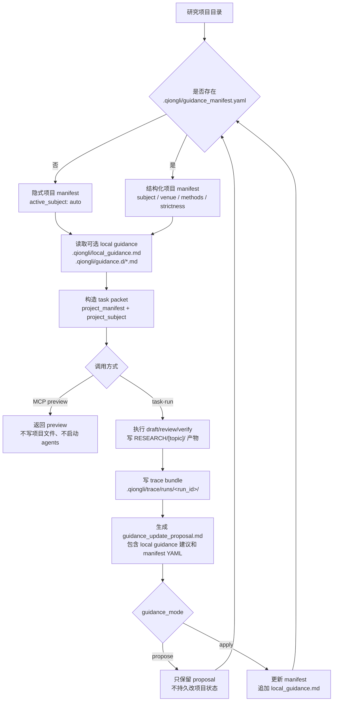

# 系统架构

Qiongli 现在采用 hybrid 仓库布局：学术内容、运行时代码、包壳、维护工具分别有清晰 source 边界；发布和安装所需的 payload 只在 staging/materialization 阶段生成。

## Source 边界

| 边界 | 可编辑源 | 职责 |
|---|---|---|
| 学术内容 | `content/` | workflow package source、internal skills、templates、standards、roles、subjects、schemas、venue profiles |
| Plugin distribution metadata | `content/distribution/plugins.yaml` | stable/next plugin 名称、描述、prompt、keywords、平台开关 |
| Python runtime | `packages/python-qiongli/src/` | `qiongli`、弃用兼容的 `research_skills` shim、bridge adapters、CLI/runtime code |
| 包壳 | `packages/npm-qiongli/`、`packages/qiongli-literature-mcpb/` | npm 与 MCPB 发布源 |
| 维护工具 | `tooling/scripts/`、`tooling/pipelines/`、`tooling/install/`、`tooling/release/` | 自动化、pipeline 描述、安装 manifest、release 资产 |
| 质量资产 | `evals/`、`tests/` | eval cases/runners 与跨包回归测试 |
| 文档 | `docs/` | VitePress 文档和维护者说明 |

根目录 `scripts/` 是兼容 wrapper。用户命令和 CI 可以继续使用 `scripts/...`，但维护者应编辑 `tooling/scripts/`。

根目录 `qiongli-workflow/`、`plugins/qiongli/`、`plugins/qiongli-next/` 和 `.agent/` 是生成后的 artifact 形状。workflow 内容改 `content/workflow/`，plugin metadata 改 `content/distribution/plugins.yaml`。

## 分层模型

| 层 | 主要可编辑源 | 职责 |
|---|---|---|
| Contract | `content/standards/research-workflow-contract.yaml` | Task ID、产物路径、质量门 |
| Capability Map | `content/standards/mcp-agent-capability-map.yaml` | 运行时路由、MCP 与 skill 要求 |
| Functional Agents | `content/roles/` | 责任归属、质量阈值、语气 |
| Internal Skill Specs | `content/skills/` | 可复用执行行为 |
| Pipelines | `tooling/pipelines/` | 步骤编排与 handoff |
| Client entry UX | `content/workflow/workflows/`、`content/distribution/plugins.yaml` | portable workflows 与生成的平台命令入口 |
| Runtime | `packages/python-qiongli/src/qiongli/` | CLI、installer、orchestration、providers |
| Distribution | materialized staging tree | `qiongli-workflow/`、plugin payload、npm payload、Python payload |

## 项目级 Guidance Runtime

Qiongli 的项目使用态由 canonical workflow 和项目本地状态共同决定。核心合同仍然来自 `content/standards/`，但每个研究项目可以在 `.qiongli/` 下保存自己的 subject、venue、method lens、strictness 和人工 guidance。

这层 runtime 的职责边界是：

| 文件或模块 | 职责 |
|---|---|
| `.qiongli/guidance_manifest.yaml` | 机器可读的项目 subject 状态；缺失时等价于 `active_subject: auto` |
| `.qiongli/local_guidance.md`、`.qiongli/guidance.d/*.md` | 人工可读的项目规则，只能作为 advisory context |
| `.qiongli/trace/` | task packet、guidance context、draft/review、validator gate 和 proposal 的审计记录 |
| `bridges.project_manifest` | manifest 读取、初始化、校验、更新和 serialization |
| `bridges.subject_runtime` | 把项目 subject 解析成当前 task 的 effective subject/domain context |
| `bridges.project_inference` | 从 task evidence 保守推断临时 subject/method 建议 |
| `bridges.guidance_runtime` | 汇总 guidance、写 trace、生成 proposal、应用已接受的 manifest/local guidance 更新 |
| `bridges.mcp_tool_handlers` | 在 `qiongli_task_run` preview 中暴露 `project_manifest` 和 `project_subject`，并保持 preview 无副作用 |

项目级 guidance 不能覆盖 canonical contract、required outputs、evidence gates、quality gates、MCP evidence requirements 或安全约束。`guidance_mode=off` 会跳过项目 manifest 和 local guidance 的读取；即使项目里有格式错误的 manifest，也不会阻断本次显式关闭 guidance 的运行。

## 稳定入口

| 入口方式 | 适用场景 | 稳定入口 |
|---|---|---|
| CLI install/upgrade | 安装与升级 assets | `qiongli`、`ql`、`research-skills`、`rsk`、`rsw` |
| Script entrypoints | CI、release、本地维护 | `scripts/*.py`、`scripts/*.sh` wrappers |
| Orchestrator CLI | 任务规划、执行、校验 | `python3 -m qiongli.bridges.orchestrator ...` |
| Portable skill package | 跨客户端分发 | 生成后的 `qiongli-workflow/` |
| Plugin package | Codex/Claude plugin 分发 | 生成后的 `plugins/qiongli/` |

## 依赖方向

默认把系统看成单向依赖图：

1. `content/standards/`
2. `content/roles/` 与 `content/skills/`
3. `content/templates/`
4. `tooling/pipelines/`、`content/workflow/workflows/` 与 plugin metadata
5. `packages/python-qiongli/src/qiongli/`
6. materialized distribution payloads

生成 payload 不能反过来成为隐藏真源。如果生成 plugin 目录与 `content/`、`content/distribution/plugins.yaml` 或 MCPB runtime package 不一致，应修源文件后重新 materialize。

精确目录职责见英文维护页 [Repository Structure](/development/repository-structure)。
