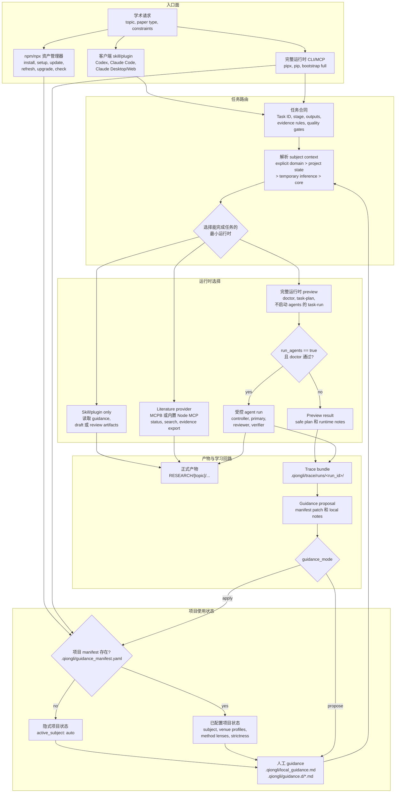

# 使用 Agent Skills

Qiongli 安装的是一套 agent-facing skill 系统，但不同客户端暴露入口的方式不一样。安装之后，如果你不知道在 Codex、Claude Code、Antigravity、Hermes 或 shell 里该输入什么，先看这一页。

## 名称模型

| 名称 | 含义 | 出现位置 |
|---|---|---|
| `qiongli` | 公开 plugin、CLI 和用户可见 skill 名称 | Skillsplace、npm、PyPI、Codex `/skills`、shell 命令 |
| `qiongli-workflow` | 便携 skill package 目录名 | `~/.codex/skills/`、`~/.claude/skills/`、`~/.gemini/antigravity/skills/`、`~/.hermes/skills/`、plugin payload |
| `skills/*/*.md` | 内部学术能力卡片 | 仓库源码和 orchestrator 自动注入 |

大多数使用者应该找 `qiongli`，不要再找 `research-paper-workflow`。目录名 `qiongli-workflow` 仍然保留，是为了兼容已有 installer 和 release artifacts。

## 客户端入口

| 客户端 | 发现方式 | 调用方式 | 说明 |
|---|---|---|---|
| Codex | `/skills` | `$qiongli`、`$qiongli-lit-review`、`$qiongli-academic-write`，或其他生成的 Qiongli workflow wrapper | Codex 不会把 Qiongli workflows 暴露成自定义 slash command。Plugin 安装会生成很薄的 wrapper skills，路由到和 Claude slash commands 相同的 canonical workflows。安装或升级后需要重启 Codex。 |
| Claude Code | Plugin UI 或 `/plugin` 命令 | `/paper`、`/lit-review`、`/paper-write`、`/code-build`，或自然语言要求使用 Qiongli | Plugin 会安装 command wrappers 和便携 skill package。 |
| Shell | `qiongli check` | npm：`qiongli install`、`qiongli update`、`qiongli project ...`；完整运行时：`qiongli doctor`、`qiongli task-run`、`python3 -m bridges.orchestrator ...` | npm/npx 是免 Python 资产管理器。完整运行时命令需要先 `pipx install qiongli`，并使用 Python 3.12+。 |

## 运行架构流程

这张图展示从用户请求到运行时选择、preview、执行和持久产物的完整路径。



关键边界是：安装不等于执行。npm/npx 只安装和刷新客户端资产；只有显式安装并调用完整运行时后，`doctor`、MCP 编排、provider setup 或 agent execution 才会运行。

## Codex 用法

通过 Skillsplace、npm、PyPI 或 `qiongli upgrade --target codex` 安装后，重启 Codex，然后检查：

```text
/skills
```

你应该能看到 `qiongli`。plugin-first 安装还会生成很薄的 workflow wrapper skills，例如 `qiongli-lit-review`、`qiongli-academic-write`、`qiongli-paper-read` 和 `qiongli-proofread`。调用主 skill 或 wrapper 时，都带上具体研究任务：

```text
$qiongli plan a systematic review on retrieval augmented generation in education
$qiongli-lit-review retrieval augmented generation in education
$qiongli-academic-write related work for my CHI paper
$qiongli design an empirical study about ai writing support in universities
$qiongli prepare a submission checklist for my CHI paper
```

不要期待 `/qiongli` 或 `/lit-review` 在 Codex 里可用。Codex 的 slash commands 是客户端内建或客户端自己暴露的入口；Qiongli 在 Codex 中的入口是 skill invocation。生成的 wrappers 是刻意保持很薄的适配层：`$qiongli-lit-review` 会路由到 Claude Code `/lit-review` 使用的同一个 `workflows/lit-review.md` source。

如果 `/skills` 只看到 `research-paper-workflow`，说明当前机器上还有旧的全局安装。先运行当前升级路径，重启 Codex，再检查：

```bash
qiongli upgrade --target codex --overwrite
```

当前 qiongli 安装器会在升级时删除确认过的 `research-paper-workflow` 旧全局 skill 目录。如果你想单独预览全局清理，先运行 `qiongli clean --globals --dry-run`。

## Claude Desktop / Claude.ai 用法

Claude Desktop 应该把 Qiongli 暴露为已安装的 `qiongli` skill 或 direct plugin entry。可以直接用自然语言开始：

```text
Use Qiongli to plan a literature review on retrieval augmented generation in education.
Use Qiongli to read this DOI and extract the claim, method, evidence, and limits.
Use Qiongli to prepare a rebuttal matrix for these reviewer comments.
```

当 direct plugin 的 workflow command wrappers 可见时，`/qiongli` 是统一入口路由器。它会委派到与更窄阶段命令相同的 workflow 文件。Qiongli Literature Provider MCPB 或 bundled literature MCP 会提供 provider search tools；只有 skill 指令本身时，不应声称 `provider_connected` literature search。

## Claude Code 用法

Claude Code 可以通过 workflow entry markdown 暴露 Qiongli。常用入口是：

| 命令 | 适合场景 |
|---|---|
| `/qiongli` | 需要统一 Qiongli 入口自动选择正确 workflow。 |
| `/paper` | 需要 guided paper workflow 和 paper-type routing。 |
| `/lit-review` | 需要文献检索、筛选、提取或综合。 |
| `/paper-read` | 需要深度分析单篇论文。 |
| `/find-gap` | 需要识别和排序 research gaps。 |
| `/study-design` | 需要实证、质性或混合方法研究设计。 |
| `/paper-write` | 需要基于已有研究工作区写 manuscript。 |
| `/code-build` | 需要严格的学术代码 specification、planning、execution、review 和 reproducibility checks。 |
| `/submission-prep` | 需要期刊或会议投稿包。 |

这些 slash workflows 是便捷入口。它们最终都会路由到同一套 Qiongli task contract 和 skill package。

## Shell 与 Orchestrator 用法

当你需要检查、升级、验证或运行显式 Task ID 时，使用 shell CLI：

```bash
qiongli check
qiongli upgrade --target all
qiongli doctor --project-dir .
```

当你需要明确的 task planning 或多 agent 执行时，使用 orchestrator：

```bash
python3 -m bridges.orchestrator task-plan \
  --task-id F3 \
  --paper-type empirical \
  --topic ai-in-education \
  --cwd .

python3 -m bridges.orchestrator task-run \
  --task-id F3 \
  --paper-type empirical \
  --topic ai-in-education \
  --cwd . \
  --triad
```

## 推荐使用流程

1. 只在单个客户端里用时，通过 Skillsplace 安装；需要跨客户端全局使用时，运行 `qiongli upgrade --target all`。
2. 重启目标客户端，让 skill registry 和 workflow discovery 刷新。
3. 在 Codex 中，用 `/skills` 确认出现 `qiongli`，然后用 `$qiongli` 调用。
4. 在 Claude Code 中，用 `/paper`、`/lit-review`、`/paper-write` 或 `/code-build`。
5. 需要可重复 task execution 时，用 `qiongli doctor` 和 `python3 -m bridges.orchestrator task-plan|task-run`。

当 workflow 或 orchestrator task 产生持久产物时，Qiongli 会把研究产物写到 `RESEARCH/[topic]/` 下。只有在你明确运行 `qiongli init` 或选择 project install parts 时，才会写入项目本地集成文件。
